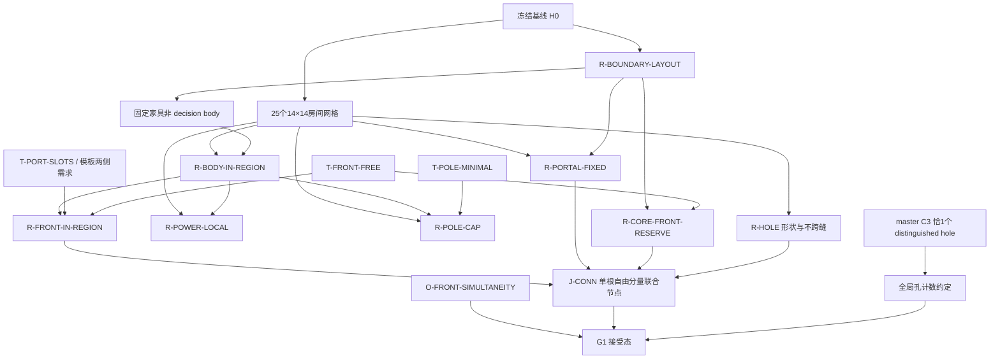

# 九条 R-* 充分限制价签精算报告

`authority=false`，本报告不登记任何界，账本保持 `U=(1188,18)` conditional、`L=absent` 不变。【已证明】

本报告的冻结比较基线记为 `H0`：canonical rules SHA256 为 `5012845367e2a0e0b51938cc36a18f46fcdc8daccfa34639f96a05a67dc12a05`，mandatory instances SHA256 为 `545b98c2b4f96643f1346b423edf2dc8e300a0c815b6cf821776ceed03cd4cd6`。【已证明】

以下定量结论只覆盖 H0 下的 G1 几何、单体候选域、关系域或明确标出的 catalog 样本，不覆盖 G2 路由、G3 端口绑定，也不构成完整生产 witness。【已证明】

`INFEASIBLE` 的有效域始终限于写明的充分限制族、target 与 catalog，不能反推 H0 原问题不可行。【已证明】

## 5.1 补丁 A：完整可替换总表

| R-* | 来源分类(①算术被迫/②对称WLOG/③求解器方便/④配方类比) | 依据的零余量账(有则填,无则写“无”) | 价签·定性 | 价签·定量(含口径) | 前提集 | 买回了什么(被迫结构/搜索缩减) | 产率评级(高/中/低,一句话理由) | 撤退线(最小改动) | 证据等级 |
|---|---|---|---|---|---|---|---|---|---|
| `R-BODY-IN-REGION` | ③求解器方便，兼有沿用旧框架的④成分 | 无 | 排除制造机身或杆本体跨越 14 倍数房缝的原规范合法位姿；当前实现因固定家具非决策而不约束固定家具跨缝 | `H0` 候选位姿口径：3×3 留 `13,920/17,952`，5×5 留 `9,600/16,896`，6×4 留 `9,540/16,900`，杆留 `4,225/4,761`；按 132/49/38 个制造实例加权，排除 `1,169,408/3,839,768=30.46%` 个实例-位姿关联；不是全局布局数 | `{H0, 25×14×14 网格, 固定家具非决策的作用域约定}` | 每台机器和杆只属于一个局部模型，去掉跨缝占格冲突；25 个房间可独立造列 | 中：付出约三成制造候选域，换来整条分解骨架，收益大但价格也大 | 加 5 格 halo 并给跨缝 body 指定 owner；catalog 发布邻房占格位图，master 加 seam 占格兼容；随后再放开跨两条垂直缝交点的四房位姿 | 候选域算术【已证明】；全局布局损失缺计数【已证明】 |
| `R-FRONT-IN-REGION` | ③求解器方便 | 无 | 排除机身留在本房、但输入或输出口前格落入邻房的合法位姿；所有 operation class 两侧需求均为正，因此机身贴活动侧房缝即被删 | `H0`、且已押 `R-BODY-IN-REGION` 的增量候选位姿口径：3×3 再删 `1,920`，5×5 再删 `1,600`，6×4 再删 `1,440`；实例加权删 `386,560/2,670,360=14.48%`；BODY+FRONT 合计删 `40.52%` 的制造实例-位姿关联 | `{H0, 房间网格, R-BODY-IN-REGION, opposite-side 模板语义, 九行类表 r_in>0 且 r_out>0}` | master 不必检查邻房目标格是否 body-free，也不必为跨缝 front 建变量 | 高：比 BODY 便宜一半以上，却消掉一整类 seam 耦合 | 保持 body 同房，catalog 发布逐边 active-front demand 与邻边 body-free/component 位图；master 对 40 条缝×14 格加兼容约束 | 候选域算术【已证明】；对完整 pattern 的收益需配对实验【强论据】 |
| `R-PORTAL-FIXED` | ③求解器方便 | 无 | 排除占用固定桩位的几何，以及只在其他缝位置有通道的几何；板边也预留桩，额外牺牲无邻居的自由格 | `H0`、当前相位口径：live 桩 `16×8+7×6+4+6=180`，其中内缝 `40×2×2=160`、板边 `20`；在 BODY+FRONT+固定家具+全 66 front reserve 的单体候选域中，制造实例-位姿关联再删 `176,088/2,076,768=8.48%`，杆锚点删 `265/3,888=6.82%`；不是 pattern 或全局布局数 | `{H0, 房间网格, R-BOUNDARY-LAYOUT 以确定 fixed/live mask}`；“零 C4 且全图连通”收益还依赖 `R-PAT-CONN` | C4 为零约束；相邻桩天然 4 邻接；16 个 CLEAN 房可塌成一个 archetype | 高：约 8.5% 的单体候选税换来零 seam 协商和 16 倍 CLEAN 对称塌缩 | 最小档先删板边 20 个 live 桩；下一档每条内缝用 14 个选择变量协商两处桩；完全档发布逐边 component/free 位图并启用 L3 crossing 变量 | live 数与单体枚举【已证明】；与 `R-PAT-CONN` 的全局价签不可相加【已证明】 |
| `R-PAT-CONN` | ③求解器方便兼论证支撑 | 无 | 排除同一 pattern 内 live 桩、固定家具所需 front、机器 active front 或孔洞分处多个自由分量的几何；原规范允许同商品多岛，故不是必要条件 | catalog 口径：旧 2,593 列中 `855/2,593=32.97%` 不满足单分量；同批供给 `3,113→2,749`，损失 `364/3,113=11.69%`；L0 2 秒对照中 strict 证死目标的 loose 侧为 0 可行、402 不可行、15 UNKNOWN，只是已测下界；解空间口径缺完整成对枚举 | `{H0, 房间网格, R-PORTAL-FIXED, R-FRONT-IN-REGION, R-CORE-FRONT-RESERVE, R-HOLE-IN-REGION 的 hole anchor, R-BOUNDARY-LAYOUT}` | 每房只发布一个走廊分量，和固定桩组合后给出板级自由空间连通的构造论证；G2 输入大幅简化 | 中：catalog 上价格显著，但买回的是核心组合论证；真实解空间产率尚未定量 | 先只要求 live 桩互通，放松 terminal/hole anchor；再退回多源 loose 读法并发布 component id；完全档删除局部连通限制，交 G2 检查 | catalog 删除量【已证明】；解空间价签不足【已证明】 |
| `R-POWER-LOCAL` | ③求解器方便 | 无 | 排除机器仅由邻房或斜邻房杆覆盖、且本房没有可替代杆集的合法几何；不禁止杆模板越缝，只禁止把越缝部分当供电见证 | 在 `R-BODY-IN-REGION` 的 4,225 个杆锚点上，杆锚点-覆盖格关系共 `750²=562,500` 条，同房关系 `630²=396,900` 条，故本限制删去跨房关系 `165,600=29.44%`，其中正交邻房 `151,200`、斜邻房 `14,400`；这是覆盖关系口径，不是布局数；实际被杀布局缺“无本地替代”的计数 | `{H0, 房间网格, R-BODY-IN-REGION, 12×12 power stencil}`；逻辑上不依赖 `R-POLE-CAP` | 每房独立完成供电 set cover，master 不需看邻房杆 | 中：删掉近三成覆盖关系，但多数几何可能有本地替代；收益明确、实际价格未知 | 先允许正交邻房供电，发布逐边 pole coverage 位图；再加斜邻房四角位图即恢复在 BODY 同房前提下的全部原规范覆盖 | 覆盖关系算术【已证明】；布局价签缺失【已证明】 |
| `R-POLE-CAP` | ③求解器方便 | 无 | 排除最小本地供电集需要第 4 根或更多杆的局部几何；也排除选了 4 根以上但可删冗余杆的表示，后者应由 `T-POLE-MINIMAL` 消掉而不应计入科学价签 | 本包只能给原始尺度：空 14×14 房可放至多 `7×7=49` 个互不重叠 2×2 杆，cap 把局部杆数层级从 `0..49` 截为 `0..3`；缺最小杆数分布，不能定量被杀 pattern 或布局；`3,392/67/146·134·118/366` 全部 conditional on 本 cap，不能反过来给它标价 | `{H0, 房间网格, R-BODY-IN-REGION 的杆归房}`；与 `R-POWER-LOCAL` 逻辑独立，当前代码仅在 postcheck 名目上耦合 | 限制局部布尔搜索与杆组合爆炸，使 packing ceiling 和 evaluator 有有限预算 | 低：没有规则锚点，收益主要是搜索预算，且价格完全未测 | 第一档 RHS `3→4`；第二档删除硬 cap、在固定 body 几何上精确最小化杆数；两档都保留房间独立性，但须重跑全部 ceiling 和 catalog | cap 独立性【已证明】；价签数值缺失【已证明】 |
| `R-HOLE-IN-REGION` | ④配方类比兼③局部化方便 | 无 | 排除 6×6、7×7、更大矩形、同形但跨缝的矩形，以及不属于 portal 分量的空矩形；“恰 1 孔”造成的多孔损失属于 master C3，不计入本条 | `H0` 矩形见证位置口径：原规范 `min_side≥6` 有 `[Σ_{w=6}^{70}(71-w)]²=2,145²=4,601,025` 个位置；本条名义词汇仅 `25×(9×8+8×9)=3,600`，保留 `0.07824%`、排除 `4,597,425`；同形全板有 `8,320`，不跨缝仅留 `3,600`，缝税 `4,720`；component 与真实空置联合价签缺布局枚举 | `{H0, 房间网格, portal component 定义}`；master 使用还依赖隐藏约定 `{C3=恰1个 distinguished hole}` | 每 pattern 只需一个局部 HoleSpec，master 只看一位 carries_hole，孔不制造跨房耦合 | 低：切掉超过 99.9% 的矩形见证词汇，只换来一个局部标志位 | 先把房内词汇扩为全部 `6≤w,h≤14`，候选 `50,625`；再放开单缝同形 `+3,760`、四房交点 `+960`；完全档用全局矩形边界变量 | 见证域算术【已证明】；layout 与 component 联合价签缺失【已证明】 |
| `R-CORE-FRONT-RESERVE` | ①算术被迫的 54 格 + ③求解器方便的额外 12 格 | output `52/52` 零余量；input `2/14` 余 12 | 真规则迫使 46 个边界 output、6 个 core output、任取 2 个 core input 的 front body-free；本条额外禁止任何 body 占其余 12 个 core input front | `H0` 固定 front 口径：`66=54+12`，额外 body-free 税恰 12 格；在保留 BODY+FRONT+PORTAL+现行固定布局的单体域中，松开这 12 格恢复 CORE 杆锚点 `28−20=8` 个，制造机位姿恢复 `0` 个；不是全局 pattern 数 | `{H0, R-BOUNDARY-LAYOUT, generic IO 52 output/2 input, T-FRONT-FREE}`；8 锚点读数另依赖 `{R-BODY, R-FRONT, R-PORTAL}` | 固定 mask 无选择变量；所有固定家具 anchor 可直接并入 `R-PAT-CONN` | 高：确定价格只有 12 格，当前单体扫描只损 8 个杆锚点，却省掉动态 core-input 选择 | 只保留 52 个 output，给 14 个 core input front 加 14 个可用变量并约束至少 2 个 body-free；再把具体 2 个留给 G3 绑定 | 54/12 算术与 8 锚点枚举【已证明】；全局影响缺失【已证明】 |
| `R-BOUNDARY-LAYOUT` | ③求解器方便兼④沿用配方；边界近饱和部分受①锚定 | 左下两边 `138/139`，余 1 | 排除边界口的其他合法相位、角位选择，以及核心的其他位置和朝向；还把“固定家具可跨房”悄然固化为 R-BODY 的例外 | `H0` 无标签几何口径：单臂 70 格放 23 个长度 3 区间有 `C(24,23)=24` 种，其中不占角 1 种、占角 23 种；两臂共享角互斥后有 `1×1+23×1+1×23=47` 种，现行留 1、排除 46；core 留 `1/7,688`，排除 7,687；两项因碰撞不可直接相乘 | `{H0}`；其坐标被 `R-PORTAL-FIXED`、`R-CORE-FRONT-RESERVE`、`R-PAT-CONN` 与 region-class 划分消费 | 固定 219 格家具、66 个 front 和十类 mask；catalog 不承担全局家具放置 | 低：边界相位仅 47 种尚可枚举，core 却被从 7,688 压成 1，价格远大于固定 mask 的便利 | 第一档外循环枚举 47 个边界铺法；第二档枚举 1,800 个房内 core pose；完全档恢复 7,688 个 core pose并把 fixed mask 变成全局决策 | 相位与 core 候选域算术【已证明】；联合全局布局数缺失【已证明】 |

## 依赖有向图与隐藏前提审计

图中 `A --> B` 表示 B 的当前语义、价签推导或组合收益依赖 A；`J-CONN` 是把 `R-PAT-CONN` 与 `R-HOLE-IN-REGION` 的“孔在 portal component 内”子句收缩成一个联合节点，以免把定义互引误画成逻辑循环。【已证明】

`R-POWER-LOCAL` 与 `R-POLE-CAP` 没有逻辑蕴含边；现行实现把超 cap 的 postcheck 记在 power 名目下只是代码耦合，不是定理依赖。【已证明】

`C3=恰 1 孔` 不属于 `R-HOLE-IN-REGION`，它只控制 master 选择多少个 distinguished hole；原规范只要求至少存在一个合格空矩形。【已证明】

前提集之并在局部结构层面自洽：每个 region class 都有合法空 pattern，CLEAN 空房可容纳房内 `6×7/7×6` 孔，固定家具 mask 与 portal/free 约束也可同时满足。【已证明】

这种局部自洽不证明 25 房 catalog 能覆盖 219 台制造机，也不证明 master 可行；当前材料只给出 strict catalog 薄、CORE 无 pose 等报警读数。【已证明】

| 隐藏或辅助前提 | 在哪里被用到 | 审计结论 | 证据等级 |
|---|---|---|---|
| `P-FIXED-FURNITURE-EXEMPT`：`R-BODY-IN-REGION` 只约束 decision bodies，固定 core 与边界口可跨房 | BODY 价签、BOUNDARY 的作用域 | 应补挂为作用域前提，否则“每个机身”会与现行 core 坐标冲突 | 【已证明】 |
| `P-INSTANCE-POSE-MEASURE`：132/49/38 加权的是实例与单体位姿关联，不是互不重叠布局 | BODY、FRONT、PORTAL 定量 | 已在所有数字旁标明候选域口径，禁止当全局解数 | 【已证明】 |
| `T-PORT-SLOTS` 与九行类表每类 `r_in>0,r_out>0` | FRONT 的贴缝裁剪 | 这是模板/需求事实，不是任意“需要 front”的口头愿望 | 【已证明】 |
| `O-FRONT-SIMULTANEITY` | PAT-CONN 及任何 accepted geometry | 单个 active front 可用不自动保证所有槽位同时匹配，实验和接受态必须跑显式二部图匹配 | 【已证明】 |
| `P-MASK-DISJOINT-H0`：219 fixed bodies、66 fronts、180 live stubs 在当前坐标转录中互不重复 | 补丁 C 的 `4,435` 面积账 | 坐标枚举与 region-class usable 合计共同复核；换相位后必须重算 | 【已证明】 |
| `P-UNLABELED-BOUNDARY-QUOTIENT` | BOUNDARY 的 47 种铺法 | 47 是无标签占格布局，不是 46 个有编号实例的排列数 | 【已证明】 |
| `spine=false` | 补丁 C 的孔净新增 `≥38` 格 | 只用于该条件行；若 spine 改开，maxK 变成 13 至 16，该行必须失效重算 | 【已证明】 |
| `P-OWNER`：跨缝对象由 anchor 房拥有 | BODY/FRONT/POWER 的撤退实验 | 仅是撤退线的新增建模约定，不应倒灌成当前价签前提 | 【已证明】 |
| `T-POLE-MINIMAL` | CAP 的科学价签 | 必须先剔除“4 根但可删 1 根”的冗余表示，只有最小杆数至少 4 才算 cap 杀解 | 【已证明】 |

## 5.2 九条逐项精算

### 1. `R-BODY-IN-REGION`

依据材料为 `06_geometry_constants.md` §1/§8 与 `08_original_domain_baseline.md` §4，所有精确候选数均绑定 H0。【已证明】

#### ① 价签

定性价签是删除任何制造机 body 或 2×2 杆 body 跨过 `x∈{14,28,42,56}` 或 `y∈{14,28,42,56}` 的 H0 合法单体位姿；固定家具不在该 decision-body 量词内。【已证明】

M3 保留数为 `25×(14−3+1)²×4 − 4×(5×12)×2 = 25×12²×4−480 = 13,920`，故删除 `17,952−13,920=4,032` 个候选位姿。【已证明】

M5 保留数为 `25×(14−5+1)²×4 − 4×(5×10)×2 = 25×10²×4−400 = 9,600`，故删除 `16,896−9,600=7,296` 个候选位姿。【已证明】

M6 保留数为 `25×[(14−6+1)(14−4+1)×2 +(14−4+1)(14−6+1)×2] − [2×(5×9)×2+2×(5×9)×2] = 9,540`，故删除 `16,900−9,540=7,360` 个候选位姿。【已证明】

杆保留数为 `25×(14−2+1)² = 25×13² = 4,225`，故删除 `4,761−4,225=536` 个候选锚点。【已证明】

按 mandatory 制造实例加权，H0 关联数为 `132×17,952+49×16,896+38×16,900=3,839,768`，房内 body 关联数为 `132×13,920+49×9,600+38×9,540=2,670,360`，删除 `1,169,408/3,839,768=30.455%`。【已证明】

这是一项 H0 单实例候选域精确计数，不是 catalog 计数，也不是 219 台互不重叠全局布局的比例。【已证明】

缺: 满足其余八条限制时，跨缝 body 几何的完备 pattern 数与 master 可拼装计数，需要带 halo 的 domino/四房枚举。【已证明】

#### ② 前提集

直接前提为 `{H0, 25×14×14 网格, P-FIXED-FURNITURE-EXEMPT}`；M3/M5/M6 的模式归一化与板外 active-front 裁剪来自 H0 模板候选域。【已证明】

该限制不依赖 `R-FRONT-IN-REGION`，但后者的增量价签必须在本限制之后计算，才能避免重复计价。【已证明】

#### ③ 撤退线（含梯级）

最小改动是在每房模型外加最多 5 格 halo，以 anchor 所在房作为 owner，catalog 发布邻房占格 bitmap，master 对 40 条缝的格占用加互斥约束。【强论据】

L1 只允许 body 跨一条正交缝，不允许同时跨纵横缝交点；它买回绝大多数跨缝位姿，代价是双房 seam coupling 与全部受影响 catalog 重生成。【强论据】

L2 允许 body 影响至多四房，恢复 H0 的全部 body pose；它需要角点兼容变量，固定 region class 计数与逐房连通论证都须重审。【强论据】

#### ④ 判定实验

执行 `D1-BODY-POSE-ENUM`：完整枚举 56,509 条 H0 单体位姿，按 body cells 的房号集合是否为单元素分组，并复算上述四类差值。【已证明】

伪代码核心为 `rooms={floor(x/14),floor(y/14) for body cell}; keep iff |rooms|=1`；预算 2 秒、64 MiB，完整扫描与守恒断言通过即终止。【强论据】

发现非空 removed 集为“可行”结果，证明候选域杀解；完整扫描 removed 为空为“不可行”结果，只证明该模板候选域免费；超时或异常为未证，不能改变价签。【已证明】

### 2. `R-FRONT-IN-REGION`

依据材料为 `06_geometry_constants.md` §1/§8 与 `08_original_domain_baseline.md` §3/§4，FRONT 数字始终按 BODY 后增量口径报告。【已证明】

#### ① 价签

定性价签是删除 body 已完全在 owner 房内，但至少一个 active input/output front 落入正交邻房的 H0 合法位姿。【已证明】

在已押 BODY 的增量口径下，M3 保留 `25×[12×10×2+10×12×2]=12,000`，再删 `13,920−12,000=1,920`；M5 保留 `25×[10×8×2+8×10×2]=8,000`，再删 `9,600−8,000=1,600`；M6 保留 `25×[9×9×2+9×9×2]=8,100`，再删 `9,540−8,100=1,440`。【已证明】

实例加权后，FRONT 的增量删除量为 `132×1,920+49×1,600+38×1,440=386,560`，占 BODY 后关联域 `386,560/2,670,360=14.476%`。【已证明】

BODY+FRONT 的联合删除量为 `3,839,768−[132×12,000+49×8,000+38×8,100]=1,555,968`，比例 `40.522%`；这个联合数不能再与 BODY 的 30.455% 相加。【已证明】

缺: 邻房 body-free、component membership 与所有 front 槽位同时匹配后的完整双房 pattern 计数，需要 paired seam CP-SAT。【已证明】

#### ② 前提集

直接前提为 `{H0, 房间网格, R-BODY-IN-REGION, T-PORT-SLOTS, T-FRONT-FREE, 九行类表 r_in>0 且 r_out>0}`。【已证明】

`O-FRONT-SIMULTANEITY` 是隐藏义务：几何上存在若干可用 front cells 不等于所有机器的槽位可同时无冲突匹配。【已证明】

#### ③ 撤退线（含梯级）

最小改动是保持 body 同房，让 catalog 发布每条边的 active-front demand bitmap 与 component id，master 对每个 seam cell 施加 `front_demand≤neighbor_free` 及匹配约束。【强论据】

L1 只放开正交跨缝 front，生成器仍可逐房造候选，但 master 不再零 seam coupling，现有 catalog 必须全量重生成。【强论据】

L2 与 BODY 一并放开，使 body/front 共同跨缝；它买回全部 H0 位姿，但需要统一 owner、占格和 front 归属，模型规模升至 domino/四房级。【强论据】

#### ④ 判定实验

执行 `D2-FRONT-SEAM-PAIR`：Phase A 对 4 个固定代表缝跑 body count `{8,10}`、hole `{0,1}`、area `{C−8,C}` 的 32 对模型，Phase B 再在其余缝复现最多 8 对。【强论据】

每侧预算 10 秒，预计 2,000 至 4,000 个布尔变量、5,000 至 15,000 条约束，最多 40 对的总硬上限为 `40×2×10=800` 秒；`C` 仅是 packing 目标刻度，不是 witness。【强论据】

relaxed 可行而 strict 证不可行，或双方证最优且 relaxed 更优，证明该切片杀解；relaxed 也不可行只否定该 target；任一 `UNKNOWN` 为超时未证。【已证明】

### 3. `R-PORTAL-FIXED`

依据材料为 `06_geometry_constants.md` §2至§4、`08_original_domain_baseline.md` §4，以及本批标准库坐标枚举结果。【已证明】

#### ① 价签

定性价签有两层：所有占用八个固定局部桩坐标的几何被删，所有只能在其他 seam 位置形成跨房自由通道的几何也被删；板边无邻居的 live 桩还额外占用自由格。【已证明】

nominal 桩数为 `25×8=200`，其中 20 格被固定家具 body 吞掉，live 数为 `200−20=180`；内缝桩为 `40 条缝×2 侧×2 格=160`，故板边 live 桩为 `180−160=20`。【已证明】

在 `BODY+FRONT+固定家具+全66 front reserve` 的单体候选域中，M3 为 `10,952→10,256`，M5 为 `7,220→6,176`，M6 为 `7,298→6,428`。【已证明】

制造实例加权前域为 `132×10,952+49×7,220+38×7,298=2,076,768`，后域为 `132×10,256+49×6,176+38×6,428=1,900,680`，删除 `176,088/2,076,768=8.479%`。【已证明】

杆锚点从 `3,888` 降至 `3,623`，删除 `265/3,888=6.817%`；只去掉板边 20 桩可恢复制造实例-位姿关联 18,216 个和杆锚点 28 个。【已证明】

这些数字是带其他当前 mask 的增量单体候选域，不是 pattern 数；“固定位置之外的通道”价格还缺 paired topology 枚举。【已证明】

#### ② 前提集

直接前提为 `{H0, 房间网格, R-BOUNDARY-LAYOUT}`，因为固定家具决定哪些 nominal stubs 被吞掉及各 region class 的 live mask。【已证明】

“C4 为零且板级自由空间连通”的收益只由 `R-PORTAL-FIXED + R-PAT-CONN` 联合产生，不能把同一连通收益分别全额记到两条名下。【已证明】

#### ③ 撤退线（含梯级）

L1 只删除 20 个无邻居板边桩，保留 160 个内缝固定桩；它不引入 seam selector，但会拆分 CLEAN 对称类并要求重建边界 catalog。【强论据】

L2 每条内缝从 14 格中协商两格，双方 selector 必须一致且被选格 body-free、在声明分量内；它买回其他相位通道，代价是 `40×14` 级 seam 变量与 catalog 全量重生成。【强论据】

L3 不固定桩数或位置，只发布逐边 free/component bitmap 并由 crossing variables 协商；现有零 C4 组合论证失效，G2/master 必须接管连通拼装。【强论据】

#### ④ 判定实验

执行 `D3-PORTAL-FIXED-VS-MOVABLE`：在 12 个可求解拓扑代表、body count `{8,10}`、hole `{0,1}`、area `{C,C−8}` 上做 96 对 FIXED/MOVABLE 求解，CORE 的 `NO_POSE` 只作独立诊断。【强论据】

MOVABLE 对每条有邻居的边设置 14 个 selector 且恰选 2，板边不要求桩；每侧预算 3 秒，总硬上限 600 秒。【强论据】

MOVABLE 可行而 FIXED 证不可行，或双方最优且 MOVABLE 更好，证明固定桩杀解；MOVABLE 也证不可行只否定该 target；任一 `UNKNOWN` 不形成价签。【已证明】

### 4. `R-PAT-CONN`

依据材料为 `05_strict_evidence_summary.md` #9/#10、`07_current_state.md` 的 L0 paired controls，以及 `08_original_domain_baseline.md` 的多岛语义。【已证明】

#### ① 价签

定性价签是删除 live stubs、required/reserved fixed fronts、所有 active fronts 或 hole cells 分散在多个自由分量的局部几何；H0 的路由语义允许同商品有多个独立岛，因此 strict 单分量不是必要条件。【已证明】

现有 catalog 口径中，旧 2,593 列有 `855/2,593=32.973%` 不满足 strict 单分量语义。【已证明】

同三份 catalog 的 capability supply 从 `3,113` 降到 `2,749`，损失 `3,113−2,749=364`，比例 `364/3,113=11.693%`。【已证明】

最新 L0 paired controls 中 strict 证死目标 417 个，loose 侧结果为 `0 FEASIBLE + 402 INFEASIBLE + 15 UNKNOWN`；这说明已测目标没有找到 strict-only 误杀反例，但 15 个 UNKNOWN 和不完备目标集阻止“免费”结论。【已证明】

前两项是 catalog 样本删除量，不是 strict/loose 完备解空间比例；缺同一完备 target/Pareto 域的 paired 枚举及 master 可拼装计数。【已证明】

#### ② 前提集

当前语义依赖 `{房间网格, R-PORTAL-FIXED, R-FRONT-IN-REGION, R-CORE-FRONT-RESERVE, R-BOUNDARY-LAYOUT}`，并与 `R-HOLE-IN-REGION` 的 component 子句组成 `J-CONN` 联合节点。【已证明】

其组合收益还隐含 `O-FRONT-SIMULTANEITY` 已关闭，否则“front 在同一分量”不能替代槽位同时匹配见证。【已证明】

#### ③ 撤退线（含梯级）

L1 只要求所有 live stubs 互通，允许 active fronts 与 hole 落在其他自由分量，并发布 component id；它保住 seam 骨架但失去“所有 terminal 同一走廊”的直接证明。【强论据】

L2 恢复多源 loose 读法，允许 stubs 分属多个含桩分量，master/G2 需要选择实际拼接分量。【强论据】

L3 删除局部连通限制，全部交给 G2 路由/连通模型；它买回 H0 允许的多岛结构，但 catalog 与组合论证须整体重做。【强论据】

#### ④ 判定实验

执行 `D4-PAT-CONN-PAIRED`：九个非 CORE region classes × area `{C−16,C−8,C}` × body count `{8,9,10}` × hole `{0,1}`，共 162 对 strict/loose 模型。【强论据】

每侧 2 秒，总硬上限 650 秒；两侧除单源与多源连通编码外必须字节级等价，历史 855/2,593 只作校准。【强论据】

LOOSE 可行而 STRICT 证不可行或最优更好为杀解证据；LOOSE 也不可行只否定目标；任一 `UNKNOWN` 不得计为“无差异”。【已证明】

### 5. `R-POWER-LOCAL`

依据材料为 `06_geometry_constants.md` §5 与 `08_original_domain_baseline.md` §3；覆盖关系数由本批标准库枚举复核。【已证明】

#### ① 价签

定性价签是删除至少一台机器只能由正交邻房或斜邻房杆覆盖、且本房没有替代杆集的 H0 合法几何。【已证明】

在 BODY 房内的 4,225 个杆锚点上，一维“杆锚点到被覆盖格”总关联按五个房列为 `[141,156,156,156,141]`，总和 `750`；同房一维关联每列合计 126，总和 `5×126=630`。【已证明】

二维总覆盖关系为 `750²=562,500`，同房关系为 `630²=396,900`，跨房关系为 `562,500−396,900=165,600`，比例 `165,600/562,500=29.44%`。【已证明】

令一维跨房关联为 `750−630=120`，正交邻房关系为 `2×630×120=151,200`，斜邻关系为 `120²=14,400`，两者合计 165,600。【已证明】

这是杆锚点到机器 cell 的关系删边口径，不是被杀布局数，因为同一机器可能另有本房杆或另一条覆盖边。【已证明】

缺: 每个 otherwise-valid body geometry 的本地最小杆集与跨房替代杆集对照表，需要双房及四房 set-cover 枚举。【已证明】

#### ② 前提集

直接前提为 `{H0, 房间网格, R-BODY-IN-REGION 的机器与杆归房, 12×12 power stencil}`。【已证明】

它不依赖 `R-POLE-CAP`，也不能由 cap 推出；已有 packing ceiling 同时押两者，只能算联合条件读数，不能用来分别标价。【已证明】

#### ③ 撤退线（含梯级）

L1 允许正交邻房供电，catalog 发布杆跨边 coverage bitmap，master 对 seam 两侧机器 coverage 做 linking；它理论上买回 151,200 条关系边。【强论据】

L2 再加入斜邻四角 bitmap，理论上买回余下 14,400 条关系；在 BODY 同房前提下，这恢复 H0 的全部跨房覆盖关系。【已证明】

两档都可让局部生成保持 owner 概念，但 master 出现 seam/角点耦合，catalog 至少要全量重评 coverage signatures。【强论据】

#### ④ 判定实验

执行 `D5-POWER-DOMINO`：Phase A 对 4 个固定代表缝跑 32 对 LOCAL/CROSS_ORTHO 模型，Phase B 再在其余缝复现最多 8 对，lex 目标为最大 body area、最大 body count、最小 pole count。【强论据】

每侧 10 秒，最多 40 对，总硬上限 `40×2×10=800` 秒；发现改善后冻结 body，另做无 cap 精确 minimum set cover，避免把 `R-POLE-CAP` 的价格错记给本条。【已证明】

CROSS 可行而 LOCAL 证不可行，或 minimum pole count 更低，证明局部供电杀解；CROSS 也不可行只否定该 target；任一求解或校验 `UNKNOWN` 为未证。【已证明】

### 6. `R-POLE-CAP`

依据材料为 `06_geometry_constants.md` §5、`05_strict_evidence_summary.md` #3至#5/#15/#26，以及 `08_original_domain_baseline.md` 的无局部杆预算条款。【已证明】

#### ① 价签

科学价签只包括最小本地供电集确需第 4 根或更多杆的几何；“放了 4 根但可删成 3 根”的冗余表示应由 `T-POLE-MINIMAL` 剔除，不算被杀解。【已证明】

空 `14×14` 房最多平铺 `⌊14/2⌋×⌊14/2⌋=7×7=49` 根互不重叠 2×2 杆，因此 cap 把原始杆数层级从 `0..49` 截为 `0..3`。【已证明】

49 只是空房表示域尺度，不是 otherwise-valid pattern 数；本包没有 `min_local_poles=0,1,2,3,4+` 分布，故不能给被杀 pattern 或布局比例。【已证明】

`3,392/67/146/134/118/366` 全部 conditional on cap=3，它们衡量现行联合档位的 ceiling，不得反向给 cap 标价。【已证明】

缺: 每个可行 body geometry 的精确最小本地杆数分布，以及 cap3/cap4 的成对 Pareto 差，需要重新求解。【已证明】

#### ② 前提集

直接前提为 `{H0, 房间网格, R-BODY-IN-REGION 的杆归房}`，辅助前提为 `T-POLE-MINIMAL`。【已证明】

与 `R-POWER-LOCAL` 的关系是实现同处而逻辑独立；generator、evaluator、packing ceiling 三处 RHS 必须同步改动才能保持语义一致。【已证明】

#### ③ 撤退线（含梯级）

L1 把三处 RHS 从 3 同步改为 4，只买回 `min_local_poles=4` 的几何；房间独立性保留，但全部 ceiling 与 catalog 必须重跑。【强论据】

L2 删除硬 cap，固定 body 后精确最小化杆数并用 lex objective 控制搜索；它恢复所有本地杆数层级，但局部组合数可能显著膨胀。【强论据】

#### ④ 判定实验

执行 `D6-POLE-CAP-3-VS-4`：九个非 CORE classes × hole `{0,1}` × cap `{3,4}`，共 36 次求解，发现 cap4 改善后再做 fixed-body uncapped set cover。【强论据】

每次 10 秒，总硬上限 360 秒，set cover 每个 2 秒；只有 set-cover optimum 精确等于 4 的样本才登记为 cap 杀解。【已证明】

CAP4 改善并通过最小杆数校验为可行证据；CAP4 也不可行只否定目标；任一 `UNKNOWN` 或未完成校验为超时未证。【已证明】

### 7. `R-HOLE-IN-REGION`

依据材料为 `06_geometry_constants.md` §6 与 `08_original_domain_baseline.md` §2/§4，位置词汇数由闭式算术与标准库枚举双重复核。【已证明】

#### ① 价签

定性价签删除所有非 `6×7/7×6` 的 H0 合格空矩形、同形但跨房缝的矩形，以及不在 portal component 的矩形；多孔布局的损失属于 C3，不计入本条。【已证明】

H0 中横向区间数为 `Σ_{w=6}^{70}(70−w+1)=Σ_{k=1}^{65}k=65×66/2=2,145`，纵向相同，故矩形见证位置共有 `2,145²=4,601,025`。【已证明】

本条名义词汇为 `25×[(14−6+1)(14−7+1)+(14−7+1)(14−6+1)] =25×(9×8+8×9)=3,600`，保留率 `3,600/4,601,025=0.078243%`，排除 `4,597,425` 个见证位置。【已证明】

只看同形矩形，全板有 `2×(70−6+1)(70−7+1)=2×65×64=8,320`，不跨缝留 3,600，故 seam tax 为 `8,320−3,600=4,720`。【已证明】

跨缝计数的 seam-incidences 为 `4×[5×64+6×65+6×65+5×64]=5,680`；跨纵横两缝交点的矩形为 `16×(5×6+6×5)=960`，故唯一跨至少一缝为 `5,680−960=4,720`，其中恰跨一缝为 `4,720−960=3,760`。【已证明】

若只扩到房内所有 `6≤w,h≤14`，每房候选为 `[Σ_{w=6}^{14}(15−w)]²=(9+...+1)²=45²=2,025`，全板为 `25×2,025=50,625`。【已证明】

以上是矩形见证位置词汇，不是 body/pole 布局数；component membership 与实际空置的联合价签仍缺完备枚举。【已证明】

#### ② 前提集

形状与不跨缝子句依赖 `{H0, 房间网格}`；“落在 portal component”与 PAT 单分量共同组成 `J-CONN`，不能分别重复计价。【已证明】

C3=恰 1 distinguished hole 是隐藏的 master 约定；放宽本条形状不能自动买回多孔布局，反之亦然。【已证明】

#### ③ 撤退线（含梯级）

L1 把 HoleSpec 扩为所有房内 `6≤w,h≤14`，每房 selector 从 144 增到 2,025，约 14.06 倍，但仍保持房间独立。【已证明】

L2 先允许同形矩形跨一条缝，买回 3,760 个全板见证位置，再允许四房交点，另买回 960 个；它引入双房/四房空置与 component 协商。【强论据】

L3 使用全局 `x0,x1,y0,y1` 恢复 4,601,025 个 H0 位置；局部 catalog 的 carries_hole 标志不再足够，master schema 必须重构。【强论据】

#### ④ 判定实验

执行 `D7-HOLE-VOCABULARY`：PART A 对九个非 CORE classes 比较 current 144 候选与 local-all 2,025 候选；PART B 对 seam domino 比较房内孔与跨缝同形孔。【强论据】

PART A 每侧每类 20 秒、总上限 360 秒，PART B 每侧 5 秒、总上限 400 秒；C3 多孔不在本实验内。【强论据】

扩词汇档可行而 current 证不可行或最优更好为杀解证据；扩词汇档也不可行只否定 target；任一 `UNKNOWN` 不能支持“144 个足够”。【已证明】

### 8. `R-CORE-FRONT-RESERVE`

依据材料为 `06_geometry_constants.md` §2/§9、`05_strict_evidence_summary.md` #19/#20/#23 与 `08_original_domain_baseline.md` §3。【已证明】

#### ① 价签

固定家具 front 共 `46 boundary +14 core inputs+6 core outputs=66` 格；generic outputs 需求 `34+18=52`，供给恰为 `46+6=52`，generic inputs 需求 `1+1=2`，供给 14。【已证明】

因此直接必须 body-free 的 front 数为 `46+6+2=54`，本条确定的额外 reserve 为 `66−54=12` 个未用 core input fronts。【已证明】

在保留 BODY+FRONT+PORTAL+现行 fixed layout 的 CORE 单体域中，精确 54-front 语义允许 28 个杆锚点，全 66 reserve 允许 20 个，故额外 12 格直接删除 `28−20=8` 个杆锚点；制造机位姿两侧均为 0。【已证明】

恢复的 8 个锚点为 `(1,60),(1,63),(1,66),(12,59),(12,60),(12,64),(12,65),(12,66)`。【已证明】

这不是 CORE pattern 数；缺这 8 个锚点能否形成 `min_poles≤3`、strict connected、可供 master 使用的 pattern 计数，需要 CORE 重生成。【已证明】

#### ② 前提集

直接前提为 `{H0, R-BOUNDARY-LAYOUT 的 core 坐标, generic IO 52 outputs/2 inputs, T-FRONT-FREE}`。【已证明】

8 锚点扫描还依赖 `{R-BODY-IN-REGION, R-FRONT-IN-REGION, R-PORTAL-FIXED}` 的当前 mask，因此只应作为增量 proxy。【已证明】

#### ③ 撤退线（含梯级）

L1 固定 52 个 output fronts，为 14 个 core input fronts 加 `available_i`，约束 `Σ available_i≥2` 与 `body_occ_i+available_i≤1`，并把选中的 inputs 纳入 PAT-CONN anchor 集。【强论据】

L2 只在 G1 发布 14 位 body-free/component bitmap，把具体 2 个 input fronts 留给 G3 绑定；它进一步减轻过早选择，但增加跨层接口义务。【强论据】

两档都不引入 seam 变量，主要成本是 CORE catalog 全量重生成和连通 anchor 从常量变为选择变量。【强论据】

#### ④ 判定实验

执行 `D8-CORE-FRONT-MASK`：零求解器枚举 CORE 房制造位姿与 2×2 杆锚点，对比“outputs 全空且至少 2 inputs 空”与“66 全空”。【已证明】

输入使用 core `(3,59)`、14 input front、6 output front 与当前 live stubs；规模少于 2,000 条记录，预算 1 秒、32 MiB。【强论据】

差集精确为 8 证明单杆锚点域有价格；完整扫描差集为空只证明该 proxy 免费；超时或异常为未证。【已证明】

### 9. `R-BOUNDARY-LAYOUT`

依据材料为 `06_geometry_constants.md` §2 与 `08_original_domain_baseline.md` §4，47 种边界铺法与 7,688 个 core poses 均为 H0 几何域计数。【已证明】

#### ① 价签

定性价签是删除边界口的其他相位与角位选择，以及 protocol core 的其他 H0 位置和朝向；它还把固定家具 mask、region classes 和 BODY 的固定家具例外全部写死。【已证明】

一条 70 格边上放 23 个互不重叠长度 3 区间，铺法数为标准压缩计数 `C(70−(3−1)×23,23)=C(24,23)=24`。【已证明】

其中不占共享角的铺法 1 种，占共享角的铺法 23 种；两臂不能同时占角，故双臂无标签占格布局为 `1×1+23×1+1×23=47`，现行保留 1 种、排除 46 种。【已证明】

H0 core 候选为 `62×62×2=7,688`，现行保留 1 个 `(3,59,o=1)`，排除 7,687 个；若只放开为 body 完全落房内，则有 `25×(14−9+1)²×2=25×6²×2=1,800` 个 pose。【已证明】

47 与 7,688 不能直接相乘，因为边界口、core body 和 fronts 可能碰撞，且 core pose 会改变 region masks。【已证明】

缺: 47×7,688 候选对中无碰撞固定家具布局的精确数，以及每个布局对应的完整 G1 catalog/Pareto 与 master 可拼装数，需要全局家具枚举和重生成。【已证明】

#### ② 前提集

直接前提只有 H0；其输出坐标被 PORTAL、CORE-FRONT、PAT-CONN、region-class 划分及固定家具 exemption 消费。【已证明】

47 的计数使用无标签 occupancy quotient；若实例标签或口类型区分被引入，计数必须重做，不能乘 `46!` 或其他排列因子。【已证明】

#### ③ 撤退线（含梯级）

L1 把 47 个边界铺法放在外循环，每个 scenario 固定 mask 后仍运行原局部管线；不引入 seam 变量，但 region classes 与 catalog 按 scenario 重建。【强论据】

L2 保留边界 scenario，core 只枚举 1,800 个房内 pose；fixed mask 仍可逐 scenario 常量化，但 catalog 数量呈乘法膨胀。【强论据】

L3 恢复全部 7,688 core poses；跨缝 core 破坏纯房间 fixed mask，需要全局占格与 front 变量，本包没有小时级以下的完备实验。【强论据】

#### ④ 判定实验

执行 `D9-BOUNDARY-LAYOUT-SCREEN`：无求解器枚举 47 个边界 occupancy，固定现行 core，重建 fronts/live stubs/region classes，再比较 M3/M5/M6/POLE 单体候选向量。【强论据】

最多 `47×56,509<2.66` 百万条位姿测试，预算 5 秒、128 MiB；该筛查不覆盖 7,688 core poses 的联合全局价格。【强论据】

某相位逐分量支配现行向量证明现行相位杀明显候选；47 相位均不支配只说明该 proxy 无反例；未完成枚举或完整 core 联合超预算均为未证。【已证明】

## 5.3 补丁交付与机器可执行性

补丁 A 是本报告 5.1 的完整表，并单独保存为 `patch_A_total_table.md`。【已证明】

补丁 B 保存为 `patch_B_04_derived_theorems.merge.json`，以 `theorems[].id` 为 merge key，仅新增 `source_class/zero_slack_anchor/baseline_hashes/price_tag/premise_set/retreat_line/decision_experiment`，不覆盖旧字段。【已证明】

补丁 B 的完整应用结果保存为 `04_derived_theorems.patched.json`，原 `authority.is_authoritative=false`、`carries_bound=false`、`ledger_effect=none` 保持不变。【已证明】

补丁 C 保存为 `patch_C_03_slack_audit_rows.merge.json`，新增 2 条无条件行与 5 条 G1 条件行；完整应用结果保存为 `03_slack_audit_table.patched.md`。【已证明】

补丁 D 保存为 `patch_D_experiment_specs.md`，九个实验均含命题、伪代码、具体常量、规模、预算、终止规则与可行/不可行/超时三分判读。【已证明】

`apply_price_tag_patches.py` 可在原包目录与空输出目录上重复应用 B/C，并拒绝覆盖任何既有 theorem 字段或重复 slack row。【已证明】

`price_tag_arithmetic_audit.py` 只使用 Python 标准库复算 BODY、FRONT、PORTAL、CORE mask、HOLE、BOUNDARY 与 POWER 关系域数字，结果写入 `price_tag_arithmetic_results.json`。【已证明】

## 5.4 全局判读

严格的全局解空间全序无法由本包建立，因为现有数字分属矩形见证域、固定家具候选域、单体位姿域、覆盖关系域和历史 catalog 域，没有共同分母。【已证明】

按可得 proxy 的压缩量可排为：`HOLE`（只留 0.07824% 见证位置） > `BOUNDARY`（core 只留 1/7,688、边界只留 1/47） > `BODY`（删 30.46% 实例-位姿关联） > 不可比中组 `{PAT: 旧 catalog 删 32.97% 列, POWER: 删 29.44% 覆盖关系, FRONT: BODY 后增量删 14.48% 位姿关联, PORTAL: 当前 mask 下增量删 8.48% 位姿关联}` > `CORE-FRONT`（12 格、8 杆锚点）；`POLE-CAP` 因缺最小杆数分布不能入序。【已证明】

这个顺序只比较各自 proxy 的表面量级，不能把 PAT 的 catalog 百分比与 BODY 的候选域百分比当成同一种概率。【已证明】

工程产率排序为 `CORE-FRONT > PORTAL > FRONT > BODY > PAT > POWER > BOUNDARY > HOLE > POLE-CAP`；HOLE/BOUNDARY 压缩最狠但主要买到词汇和场景固定，CORE 价格最小却省掉动态 mask，故两种排序明显不一致。【强论据】

避免重复计价的规则是：`BODY+FRONT` 只报 FRONT 增量 14.48% 与联合总价 40.52%；`PORTAL+PAT` 的零 C4/板级连通只记联合收益；`PAT+HOLE-component` 收缩为 `J-CONN`，HOLE 的 4,597,425 只算形状/位置；`BOUNDARY+CORE-FRONT+PORTAL` 的 mask proxy 只在现行 fixed layout 下成立；`POWER+POLE-CAP` 共同条件化 3,392 ceiling，但该 ceiling 不是两者任一条的价格。【已证明】

九条中没有一条整体属于纯 ①算术被迫：`CORE-FRONT` 只有直接所需 54 格免费，额外 12 格仍属 ③；`BOUNDARY` 只有 138/139 的近饱和被算术锚定，47 中选 1 的相位与 core 1/7,688 都不是被迫。【已证明】
