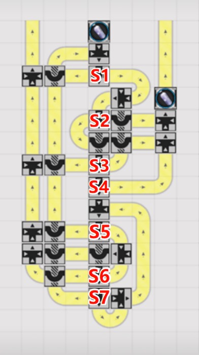
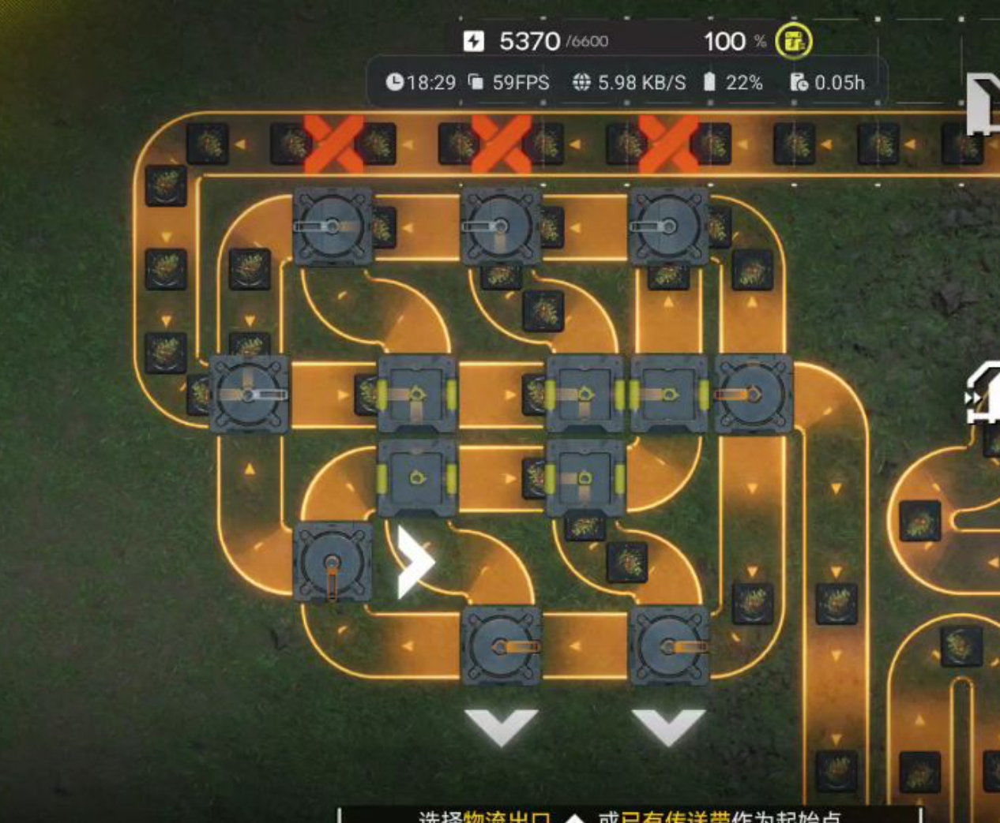
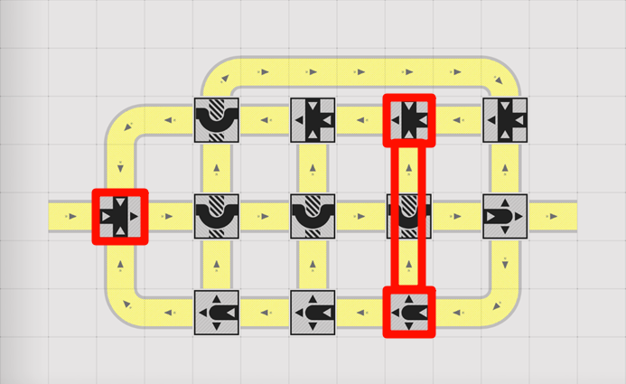
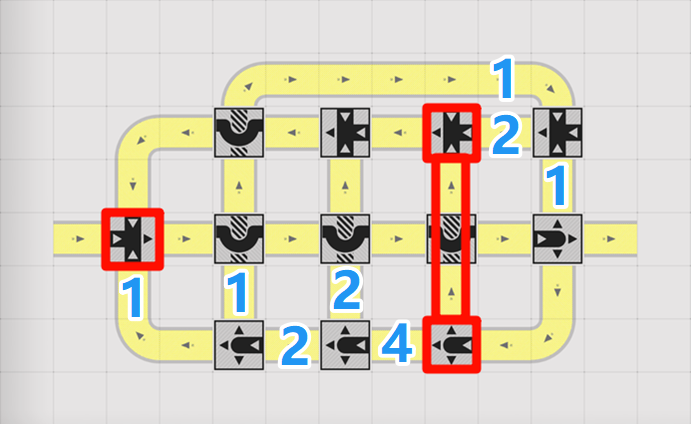
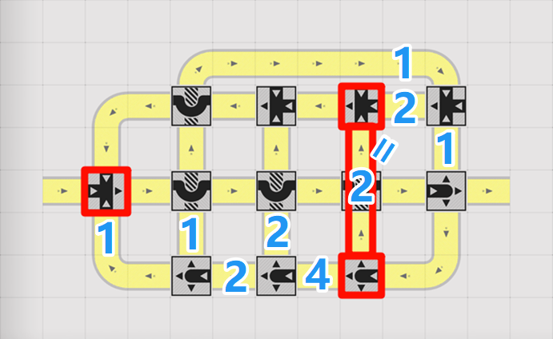
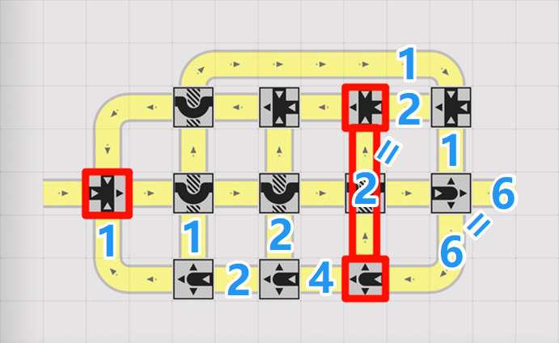

# 分流

> 原文：https://docs.qq.com/doc/DZW5GRmJDQXZDVUtm（腾讯文档经典文档，公开只读；公式由文档内部结构转成 LaTeX，原始数据在 `原始数据/外链文档/`）

本篇大部分公式为基于实验经验总结，暂未进行严谨证明。暂不考虑如$4n卡1s$的特性带来的影响。暂默认本篇中所涉及结构存在且能达到稳态。

简单分流器：

对于有1个入口，$t$个出口且在轮询机制下，可视为均匀分配到每个出口的分流器，称为$t$分简单分流器

简单分流器的输入速率、元输出速率：

　　用$\frac{物品的实际通过速度}{满带速度}$表示传送带速率，则对于稳态下的简单分流器，输入速率${v}_{in}$即为唯一入口处的传送带速率；仅当存在未被阻塞的出口时，存在元输出速率${v}_{0}$，元输出速率即为单条未阻塞出口处的传送带速率

双输出式分流器：

　　（分流器目前既可以指单个分流元件，也可以指能达成分流效果的整体结构，具体的规范命名方式待讨论）

　　通过将简单分流器的数个未阻塞出口的输出进行汇流，最终只有两个输出口的分流结构。将两个输出定义为主输出和副输出，取主输出的传送带速率${v}_{主}$为${v}_{out}$。一般的，简单分流器和和双输出式分流器可以相互转化，且由于只能取为阻塞的出口用于输出，有${v}_{out}={v}_{主}=n·{v}_{0}$，$n$为主输出中等效选取的简单分流器的出口数量

分流器的分流效率：

$$
η=\frac{{v}_{out}}{{v}_{in}}
$$

　　（在讨论有顶部回流的分流结构时，需额外定义输出占比，因为此时输入并不与所有输出的和相等 详细说明待补充）

(以下内容待修改，暂时折叠)

## 无阻塞的双输出式分流

条件1.每个分流器一定按出口数均匀分配且能到达后续节点

条件2.回流时，汇流器的输入带速和≤1

条件3.通入物品数量足够多

推论1.目的相同的路是完全等价的，故不需要考虑相位，且完全不用考虑汇流器的布置方法

分流器及其出口：

用形如${S}_{n}\left( {S}_{m}XY… \right),m,n∈{N}^{*}$表示单个分流器（或复合分流器）${S}_{n}$及其连接到的目的地。括号内每个元素代表一条路径。其中，${S}_{m}$表示该路径连接到分流器${S}_{m}$，$Y$表示该路径连接到有效输出，$X$表示该路径连接到销毁（或返回仓库）。同一元素可以重复出现，重复出现次数表示到达该目的地的路径数 
    用${T}_{n}$表示分流器${S}_{n}$的分流路径总数，${Y}_{n}$表示分流器${S}_{n}$连接到$Y$的路径数 
    例如，${S}_{n}({S}_{m}XYY…)$可以理解为：当任意物品到达分流器${S}_{n}$时，有$\frac{1}{{T}_{n}}$概率流向分流器${S}_{m}$，$\frac{2}{{T}_{n}}$概率被有效输出，$\frac{1}{{T}_{n}}$概率被销毁（或返回仓库），$…$

链：

暂时只考虑单输入的情况 
　　对于单输入环境，一般的，用${S}_{1}$表示被输入的分流器。此时，除${S}_{1}$外，对于任意分流器${S}_{i}$，都至少有一个来自分流器${S}_{j}$的路径的输入满足$j<i$，便能够对所有分流器进行排序得到链，记作：

${S}_{1}\left( … \right){S}_{2}\left( … \right){S}_{3}(…)……{S}_{n}(…)$，或记作： 
${S}_{1→n}=[…,…,…,……,…]$

复合分流器（整体法）：

　　若对于${S}_{i→j}$，其元素中的${S}_{k}$均满足$k∈\left[ i,j \right)$，则可以将其视作整体，即一个复合分流器。将其整体的${T}_{n}$记作${T}_{i→j}$。不难发现，${S}_{i→j}$中会重复出现${T}_{i+1→j}$次原本${S}_{i}$中的元素，${T}_{i+2→j}$次原本${S}_{i}+1$中的元素，$……$，$1$次原本${S}_{j}$中的元素。

1\.单链结构

对于能写成${S}_{1}\left( {S}_{2}… \right){S}_{2}\left( {S}_{3}… \right){S}_{3}({S}_{4}…)……{S}_{n-1}({S}_{n}…){S}_{n}(…)$的结构，即${S}_{n}$有且仅有一条路径连接到${S}_{n+1}$，且无连接到${S}_{m},m>n+1$的结构，称为单链结构

1\.1简单单链

设$P(n)$为物品经过${S}_{n}$后，到达$Y$的概率 
对于无回环的简单单链结构，显然：

$$
{P}_{n}=\frac{{Y}_{n}}{{T}_{n}}
$$

$$
{P}_{n-1}=\frac{{Y}_{n-1}}{{T}_{n-1}}+\frac{1}{{T}_{n-1}}⋅\frac{{Y}_{n}}{{T}_{n}}=\frac{{Y}_{n-1}{T}_{n}+{Y}_{n}}{{T}_{n-1}{T}_{n}}
$$

以此类推，归纳可得：

$$
{P}_{1}=\frac{\sum\limits_{i=1}^{n} ({Y}_{i}\prod\limits_{j=i+1}^{n} {T}_{j})}{\prod\limits_{j=1}^{n} {T}_{j}}=\frac{\sum\limits_{i=1}^{n} ({Y}_{i}{T}_{i+1→n})}{{T}_{1→n}}
$$

由于条件2，${P}_{1}$在数值上与整链的输出占比相等

1\.2单链上的回环结构

回环：

如果单链中出现${S}_{i}\left( {S}_{j}… \right)$满足 $j>i$，称作回环，记作：

${S}_{i回环j}$=$\left[ {S}_{i+1}…,{S}_{i+2}…,……,{S}_{j}…,{S}_{i}… \right]$

单回环情况：

设${S}_{1→n}$中有回环结构${S}_{i回环j}$ 
通过瞪眼法可得，引入回环后${T}_{1→n}$发生变化：

${T}_{1→n}=\prod\limits_{k=1}^{n} {T}_{k}-\prod\limits_{k∉[i,j]} {T}_{k}$ 

1\.3单链上任意个回环

将上式推广到任意个数的回环：

${T}_{1→n}=\prod\limits_{k=1}^{n} {T}_{k}-\sum\limits_{in回环jn} \prod\limits_{k∉[i,j]} {T}_{k}+Δ$ 

当存在两回环${S}_{i1回环j1}，{S}_{i2回环j2}$满足${j}_{1}<{i}_{2}$时：

$Δ=\prod\limits_{k∈U} {T}_{k}，U=\{{S}_{k}∣k∉[{i}_{1},{j}_{1}]∪[{i}_{2},{j}_{2}]\}$ ，且当$U=∅$时$Δ=1$ 
若存在三回环外离，则需两两计算$Δ$后额外减去三环的补集元素的${T}_{n}$积，以此类推

举例验证：

右图为一个七分流器的单链结构$\frac{325}{799}$，可将其写为： 
(此分流输入速率为1时，输出速率并不为$\frac{325}{799}$，但其输出占比确实如此，这里只验证计算其输出占比，等我有空再详细解释)

$$
{S}_{1→7}=[{S}_{2}X,{S}_{3}YY,{S}_{4}{S}_{2}X,{S}_{5}Y,{S}_{6}XX,{S}_{7}XX,{S}_{1}{S}_{5}{S}_{5}]
$$

　　显然${T}_{n}=\left[ 2,3,3,2,3,3,3 \right]$，且有四个回环：

　　　　${S}_{2回环3},2*{S}_{5回环7},{S}_{1回环7}$

$$
{T}_{1→n}={2}^{2}*{3}^{5}-\left[ 2*2*{3}^{3}+2*\left( {2}^{2}*{3}^{2} \right)+1 \right]+2*2+2*2=799
$$

只计算${Y}_{n}≠0$时的${T}_{i→7=n}$： 
对于${T}_{3→7}$，${S}_{3→7}=[{S}_{4}XX,{S}_{5}Y,{S}_{6}XX,{S}_{7}XX,X{S}_{5}{S}_{5}]$： 
${T}_{3→7}=2*{3}^{4}-2*2*3=150$

对于${T}_{5→7}$，${S}_{5→7}=[{S}_{6}XX,{S}_{7}XX,X{S}_{5}{S}_{5}]$： 
${T}_{5→7}={3}^{3}-2*1=25$ 
${P}_{1}=\frac{\sum\limits_{i=1}^{n} ({Y}_{i}{T}_{i+1→n})}{{T}_{1→n}}=\frac{2*150+25}{799}=\frac{325}{799}$

待分析： 
周期、为满足条件2 的限制

待推广方向： 
多链、环状多链、涉及多链的回环、多输入情况

## 阻塞及限流

由于目前仅对二分分流器、三分分流器做过实验，以下内容可能无法严谨地向更多分流数的分流器进行推广

阻塞式分流器：

对于稳态下的分流器，若存在出口的${v}_{k}<\frac{{v}_{in}}{t}$，则称该分流器发生阻塞，该出口为阻塞出口，称同时存在阻塞出口和未阻塞出口的分流器为阻塞式分流器。对于阻塞式简单分流器，由于未阻塞的出口在轮询机制下依旧保持均分，设有$k$个阻塞出口，有：

$$
{v}_{in}=(t-k){v}_{0}+\sum\nolimits_{{v}_{k}<\frac{{v}_{in}}{t}} {v}_{k}
$$

　　将$\sum\nolimits_{{v}_{k}<\frac{{v}_{in}}{t}} {v}_{k}$记作${v}_{阻}$，则：

$$
{v}_{in}=\left( t-k \right){v}_{0}+{v}_{阻}
$$

$$
{v}_{0}=\frac{{v}_{in}-{v}_{阻}}{t-k}>\frac{{v}_{in}}{t}
$$

特别地，若$t-k=1$，有${v}_{0}={v}_{in}-{v}_{阻}$，且此时有且仅有唯一未阻塞出口，故${{v}_{out}=v}_{0}={v}_{in}-{v}_{阻}$，该类结构称为取补结构

在阻塞式分流器中，通常用限流器构造${v}_{阻}$

阻塞式汇流器：

详细定义待补充。可在确定阻塞的判定方法之后再根据需求进行定义

这里只需要两条其性质：

1. 稳态下，对于任意简单汇流器，输入速率之和＝输出速率 
（事实上物流元件都有输入速率之和＝输出速率之和，包括协议箱）

2. 稳态下，若发生阻塞，被阻塞的入口处传送带速率一定相等

注意：由于优先汇流结构的存在，阻塞式汇流器并不要求非阻塞路速率小于阻塞路速率

阻塞的判定方法 待补充

限流器：

　　详细定义待补充

显然，用二分分流器和三分分流器能直接构造形如$\frac{n}{{2}^{a}{3}^{b}}$的限流器，构造方法与无阻塞分流中的简单单链的构造类似

对于用$t>2$的主分流器构造的限流器，可以通过将该分流器一个出口的输出，经由一个双输出式分流器，将一个输出汇流至该分流器的另一个输出，来达成阻塞被汇入的输出的目的

该结构什么情况下会被阻塞的证明 待补充

例如，$t=3$时，分流器的三条输出分别称为输出路、阻塞路、分流路。用${S}_{i}$表示单链上的第$i$个分流器，用${S}_{i→n}$表示${S}_{i},{S}_{i+1}, …,{S}_{n}$构成的整体，将${S}_{i}→{S}_{i+1}上的传送带速率定义为{S}_{i}的{v}_{主}(i)$，从${S}_{i}$出发通向阻塞路的速率定义为${v}_{副}(i)$，则有：

　　${v}_{out}\left( i \right)={v}_{主}\left( i \right)={η}_{i}·{v}_{in}\left( i \right)$

　　　　${v}_{副}\left( i \right)=(1-{η}_{i})·{v}_{in}\left( i \right)$

　　　　${v}_{out}\left( i→n \right)={v}_{out}\left( n \right)={η}_{i→n}·{v}_{in}\left( i \right)$

　　　　${v}_{副}\left( i→n \right)=\sum\limits_{j=i}^{n} {v}_{副}\left( j \right)=(1-{η}_{i→n})·{v}_{in}\left( i \right)$

　　通过推导可以得到：

　　　　${η}_{i→n}=\prod\nolimits_{k=i}^{n} {η}_{k}$

　　若${S}_{i}$未发生阻塞，显然${η}_{i→n}=$ 
（此处需要用到无阻塞的双输出式中得到的结论，但我还没开始改那部分的内容，知道这里很显然就行）

　　若${S}_{i}$发生阻塞，  
（受双输出式分流器模型限制，无法构造三输出下，到阻塞路的输出同时存在阻塞和未阻塞的情况。同样的，三输出也可以用于在非主分流器位置构造同时有输出、阻塞、分流的结构。但目前似乎也未实际构造过这些结构，先就这样吧）

　　此处需要由被阻塞的汇流器，用性质2推导得到的${η}_{i}$，需要考虑汇流器的位置、连接方式等，我不会推

　　对于三汇流+三分流的限流结构，由于限流器的输入与输出相等，有：

$$
\sum\limits_{j=1}^{n} {v}_{副}\left( j \right)={v}_{out}\left( 1 \right)={v}_{in}\left( 2 \right)=\frac{{v}_{out}\left( 2→n \right)}{{η}_{2→n}}=\frac{{v}_{out}\left( n \right)}{{η}_{2→n}}
$$

　　由阻塞式汇流器性质1，2对于阻塞路上的汇流器和必定阻塞的主汇流器，有：

　　　　$2·\sum\limits_{j=1}^{n} {v}_{副}\left( j \right)+{v}_{out}\left( n \right)=1$，即：

$$
2{v}_{out}\left( 1 \right)+{η}_{2→n}·{v}_{out}\left( 1 \right)=1
$$

解得${v}_{out}\left( 1 \right)=\frac{1}{2+{η}_{2→n}}=\frac{1}{2+\prod\nolimits_{k=2}^{n} {η}_{k}}$ 
(此式与之前的${v}_{out}=\frac{T}{3T-Y}$等价）

待向t\>3推广

先前给出的计算方法实际上是三汇流+三分流的限流结构中的一种特解，其条件为每个分流器都有一个与之对应的汇流器，且排列顺序相同。上述内容讨论对三汇流+三分流的限流结构的通解，但还未得到结果。这里提供一种图解法，同样的在已知堵塞位置的前提下，该方法能对分流器不与汇流器对应且顺序混乱的情况求解：

以由@苍孤狼 构造的结构为例：

做出其等价结构，标出阻塞路之外的阻塞及阻塞元件：

　　将${v}_{out}\left( n \right)={v}_{副}\left( 1 \right)$标为1，通过未阻塞的分流器依次向上计算，直到遇到阻塞的分流器：

　　遇到阻塞的分流器后，可利用其对应汇流器的性质2计算它们之间的值：

之后计算主分流器的所有出口、主汇流器的所有入口均可：

　　便可算出主分流器的分流效率：

$$
{η}_{1}=\frac{6}{1+6+6}=\frac{6}{13}
$$

$$
{v}_{out}\left( 1 \right)={η}_{1}·{v}_{in}\left( 1 \right)=\frac{6}{13}·1=\frac{6}{13}
$$

由图解法对判定阻塞的猜想：

　　在已知或证明出一条必定阻塞的路上，上面的汇流器必须满足副输入≤主输入，当副输入\<主输入时，阻塞未发生；当副输入=主输入时，需依靠该路上游判断是否阻塞，以上游是分流器为例，需判断其输出是否\<$\frac{{v}_{in}}{t}$
