# 物流结构分类

> 原文：https://docs.qq.com/aio/DZXhhTUp6WU1Yd3Ba?p=GzlRUGEnEkorT2H6NOunIL

本文的目的是对物流结构进行初步分类（按结构分类），供讨论统一对物流结构及相关术语的命名。故本文会先使用个人习惯进行描述说明，并尽量不用符号（以便后续同一术语规范？），需要经过讨论后规范化再放入任务板

暂时不做证明，感觉是对的就写上去，如果这种分类方法被广泛接受再写

（其实就是懒得写）

引用的案例不一定是最早的，有的可能无法溯源，记得谁做过就放上去了（去网上溯源就更麻烦了，先放群友做的）

关于分流和限流：从习惯上讲，一般把单入单出的结构称为限流结构，单入多出的结构称为分流结构。但我不清楚多输出的限流结构应该如何描述？大部分限流结构实际上是支持多输出的

由于是人类生成，可能含有诸多逻辑不清、话说不清、自相矛盾的情况，还请见谅

<b>基础分流结构：</b>

一些临时定义（这些定义的适用范围不同，理论上不应该都放在这里）：

基础分流结构：一个单入n出的结构（n为正整数），由分流结构、输入汇流结构（可选）、输出汇流结构（可选）组成。分流结构可以是单一分流节点，也可以是复数个分流节点组成的分流树，汇流结构同理

（此处需要配图）

自由流量：在指定的输入流量下，假设所有分流节点都只发生均分，且边的流量不受1的上限限制时，物流结构的边的流量。计算方法：对物流结构的分流节点列线性方程组求解

分流效率：反映输出承担输入的比例。在基础分流结构中，输出的分流效率＝自由输出流量/自由输出流量之和

结构阻塞：若在指定的输入流量下，某物流结构有边的自由流量大于1，称该结构在该输入流量时发生阻塞。若未声明输入流量，对于基础分流结构，默认输入流量为1。阻塞结构能接受

阻塞结构：在指定输入流量的基础分流结构中，由所有阻塞边和阻塞节点（输入边和输出边均阻塞的节点）组成的子结构

（基础分流结构的阻塞节点应该只能是汇流节点？需要证明）

阻塞约束流量：在指定的输入流量下，假设所有分流节点都只发生均分，且边的流量受1的上限限制时，物流结构的边的流量。计算方法（仅基础分流结构）：阻塞约束流量=自由流量/最大自由流量

实际（真实？）流量：该考虑的都考虑的流量，就是求解器给出的结果。实际输入流量≤（原？）输入流量

（需要考虑避免与真实环境（游戏内考虑物流bug的环境）的歧义）

回流：分流节点的输出指向的汇流节点是自身的上游的行为，称该输出边为回流边。在基础分流结构中，从分流结构指向输入汇流结构的边均为回流边；输入流量为1时，有回流边必定发生阻塞。

限速值：在输入流量为1时，结构能进行的最大输出总流量。基础分流结构有固定的限速值，回流边均未阻塞时，限速值即为输入为1时的最大自由流量的倒数；有阻塞回流边时，限速值大于该值

基础分流结构的流量函数：实际输入流量=min(输入流量，限速值)，实际输出流量=实际输入流量\*分流效率

（这里可以引出另一种对于分流结构的分类方式：伪分流结构—在特定范围的输入下符合需求的比例；常规？分流结构—在任意输入下都能符合需求的比例；完全？真实？分流结构—等价于一个单元件工作，即使有输出阻塞，流通输出也能均分）

可以根据回流边在输入流量为1时回流边的状态将基础分流结构分为三类：

<b>一、无回流边的基础分流结构</b>

这东西有啥用 好吧还真有？

该结构不会发生阻塞

构造范围：

$$
\frac{p}{2^{n}\ast 3^{m}}分流\ 或\ a:b分流，a+b=2^{n}\ast 3^{m}
$$

周期：

案例：

1/2分流或1：1分流：

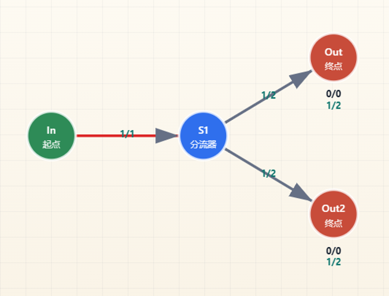

等价单元件四分器，来自@kkb ：

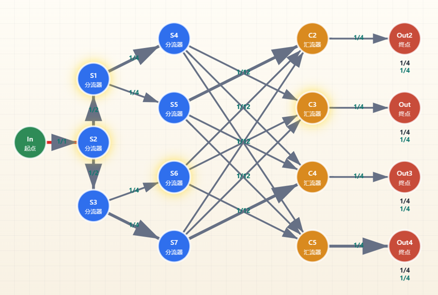

构造思路：这有必要说吗

（很遗憾，更高级的应该无法在没有回流边的情况下构造）

<b>二、回流边均未阻塞的基础分流结构</b>

在输入流量≤限速值时，该结构可以将输入分为不同比例，因此有以下作用：输入流量≤限速值时，用于构造分流结构；输入流量＞限速值时，用于构造限流结构

该结构在输入流量＞限速值时发生阻塞，且阻塞结构为链状，开端点为输入节点和首个分流节点

实际构造中，由于子结构的输入流量大多不会超过限速值，固该结构会经常性地作为其它结构的子结构参与构造

1\.传统（伪）有理分流结构

构造范围：

$$
\frac{p}{q}分流\ 或\ a:b分流，仅当输入流量\leq 限速值时
$$

周期：

案例：

早期的常见伪五分器，1/5或1：4分流，仅当输入流量≤5/6时：

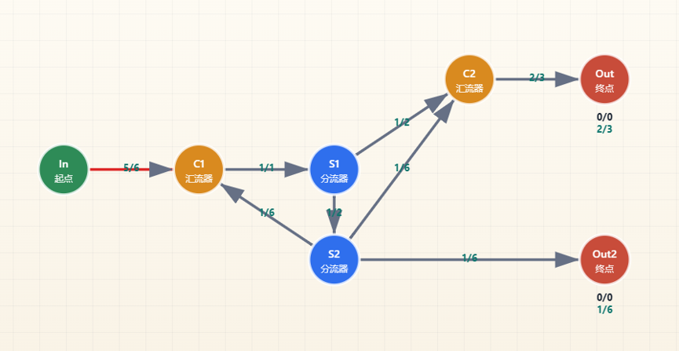

325/799分流，仅当输入流量≤799/864时，来自b站@Necesitas 于BV1ScF7z1Eh5的评论：

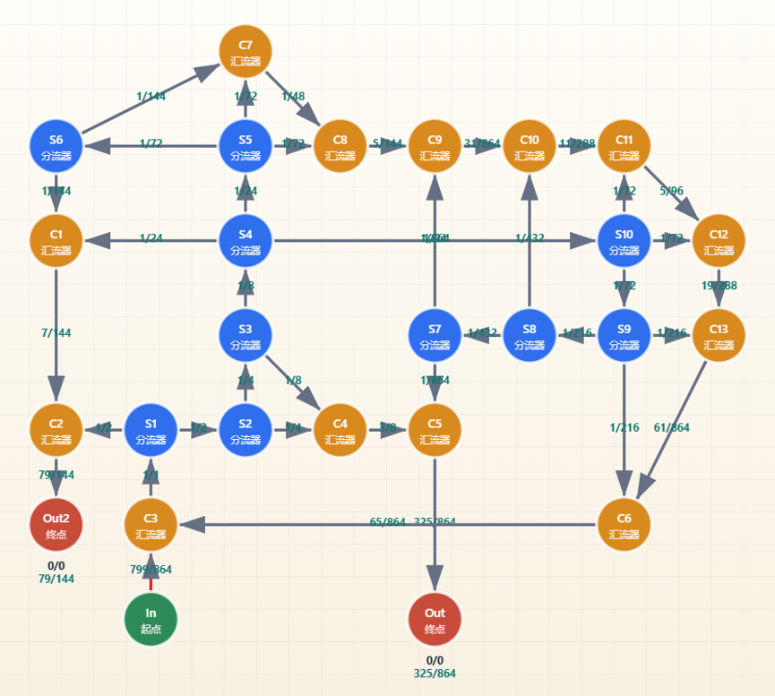

构造思路：先寻找一个大于目标分母的、质因数只有2和3的数864=2^5\*3^3，计算与目标分母的差864-799=65作为回流，将864用分流器进行拆分（二分或者三分）得到新的元素并放入一个可输出元素的集合，根据子集和判断是否能凑出目标分子和回流，若不行则继续拆分，直到得到结果。例如，在此图中构成分子325的集合为{216，108，1}。然后再将各个元素作为分流器的输出进行汇流，连至各自的输出节点/回流位置

2\.传统限流结构：

构造范围：

$$
\frac{p}{2^{n}\ast 3^{m}}限流
$$

周期：

案例：

2/3限流：

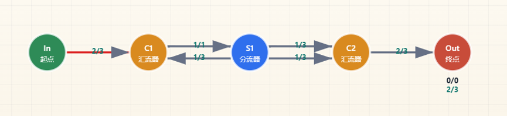

325/486限流，由于没找到适合的案例，@Orirock 临时构造：

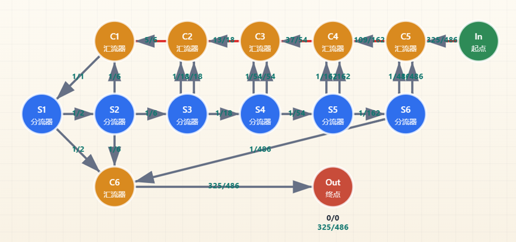

构造思路：对目标分母486进行拆分（二分或者三分），使得到的元素的集合中存在子集和为325的子集，此处为{243，81，1}，其元素汇流后连至输出节点；其它元素作为回流，按越小的越先汇入外部输入进行回流

<b>三、有阻塞回流边的基础分流结构</b>

与回流边均未阻塞的基础分流结构类似，但可以构造（0，1/2）的有理数限流

该结构在输入流量＞限速值时发生阻塞，且阻塞结构为树状

1\.1/n限流

阻塞结构为毛虫树状，汇流结构和分流结构均为链状

构造范围：

$$
\frac{1}{n}限流
$$

周期：疑似为n

案例：

1/5限流，来自@jnk ：

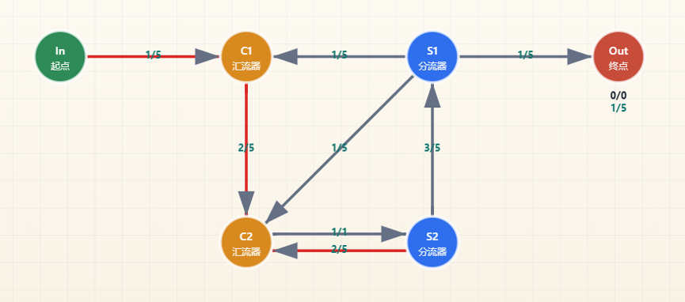

1/325限流，纯三分器构造，来自@madSUN ：

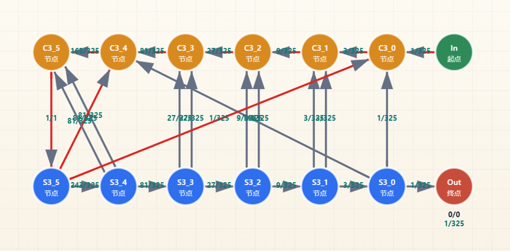

构造思路：详见[关于 1/n 阻塞流的一些研究和搜索](https://docs.qq.com/aio/DTmluZ1diWlpQZldw?p=7IIqNDoItC2dFP65ZsyOaQ)

1/328限流，二分三分器混合构造，来自@Orirock ：

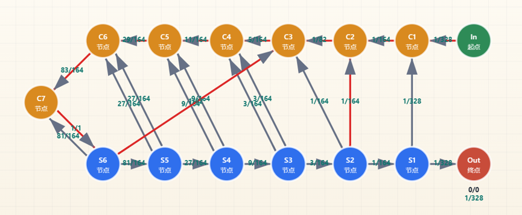

构造思路：跟1/n差不多，只是允许使用最多两个二分器

2\.1/n限流扩展

阻塞结构为毛虫树状，汇流结构和分流结构均为链状

相较于1/n，该结构减少了部分回流边从而增加了输出边

构造范围：

$$
\frac{p}{q}\in \left(0,\frac{1}{2}？\right)限流
$$

注：该结构难以构造接近1/2的限流

周期：

案例：

2/5限流：

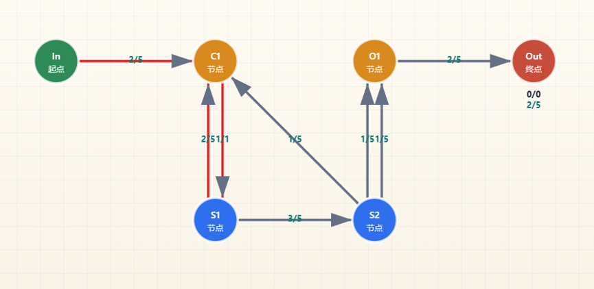

325/799限流，来自@Orirock ：

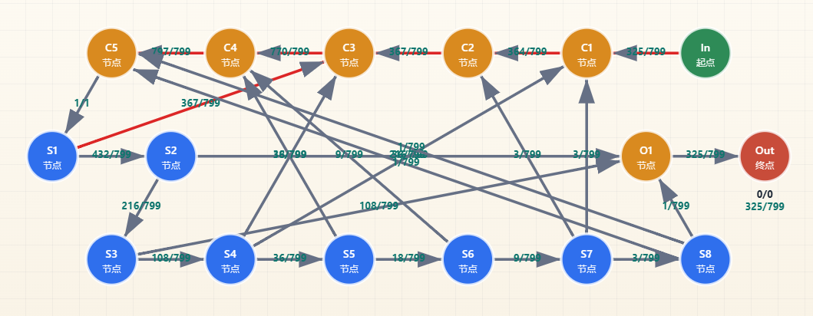

先用构造[2.传统限流结构：](物流结构分类.md#G7eYxGV37hOMyN3YfxrFXh)的方法构造一个325/432作为下部，输出元素汇流后连至输出节点，再用构造[1.1/n限流](物流结构分类.md#l148TflfSPrZdNltKLmpyr)的思路寻找一个小于799/432的n，将传统限流结果中的回流元素和1/n的回流元素一起排列，直至找到目标分母；若找不到，考虑更换下部或上部的结构继续搜索

3\.基础三分三汇限流

阻塞结构为树状，S1到C1的路径阻塞且之间至少有一个汇流器

构造范围：

$$
\frac{a+b}{2a+3b}, a+b=2^{n}\ast 3^{m}
$$

周期：

案例：

2/5限流，来自@Cipolla\_ ：

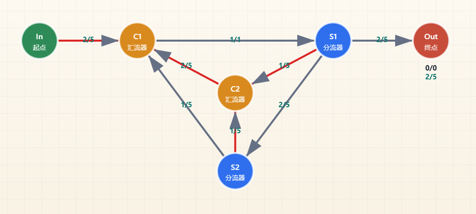

144/325限流，@Orirock 临时搜了一个放上来：

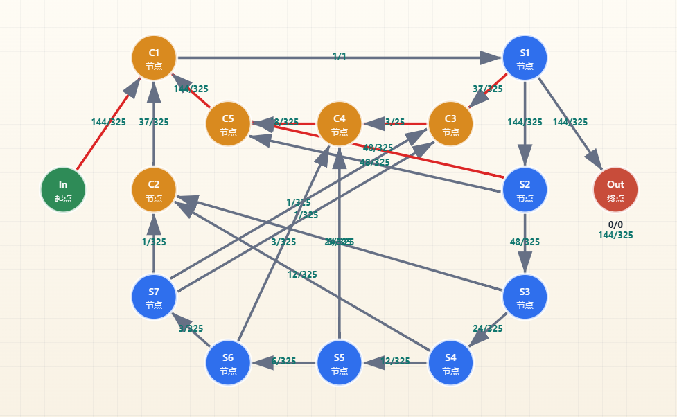

构造思路：先根据a+b=144，2a+3b=325计算得a=107，b=37，用[2.传统限流结构：](物流结构分类.md#G7eYxGV37hOMyN3YfxrFXh)构造37/144，输入为主分流器S1的输出，将输出元素汇流后输入主汇流器，回流元素与主分流器的另一输出汇流后汇入主汇流器，注意需保证传统限流结构中的回流边不阻塞，结构输出为S1的一个输出边

4\.有S1以外的分流器有回流边阻塞，且阻塞回流变位置在S1和C1之间的基础三分三汇限流：

构造范围：

周期：

案例：

3/7限流，来自@Cipolla\_ ：

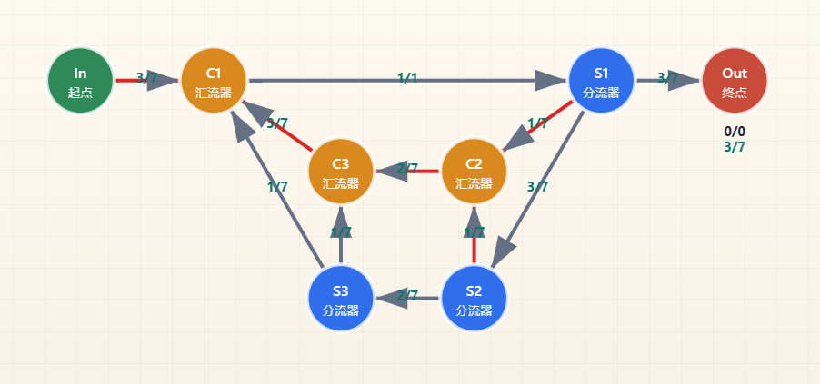

目前没有该结构的搜索算法，不知道放什么合适

5\.部分树状分流链状汇流结构

类似1/n扩展，但此时不再限制分流结构为链状。分流结构可以为树状但存在限制，具体为要求所有输出边同时受/未受阻塞回流边影响

构造范围：

$$
\frac{p}{q}\in \left(0,\frac{1}{2}\right)限流
$$

周期：

案例：

5/17限流：

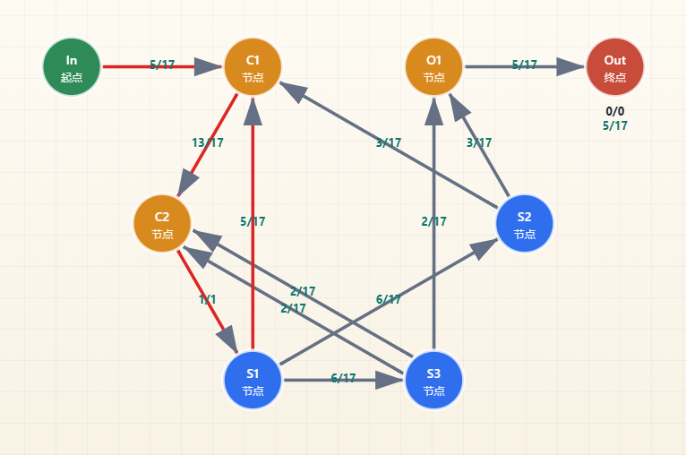

通过这些案例可以看出，基础分流结构只有在出现回流边阻塞，也就是对应分流器发生溢流时，可以用于构造有理输出结构。并且回流边阻塞会使对应分流器的流通边流量增大从而增大整个结构的限速值。同时，更多的阻塞回流边已经与流通流量边差值更大的阻塞回流边意味着整个结构的限速值会更大，这意味着缩小了结构对分母的构造范围。从阻塞情况来看，

回流边均未阻塞的基础分流结构和有阻塞回流边的基础分流结构在输入＜限速值时，输出有优秀的均匀性，因此可以用来构造整流器/滤波器

滤波器，来自@xyIvneu\_ ，BV1HFFrzeEtc：（不知道如何展示其功能）

<b>基础分流结构的局限性：</b>

基础分流结构无法用于构造限速值＞1/2的有理限流结构。原因：若输出流量＞1/2，意味着输入流量＞1/2且回流永远小于输入，也就是无法形成分流器未均分的情况

<b>基础汇流结构：</b>

（由于目前很少讨论汇流结构，故所有涉及汇流结构的内容大多为猜想）

做基础分流结构的有向图的转置图，可得到基础汇流结构。

不难注意到，若不考虑流量的方向，未阻塞的分流节点和阻塞的汇流节点的流量表现出相同的结果。相应的，分流结构与其转置得到的汇流结构，在分流结构输入流量＝汇流结构输出流量时，对应边的流量也应该是相等的。且改变分流结构的输入，等价于对汇流结构输出进行限速；改变汇流结构的输入，等价于对分流结构的输出限速。

（由于和基础分流结构关系过强，那些基础分流结构结构里进行的定义我暂时直接拿来用了，后续再讨论是需要统一命名抑或分别命名）

对于基础汇流结构，仍可根据结构内是否有边的自由流量\>1来判断是否发生结构阻塞。若不考虑对相位的影响，未发生阻塞基础汇流结构仅是对输入流量简单相加，故此处不做讨论；完全阻塞的基础汇流结构（在输入流量均≥分流效率\*限速值时，基础汇流结构会完全阻塞），基础汇流结构每条边的流量实际上等价于输入流量=1的对应转置分流结构的每条边的流量，故此处也不详细讨论

所以主要讨论的是，存在阻塞且未完全阻塞的基础汇流结构，在不同输入流量下的实际流量。

关于基础汇流结构的流量函数：

目前没有什么思路，其流量函数仍与具体的结构密切相关

汇流结构常用于打混器，制作混带

<b>基于基础分流结构的简单复合分流结构：</b>

当基础分流结构为单入单出时，可将其作为一条边替换其它结构中的边；为单入多出时，可将其作为一个分流节点替换其它结构中的分流节点

同样的，复合分流结构也能作为边或节点替换其它结构中的边 

<b>一、替换边的简单复合分流结构</b>

当基础分流结构作为边时，若其限速值≥1，若不考虑相位，对流量无影响。故此处主要讨论限速值\<1的基础分流结构

1\.狭义取补结构

在二分器下接限流结构，可使二分器另一端的流量为max（1/2输入流量，输入流量-限速值）。仅在限速值＜1/2输入流量时，取补结构才会工作，否则仍表现为普通分流器。若将接了限速结构的输出端回流至上游，该结构对上游的汇流器始终保持流通，故是否回流都不影响狭义取补结构的工作

正如前文所说，基础分流结构无法用于构造限速值＞1/2的有理限速结构，因此该结构常用狭义取补结构构造

一般而言，狭义取补结构需要两个元件（分流器、汇流器）来构造一个限速值＞1/2的限速结构；若作为子结构的限速结构的输出端汇流器存在空位，也可以只用一个元件（分流器）来构造

构造范围：

$$
\frac{p}{q}\in \left(\frac{1}{2},1\right)限流
$$

周期：取决于子结构

案例：

3/5限流：

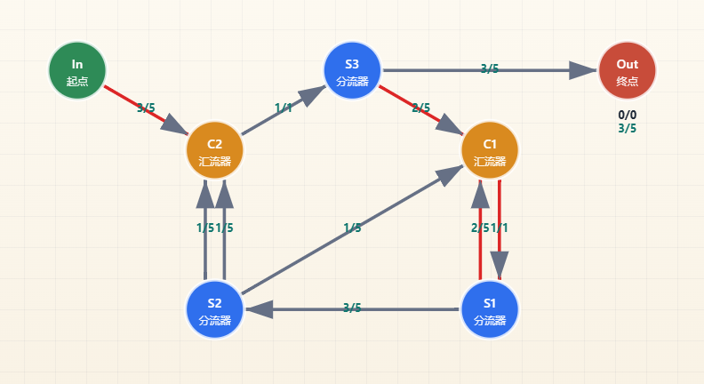

随便放了个，302/325限流：

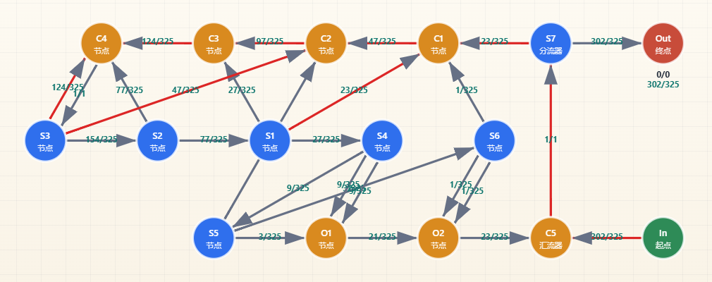

2\.广义取补结构

在分流结构的若干输出边下接若干个限流结构构造而成。或称多级溢流结构

由于分流结构下接多个限流结构的流量函数复杂且需要更多元件，此处暂不提供案例

3\.限流结构的嵌套

通过将限流结构置于基础分流结构的首个分流器之前（即流量为1的边，在基础分流结构中唯一），可以使基础分流结构的限速值变为原限速值\*限流结构限速值，通常用于快速构造分母非质数的限流结构，或通过已有的质数限流结构对分子进行乘法运算

需要注意的是，嵌套后结构外部的回流边会不再阻塞，因此并不是所有结构都能被用作嵌套结构外层

构造范围：

周期：

案例：

基于1/5限流和2：3分流再回流的3/25：

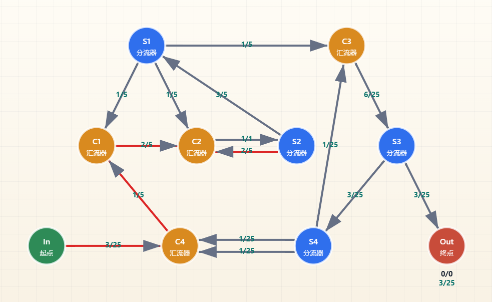

基于25/47限流和13/17的325/799：

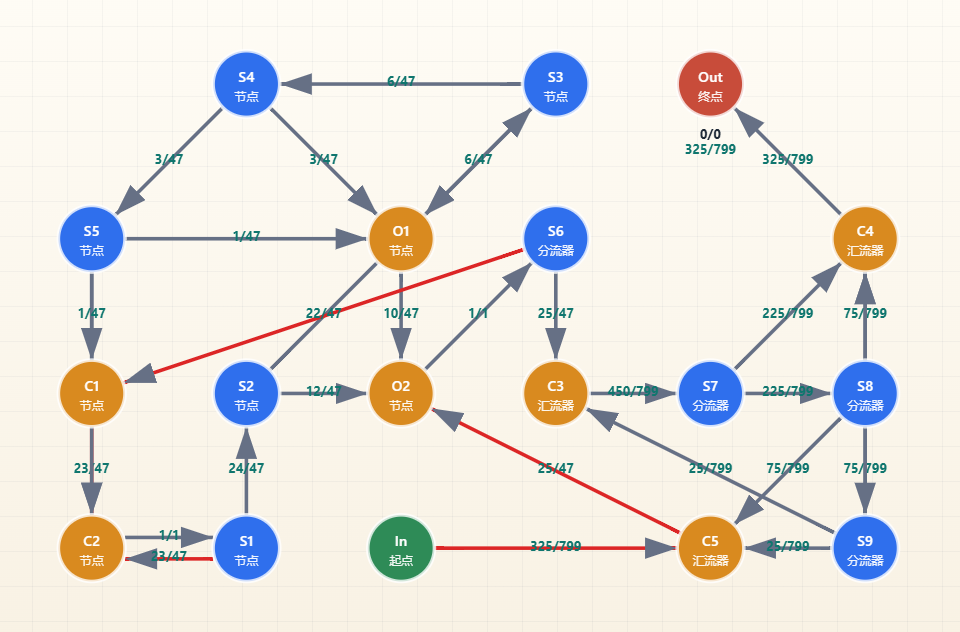

<b>二、替换分流节点的简单复合分流结构</b>

作为分流结构替换时，若阻塞未发生，可将子结构视作一个整体的分流器，从而构造2、3以外的质因数。但如此操作往往会使结构的元件利用率降低

1\.无阻塞的有理分流结构
