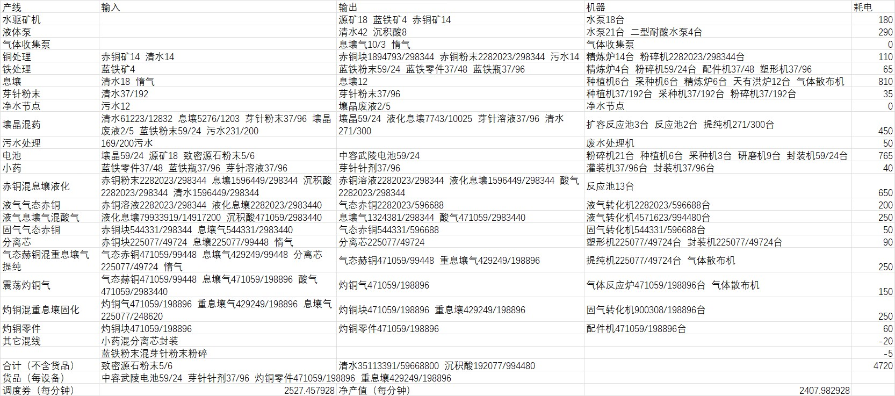
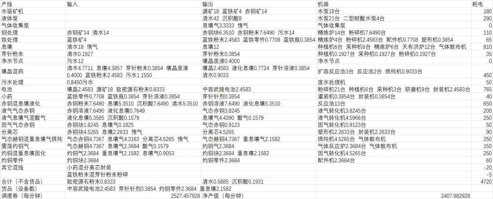

# 1.4自适应最大净产

> 原文：https://docs.qq.com/aio/DTmluZ1diWlpQZldw?p=VaTdkQbdSqtUrbygzXaic1　上级：[「向渊行」版本](「向渊行」版本.md)

前瞻：

[https://www.bilibili.com/video/BV1MAtp6mE6n?vd_source=bf73afe506171ce1f2c1a4732d9d4bde](https://www.bilibili.com/video/BV1MAtp6mE6n?vd_source=bf73afe506171ce1f2c1a4732d9d4bde)

正式：

咕咕咕 咕咕 咕咕咕咕咕

## 产出拉表

## 重要节点

[自适应产线节点元件构造](单个反应池生产壤晶废液.md)

[小药/分离芯混合封装](小药_分离芯混合封装.md)

## 其他节点

[1.4中较简单的自适应装置们](较简单的自适应装置们.md)

## 布局
