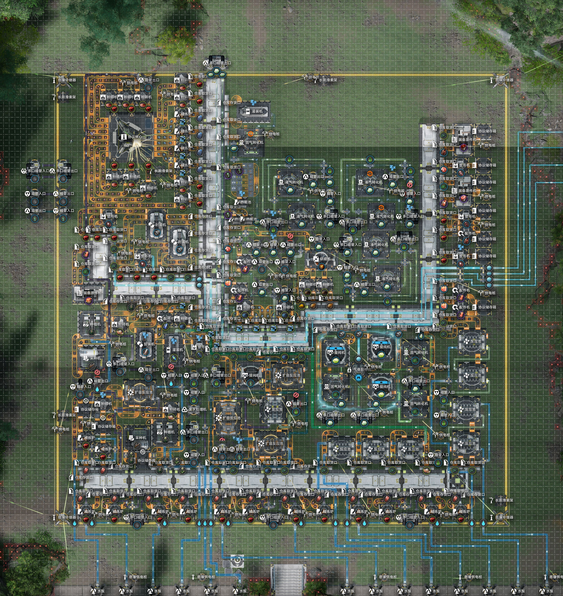
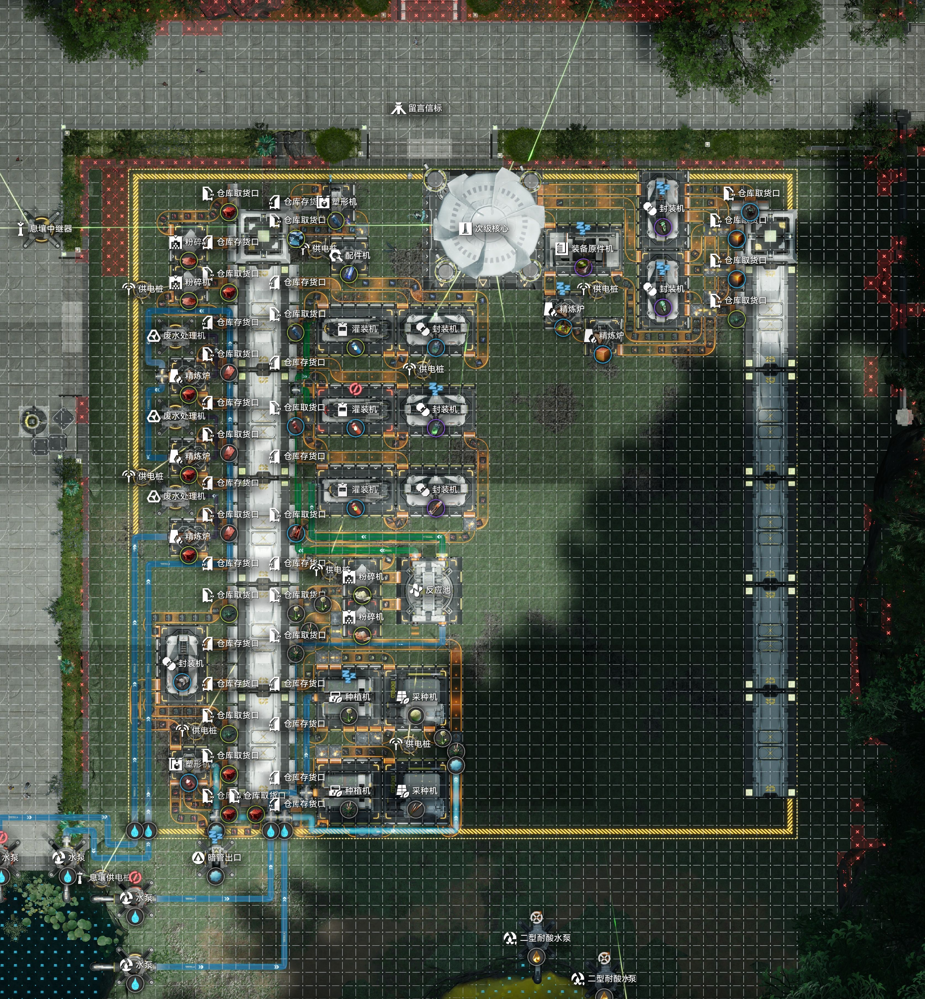
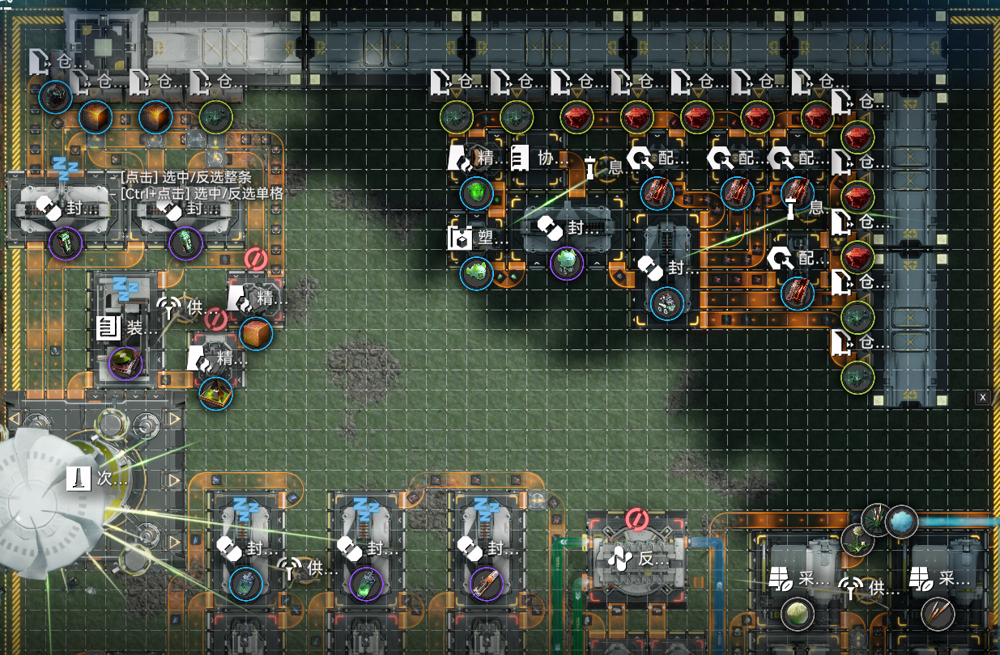
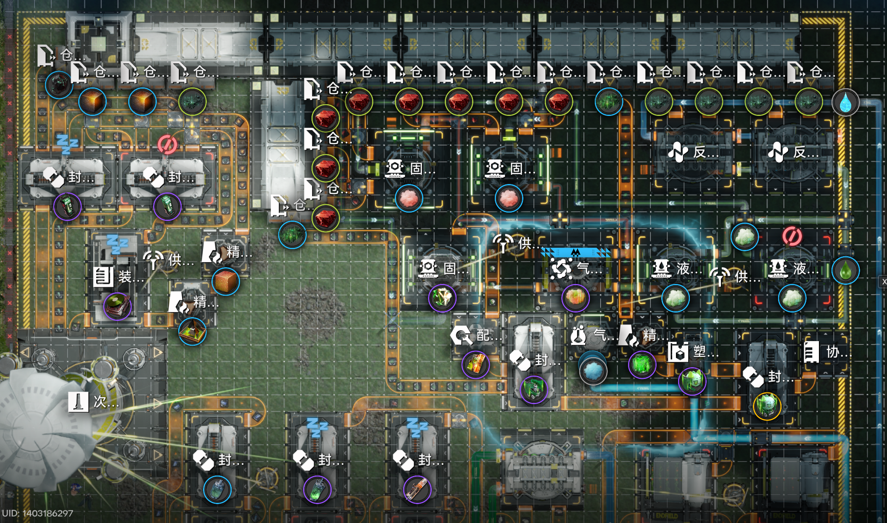
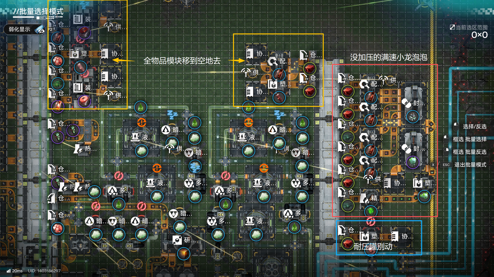

# 1.5智能全物品

> 原文：https://docs.qq.com/aio/DTmluZ1diWlpQZldw?p=pRYbuAlRWdRJutvUjeqpKw　上级：[1.5智能最大毛产](1.5智能最大毛产.md)

## 概述

本基建在 [1.5智能最大毛产](1.5智能最大毛产.md) 的基础上，调整了武陵主基地布局，并利用剩余空地添加了全物品产出插件。

基建介绍视频：[【终末地】成熟的基建会自己配平自己 \| 1.5智能全物品基建](https://www.bilibili.com/video/BV1NFe56uEdQ/)

> ⚠️ 若有问题请优先观看 [1.5智能最大毛产](1.5智能最大毛产.md) 文档的常见问题汇总部分，本页面仅会记录全物品基建与原版最大毛产基建的差异部分。

<b>言：这里的蓝图没有更新景玉谷和应龙关，请移步原文档安装这两个基地</b>

## 蓝图码合集

### <b>开始拍蓝图前</b>

<b>请确认仓储情况：</b>

10000+息壤 10000+赤铜块 2000+赤铜零件 1000+紫晶零件 1000+铁制零件 1000+晶体外壳 1000+源矿 500+锦草 500+芽针 500+砂叶种子

足量设备

<b>请确认基地升级：</b>

建议升满所有的区域扩大和存取线基段（实际上应龙关的存取线可以少点两级），必须开启除了炮台之外所有科技点（部分科技点存在前置任务，查漏补缺请自行完成）

<b>请确认禁区息壤气矿：</b>

需要4个矿点以上（80+息壤气/min）的息壤气输送到应龙关基地

以下为选做，完成后基建会自动优化至最大产能：

建设等级达到24级且连接所有矿点（源矿540 蓝铁矿120 赤铜矿510 息壤气150）

超库存传输致密源石粉末

连接净水节点

将应龙关基地的富余息壤气使用多口暗管输送到武陵主基地（这一步若不做，则雪松林的50息壤气可选择不输送）

### 应龙关分基地（与最大毛产相同）

[1.5智能最大毛产-应龙-自动赫灼18灼](1.5智能最大毛产.md#aZli93Lno95jxDGgn1OJj9)

内容与视频展示相比有更新，摆放方式基本一致，01靠最上边拍，后续注意基段连接/贴边等（通常只有一个可放置位置），暗管位置与视频一致。

### 武陵主基地

《明日方舟：终末地》蓝图 \[武陵左上01\]分享码EF018OI342Eo515aUI73 请复制后前往游戏中使用。

《明日方舟：终末地》蓝图 \[武陵中上02\]分享码EF010819Iu3aoiAIE179 请复制后前往游戏中使用。

《明日方舟：终末地》蓝图 \[武陵右上03\]分享码EF0170iU169ea5ueO0Ai 请复制后前往游戏中使用。

《明日方舟：终末地》蓝图 \[武陵右下04\]分享码EF01o5u82EOI46o7IieO 请复制后前往游戏中使用。

《明日方舟：终末地》蓝图 \[武陵中下05\]分享码EF01A67i0a1U9E2E9ieO 请复制后前往游戏中使用。

《明日方舟：终末地》蓝图 \[武陵左下06\]分享码EF01E752iAUOeo183uIa 请复制后前往游戏中使用。

《明日方舟：终末地》蓝图 \[武陵净水\]分享码EF01I43oEO5u29975o08 请复制后前往游戏中使用。

《明日方舟：终末地》蓝图 \[武陵全物品补充\]分享码EF015i2OU7e4Au13eIoe 请复制后前往游戏中使用。

《明日方舟：终末地》蓝图 \[半速固气灌装\]分享码EF01U9eAa1670OO271a8 请复制后前往游戏中使用。

《明日方舟：终末地》蓝图 \[16档震荡发电\]分享码EF01o5u82EOI46ooIieO 请复制后前往游戏中使用。

### 天王坪分基地

[1.5智能最大毛产-景玉-12息壤2中电](1.5智能最大毛产.md#qMT4GtWsR8rDPnonIh5VLq)

可忽略视频讲解中的“景玉谷03”部分，只按顺序放01、02蓝图即可。更新后入水口位置有变化，惰气口在基建中部右侧（水池在下方的视角）

原蓝图码（与视频一致，但极端情况可能出bug，建议抄最大毛产的修复版）：

《明日方舟：终末地》蓝图 \[天王坪上01\]分享码EF01u28IO543E03oAoOU 请复制后前往游戏中使用。

《明日方舟：终末地》蓝图 \[天王坪下A02\]分享码EF018OI342Eo5151UI73 请复制后前往游戏中使用。

《明日方舟：终末地》蓝图 \[天王坪下B03\]分享码EF013Eou5428OaUi0579 请复制后前往游戏中使用。（03只有水管）

### 首墩分基地

《明日方舟：终末地》蓝图 \[首墩右01\]分享码EF01u28IO543E038AoOU 请复制后前往游戏中使用。

《明日方舟：终末地》蓝图 \[首墩左02\]分享码EF01Oe4o17iu9I059oe4 请复制后前往游戏中使用。

#### 龙泡泡插件

《明日方舟：终末地》蓝图 \[一阶段01\]分享码EF016u0Iuui10762O83e 请复制后前往游戏中使用。

放置完成后，建议去主基地关闭2\~4台赤铜粉碎机，以及1\~2台息壤反应池（关哪个视频最后说了）。以简报中赤铜块与息壤消耗殆尽为标准。

<i>“如果你的息壤和赤铜没被吸干说明你还没有榨干产线的最后一丝产能。”</i>

《明日方舟：终末地》蓝图 【大龙泡泡加压】分享码EF012UO30A7o187oeIOo 请复制后前往游戏中使用。

20260923 19:00更新：修了大龙泡泡蓝图中，极端情况下可能怎样都跑不满速的bug（如果没出现类似问题可以不换）

摆的有点丑请见谅，<b>需要外接一个水泵，摆完要检查惰气管道，确认连上了之前蓝图的惰气准入口，首墩的四个惰气最好全采集回来</b>。

> ⚠️ 请注意：二阶段商店仅一条满速大龙泡泡不足以搬空最后的100个折金票，解决方案包括但不限于在主基地多补一条满速的小龙泡泡（需要自行关闭赤铜粉碎机/息壤反应池），主基地惰气不够再来一条满速的大龙泡泡了。（也没地方摆了）
>
> 如果你觉得这点蚊子腿折金票不要也罢那就不用管。
>
> 详情见：[1.5智能最大毛产-二阶段-首墩-7.5/min重息壤龙泡泡](1.5智能最大毛产.md#Sp48AHGvwvLIbjxO4OoUeX) 说明部分

加压比例同小龙泡泡，实际需要120赤铜+60息壤，2:1加压，先前摆过小龙泡泡的直接换就行不需要再次开关机器（如果你其他产物的爆仓情况没有变化的话）。

空间限制原因无法采用最优的固液气途径，息壤消耗较最佳配比多4.8/min。

二阶段如果需要主基地多摆小龙泡泡产线可以参考我的摆法：

“全物品补充”的设备挪到空地里（耐压罐要惰气不能挪），然后原来的位置补一个小龙泡泡的产线，就<b>用下面那个没有加压的满速产线，不要加压，加压了反而可能会导致大龙泡泡掉速</b>。然后把六个赤铜粉碎机全关了，如果还不够就再多关1\~2台，息壤反应池关多少看个人情况，我关了两台。

小龙泡泡不满速问题不大，5.5/min就够用，如果你一阶段有富余龙泡泡的话也许还能更少（可以自己对着商店按一下计算器看看需要多少）

（以下为根据前瞻节目盯帧配方制作的活动产线，未加压）

《明日方舟：终末地》蓝图 \[满速小龙泡泡\]分享码EF018OI342Eo515uUI73 请复制后前往游戏中使用。

《明日方舟：终末地》蓝图 \[满速大龙泡泡\]分享码EF01eaA7690i14I0oAi8 请复制后前往游戏中使用。

## 更新日志

### 20260923

补充加压大龙泡泡产线

19:00更新：修了大龙泡泡蓝图中，极端情况下可能怎样都跑不满速的bug（如果没出现类似问题可以不换）

### 20260916

同步最大毛产的改动，补充加压龙泡泡产线

### 20260915

正式发布
