# 1.5智能最大毛产

> 原文：https://docs.qq.com/aio/DTmluZ1diWlpQZldw?p=umMgUzRULECbKVLsX5rOlZ　上级：[「雪凇幽梦」版本](「雪凇幽梦」版本.md)

视频链接 
产线本体：[https://www.bilibili.com/video/BV1tgbW6RE6W/?share_source=copy_web&vd_source=9f60c330d7b703cb7375642cd8db2daf](https://www.bilibili.com/video/BV1tgbW6RE6W/?share_source=copy_web&vd_source=9f60c330d7b703cb7375642cd8db2daf) 
自适应讲解： 
自动配平讲解：

## 1.5智能最大毛产出基建蓝图

<b>常见问题自查请往下翻，拓展功能使用请往下翻</b> 
<b>若因为问出常见问题中能直接解决的问题，很可能被忽略提问</b>

<b>如果有任何其他需求，请询问腾讯文档ai阅读或先看一遍目录再向群友提问</b>

### 蓝图更新记录

- 2026\.9.7 13:49 更新蓝图：武陵05

- <s>2026.9.8 00:26 更新蓝图：应龙关01、应龙关03（无效更新）</s>

- 2026\.9.15 2:56 更新蓝图：应龙关（全部）

- 2026\.9.16 0:57 更新蓝图：景玉谷（全部）

- 2026\.9.21 更新蓝图：龙泡泡二阶段

更新后蓝图可查阅下方对应区域的蓝图码，更新详情见[蓝图更新日志](1.5智能最大毛产.md#kK6NOYj9oOxPhfdKLYWdO5)

### <b>蓝图准备工作</b>

<b>请确认仓储情况：</b>

10000+息壤 10000+赤铜块 2000+赤铜零件 1000+紫晶零件 1000+铁制零件 1000+晶体外壳 1000+源矿 500+锦草 500+芽针 500+砂叶种子 
且灼铜块未满仓

<i>P.S. 用于制造设备时，谷地和武陵仓储互通。</i>

<b>请确认基地升级：</b>

建议升满所有的区域扩大和存取线基段（实际上首墩和应龙关的存取线可以少点两级），必须开启除了炮台之外所有科技点（部分科技点存在前置任务，请自行完成查漏补缺）

<b>请确认禁区</b><b>息壤气矿</b><b>：</b>

需要80+息壤气/min（等效4个高纯矿点以上）的息壤气输送到应龙的盈天台基地

<b>此外拍蓝图时需要注意：</b>

- 在拍下一张蓝图之前，务必完成上一张蓝图设备的布置（完成设备制作与提交，不能是黄色待建造状态）

- 请不要在蓝图的产线里擅自做任何视频演示以外的修改

如果库存赤铜零件不足，可考虑使用以下蓝图：

《明日方舟：终末地》蓝图 \[赤铜零件准备\]分享码EF012UOAUUI4O8UAeIOo 请复制后前往游戏中使用。

此蓝图需要接入两个水泵，可生产120/min的赤铜零件。（注意不要断电哦\~）

### 应龙-自动赫灼18灼

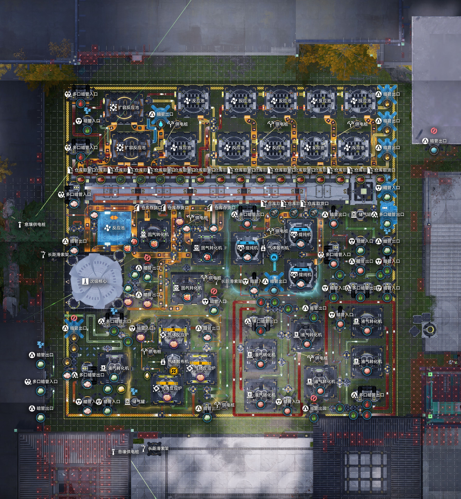

《明日方舟：终末地》蓝图 \[应龙断电池\]分享码EF01ao68oo706A06oe5e 请复制后前往游戏中使用。 
制备好反应池后（即反应池中有清水、源矿、蓝铁矿、赤铜矿、赤铜零件各一），将此反应池移动到空地并删除剩余结构，放好应龙01后用制备好的反应池替代01中的断电反应池。

《明日方舟：终末地》蓝图 \[应龙01\]分享码EF0193au33A6ae1a5UI2 请复制后前往游戏中使用。

连接好各处暗管，可参考下图。

《明日方舟：终末地》蓝图 \[应龙02\]分享码EF01u284221I80IOAoOU 请复制后前往游戏中使用。

《明日方舟：终末地》蓝图 \[应龙03\]分享码EF01081388U91i4uE179 请复制后前往游戏中使用。

重大更新记录：2026.9.15 2:56重置整个应龙基地以修复自动赫灼bug

若已安装原有蓝图，请遵循以下方式修改：

- 根据视频连接暗管过程，逐个将连接外部的暗管挪出基地，然后删除原有应龙基地。

- 删除原有应龙基地时请不要保留断电反应池，请重新进行断电池制备。

- 重拍前请确保有500+息壤库存且赫铜块灼铜块均未满仓，如果没有息壤库存请根据[暖机相关](1.5智能最大毛产.md#sdvd1X3RJrhAL32oIkexUc)进行操作，如果赫铜块灼铜块满仓就消耗500+赫铜零件和灼铜零件。

- 新版的暗管和断电反应池与它们在旧版中的位置基本一致。

- 重拍可参考[【终末地1.5】【谨慎抄取】集成援助龙泡泡补丁！一次毕业两期！\_哔哩哔哩bilibili](https://www.bilibili.com/video/BV1xZeF6PEAj/?vd_source=673daf93e07b6287b53c46b17964ca5b#reply314160488385)

<i>为什么强调单口连多口？这是因为多口连多口允许2-4/s的液气输送，而“多口暗管-管道汇流器”的优先级结构是让流量大于2/s的部分进入次优先的管道，这使得优先级不完全。举个例子，某多口连多口的实时流量是“1/s持续1s 2/s持续1s 3/s持续1s”，那么平均流量是2/s，理应没有任何物品进入“多口暗管-管道汇流器”的优先级结构中的次优先的管道，但实际上在“3/s持续1s”中是持续1s的2/s进入优先的管道而1/s进入次优先的管道，次优先的管道意外进入了1/3/s的物品！而单口多口相连就直接将流速限制在2/s，使得该优先级结构为完全的优先级。</i>

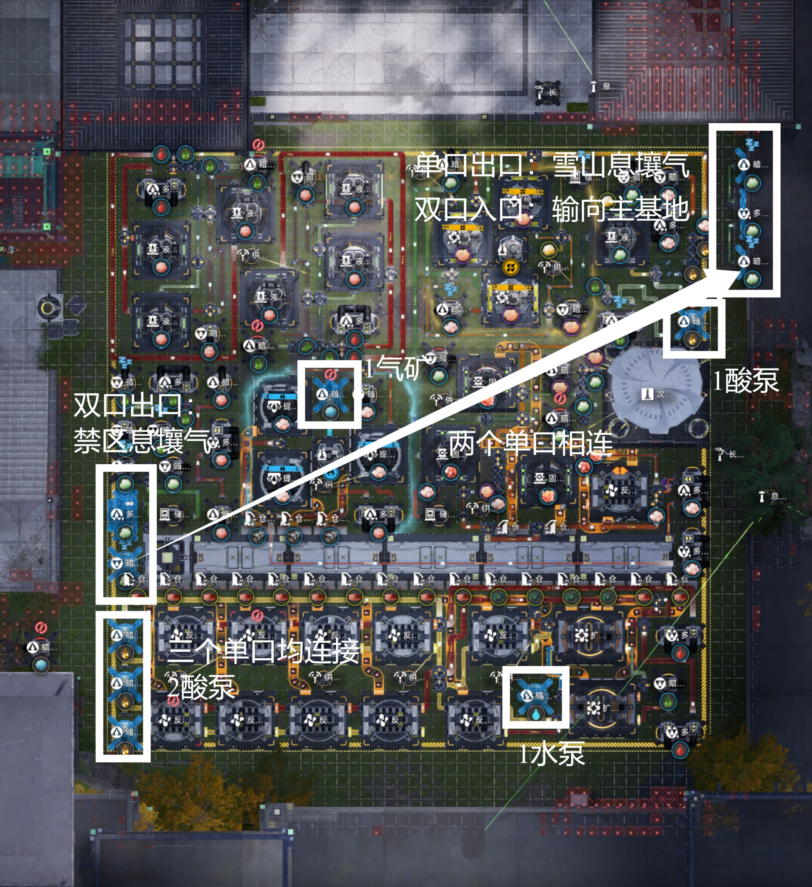

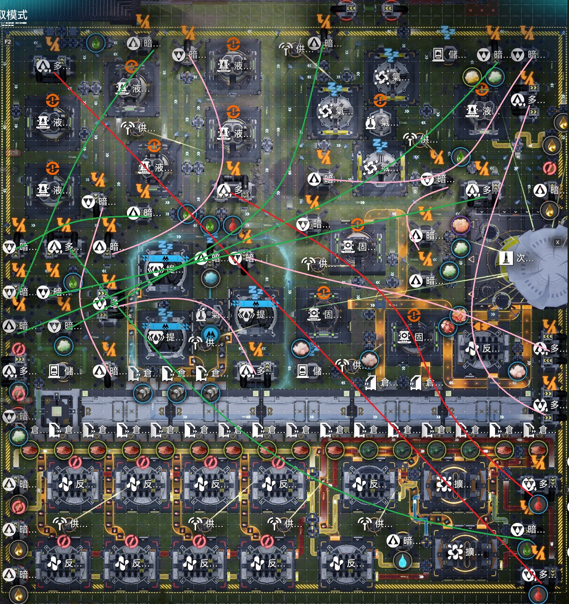

### 武陵-7池6液气兼容中电爆仓稳态

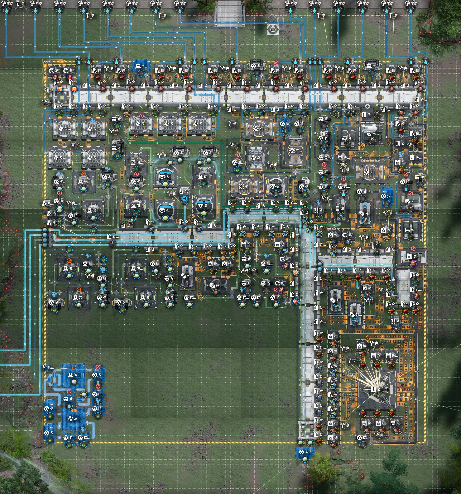

《明日方舟：终末地》蓝图 \[武陵01\]分享码EF0170i9002Ui521O0Ai 请复制后前往游戏中使用。

放完01后根据准入口设置协议核心取货口。

《明日方舟：终末地》蓝图 \[武陵02\]分享码EF014AEiAAo5E34OE71A 请复制后前往游戏中使用。

《明日方舟：终末地》蓝图 \[武陵03\]分享码EF01E75U77u25o8o3uIa 请复制后前往游戏中使用。

《明日方舟：终末地》蓝图 \[武陵04\]分享码EF01081388U91ieIE179 请复制后前往游戏中使用。

《明日方舟：终末地》蓝图 \[武陵05\]分享码EF016u0Iuui1078uOa3e 请复制后前往游戏中使用。2026.9.7 13:49更新本蓝图（05），更新详情请移步下方更新日志，无需重拍蓝图。

《明日方舟：终末地》蓝图 \[武陵06\]分享码EF01A671665i7EAu91eO 请复制后前往游戏中使用。

若有连接净水节点或应龙-武陵息壤气则参考下图连接暗管，若没有连接净水节点则不要忘记自己补上污水处理，根据不同情形可选用以下两个蓝图之一。

《明日方舟：终末地》蓝图 \[净水暗管连接\]分享码EF01u28U5Ie8701AoOU 请复制后前往游戏中使用。

《明日方舟：终末地》蓝图 \[不使用净水节点\]分享码EF01u28U5Ie870oAoOU 请复制后前往游戏中使用。

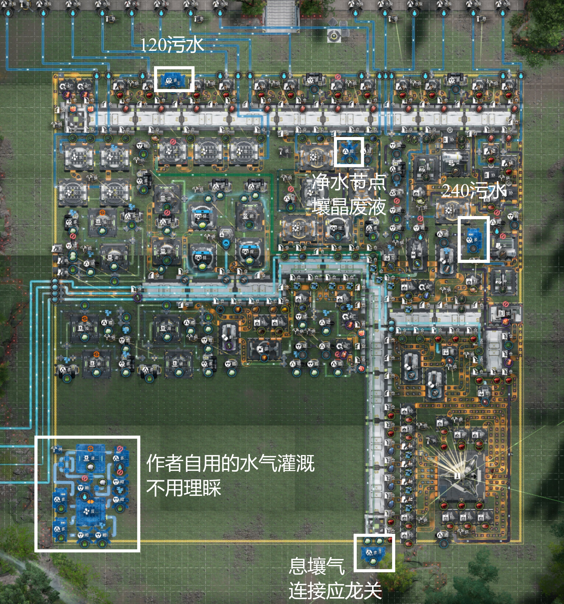

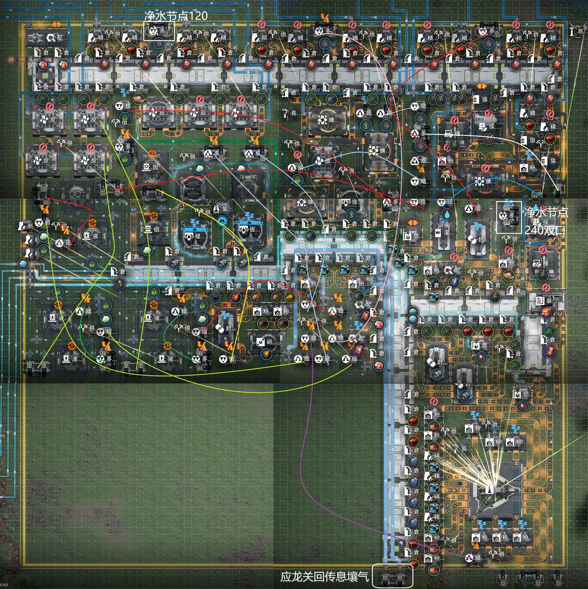

### 景玉-12息壤2中电

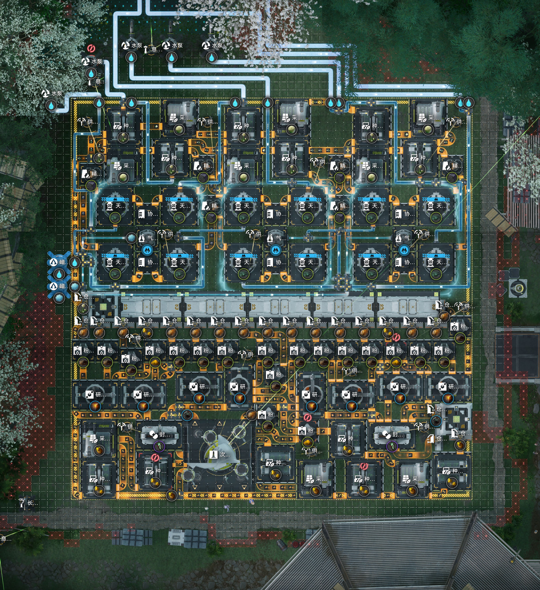

《明日方舟：终末地》蓝图 \[景玉01\]分享码EF018OIEOO93I18uUI73 请复制后前往游戏中使用。

放完01后根据准入口设置协议核心取货口。

《明日方舟：终末地》蓝图 \[景玉02\]分享码EF01081388U91i6IE179 请复制后前往游戏中使用。(2026.9.16 11:28前惰气散布机前准入口未限速，若在此之前复制蓝图就自己改一下或者直接重拍）

放完02后连接惰气/清水，每个清水准入口连接一水泵，惰气准入口连接一气矿或更多。

重大更新记录：2026.9.15 2:56重置整个景玉谷基地。

新基地大幅降低各种息壤失压发生的可能性，其实就是将息壤部分原本的存入口入库改成了箱子入库，让取货口大体上轮询以保证加压正常。另外换成了明管进水/惰气，降低了抄错的可能性。

若已安装原有蓝图，可遵循以下方式修改：

（如果基建报表正确、未出现异常状况，可以不进行修改）

- 将单口暗管出口的水和惰气挪到基地边上备用，然后删除原有景玉谷基地。

- 移除原有的多口暗管，清水和惰气将改为明管连接。

- 重拍前请确保锦草和砂叶种子有500+的库存，以及1000+的息壤库存，防止重拍时壤晶线缺乏息壤而发生损坏。若息壤库存已耗尽则移步[暖机相关](1.5智能最大毛产.md#sdvd1X3RJrhAL32oIkexUc)。由于需要拆除息壤产线并重造，可能会出现息壤需求严重不足的情况，可以在重拍完景玉谷后，根据[暖机相关](1.5智能最大毛产.md#sdvd1X3RJrhAL32oIkexUc)修复位于主基地的壤晶线。

- 重拍可参考[【终末地1.5】【谨慎抄取】集成援助龙泡泡补丁！一次毕业两期！\_哔哩哔哩bilibili](https://www.bilibili.com/video/BV1xZeF6PEAj/?vd_source=673daf93e07b6287b53c46b17964ca5b#reply314160488385)

### 首墩插件

《明日方舟：终末地》蓝图 \[赤铜零件准备\]分享码EF012UOAUUI4O8UAeIOo 请复制后前往游戏中使用。

放置蓝图前/放置蓝图时发现赤铜零件不够可以用。

以下两张蓝图任选其一即可：

《明日方舟：终末地》蓝图 \[首墩 有箱\]分享码EF01eaA0aaE7A412o9i8 请复制后前往游戏中使用。

体积稍小，多用了箱子的电。

《明日方舟：终末地》蓝图 \[首墩 无箱\]分享码EF013Eo74uioeau90579 请复制后前往游戏中使用。。

体积稍大，少用了箱子的电。

### 龙泡泡插件

#### 一阶段-主基地/首墩-6/min息壤龙泡泡

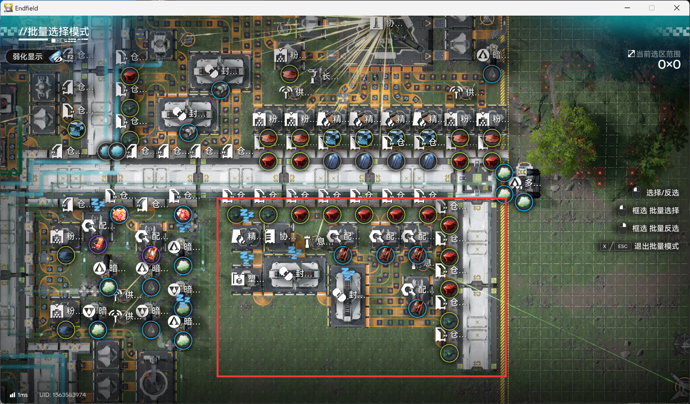

安装可参考[【终末地1.5】【谨慎抄取】集成援助龙泡泡补丁！一次毕业两期！\_哔哩哔哩bilibili](https://www.bilibili.com/video/BV1xZeF6PEAj/?vd_source=673daf93e07b6287b53c46b17964ca5b#reply314160488385)

放在主基地空地或者首墩空地都行。

考虑到赤铜块压力可能不足，请根据[暖机相关](1.5智能最大毛产.md#sdvd1X3RJrhAL32oIkexUc)中的指示关闭三台粉碎机（或者你希望赤铜块有积累以完全避免压力不足则可以考虑关闭更多，事实上这就是[扩大自由调用区间](1.5智能最大毛产.md#6rcRwbuFHgJ50Hq0nLJmk8)中的内容）。考虑到息壤压力不足导致壤晶线损坏请根据[暖机相关](1.5智能最大毛产.md#sdvd1X3RJrhAL32oIkexUc)中的指示关闭四台反应池。

《明日方舟：终末地》蓝图 \[一阶段01\]分享码EF016u0Iuui10762O83e 请复制后前往游戏中使用。

已经过实战检验，系正常运行。

#### 二阶段-首墩-7.5/min重息壤龙泡泡

最近更新时间：9月21日

已经过实战检验，系正常运行。

<b>！！！鉴于不少人一阶段都不能保证产出正常，而二阶段的原料调用比一阶段更多对原有产线负荷更重，如果在使用二阶段蓝图前仍没有解决问题的能力很可能无法换完活动商店的5w折金券，现在换成别的蓝图还来得及，请对自己的账号负责！！！</b>

<b>但是话又说回来了，不管这毛毛雨的5w折金券的话其实6/min重息壤龙泡泡0/min息壤龙泡泡也够用换了，总之自己看着办吧。</b>

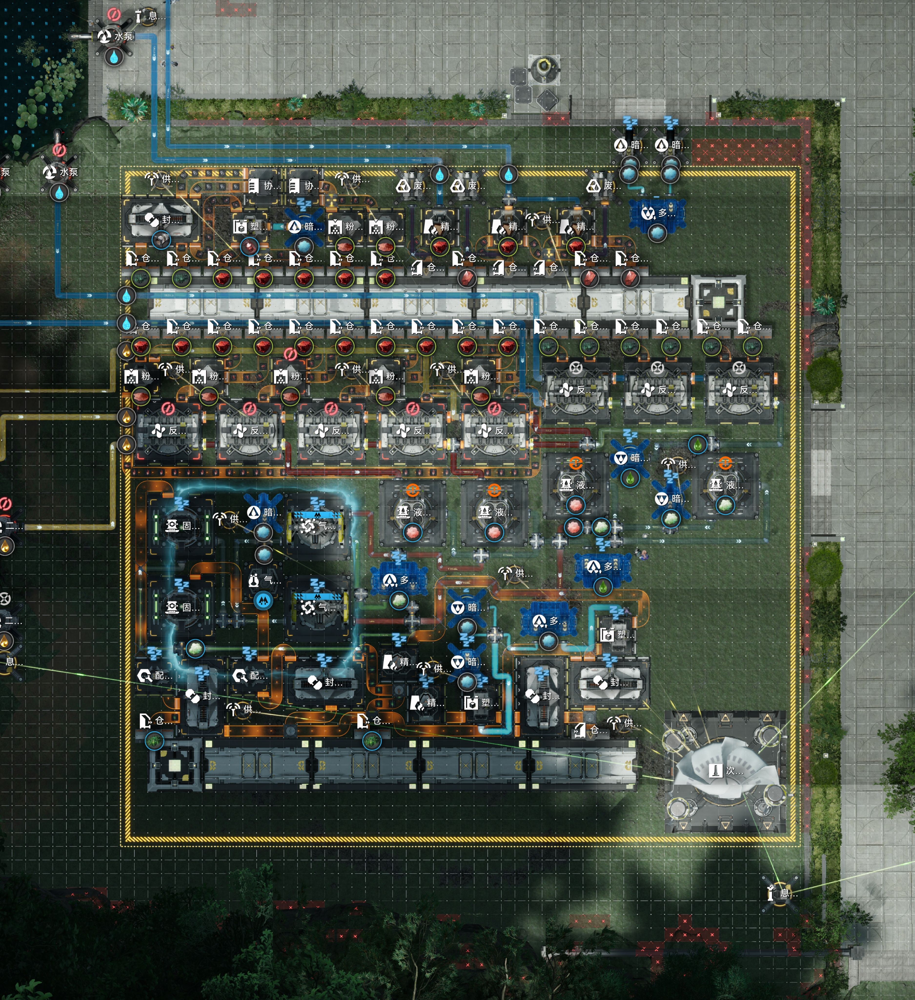

<i>二阶段没开，配方都没解锁，开之前抄这个当然不会有产出了！抄了又不想拆就关关掉吧，会偷吃36/min的息壤。二阶段解锁是9月22号。</i>

安装可参考[【终末地1.5】【谨慎抄取】集成援助龙泡泡补丁！一次毕业两期！\_哔哩哔哩bilibili](https://www.bilibili.com/video/BV1xZeF6PEAj/?vd_source=673daf93e07b6287b53c46b17964ca5b#reply314160488385)

因为需要整合惰气，所以需要重拍首墩，重拍前请将连好的惰气暗管移出基地。也就是说为什么不能作为插件直接拍的原因是惰气不够用了。

同样的，由于惰气不足，二阶段龙泡泡产能难以进一步提升，需要保留主基地6/min的一阶段龙泡泡产线以换完活动商店。<b>但是只要不管商店里的毛毛雨一样的5w折金券的话其实6/min重息壤龙泡泡0/min息壤龙泡泡也够用换了，所以并不是一定要保留一阶段产线，如此一来失压情况也没有下面说得这么严峻。（2026.9.23 4:26 补充了这一段加粗白字）</b>

考虑到赤铜块压力可能不足，请根据[暖机相关](1.5智能最大毛产.md#sdvd1X3RJrhAL32oIkexUc)中的指示关闭<b><u>六台</u></b>粉碎机<b>（息壤空仓而铜块未空仓则关闭八台）</b>（或者你希望赤铜块有积累以完全避免压力不足则可以考虑关闭更多，事实上这就是[扩大自由调用区间](1.5智能最大毛产.md#6rcRwbuFHgJ50Hq0nLJmk8)中的内容）。考虑到息壤压力不足将导致壤晶线损坏请根据[暖机相关](1.5智能最大毛产.md#sdvd1X3RJrhAL32oIkexUc)中的指示关闭<b><u>四台</u></b>反应池。

<b>如果仍然发生壤晶线息壤失压则将景玉谷更换为9月15号更新的版本，如果已更换则关掉更多赤铜粉碎机。更极端更保险的办法参考</b>[壤晶线应急修理办法](1.5智能最大毛产.md#b0yB7GcYPo8AVeFqRmsf5g)

<b>以及仅限于龙泡泡活动可以考虑采用的关闭一台主基地的重息壤固气机。</b>

不过如果重息壤已爆仓的话那基本上不可能发生息壤失压了。

《明日方舟：终末地》蓝图 \[二阶段01\]分享码EF01081388U91i6eE179 请复制后前往游戏中使用。9月21日修正配方后更新。

紧贴西南角放置，按准入口标签接好水和酸和惰气，注意水和酸一管对一泵 惰气则是一管对二矿。然后等待反应池开始产生息壤液后再拍02 。

《明日方舟：终末地》蓝图 \[二阶段02\]分享码EF015i2eii8O2u55eIoe 请复制后前往游戏中使用。9月21日修正配方后更新。

嵌入01放置。

蓝图维护小贴士：可能的故障来自于从东往西数第二台液气机，因为它混息壤和铜，一般来说拍完01等待充分即01有息壤液产生后拍02则完全不会故障，但是如果因为种种原因真的发生故障可以自行掏这台液气的原料槽中卡住的1铜液。

一般来说需要一定时间暖机，如果拍下产线并解锁配方，10分钟后还未生产，说明有问题。

#### 停止灼铜/赫铜生产（进阶内容）

此时可以大量添加龙泡泡产线取代灼铜/赫铜的原料使用，而不是视频[【终末地1.5】【谨慎抄取】集成援助龙泡泡补丁！一次毕业两期！\_哔哩哔哩bilibili](https://www.bilibili.com/video/BV1xZeF6PEAj/?vd_source=673daf93e07b6287b53c46b17964ca5b#reply314160488385)中所演示的仅开6/min一阶段产线或着7.5/min二阶段产线。

<b>下图忘了说，关掉应龙之后主基地和首墩还是会继续打粉，得把那些打粉也关了不然要傻等铜粉满仓</b>

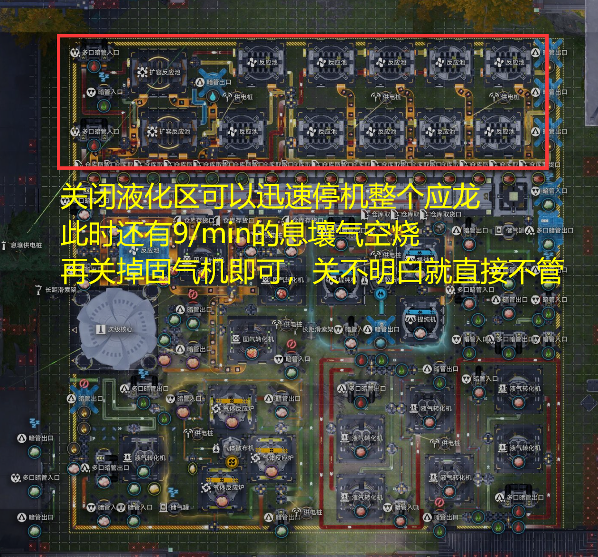

（光看下图别忘了主基地还有一条小泡泡）此时我们让龙泡泡成为铜末端，应该供满息壤和重息壤，让龙泡泡产线吃完重息壤没用光的铜，也就是加压息壤和重息壤，不加压铜（重息壤是二阶配方要用到，因为有库存所以直接给出正常数量的取货口就算加压了）。<b>其实把铜的取货口删一半让一口对一个配件机即可：</b>

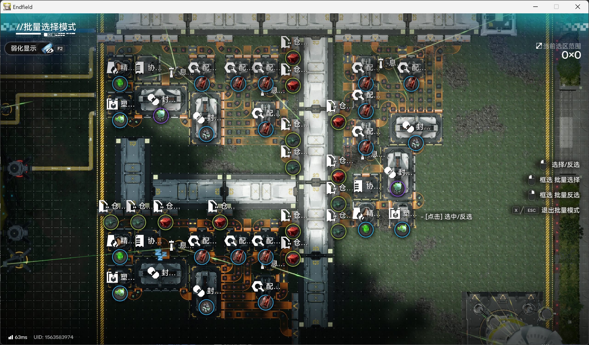

如果需要的话自取蓝图码<b>（建议分离芯/壤晶满仓再用这个，不然少摆一条）</b>： 
《明日方舟：终末地》蓝图 \[息壤龙泡泡！？\]分享码EF01ao68oo706A933oe5e 请复制后前往游戏中使用。

另外有个比较猎奇的事情是最终配平效果是14.75中电2.3125小药26.758重息壤22.155息壤龙泡泡，息壤龙泡泡换成券已经超过老乡总产券了（2215.5\>2036）...可以考虑关一条然后重息壤加速并且有一定铜积累。

作者用下来感觉还是关掉一条（作者关的是主基地那条）比较好一点，不然息壤失压不好修，而且除了加速了爆仓别的也没啥区别啊我感觉（）而且yj这什么设计，龙泡泡没券也能硬换但是不想硬换还得自己注意别把券换完（）

感觉多做龙泡泡真是错了的，灼赫爆仓了我还能做炮台，龙泡泡换券然后重息壤爆仓了我还能做啥啊（（

#### 全自动切换阶段

新建文件夹中，请耐心等待后续更新……

## 常见问题汇总：

大部分问题可以通过重新拍产线解决（更精细的做法可参考下文“暖机相关部分”）

<b>！！！不要在上一张的蓝图设备尚未制作完成（黄色待建造状态）就拍下一张蓝图，请先完成设备制作并提交，否则将导致优先级损坏！！！</b>

<b>！！！不要在蓝图的产线里擅自做任何视频演示以外的修改！！！</b>

向群聊内或者b站评论投放产能报表寻求答疑时，请一律展示以下物品（可在报表中点击星标置顶物品方便展示）： 
源矿 蓝铁矿 赤铜矿 赤铜块 蓝铁粉末 赤铜粉末 致密源石粉末 赫铜块 息壤 重息壤 壤晶 灼铜块 分离芯 赤铜溶液 气态赤铜 气态赫铜 气态灼铜 中容武陵电池（默认排序 升序）

<b>若不遵守我们很可能忽略您的提问。</b>

1. 景玉谷蓝图不能放下去：请仔细观看视频教程，按照演示移动暗管，要把暗管入口完全移出基地范围；检查基地内是否有掉落物（罕见）

2. 若应龙关管道物流上限：酸液暗管改用多口暗管不使用管道汇流器，惰气矿同理；检查是否在基质刷取点放置了大量管道件限位。

3. 产物报表有波动是正常的，因为自适应产线有大量震荡的运行以自动控制反应速率，不要大惊小怪；机器时开时停是正常的，这是自适应震荡供料，避免所有息壤浪费，所以我们才有这么高的产量，装置细节可以移步：[自适应产线节点元件构造](较简单的自适应装置们.md)

4. 息壤、蓝铁块、赤铜块、致密源石粉末消耗大于产出是正常的。事实上，从息壤/赤铜块仍有库存直到产线抵达最终稳态（即息壤/赤铜块空仓而分离芯/壤晶满仓）产线实际给出是“这段时间的息壤/赤铜块总产量+息壤/赤铜块在一开始的库存量”的最优灼铜重息壤的配比，<u>换而言之，只要没有全部爆仓，暖机完毕的产线事实上一直处于完全体。</u>

5. 因为上一条提到息壤消耗大于产出，也就是在任意产物爆仓前息壤最终会归零，那么有没有什么办法留一点息壤呢？请移步下文的“暖机相关”部分[暖机相关](1.5智能最大毛产.md#sdvd1X3RJrhAL32oIkexUc)

6. 如果发现自己发电量不超过9800还大断电了且赤铜块满仓，则解耦模块出现问题且大概率是拍蓝图时仓库中没有500+锦草，请准备好足量锦草后重拍主基地蓝图。

7. 若灼铜块产量在60/min左右，很大可能是因为赫铜没有满仓，我们设计的自动赫灼切换会在赫铜未满仓时1:2地生产赫铜和灼铜。不需要理会它，灼铜和重息壤和电池可以轻松换完券。实在不要赫铜可以可以关闭反应池边上的赫铜气准入口，关闭方式是开启限制通过数量1。

8. 若赫铜块、灼铜块产速降低严重（对半砍甚至更多，当然没那么多其实也有可能是这一条），检查北部禁区息壤气多口暗管出口的上游（即与该多口暗管出口相连暗管入口处），若为多口暗管入口则必须只使用一个口，保持另一个口不流入息壤气，只在一个口汇流息壤气（或者将这个多口暗管入口改为单口暗管入口）。<b><u>另一种可能是</u></b>息壤气气矿压根没接够80——一个高纯气矿是20一个低纯气矿是10，不要接少了。<b><u>还有一种可能是</u></b>扩容反应池的息壤输入失压，重拍蓝图或者请移步下文的“暖机相关”部分[暖机相关](1.5智能最大毛产.md#sdvd1X3RJrhAL32oIkexUc)

9. 若息壤产量未达到360，检查景玉谷植物（即锦草）是否放置足够、水泵连接是否无误，惰气的连接是否正常（惰气矿处易受高低差影响未接入暗管），如果把暗管移动至其他地方进行连接，请记得把连接好的暗管和多口暗管放回它们在基地内原本的位置。检查水管连接情况：两个多口暗管，每个多口暗管的每个口汇流两个水泵（不可以汇流三个），基地外拉一条单口暗管，连接一水泵。如果是锦草不足则大概率后续会发生常见问题6，请前往排查[如果发现自己发电量不超过9800还大断电了且赤铜块满仓，则解耦模块出现问题且大概率是拍蓝图时仓库中没有500+锦草，请准备好足量锦草后重拍主基地蓝图。](1.5智能最大毛产.md#kbzU5Vs1txwgr4uzbGLnEd)

10. 应龙关部分暖机较慢，这是正常的（大概需要1-2h）。若想加速请移步下文的“暖机相关”部分[暖机相关](1.5智能最大毛产.md#sdvd1X3RJrhAL32oIkexUc)

11. 灼铜爆仓较长时间（半小时以上）后卖出灼铜时，此时应龙关不会立即开始生产，而是需要花费10-20分钟自动解除自锁，无灼铜产出系正常现象，不要大惊小怪。

12. 若赤铜块在未满仓的情况下产量只有390，请检查接往净水节点/废水处理机的单口暗管和多口暗管是否接反。类似的，若开满矿机而赤铜块产量不足510，都应该尝试检查污水疏通和清水供应是否正常，或者矿点供水是否正常。

13. 赫铜未满仓但无赫铜相关产出：检查应龙关协议核心附近的反应池的朝向是否正确；检查协议核心的方向是否正确。

14. 多检查水泵酸泵是否正确连接，以及武陵主基地内的暗管连接是否正确，尤其是壤晶产量不为81（使用净水节点）或75（不使用净水节点）时请检查污水相关的暗管连接是否正确（注意检查净水节点暗管连接是否和视频介绍一致）。

15. 壤晶产量为0：请先检查息壤产量，0息壤产量会导致壤晶不生产，排查方法详见2；排除问题2后请检查水泵连接（河边最角落有一个水入口请不要遗漏）。

16. 壤晶产量为0-31：若电池爆仓则为正常情况；若电池未爆仓则请检查主基地壤晶线，维修办法见下文的“暖机相关”部分。

17. 分离芯未达到产出大于消耗：在息壤产速达到360、赤铜块产速510的前提下（未达到请排查问题2、5、6），检查分离芯产线上游的息壤和赤铜块取货口中是否有一直不运输物品的，如果有请移步下文的“暖机相关”部分；检查惰气矿连接是否正常，惰气矿可能因高低差原因未接上。

18. 赤铜粉末充足的情况下赤铜粉末消耗未达到360：若灼铜块满仓则为正常情况；在排除问题3的情况下，请检查连接赤铜液生产线的酸液暗管（即应龙关基地角落的三个摆放在一起的运输酸液的暗管）是否因高低差漏接或与另一个单酸泵暗管接错，这三个暗管全都是需要接入两个酸泵的，请逐一排查。赤铜粉末消耗速度为300时则高度怀疑为酸泵漏接或接错，如遇到该情况，请务必注意。

19. 武陵主基地中惰气入口侧的液气转化机不在正常工作是正常的，其只会在下游缺少息壤气且上游液化息壤足够的情况下自动启动，不用理会即可，相信产线智能。

恭喜您看到了这里，您已经超过了80%的群友了(≧∇≦)/ <s>（没这么少）</s>

若想了解进一步的原理可以移步：装置的自适应[自适应产线节点元件构造](较简单的自适应装置们.md)产线的自动配平（暂时）[讲解：自配平产线和自适应装置-脚本草稿02（2026.09.20 23:26）](讲解：自配平产线和自适应装置.md#JHB9yrgA7h2xtO0t0QlxBz)

产线无息壤浪费运作前提：应龙关的盈天台输入80/min以上的息壤气，300/min（10洪炉）以上息壤产出，280/min以上赤铜矿产出（并不需要拉满矿点和地区建设等级）

净水节点接入与否/超库存传输致密源石粉末与否/源矿矿点拉满与否均不影响产线不浪费息壤地完成自动配平，但是需要注意至少要能产够发电用的电池

P.S. 如果<b><u>能</u></b>达到18灼件（12灼件6赫件）36重15电池基本上就对了，<b>不过这并不代表其他报表情形就不对。</b>事实上只要产线正确，基于不同的原料和中间产物的情况会有不一样的报表，而它们也都是正确的。

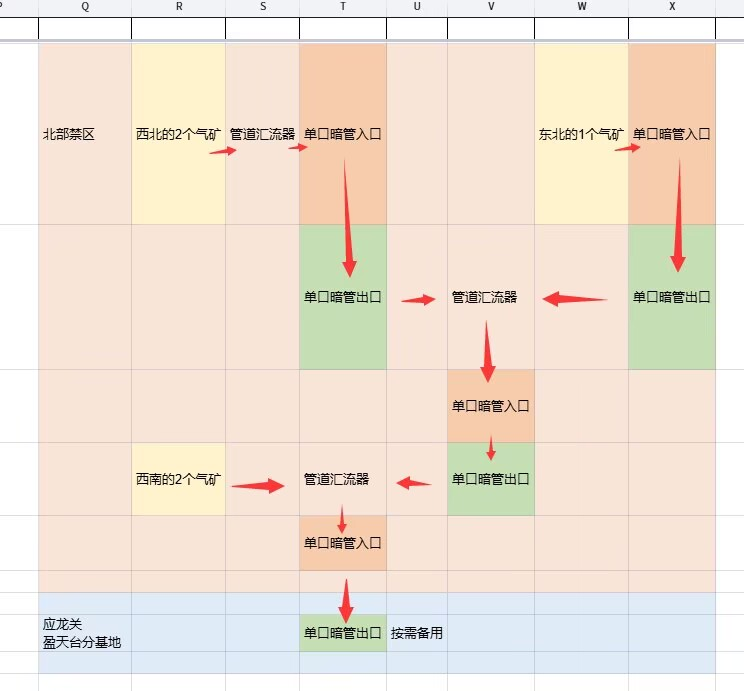

## 暖机相关

请在有一定息壤库存时启动本蓝图 
那如果没有那怎么办呢

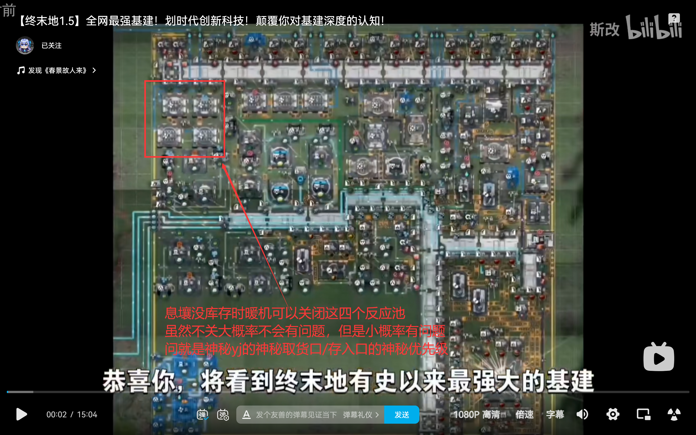

关上上图的四个池子就能积累了，暖好机别忘了重新打开。当然如果你希望仓库里积累息壤也可以一直关着，更进一步的利用请移步下文“自由调用”部分。[自由调用](1.5智能最大毛产.md#4KFSHVD7aAsnzKeVp1Dyo5) 
<b>类似的，如果应龙关的扩容反应池液化息壤产量不足60/min（即没有满速生产液化息壤）或者生产分离芯的封装机缺少息壤也可以用这个办法重置取货口轮询；类似的，如果生产分离芯的封装机缺少赤铜耐压罐也就是缺少赤铜块，可以关闭主基地东南角的几个粉碎机积累一些赤铜块以重置取货口轮询。</b>

没有息壤会发生什么？小概率的分离芯/壤晶息壤加压不足导致壤晶线损坏和自动配平失效（分离芯失压）。如何修复壤晶线请看下图：

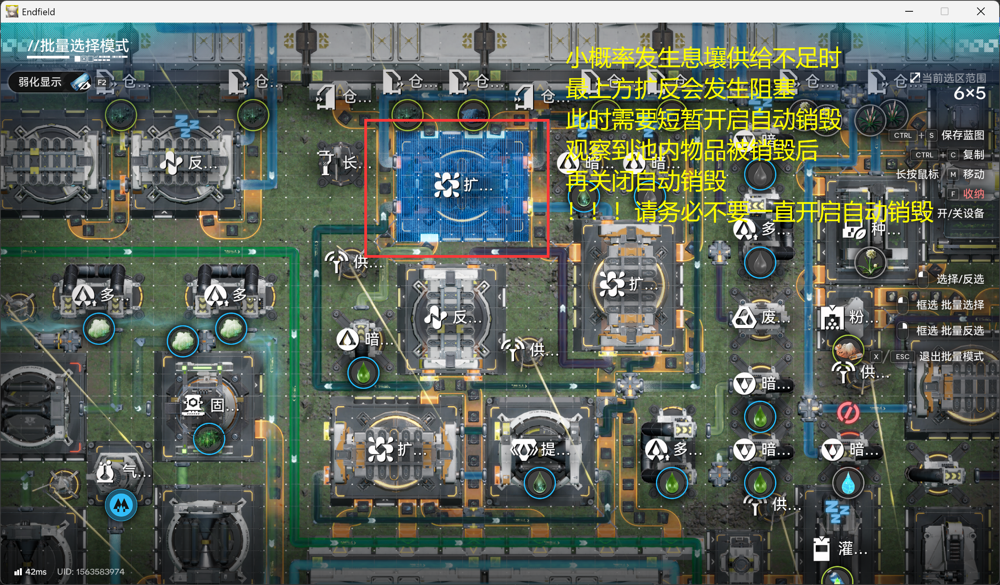

至于为什么，我只能说神秘yj的神秘取货口/存入口的神秘优先级神秘发力了，我们有尝试探索规律但是几乎无功而返——1.6基建我们一定做以洪炉为起点的固体息壤总线结构（（（

另外应龙暖机比较慢，因为要填2000液化息壤缓存，别担心，启动慢是正常的。等我启动.jpg 我已启动.jpg

当然，只要把应龙所有的液化息壤暗管都填满液化息壤，就即刻暖机完成了。

## 自动赫灼恶性bug（已解决）

当铜/铜粉未空仓时灼铜/赫铜线会全力生产，也就是说赫铜块输出为30/min，而令人忍俊不禁的是离线状态下赫铜块通过断电反应池和物品准入口会被降速，大概下线8-12h后赫铜块就会堆满机器（在线时不会有问题），如下图所示（可以看到并没有显示停产）

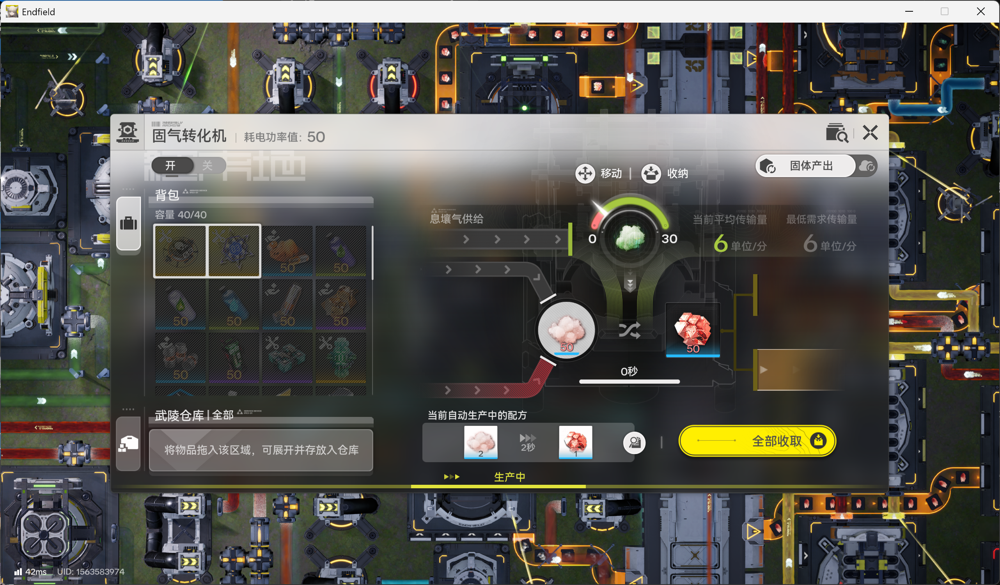

机器中存在50赫铜会使得断电池截断赫铜气时将会流向断电池并在其中积累的赫铜是机器中的50赫铜+管道与机器中残余赫铜气将产出的赫铜，后者是我们设计的小于100赫铜气，产生的赫铜不会填满断电池缓存。但是加上机器中的50赫铜后就会溢出来堵住传送带，使得后续生产的灼铜也无法正常通过，如下图所示：

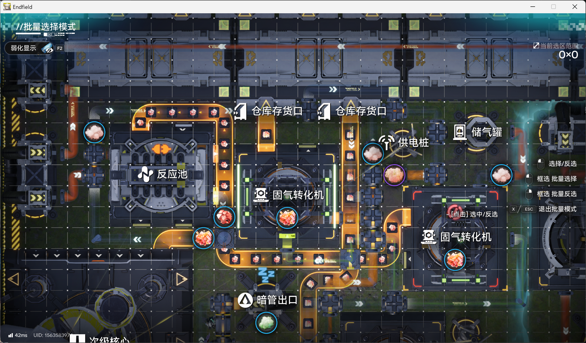

<b>补充——一劳永逸的解决方法：</b> 
经过b友善意提醒我注意到实际情况中很难避免铜没有积累，重息壤和灼铜随便哪个爆仓之后就积起来了，所以还是要一劳永逸地解决问题，也就是降低赫铜经过反应池和准入口的流量：

<s>通过将多口暗管外置，我们成功取得了修改的空地（大嘘），然后就能让断电池双出双入赫铜块了。真是不优雅的做法啊，但是我们真的没招了。（注：协议箱和多个准入口是不必要的，只是我看这地有位子就塞了，以避免任何可能的问题）</s>

<b>（2026.9.8）已更新应龙01应龙03蓝图，完全消灭问题。</b><b>（2026.9.10）（由于神秘莫测的离线降速，如果您在正确修改后真的发现赫铜还是把灼铜堵住了，可以向我们反馈样本，简单的修复方法是把固气机里面和传送带上的赫铜掏掉）（搞半天还是准入口降速，yj我真得控制你了，修到现在了！）</b><b>（2026.9.15 已完全修复，并更新应龙010203蓝图）</b>

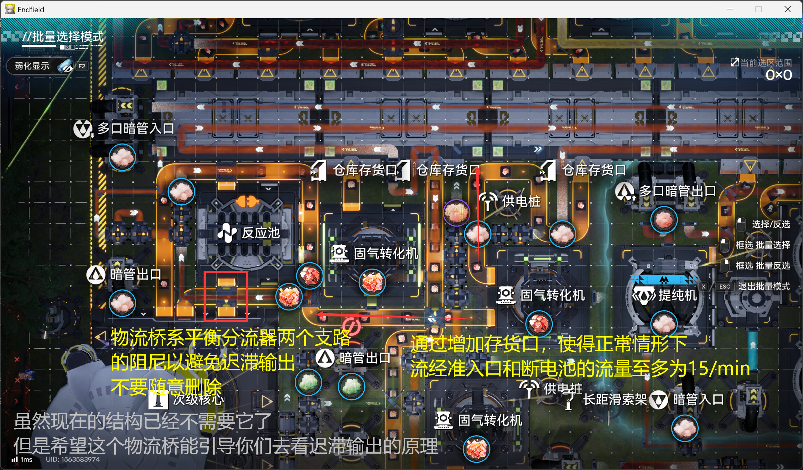

迟滞输出相关理论来自[终末地物流bug分析导论](终末地物流bug分析导论.md)

## 壤晶线应急修理办法

首先应尝试[暖机相关](1.5智能最大毛产.md#sdvd1X3RJrhAL32oIkexUc)中给出的办法并确保自己的景玉谷是9月15号更新的景玉谷[景玉-12息壤2中电](1.5智能最大毛产.md#qMT4GtWsR8rDPnonIh5VLq)，若无果请在此基础上使用下面的激进方案

### 小幅降低电池产量

需要壤晶已满仓。

减少电池产能以减少壤晶需求量；关闭主基地的电池产线，位置如图：

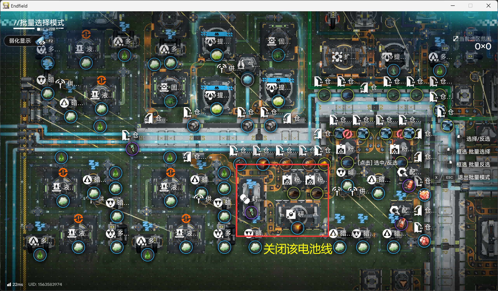

### 开启壤晶线自动销毁

代价是壤晶爆仓后将浪费一些原料；需要开启销毁的扩容反应池的位置如图：

<table>

<tr>

<td valign="top" width="50%">

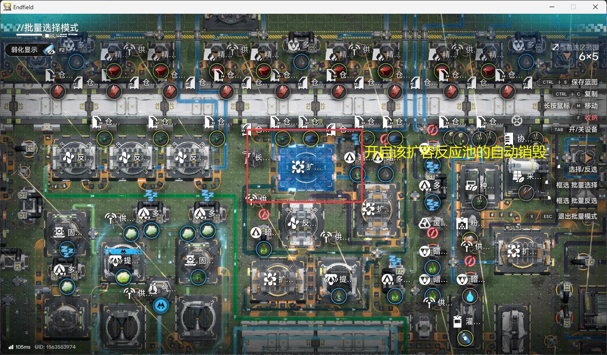

</td>

<td valign="top" width="50%">

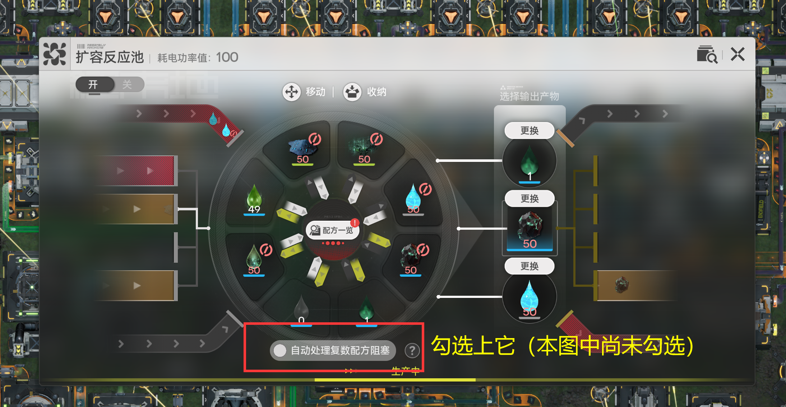

</td>

</tr>

</table>

## 自由调用

### 自由地新增取货口

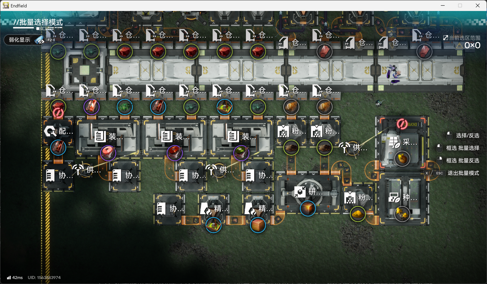

直接加就行了（取货口物品选择范围：赤铜块 息壤 重息壤 赫铜块 灼铜块），如果不想考虑太多的话就每种物品不超过两个口。图中的源矿不要学，或者你和我一样只开一两个口，开多了怕你们玩断电了。蓝铁块的话可以把小药（蓝色品质的芽针针剂）关了开一两个口，多了容易影响壤晶。

那该怎么判断自己有没有加过多呢？见下一小节

### 对已有产线影响

增加取货口太多后壤晶线的息壤供应和分离芯线的息壤/赤铜块供应可能会不足造成不良后果，总之看一下分离芯和壤晶存量有无下降，无下降即无问题。

以下图为例（最终产物均无爆仓，息壤空仓赤铜未空仓）：壤晶产出大于消耗——存量无下降，分离芯产出等于消耗维持满仓——存量无下降，也就是说这位小伙伴的自由调用是没有问题的。

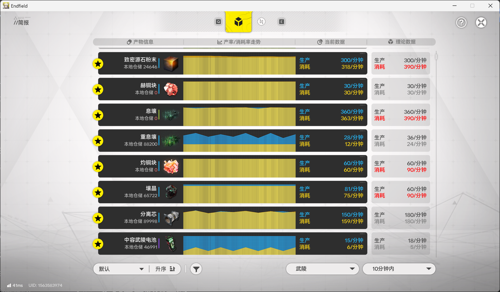

那么如果壤晶/分离芯存量下降，就只能减少取货口数量吗？见下一小节

### 扩大自由调用区间

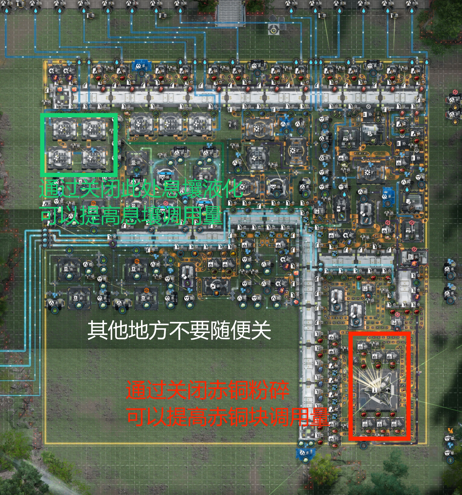

关闭后判断自由调用是否过量的方式依然和之前一样，即确认壤晶/分离芯的存量不下降。

### 加压输入以达到满速。

就是用更多的取货口连上同一条传送带/同一台机器，目的是确保带/机器在空仓下也供料充足。

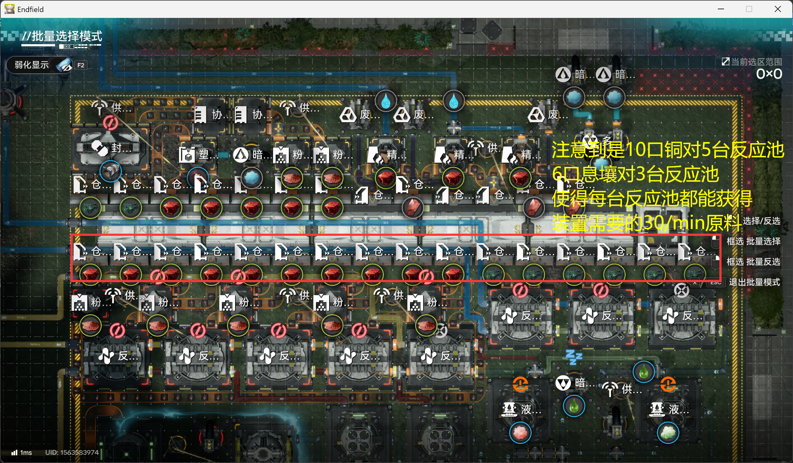

需要注意的是，紧贴取货口放置汇流器有优先级现象，在以加压为目的时需要避免。

### [手切全灼铜](1.5智能最大毛产.md#3FyFs9BDN3vWv9LoFn2ZpY)

### 手切三核赫铜模式

首先，找到产线中如图所示的两个暗管出口和准入口

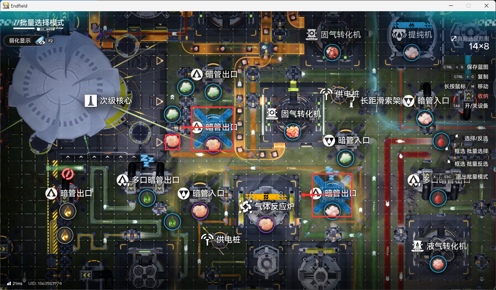

现在对调这两个暗管出口，如图所示

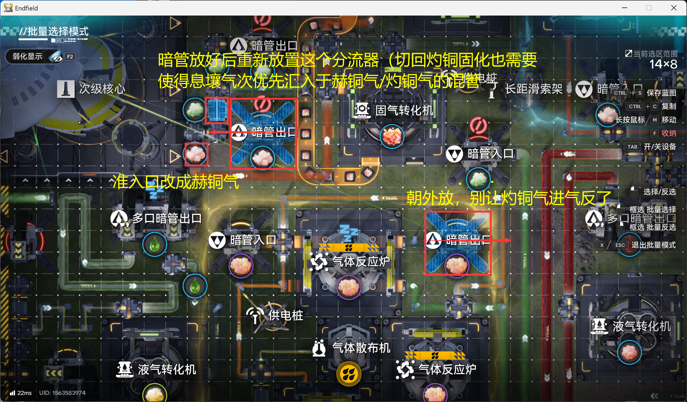

注意当我们将这些复原后，也就是变回灼铜固化也就是回到第一张图的样子，还需要清理固气机中的剩余赫铜气

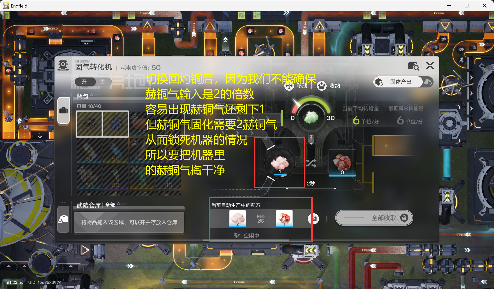

### 全物品！？

📄 [1.5智能全物品](1.5智能全物品.md)

## 蓝图更新日志

### 2026.9.7 13:49

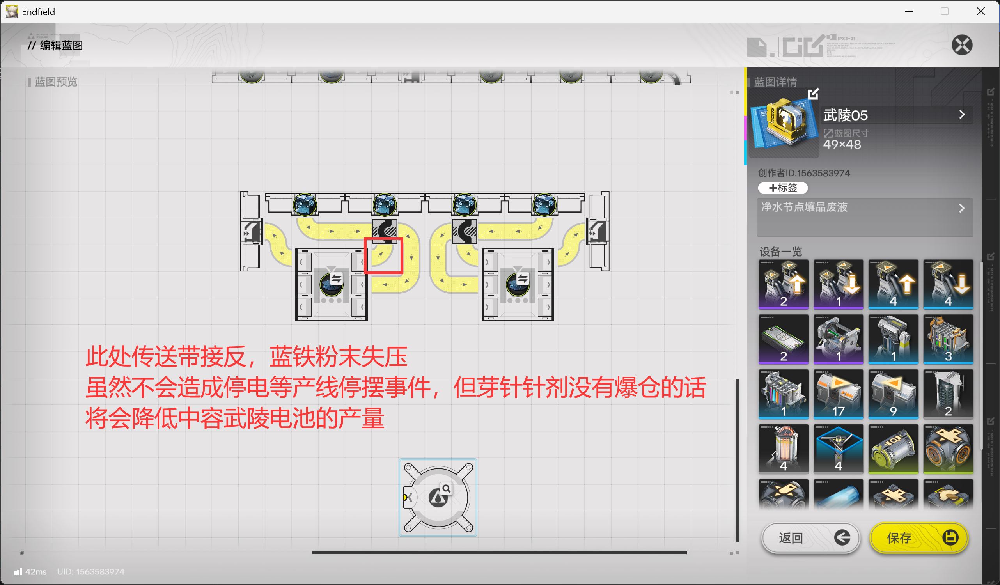

### 2026.9.8 00:26（无效更新）

失败的对赫灼自动切换的修复，误判了离线降速原因为断电反应池，实际降速原因时是物品准入口。

因为对离线降速的测试周期十分漫长，更新延误对大家的影响在这里深感抱歉。

### 2026.9.15 2:56

应龙整个基地重置以修复自动赫灼bug，请根据视频连接暗管过程逐个将连接外部的暗管挪出基地，删除原有应龙基地后从断电反应池制备开始重新摆放蓝图。删除原有应龙基地时请不要保留断电反应池，为避免保留方式有误请重新进行断电池制备。蓝图码移步[应龙-自动赫灼18灼](1.5智能最大毛产.md#aZli93Lno95jxDGgn1OJj9) 
重拍前请确保有500+息壤库存且赫铜块灼铜块均未满仓，如果没有息壤库存请根据[暖机相关](1.5智能最大毛产.md#sdvd1X3RJrhAL32oIkexUc)进行操作，如果赫铜块灼铜块满仓就消耗500+赫铜零件和灼铜零件。

### 2026.9.16 0:57

景玉谷整个基地重置以大幅降低各种息壤失压发生的可能性，其实就是将息壤部分原本的存入口入库改成了箱子入库，让取货口大体上轮询以保证加压正常。另外换成了明管进水/惰气，降低了抄错的可能性。蓝图码移步[景玉-12息壤2中电](1.5智能最大毛产.md#qMT4GtWsR8rDPnonIh5VLq)

重拍前请确保锦草和砂叶种子有500+的库存，以及1000+的息壤库存以防重拍时壤晶线缺乏息壤而发生损坏。若息壤库存已耗尽则移步[暖机相关](1.5智能最大毛产.md#sdvd1X3RJrhAL32oIkexUc)。实在不想准备息壤库存那就先让壤晶线坏掉，重拍完景玉再根据[暖机相关](1.5智能最大毛产.md#sdvd1X3RJrhAL32oIkexUc)去修壤晶线，也不是不行。

### 2026.9.21

修正了龙泡泡二阶段配方及配比判断错误导致的蓝图问题。

## 性能简述

以下产能均为不自行添加其他产线时的情形。

产能（源矿540/min、蓝铁矿120/min、赤铜矿510/min、息壤气150/min、超库存传输致密源石粉末、连接净水节点、连接应龙关息壤气暗管到主基地）（赤铜块、息壤均已空仓，壤晶、分离芯均已满仓）（以下数字的单位均为unit/min）：

赫铜未满仓：34.845(54219/1556)重息壤11.277(17547/1556)灼件5.6385(17547/3112)赫件14.75中电2.3125蓝药0息壤0赤铜矿0源矿0致密源石粉末0蓝铁矿

赫铜已满仓：28.705(28734/1001)重息壤17.529(17547/1001)灼件0赫件14.75中电2.3125蓝药0息壤0赤铜矿0源矿0致密源石粉末0蓝铁矿（毛产券2836.5 即一天408w武陵券）

（下列均以赫铜满仓为前提，中电爆仓时按4.5/min消耗中电发电9600）

中武已满仓：36重息壤16.8灼件0赫件4.5中电3蓝药33.32息壤0赤铜矿360源矿25致密源石粉末37.5蓝铁矿

灼铜已满仓：36重息壤0灼件0赫件14.75中电2.3125蓝药127.4息壤420赤铜矿0源矿0致密源石粉末0蓝铁矿

重壤已满仓：0重息壤18灼件0赫件14.75中电2.3125蓝药198.2息壤60赤铜矿0源矿0致密源石粉末0蓝铁矿

全自动收敛至最优灼铜零件和重息壤配比、赫铜灼铜产出自动切换无需手动清炉灰、自由增加息壤/赤铜块/源矿取货口不影响产线配平剩余原料、接入净水节点与否/地区建设等级满级与否/地图矿点开齐与否/超传致密源石粉末与否都不影响产线配平、某一最终产物爆仓将加速其他产线而无需销毁高价值的最终产物、能够兼容集成援助的龙泡泡

完全不浪费息壤的稳态：

①所有产物未满仓②仅赫铜已满仓③仅中武已满仓④全赫模式且赫铜与重息壤未满仓（即可以叠加中武满仓）

其他稳态存在极低的息壤浪费，当然其实这些所谓的“其他稳态”更容易发生的息壤浪费形式是直接9w息壤爆仓了（从上面的产能拉表就能看出来），所以无需理会

不改动产线且确保最大电池产出时可支持的最大铜壤调用量：

83\.181息壤 237.10铜矿

若能改动产线则为510铜矿与251.6息壤（即减去14.75电池用掉的108.4息壤）
