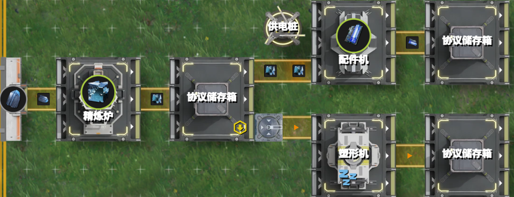
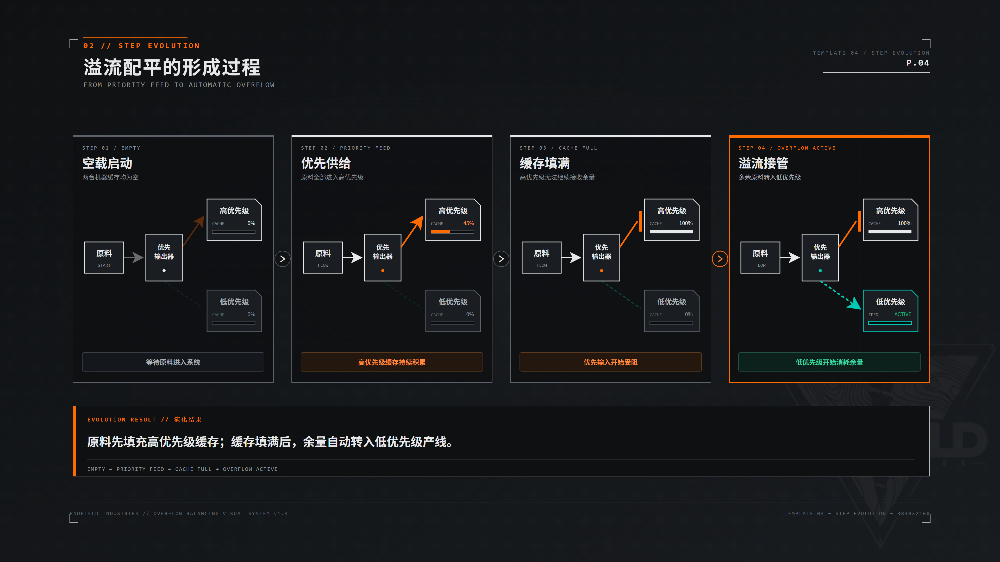

# 2.1 Hello World：蓝铁矿的命途分叉

> 原文：https://docs.qq.com/aio/DTmluZ1diWlpQZldw?p=EtRfKcfCGHwRQxAFs7gkqI　上级：[反应控制与前沿研究](反应控制与前沿研究.md)

考虑如下智能生产方案：<b>先生产</b><b>铁零件</b><b>到装满储存箱，然后再开始生产</b><b>蓝铁瓶</b>。使用<u>优先输出器</u>，可以很简单地达成这一目标，如下图所示。铁零件装满存储箱后，配件机逐渐堵塞，

麻雀虽小五脏俱全。虽然简单，但是这个例子已经包括了阻塞生产的绝大部分概念：

1. <b>两种生产状态（两条生产通路）</b>：生产铁零件（30/m）以及生产蓝铁瓶（15/m）

2. <b>阻塞信号</b>：铁零件首先装满储存箱，然后向上游传播，逐渐阻塞配件机

3. <b>生产状态如何发生变化</b>：配件机及其直接上游传送带阻塞后，蓝铁块自然地流向塑形机开始生产蓝铁瓶。

这些概念实质上构成了一个最为基本的阻塞生产单元。后面所述的各类阻塞生产结构，其可能在具体生产流程设计，设备布局等方面更加复杂，但核心逻辑是和这一基础单元一致的。

[2.2 花开两朵：切换型阻塞与平衡型阻塞](2.2%20花开两朵：切换型阻塞与平衡型阻塞.md)
