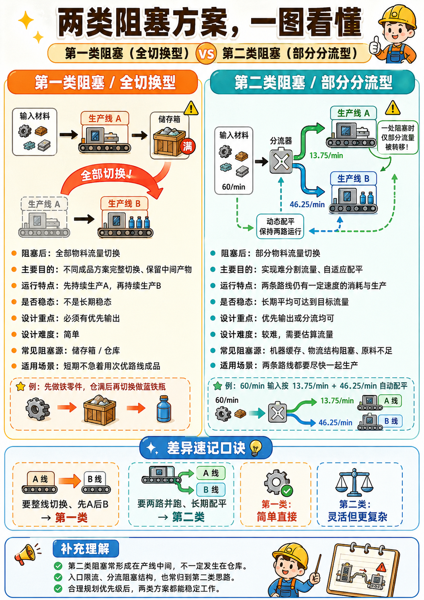
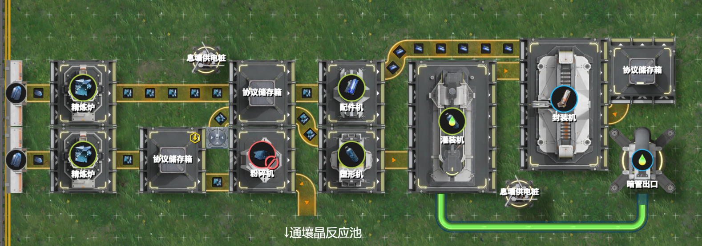
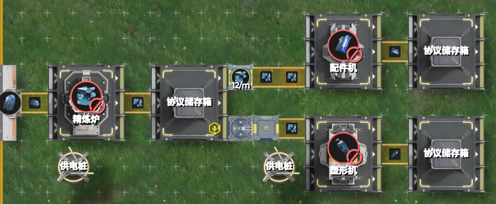
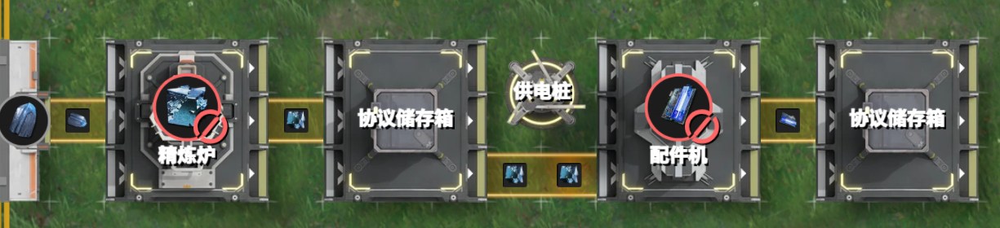

# 2.2 花开两朵：切换型阻塞与平衡型阻塞

> 原文：https://docs.qq.com/aio/DTmluZ1diWlpQZldw?p=ZDxRoi4GKekmLzgHNaf4fQ　上级：[反应控制与前沿研究](反应控制与前沿研究.md)

下面介绍两类生产中常用的阻塞方案。

1. <b>切换型阻塞</b>（曾用名：第一类阻塞）：在不人为干预的情况下，阻塞发生后<b>全部</b>物料流量从一条通路切换到另一条通路，出现生产产品的更换，常用于<b>实现同材料不同成品生产方案的完全切换，过剩产量留存中间产物等</b>。

2. <b>平衡型阻塞</b>（曾用名：第二类阻塞）：在不人为干预的情况下，阻塞发生后<b>部分</b>物料流量从一条通路切换到另一条通路，达到平衡，没有出现产品的改变，常用于<b>实现不容易分流得到的流量数值，自适应配平</b>。平衡型阻塞产线一般用来长期运转下去。

> 注意，以上关于物料流量的转移指的是一段时间内平均下来的视角。从局部的微观尺度角度来说，阻塞发生时全部物品都流向另一条支路，等阻塞的机器消耗原料后阻塞短暂解除，又恢复流量使其重复堵塞。

前一小节所述最小例子属于切换型阻塞。

|  |  |  |
| --- | --- | --- |
|  | <b>切换型阻塞</b> | <b>平衡型阻塞</b> |
| 多少物料流量发生切换 | 全部 | 部分 |
| 主要目的 | 不同成品方案切换，留存中间产物或必要零件 | 达到特定流量，自适应配平 |
| 设计关注点 | <b>要从什么切换到什么</b> | <b>如何使初始状态向平衡状态演化</b> |
| 典型应用 | 供给30/m蓝铁矿，先按30/m生产铁零件，<u>铁零件库存满后</u>再按15/m生产蓝铁瓶 | 供给60/m蓝铁矿，其中13.75/m用于生产壤晶，46.25/m用于生产蓝药 |
| 稳定状态 | 没有稳定状态，先持续生产A，再持续生产B | 达到平衡稳定后，长期平均下来按预定速度生产 |
| 优先级设计 | 一般使用优先输出（储存箱优先输出次优送回仓库也是一种） | 优先输出与分流器均可 |
| 设计难度 | 简单 | 难（需要评估流量与动力稳定性） |
| 阻塞发生源 | 通常是<b>储存箱</b>或<b>仓库</b> | 通常是<b>机器缓存</b>或<b>物流阻塞结构</b> |
| 两条通路生产需求 | <b>短期内不急着用次优通路的成品</b> | <b>要尽快一起生产</b> |

ai总结图

平衡型阻塞的特点是阻塞形成时<b>两条通路均仍平衡在一定速度的物料消耗与成品生产</b>，因此阻塞源常形成在产线的中间部分，包括<b>在连接机器的阻塞型物流结构阻塞，机器本身的生产速度不足导致缓存阻塞，</b><b><u>或多原料配方时其余原料的供给不足导致缓存阻塞</u></b>。需要注意的是，在无手动干预的情况下，阻塞型物流结构和机器生产速度无法自发调节，因此前两种设计复杂程度低，系统行为表现简单，但不具备根据其他物料流量控制生产速度的能力。

对于两类阻塞，在规划好生产优先顺序，并合理应用<b>优先级</b>布局设计（见本节附录）的情况下，都可以得到稳定可靠的阻塞生产产线。但对于平衡型阻塞，也可以<b>使用分流结构替代优先级</b>来极大地简化设计，详见2.5节。

两类阻塞也可以一起使用。例如言老大的智能切换产线中（[较简单的自适应装置们-灼铜赫铜 混用不满速固气机-前后与馈-反馈控制](较简单的自适应装置们.md#ZJVOO6eIEMkLMbQvKmSE1N)），赫铜零件不足时，先生产赫铜和灼铜零件和重息壤，在产线运行时表现为平衡型阻塞。而赫铜零件填充满仓库后，所有流向赫铜零件的铜原料都转向灼铜零件生产，也体现了切换型阻塞的性质。

[2.1 Hello World：蓝铁矿的命途分叉](2.1%20Hello%20World：蓝铁矿的命途分叉.md)

[2.3 受控的受控端 \& 不自由的自由端 （考虑弃用）](2.3%20受控的受控端%20&%20不自由的自由端%20（考虑弃用）.md)
