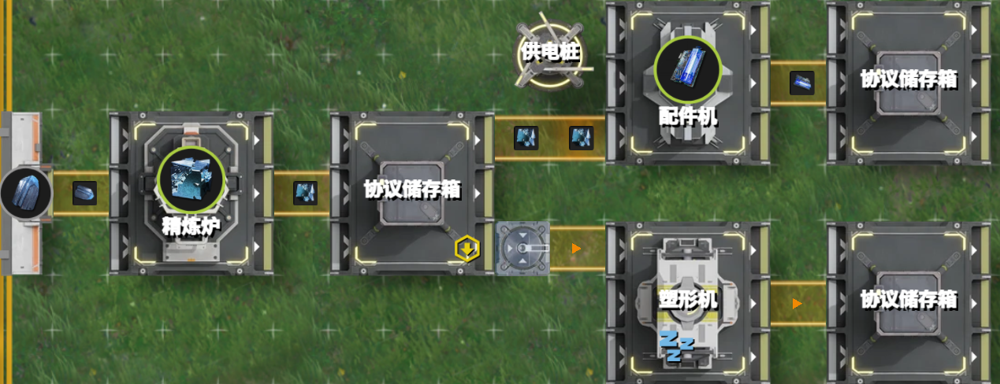
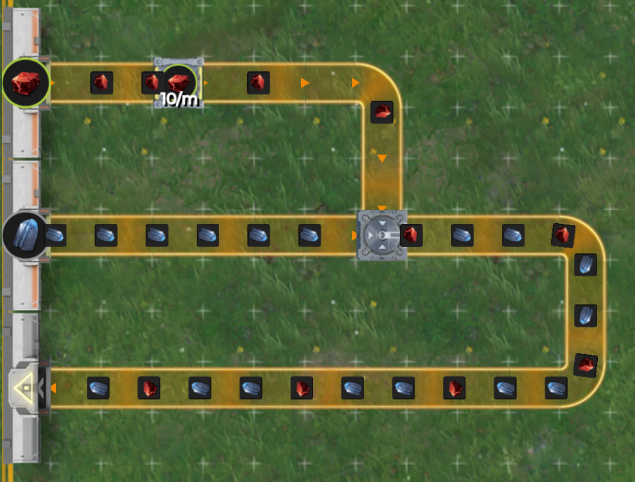
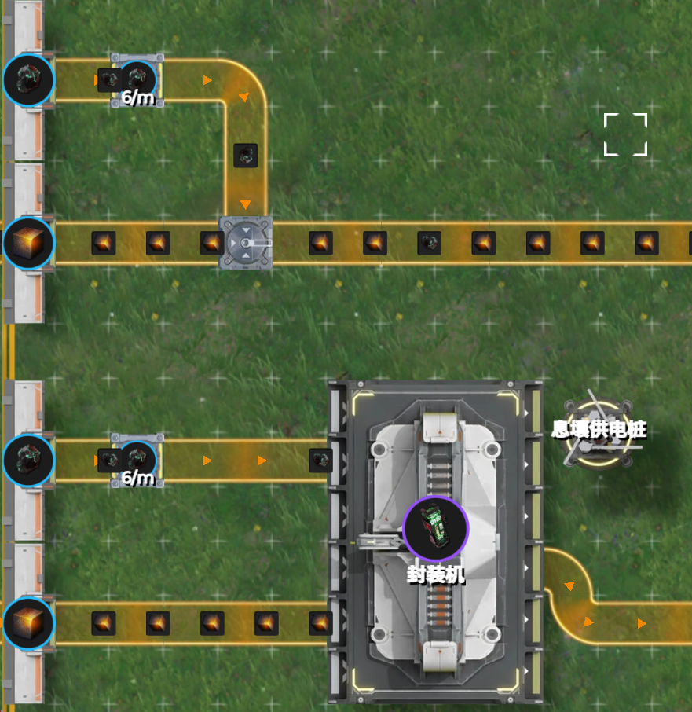
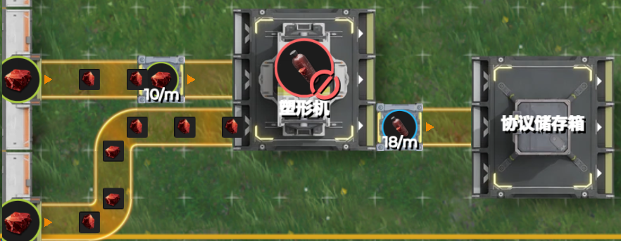
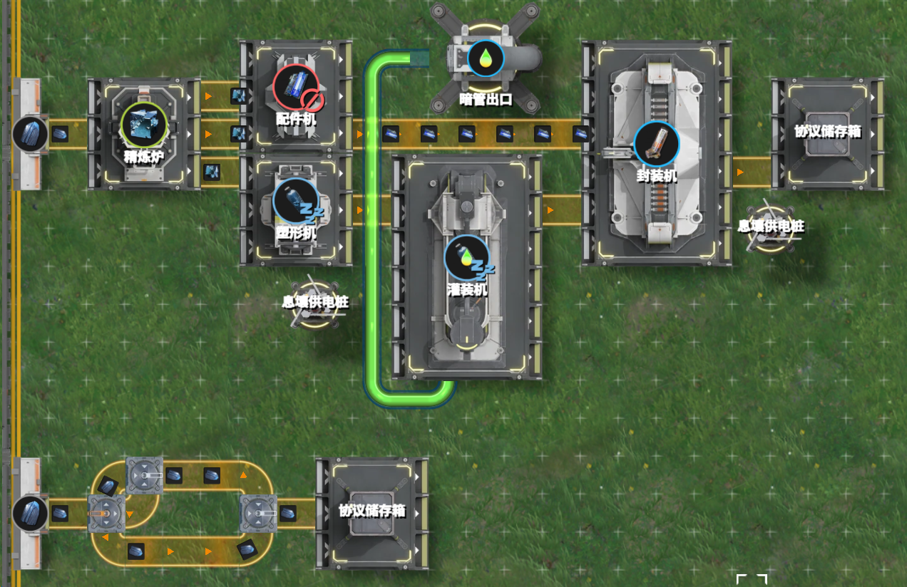

# 2.3 阻塞端与流通端：你控控我，我控控你

> 原文：https://docs.qq.com/aio/DTmluZ1diWlpQZldw?p=Bk5lLqDsnmVVaFwefNgViT　上级：[反应控制与前沿研究](反应控制与前沿研究.md)

从控制的角度讲，阻塞其实我们用来<b>控制的手段</b>。

### 分流的角度

在我们前面的讨论中，当我们<u>从一条生产通路分为两条生产通路</u>，且其中一条形成阻塞时，这两条通路之间就形成了某种<b>控制关系</b>。（也可理解为因果关系）

对于两类阻塞，我们把<b><u>我们希望</u></b><b>首先形成阻塞的通路称为阻塞端</b><s>而不是因为你搭错了导致另一条路堵了变成阻塞端</s>，另一条通路称为<b>流通端</b>。顾名思义，阻塞端的生产速度往往会受到各个方面的<b>外部限制</b>，在限制发生变化时，生产速度也相应发生变化。例如，对切换型阻塞，外部限制为<u>满的库存</u>。当库存清空或者开始消耗后，阻塞端的生产又会恢复。对平衡型阻塞，外部限制为<u>阻塞限流器或产品配方的其他物料供给</u>。当阻塞限流流量数值修改，或其余物料供给情况发生变化时，阻塞端的生产速度也会变化。

<b>流通端的生产则完全由阻塞端决定</b>，即形成阻塞时，全部或部分流量由阻塞端转向流通端生产。阻塞解除时，相应流量又转回阻塞端，使得流通端生产放缓。控制流程为：<b>首先外部限制影响阻塞端生产，其次阻塞端生产影响流通端生产</b>。即控制方向：

<b>外部限制→阻塞端→流通端</b>

也因此，阻塞端常常表现为依据下游阻塞的缓存空间/生产速度决定上游生产速度，而流通端则表现为依据上游所给予的材料进行生产，只要没有材料过来，它就免费了。

我用最直白，最不绕弯子，一针见血的方式跟你说：阻塞端局部是满仓，流通端局部是空仓。满仓走了多少才能生产多少，空仓进多少就生产多少。

> 这一性质在之后的气液反馈自适应中有重要影响，即流通端不能采用后馈控制，阻塞端不能采用前馈控制，

> 在某些讨论环境下，流通端又经常被大家称为末端

<b>在上面的最简例子中，配件机这条支路就是阻塞端，塑形机这条支路就是流通端。</b>阻塞端意即直接按照配件机最大速度生产铁零件，直到仓库装满为止，但是其仍然在“侦听”仓库中铁零件的数量，当仓库中铁零件被拿出时，它又会立刻开始生产。而流通端的塑形机则是拿到多少蓝铁块就做多少蓝铁瓶。

> 当然，这要建立在输入流通端+阻塞端的总物料流量保持不变的情况下。

<b>在使用优先级方案时，</b><b><u>优先输出端需要连接阻塞端生产，次优输出端需要连接流通端生产</u></b><b>。使用分流结构方案时，需要确保向</b><b><u>阻塞端提供充足的流量</u></b><b>，否则无法达成生产目的（见后）。</b>

一般而言，流通端的生产能力被设计为能够承接所有因阻塞而切换过来的物料流量，从而防止原料供给堵塞。当然，流通端也可以发生阻塞，从而使得物料转向第三条通路。这一情况下，流通端相对于第三条通路也成为一个阻塞端，而第三条通路成为新的流通端。此时，控制流程为外部限制→通路1→通路2→通路3。

|  |  |  |
| --- | --- | --- |
|  | 阻塞端 | 流通端 |
| 相对生产优先级 | 高（意味着优先满足） | 低（不意味着不生产） |
| 状态 | 阻塞 | 流通 |
| 机器缓存 | 装满 | 空 |
| 生产受何限制 | 输出缓存阻塞，缺其他原料等 | 缺输入原料 |
| 流量表示（见2.5节） | XX- | YY+ |
| 因果性 | 由于受到外部限制而生产速度受限 | 由于仅能得到阻塞端剩余流量而生产速度受限 |

> 在2.1的例子中，可以认为蓝铁矿留在仓库是第三条通路

### 汇流的角度

作为对偶的一方，汇流器则表现得恰好相反。汇流器的特性，使得其阻塞的上游支路流量，取决于流通支路的流量，如下图中红矿的流量越高，蓝铁矿的流量就越低。

我们仍然把阻塞支路称为阻塞端，流通支路称为流通端。此时，若流通支路受到外部限制，则控制方向为：

<b>外部限制→流通端→阻塞端</b>

可见，在汇流器处控制方向发生了改变。这是由于满带对于汇流器的地位等价于空带对分流器的地位，即汇流器总能从满带获得物品，而分流器总能向空带输出物品。

此时的流量表示（见2.5节）也发生变化。阻塞端变为XX+，流通端变为YY-。

这种性质在阻塞流理论中也有充分研究（链接待补）。在阻塞生产中，我们还会遇到具有此类性质的机器：如下图所示，阻塞的源石粉末流量取决于壤晶的流量。这当然是显然的，因为给多少壤晶，才能消耗掉多少源石粉末。但是注意，这种控制行为我们完全可以不通过机器，而是只通过一个汇流器即可实现——只需要源石粉末形成阻塞。

事实上，也并非需要两种材料，同一种材料也会出现此类情形，例如下图所示，下游最多接受18/m的赤铜瓶，上游赤铜块阻塞支的流量取决于流通支赤铜块的流量。图中10/m的流通支总能进入塑形机，而总消耗量为36/m，因而阻塞支的流量仅为26/m，这是一个常见的出货口不满速原因。

不过，机器终归不完全是汇流器。从下面的例子来看，2/3的蓝铁矿流量去了配件机，1/3的蓝铁矿流量去了塑形机，它们二者最后又会在封装机中合成蓝药，此时配件机会间歇发生阻塞。但在下面构造的分汇流图中，2/3的蓝铁矿流量去上半，1/3流量去下半，最终二者汇流，实际并不出现阻塞。

那么，区别到底在哪呢？请读者开动聪明的小脑瓜想一想

[2.2 花开两朵：切换型阻塞与平衡型阻塞](2.2%20花开两朵：切换型阻塞与平衡型阻塞.md)

[2.4 阻塞信号の“超光速”反向传播规律](2.4%20阻塞信号の“超光速”反向传播规律.md)
