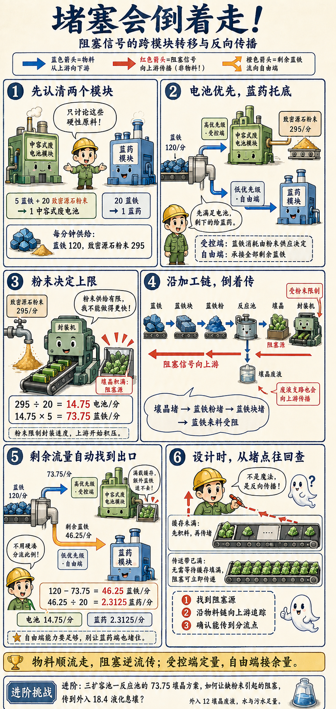
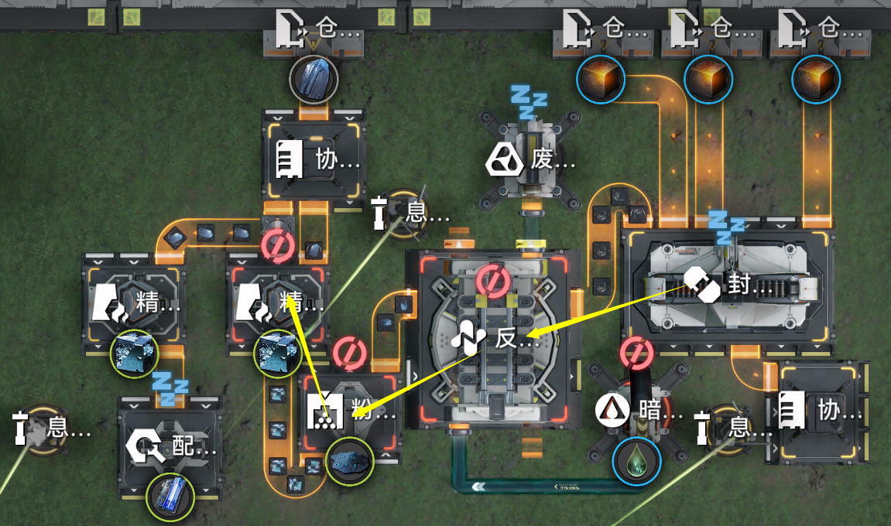

# 2.4 阻塞信号の“超光速”反向传播规律

> 原文：https://docs.qq.com/aio/DTmluZ1diWlpQZldw?p=6aq5YsEznFHSQK7mwkc1Gm　上级：[反应控制与前沿研究](反应控制与前沿研究.md)

ai总结又来力

我们在交流的时候常常使用<b>模块</b>的概念。在本文的语境下，模块就是完成特定生产任务的一个<b>生产结构</b>。回顾术语表，生产结构具有输入和输出节点，模块的输入和输出节点当然就是我们想要的<u>原料与成品</u>。

我们来讨论如下的经典例子。在不论其他材料消耗的情况下，我们有蓝药模块：20蓝铁做1个蓝药；和中容电池模块：5蓝铁20致密源石粉末做1个中容武陵电池。同时，我们有原料生产速度每分钟120蓝铁与295致密源石粉末。

所有管理员都知道要优先把蓝铁做成中电池，因为它价值高，并且只能做那么多，而蓝药只需要蓝铁作为硬性材料，有多少蓝铁都能花完，是一种托底的选择（就跟你直接卖息壤一样）。通过计算我们知道需要<u>每分钟生产14.75中电池，消耗73.75蓝铁，剩余的46.25蓝铁则全部做成蓝药</u>。

这个数字用硬分流并不能很方便地达到，因此我们考虑通过<b>阻塞生产</b>来实现。我们使用优先级（或在下一节中采用分流手段）<b>将中电池模块的蓝铁阻塞</b>，即可达到中电池的计划生产速度。怎么做到的呢？因为中电池这边最多消耗每分钟73.75蓝铁，粉末就没有了，<u>没有粉末之后蓝铁当然就阻塞了</u>。自然地，蓝铁消耗速度也就是对应的速度。

阻塞形成之后，我们只需要<u>为剩余的蓝铁创造通向蓝药的大路</u>（即把蓝药接进来），就会自动地生产出46.25蓝铁所对应的蓝药，<i>因为我们总共的蓝铁只有那么多嘛</i>。

可以发现，对于蓝铁来说，这个问题中的两个模块有着很明显的<b>受控端</b>与<b>自由端</b>的特征。<b>中电池模块是受控端</b>，蓝铁去它的优先级高，在其中阻塞。蓝铁在中电池模块的消耗量，受控于源石粉末的供应速度。而<b>蓝药模块则是蓝铁的自由端</b>，蓝铁去它的优先级低，不形成阻塞。蓝药的模块速度一般设计为能承接所有剩余蓝铁流量的速度，且其实际工作速度取决于有多少蓝铁流量进入（被受控端溢流进来）

那么，如何设计产线，<b>使得蓝铁在中电池模块的阻塞能够被正确地传播到蓝铁上呢</b>？这就需要我们梳理阻塞传播的<b>链条</b>。根据阻塞流的基本性质，阻塞传播具有如下的显而易见的规律：

相对于物料从上游向下游传递，<b>阻塞信号的传递方向是由下游向上游传播</b>。且当传送带填充满物料时，阻塞信号能够瞬间传播（没有填充缓存的时间）。这称为阻塞信号的<b>反向传播规律</b>。虽然可能具有同时性，但是从因果角度，最先发生阻塞的位置称为阻塞源，阻塞源的阻塞信号导致其直接上游被阻塞。

> 在产线中，经常会出现一个地方堵住后另一个地方立刻发生变化的情形。这种“鬼魅的超距作用”正是阻塞信号能够瞬时传播的典型例子。

由此我们梳理阻塞信号的传播链条。如下图所示，显然蓝铁的堵塞源发生在封装机（表现为壤晶堵塞）。由于壤晶是反应池中壤晶废液与蓝铁粉合成，因此导致壤晶废液与蓝铁粉形成阻塞；继续向上游，使得蓝铁粉、蓝铁块阻塞，并最终使得蓝铁溢流到左侧的自由端。

> 顺带一提，壤晶废液的阻塞信号也会向其上游传播，只不过这里不是重点。

阻塞传播链条分析是设计阻塞生产产线的常用基本技能。<b>正确分析阻塞传播链条，才能保证阻塞形成时产线能发生我们所希望的转变</b>。如上是一个简单的例子，如果觉得太简单，请尝试对三扩容池一反应池的73.75壤晶方案（外入12壤晶废液和18.4液化息壤，足量水和污水）分析，并给出一种在壤晶由于缺源石粉末堵塞时，阻塞能够正确传播到外入18.4液化息壤的方案。

[2.3 受控的受控端 \& 不自由的自由端 （考虑弃用）](2.3%20受控的受控端%20&%20不自由的自由端%20（考虑弃用）.md)

[2.5 箱子不就是特殊的分流器吗？（核心内容⭐）](2.5%20箱子不就是特殊的分流器吗？（核心内容⭐）.md)
