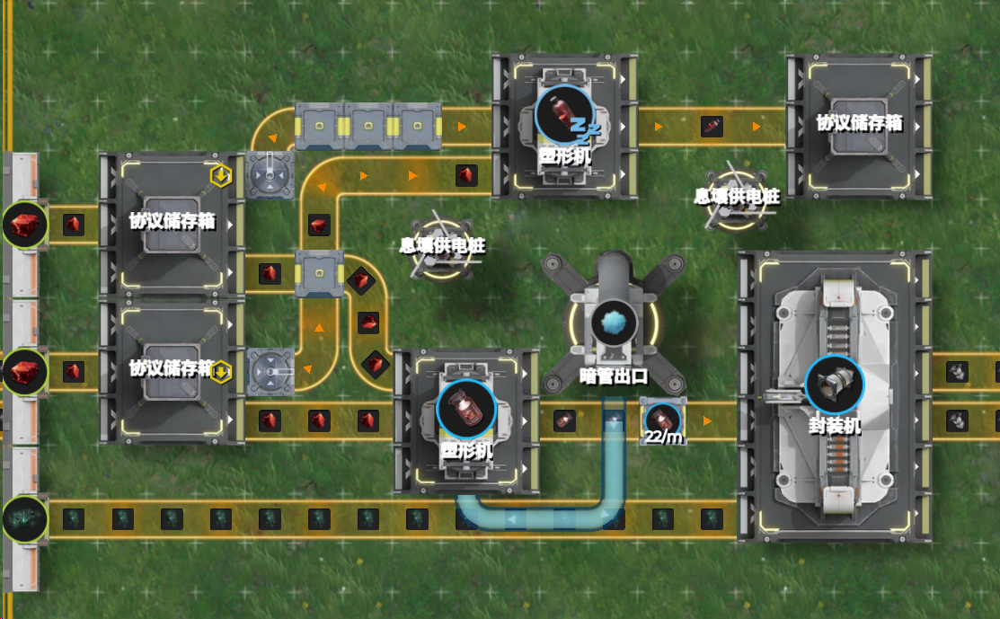
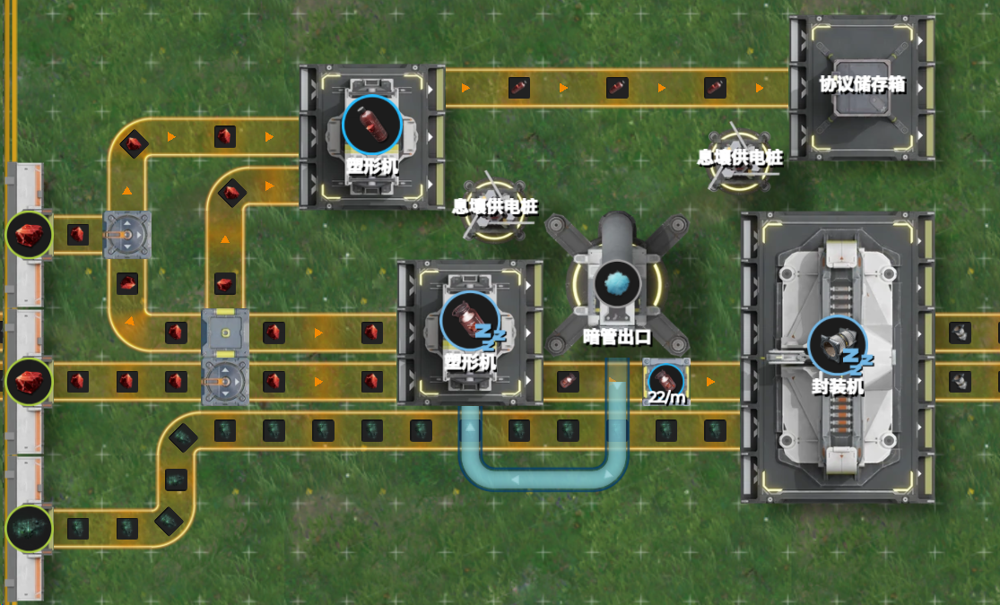
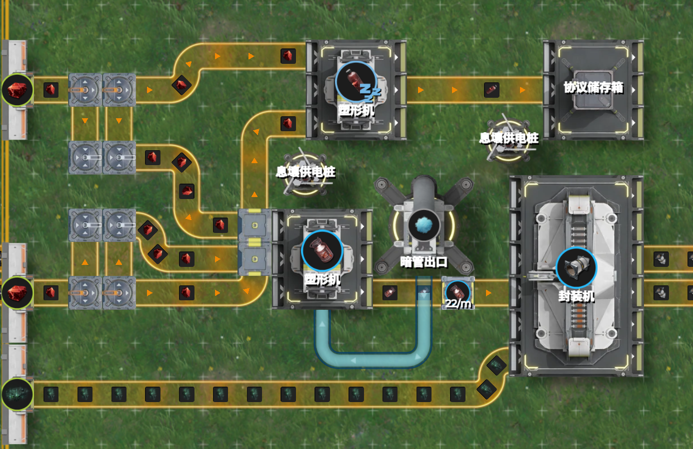

# 2.5 箱子不就是特殊的分流器吗？（核心内容⭐）

> 原文：https://docs.qq.com/aio/DTmluZ1diWlpQZldw?p=o3yxqfGNALKamNYPO1eu1t　上级：[反应控制与前沿研究](反应控制与前沿研究.md)

本节原名：使用分流结构替代优先输出，分流比例的概念与自适应区间的计算

> 由于切换型阻塞需要使用优先级来达到切换的目的，同时也不涉及流量数值的分配，一般不讨论本节内容。主要是平衡型阻塞。

优先输出方案虽然很稳，但是其<u>结构设计较为笨重</u>。特别是对于固体而言，一条传送带只能以每分钟30个的速度运输物品，在处理大流量的优先级时很麻烦。

### 举例说明

如下图所示，我们想让两路铜<b>优先做</b><b>赤铜耐压罐</b>，然后再做赤铜瓶。通过核算，我们发现下游所需要的分离芯量为22/m（举个例子，图中用限流器表示一下，实际上是受下游产线制约），需要进入44/m的赤铜块。因此，如果我们采用<b>优先级</b>的方案，我们需要用两个储存箱单独控制两路的优先级，再各自汇流。不仅结构复杂，还需要处理交叉后优先级发生变化的问题。

有没有更简单的方法呢？有的，兄弟，有的

回想我们的硬分流方案，只需要用分流器对两条流量做11/30分流即可。但是<i>这个分数构造起来太麻烦</i>了。我们直接用二分分流器试试。

理由是什么？理由是：<b>和箱子一样，分流器创建了一个源头到两个下游机器的通路</b>，塑形机最多每分钟消耗44个铜块，那它堵满之后，<b>剩余的流量不就自动转移到</b><b>铜瓶</b><b>那边去了吗</b>？而且这样，结构就简单了很多诶！

然而现实很骨感。这么分流，压根无法达成生产目标。明眼人一看就明白，这不是两个塑形机各吃掉30赤铜块，生产15罐子和15瓶子吗？<i>问题出在哪儿了？</i>

显然，问题出在<b>塑形机没有正确发生阻塞</b>。在优先级的例子中，塑形机最初接收到60赤铜块，但最多只能消耗44的赤铜块，因此速度就从60降低到了44，并维持在44。此时剩余的16流量才转向赫铜瓶生产。

那么如何解决呢？我们用分流器，虽然不能在最初把流量完全给到赤铜罐生产，但是我们<b>只要给超过44流量的</b><b>赤铜块</b><b>，不也能让其阻塞并维持在44吗</b>？二分流不行，那就取<s>2/3</s>3/4呗。考虑如下结构

图中每条支路的铜块均被二分二分后，1/4进入赤铜瓶塑形机，3/4进入赤铜罐塑形机。在产线运行的最初，可以计算出<b>进入塑形机</b><b>赤铜罐</b><b>生产的</b><b>赤铜块</b><b>速度为45，超过</b><b>赤铜罐</b><b>的消耗速度44，因此会形成阻塞</b>。原本进入赤铜瓶塑形机的赤铜块速度为15，在气罐塑形机阻塞后，则自然地变成了16，<u>达到了我们想要的生产目的</u>。同时，分汇流元件的摆放也比箱子更加灵活自由。<s>很多时候一个二分就能解决的事情</s>。

在上面的例子中，显然可以判断出赤铜耐压罐是<b>受控端</b>，而铜瓶是<b>自由端</b>。因此我们可以总结出使用<b>分流结构替代箱子优先级</b>的构造方式：设计分流结构，使得<u>受控端所接收到的分流流量</u><b>超过</b>其<u>核算出的所需的生产速度值</u>，<b>使其阻塞</b>。由此，剩余流量可以转向自由端的生产。

> 此处其实已经体现了局部的加压

### 分流比例

进一步地，我们能讨论<b>分流比例</b>的概念。在中间的例子中，二分分流器使得两路<b><u>在没有阻塞形成时</u></b>流量比例为原来流量（这里即满速30）的0.5和0.5。在最下面的例子中，两路<b><u>在没有阻塞形成时</u></b>流量比例为0.25和0.75。同时我们注意到，在第一个优先级例子中，两路<b><u>在没有阻塞形成时</u></b>流量比例事实上是1和0。由此，我们可以建立一个<u>统一的模型</u>来描述<b>上游流量如何分到两支下游的流量</b>：即<b><u>在没有阻塞形成时</u></b>流量比例为R和1-R。当R=0或者1时，表示优先输出；R为小数时，则可以用相关结构构造出相应的分流器[通用分流器理论整理](通用分流器理论整理.md)。但当我们只进行理论讨论时，就只使用R值，而不再区分具体实现是优先输出器还是分流汇流元件组成的结构。

> 我觉得把<b>R值默认作为指向受控端的分流比例</b>比较合适，因为这是我们首先关心的产物，后面没有特别说明都采用这一约定

在上面的例子中，我们基于设计好的R值（如0.25/0.75）与一条传送带输入的赤铜块流量（30），可以计算出<b><u>在没有阻塞形成时</u></b>时，两路的流量值为7.5和22.5。把<b>受控端</b>流量称为22.5-，自由端流量称为7.5+，由此区分两端不同的性质，以及阻塞生产（自适应）过程中流量并非稳定值，可能会发生变化的性质。正如开篇所述，<b><u>阻塞形成</u></b>会使得流量形成<b>重分配</b>。受控端受到限制，<b><u>阻塞形成</u></b>之后，<b>受控端</b>流量一定小于22.5，而自由端流量一定大于7.5。具体的数值，则取决于<b>受控端</b>具体所受到的控制如何。这种表示方法在产线的一些计算中，可能会带来一定的便捷性。

> 例如，一条15-速度的息壤和一条10+速度的晶体做息壤装备元件，最终能够平衡，其速度在10到15之间，因为息壤是阻塞塞满原件机的，息壤实际消耗量取决于晶体供给量。而15+速度的息壤和10-速度的晶体做装备元件，则无法成立想要的稳定流量，因为晶体最多只给到10，息壤只需要10就阻塞了，没有起到自由端的作用，此时自由端也阻塞，息壤会在仓库堆积。

最后，我们讨论当<b>原料供给或生产需求发生变化</b>时，我们这个产线是否仍然能够达到预定的生产需求，这就决定了我们的产线设计能够具有多大的<b>自适应区间</b>。

从理论层次角度，说白了，在这个例子中我们设计产线，<b>设计的只有R的数值</b>。我们记R为送往赤铜罐的原料比例，设赤铜块供应速度不再是60，而用字母I表示。核算出的赤铜罐消耗量也可能随着其他物料的供给情况变化而发生变化，记为P\*。由此，我们可以得到前述形成阻塞条件的数学表达式：

$$
IR>2P^* \qquad(2.5.1)
$$

对于前面的例子，2P\*=44，我们可以计算：60\*1=60\>44，60\*0.5=30\<44，60\*0.75=45\>44，因此第1，3种设计都是能正确达到阻塞生产目标的。

进一步地，如果我们记：

$$
R^*=2P^*/I\qquad(2.5.2)
$$

则条件简化为：

$$
R>R^{*}\qquad(2.5.3)
$$

R\*是什么呢？思索一下字母的含义，<b>我们立刻可以发现R\*正是精确分流（或硬分流）所需要的比例</b><b>！</b>这其实揭示了精确分流和阻塞生产（或自适应生产，溢流生产）的内在联系。当设计产线的供给受控端的流量，超过核算出的精确分流的流量时，就能够正确形成阻塞。<b>式2.5.3是整个第2节，</b><b><u>单原料</u></b><b>阻塞生产最重要的式子</b>。

<b>自适应区间</b>，指的是在固定产线设计（即R值）的情况下，产线能在<b>多大的原料和产能需求区间</b>内成立。显然，在固定P\*值时，对于所有超过2P\*/R的供给量，或者在固定I值时，对于所有不到IR/2的生产需求量，产线都能达到生产目标，由此可判断其自适应区间。<s>当然，实际还需要考虑机器生产速度上限</s>。在少数时候，I和P\*是协同变化的，此时需要讨论R\*=2P\*/I的取值范围，再加以综合判断。

> 此处可以看出，分流比例R的设置影响着自适应区间。当R=1，即严格采用优先级时，供给量要求的下限最小，生产需求要求的上限越大。我们采用分流器替代R值，一定程度上

可能不少朋友会对式子中的<b>常数2</b>感到奇怪。它来自于配方：2赤铜块+1惰气→1赤铜罐 中做一个产品所需要的原料数。对于不同的配方，它当然也会发生变化。这个值会在后面的第三节中起到重要的作用。

> 通过动力学分析，可以证明R\>R\*是阻塞时生产目标流量局部动力稳定的条件。
>
> <s>这真的还需要证明吗？</s>

[2.4 阻塞信号の“超光速”反向传播规律](2.4%20阻塞信号の“超光速”反向传播规律.md)

[实战演练 120蓝铁的壤晶-蓝药耦合产线解析](实战演练%20120蓝铁的壤晶-蓝药耦合产线解析.md)

[2.6 空仓？满仓？我们需要更多的加压！](2.6%20空仓？满仓？我们需要更多的加压！.md)
