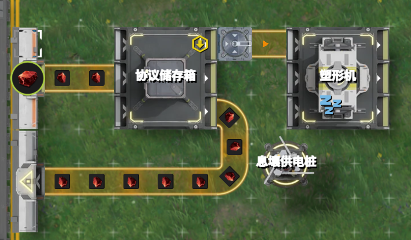

# 2.6 空仓？满仓？我们需要更多的加压！

> 原文：https://docs.qq.com/aio/DTmluZ1diWlpQZldw?p=2kENbD6F4B8qcMtdPdudqt　上级：[反应控制与前沿研究](反应控制与前沿研究.md)

本节原标题：“借助仓库实现阻塞信号的转移，加压，满仓与空仓配平”

> <i>“满仓配平是区。”</i>
>
> ——2026年8月，言老大于1.4版本制作最大毛产时发现息壤生产速度不达360时言

> <i>“空仓配平是区。”</i>
>
> ——2026年9月，言老大于1.5版本制作最大毛产时发现息壤出货口不出息壤时言

本小节讨论产线在空间上分离，没有物流结构相连时，如何借助仓库与取货存货口，将阻塞信号从一个地方传递到另一个地方，甚至跨不同的分基地。

我们首先需要回顾一下仓储取货口和存货口的性质。<s>此处原计划链接基础基建知识但还是空白</s>

算了，这东西的优先级到现在还没完全研究明白，可能存在一定规律，但是离线可能发生变化。[仓库相关优先级现象](仓库相关优先级现象.md)后面暂且就当取货口是轮询讨论。存货口倒是有一些证据表明其具有先后的优先级顺序，但是仓储容量足够时也可视为轮询。

基于此，我们可以把仓库+不同取货口认为是一个<b>巨大的分流器或分流结构</b>，从而直接应用2.5节的结论。例如，我们想要<u>用进仓库的每分钟120蓝铁，拿出73.75做壤晶，47.25做蓝药</u>。我们设计给壤晶模块3个取货口取蓝铁，蓝药模块2个口取蓝铁。

在<b>仓库中还有蓝铁</b>时，每个取货口都是满速出蓝铁（可以视为最大总供应速度150）。用上面的记号，壤晶模块的蓝铁流速是90-，蓝药模块的流速是60+。<u>阻塞形成后，壤晶模块蓝铁流速实际为73.75</u>，原本多余的26.25流量将转去蓝药模块，但蓝药模块被设计为可承载60蓝铁的消耗量，所以这26.25流量只能留在仓库中（即蓝药模块也可视为阻塞）。因此，蓝铁的总消耗量达到了133.75，超过了蓝铁产量，使其数量越来越少。

在<b>蓝铁用光后</b>，分流器的性质就体现出来了。每个取货口均没有办法满速，因为<b>每分钟仓库只拿到120蓝铁，均分给5个取货口</b>，可知壤晶模块蓝铁流速变为72-，蓝药模块流速变为48+。此时<b>供给壤晶的蓝铁量不达标</b>，无法形成阻塞。（R=3/5=0.6，而R\*=73.75/120=0.614583）。

怎么办呢？我们可以给壤晶产线增加更多的取货口。例如，我们增加到4个取货口，同时蓝药处仍保留为2个取货口，则R变为4/6=0.6667，此时壤晶模块流速为80-，蓝药模块流速为40+，这就足够使得壤晶生产形成阻塞，从而使得多余流量转向蓝药。

> 此时蓝药的实际流量计算，需要先从总蓝铁生产量120中扣除阻塞的受控端的流量73.75，剩余46.25均分给两个输出口

像这样，设置超过产量/30的取货口数量，并使用超过模块计划产速/30对应的取货口数量供货，称之为<b>加压</b>。一般来说，<b>加压</b>使得物料数目逐渐在仓库中减小到0，并且在其后取货口速度不达30时，仍供应充足的原料，使其仍然保持<b>受控端阻塞</b>的性质。

> 由于库存消耗大于生产，库存归零后消耗会被强制与生产等同。物料在仓库中积累的速度可以记为0+。在取货口连接的模块完全堵塞完之前，这个0+也只能当0。这种配平形式称之为<b>空仓配平</b>。

> 笔者本人倾向于一般化加压的概念，只要某处在稳定平衡生产时速度为x，通过优先级或分流器，设计最初到达该处的流量大于x，（特别是有意的采取更大的比例），使其（更快的）阻塞，就称为加压。

在第一类阻塞的设计中，常针对满仓的阻塞信号作检测。传统上，常采用如下的设计：原材料首先进入储存箱（或者机器也可，如果正好需要加工），然后优先输出方向送回仓库，次优输入下一步生产。<b>即受控端为仓库库存，自由端为下游生产</b>。仅在仓库库存满仓时，继续向塑形机方向输送物料并生产。

然而，<b>这种结构有一个巨大的问题：满仓检测的回流入库会挤占生产侧材料的入库</b>。以上图中的赤铜块爆仓生产赤铜瓶为例，在1.5版本中有17台精炼炉往仓库中送赤铜块。此处的装置，实际上是增加了一个入库赤铜块的渠道（储存箱是关闭的，入库渠道是<b>存货口</b>）。简单起见，我们讨论<u>每个存货口等权重轮询输入的假想情形</u>。

1. 假定原本，<u>在其他产线每分钟生产510赤铜块，消耗480赤铜块</u>；此处在赤铜块未满仓时，每分钟取出30赤铜块存入30赤铜块。

2. 当赤铜块逐渐积累满仓后，就需要仓库中取出赤铜块消耗，才能再进入赤铜块。由于<u>赤铜块总生产量大于塑形机未启动时的消耗量，所有存入口形成阻塞。</u>

3. 此处部分赤铜块流量转向塑形机，不妨设为x；送回仓库的赤铜块流量为30-x。此时所有产线的赤铜块总消耗量为480+x。

4. 理想情况下，我们当然希望x=30，<b>但是实际由于外部精炼炉和该处装置一起输入仓库</b>，且均阻塞，按均分模型，总消耗量480+x腾出的空位会被18个入口平分，每个入口分到(480+x)/18的入库流量；

5. 因此30-x=(480+x)/18，解方程得到x=3.16。这就导致装置几乎没有起到设计的作用，反而使得精炼炉堵塞，只能处理17\*(30-3.16)=456赤铜矿。

> 也是一种阻塞图求解

实际上，由于存货口存在优先级，具体数值情况会有些不同，但问题仍然不太方便解决。

考虑我们以某种方式使得上图中回流入库的存货口具有<b>最末优先级</b>，则存在如下情况。

- 当其他产线按照均匀的速度每2秒取出16个赤铜块，此处也均匀地每2秒取出1个赤铜块时，其余17个精炼炉总能每2秒存入17个，而此处存货口不入库，所有多余的赤铜块都进入塑形机。

- 但若其他产线存在取货波动，如每4秒的前2秒取出28个，后2秒取出4个，长期平均也是每分钟480。但是，前2秒取出28个后，这里的最末优先级存入口也会开始入库，因而仍然会挤占正常生产的入库空间。

> 为什么会存在取货波动呢？是不是谁又在悄悄加压

- 如果让生产侧全部用箱子入库，虽然箱子缓存可以快速填充空缺，但是在箱子等待回传时，此处存入口也仍然会入库，同样挤占正常生产的入库空间。

- 如果在此处满仓检测器用箱子入库，生产侧用存入口入库，可以较大程度的缓解问题，只在箱子回传的一瞬间存在一定的挤占现象。

要想完全解决或避免此类问题，可以从以下角度考虑：

1. 针对没有其它入库生产产线的物品作检测，如抽一条赤铜块来做赤铜零件，对赤铜零件作检测，满仓阻塞后令赤铜块流向其他地方。因为没有其他地方做赤铜零件入库，这就不存在竞争问题。

2. 完全搞明白箱子和存货口优先级控制，并且需要离线稳定

3. 使用更复杂的信号控制结构，仍在开发中，见其他页面

无论如何，由于<b>取货口的性质目前尚没有完全弄明白</b>，使用满仓和空仓方案时，一定要小心谨慎，并仔细核算数值。如言老大的智能产线，也会出现空仓取货口不出货的神秘情况。笔者建议大家从简单的产线方案开始练手，熟悉感觉后再尝试大规模应用。

<s>当然笔者本人基本上是满速取货口拥趸者，不空也不满</s>

[2.5 箱子不就是特殊的分流器吗？（核心内容⭐）](2.5%20箱子不就是特殊的分流器吗？（核心内容⭐）.md)

[反应控制与前沿研究](反应控制与前沿研究.md)
