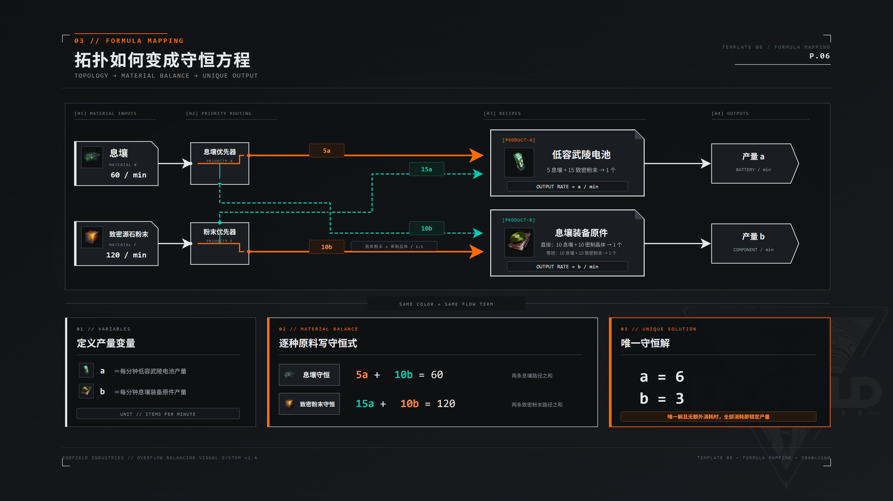
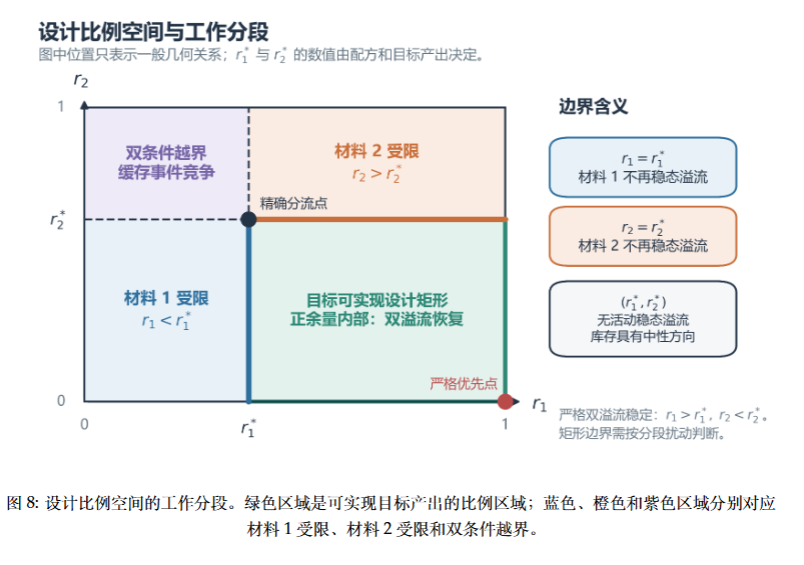

# 3.1 自动配平思想的萌芽：息壤与源石粉末的爱恨情仇

> 原文：https://docs.qq.com/aio/DTmluZ1diWlpQZldw?p=KHooQBQESX74amkILMa8UI　上级：[反应控制与前沿研究](反应控制与前沿研究.md)

> Xiranite and Originium Powder will find their way out.
>
> —— Perlica, inspecting the adaptive designs in Wuling, July 2026

本节又名”两种原料两种成品的简单阻塞配平设计“

### 起源

一切的一切起因于如下简单的观察：<b>息壤和致密源石粉末，能够按照不同配比做成不同的产物</b>：

$$
\matrix{10息壤+10致密源石粉末（致密晶体）=1息壤装备元件\\ 5息壤+15致密源石粉末=1低容武陵电池}
$$

其中致密晶体由于仅由源石粉末直接烧炼两步得到，基本可以视为同一个东西。 
那么一个条件反射般的结论就是：只要<b>输入的息壤和源石粉末数量在这两个配方的比例之间</b>，就肯定能通过<b>线性组合</b>，把息壤和源石粉末全部消耗完。换句话说，在给定输入量后，我们求一下方程组的解，就知道我们生产X个息壤装备元件，Y个低容武陵电池就能消耗完原材料，实现配平。

但是终末地的机器没法直接控速，我们只能间接地控制原料给进去的数量，来决定机器的产速。由此形成了最古早最朴素的<b>精确分流方案</b>：<u>通过求解方程组，得到两种原料应有的配比，然后构造分流器结构，将指定比例的流量送入机器</u>。在这一阶段，产生了发展了不少分流器构造的相关理论<s>当然，时至今日也还在发展</s>，可见[通用分流器理论整理](通用分流器理论整理.md)

随着版本来到了1.2，<b>提纯机，净水节点</b>的加入使得配方计算变得复杂了起来，线性方程的精确解往往是复杂分数，构造安装变得尤为困难。是否有更好的方案呢？

我们换一个角度思考。配方配平，<b>想要的是进入的原料被全部消耗做成了产品</b>。如果我们能通过其他手段达到这一点，其实就无需计算精确流量，<b>而是直接从守恒律出发</b>，绕开了配方配平的问题。

如果产线摸的比较多，应该会有如下体会：<u>封装机不生产，往往是材料A在等材料B</u>。此时，封装机中堵满了材料A，材料B只要一进去就会消耗，然后材料A继续生产堵满机器。那么，只需要做个镜像对称，我们就惊奇的发现：<b>如果让一台机器堵满材料A，另一台机器堵满材料B，两种材料各自去另一台机器时</b>，又由于对方堵满，过去的材料都能被马上消耗掉。在这个设计思路下，我们发现<b>材料A和B的入口支似乎永远不会阻塞</b>，因为永远有一条空出来的路径可以走。既然不堵塞，那么就可以知道一定是<u>进入的原料全部被消耗</u>，由此可推知产出比例一定是全消耗时所对应的比例，形成了自适应配平。而如何让两个机器先堵满AB，那就要靠优先级的功劳了。

### 优先级情形下的推演

用阻塞生产的术语讲，我们：

1. 对A原料，机器M作为受控端，机器N作为自由端。

2. 对B原料，机器N作为受控端，机器M作为自由端。

这样，每种原料都存在一个自由端，意味着它在产线正常运行时不可能堵塞；而每条原料也存在一个受控端，消耗量取决于对方自由端的材料供给情况。

这样做真的能收敛吗？我先直接给出答案，后面再说为什么：<b>原料优先供给它消耗相对少的配方，次优先供给它消耗相对多的配方</b>。

仍然以12息壤+30源石粉末做小电池和息壤装备原件为例子，我们来作一下推演。简单起见，虽然做元件需要致密晶体，但都用粉末指代。注意，相同时间内粉末的供应量总为息壤的2.5倍。

|  |  |  |  |  |
| --- | --- | --- | --- | --- |
|  | <b>封装机息壤</b> | 封装机粉末 | 原件机息壤 | <b>原件机晶体</b> |
| 填充完成后 | 50 | 0 | 0 | 50 |
| 2 | 50-5=45 | 0+15-15=0 | 0+6=6 | 50 |
| 3 | 45+5=50 | 0+12.5=12.5 | 6 | 50 |
| 4 | 50-5=45 | 12\.5+2.5-15=0 | 6+1=7 | 50 |
| 5 | 45 | 0 | 10-10=0 | 50-10=40 |
| 6 | 45+5=50 | 0+2.5=2.5 | 0 | 40+10=50 |
| 7 | 50-5=45 | 2\.5+12.5-15=0 | 0+5=5 | 50 |

1. 初始阶段，从空仓启动，小电池消耗粉末相对更多，所以粉末优先去做装备原件，息壤优先去做电池。简便起见，我们假设两个机器中相应的缓存同时达到满仓（不同时也行，不太影响推演）。

2. 由于满仓阻塞，息壤开始进入原件机，粉末开始进入封装机。按照供给速率，进入15粉末/6息壤后，开始生产第一颗低容武陵电池，消耗5息壤/15粉末。

3. 其后，5息壤继续优先进入封装机填充库存，此时封装机一同进入12.5源石粉末，原件机仍在待机。

4. 在封装机达到15源石粉末时，如同第2步生产一颗电池。这一过程中有1息壤溢流进入原件机中，此时原件机留存7息壤

5. 在这个小循环中，每做1颗小电池，就会溢出1份息壤到原件机。当息壤溢出到10时，原件机启动，生产1个元件。

6. 此后，又按照优先级进入填充环节，封装机进入5息壤时，已经有10粉末进入原件机，2.5息壤进入封装机。

7. 等到12.5粉末进入封装机生产电池时，已有5息壤进入原件机。

从此处开始，大家应该能看出来形成了一个稳定的循环。

那么如果反接优先级会怎么样？息壤优先去原件机，粉末优先去封装机，不也能让原料形成两条通路吗？我们也来推演一下.

|  |  |  |  |  |
| --- | --- | --- | --- | --- |
|  | 封装机息壤 | <b>封装机粉末</b> | <b>原件机息壤</b> | 原件机晶体 |
| 填充完成后 | 0 | 50 | 50 | 0 |
| 2 | 0+4=4 | 50 | 50-10=40 | 0+10-10=0 |
| 3 | 4 | 50 | 40+4-10=34 | 0+10-10=0 |
| 4 | 4 | 50 | 4 | 0 |
| 5 | 4 | 50 | 4+4=8 | 0+10=10 |

1. 仍然是假定封装机粉末和原件机息壤同时到达满仓。

2. 粉末溢流去往原件机，进入10个后，开始做1装备原件，消耗10息壤10粉末。于此同时，有4份息壤溢流进入封装机。

3. 息壤继续按优先级先填充原件机，但是只填充了4个息壤，就有了10个粉末进入原件机，启动了下一个元件生产，原件机净亏6个息壤。封装机则完全无事发生。

4. 如此进10粉末4息壤-做原件循环，最终到了原件机只剩4个息壤的地步。

5. 再有10个粉末进入原件机时，息壤只达到8个。至此，原件机息壤的已被粉末完全控制，息壤一填满10个，就会被消耗做成元件。与此同时，原件机内粉末的数量还在不断增长。

6. 最终，原件机内粉末堆满堵塞。由于封装机内粉末也堆满堵塞，粉末直接源头也堵塞。

可见，此时原料的输入被阻塞，没有达到既定的生产目标，实际变成了12息壤+12粉末全做装备元件的状态，多余的18粉末直接进不去生产了。

如果最开始封装机粉末进的比较慢，<b>息壤在被消耗前进入了封装机</b>，则又是另一回事了。息壤一进入封装机，就会每5息壤消耗15粉末，而补充15粉末的同时会进入6息壤，使得息壤越积越多直至堵塞。这时候实际变成了10息壤+30粉末全做电池，多余的2息壤直接进不去生产了。

到此处，可能读者能够感受到优先级的重要性。对更一般的情况，如下所示的配方

$$
K_{11}原料A+K_{12}原料B=产品1
$$

$$
K_{21}原料A+K_{22}原料B=产品2
$$

我们指出，原料A优先去产品1，原料B优先去产品2，能够形成稳定配平的充要条件是，原料供给速度在配比范围之间（线性方程组有正解），且

$$
K_{11}K_{22}<K_{12}K_{21}
$$

如果不等式不成立，原料A就优先去产品2，相当于AB地位互换处理。

至于它是怎么导出来的，可以通过对流量变化建模得到（见论文pdf），当然也可以用这个带K的配方进行推演分析，留给读者自证<s>我估计应该也是能得到的</s>。

### 使用分流比例的情况

如果我们不用优先级方案，参考[2.5 箱子不就是特殊的分流器吗？（核心内容⭐）](2.5%20箱子不就是特殊的分流器吗？（核心内容⭐）.md)节中提到的分流比例概念，假定已经满足如上的稳定性条件，记RA的原料A送去做产品1，RB的原料B送去做产品2，RA=RB=1的情况则对应于上面的优先级情形。那么，RA和RB在什么取值范围，能够达到自动配平的生产目的？

这里也直接给出结论。依据实际两原料的输入量I1,I2，我们可以计算出两原料精确分流的比例RA\*,RB\*。RA和RB只要落在精确分流的比例点，和优先级点组成的矩形区域中，就能够达到自动匹配的生产目的。

$$
RA>RA^*\qquad RB>RB^*
$$

> 当然，除此之外还有两种退化情况：RA=RA\*或RB=RB\*。以前者为例，此时对原料2来说，两台机器都是处于最大能达到生产精确分流结果产能的状态，某种程度上退化为了原料2的单原料阻塞配平。

基于2.5节的讨论，可以认识到，满足这两个<s>加压</s>条件能够使得两台机器能形成正确的阻塞状态，从而达到生产目标。这确实也是一种导出这一条件的思路，不过严格的数学表达推导还是挺麻烦的，见论文pdf。

我把最重要的图拿出来放着，其他相关内容请参考论文pdf。

相关分析与视频讲解

[https://bbs.nga.cn/read.php?tid=47031688](https://bbs.nga.cn/read.php?tid=47031688)

🔗 [【终末地/基建】《爆仓动力学》？息壤和源石粉末的自动配平方案](https://www.bilibili.com/video/BV1vsNG6GEjE) — 本来版本初就该发了，但是一直忙的团团转（主要在玩AI），游戏都没空打，眼看着马上版本都要更新了换新产线了，咬咬牙加班一个周末做出来。不过这个东西真挺难的，还得靠AI帮助理顺思路和建模，以及写模拟程序，做稳定性分析之类的，这样前前后后大概加起来还花了一周。最后做视频也拿AI做了一整套配音，审听，配图之类的工具（用的小米音频合成，效果感觉不如必剪）。  所以也没蓝图，一是马上换新产线了没必要，二是主要分享一个思路。  更神奇的是，视频里的技术是1.0版本就能做出来的，可能只是当时没这种需求……但是以防万一有人做过了，我进一步把整套动力学建模分析模拟做了一下，这个估计没人闲得无聊搞吧（

🔗 [【终末地/基建？！】向自适应产线学习如何递推求解线性方程组（gpt邦邦我](https://www.bilibili.com/video/BV1DhYJ6bE9r) — 自动配平前置视频讲解 BV1vsNG6GEjE 这两天在琢磨自适应产线是个巨大的线性方程求解器，我们只需要给定进入流量，看一下产品报表就能得到线性方程组求解结果。那么产线到底是怎么求解方程组的？ 结果似乎就是递推法求解......（我还真不知道，给我学到了  更多原理可参考本人主笔理论 https://docs.qq.com/aio/DTmluZ1diWlpQZldw?p=0iirIEzxWlkfel2jMLIWJJ

[3.0 配平，自适应，最大价值产出，叽里咕噜说什么呢](3.0%20配平，自适应，最大价值产出，叽里咕噜说什么呢.md)

[3.2 最高的山山？！重息壤AND灼铜](3.2%20最高的山山？！重息壤AND灼铜.md)
