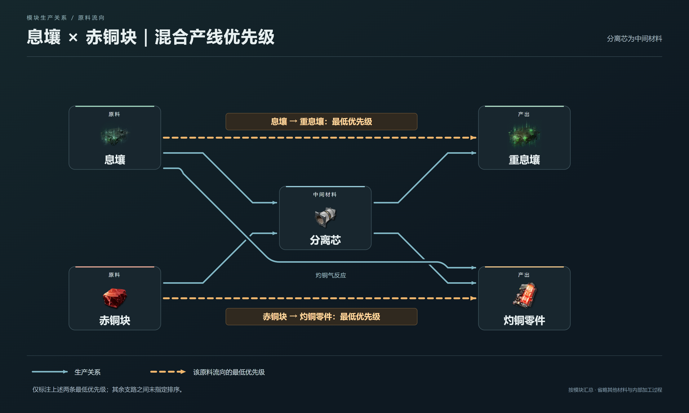

# 3.2 最高的山山？！重息壤AND灼铜

> 原文：https://docs.qq.com/aio/DTmluZ1diWlpQZldw?p=SpFI2A6dCHUMgJI8KqPSP2　上级：[反应控制与前沿研究](反应控制与前沿研究.md)

#### 这边需要息壤到重息壤是最低优先级，铜到灼铜零件是低优先级

##### 60铜+60息壤生产2.19灼铜+2.09重息壤+18.4液化息壤

同样可以参考本人视频

🔗 [【终末地/基建】挑战1.4基建最高的山！按需供料自动配平26.097重息壤14.19灼铜零件](https://www.bilibili.com/video/BV1yp3q6GEK3) — UP最近很忙，做完这个视频又要忙别的去了，游戏里任务都没打，b站评论也都没空看和挨个回复，还请评论区大家多多互帮互助，也欢迎工头来群里讨论1095487306（什么主人的任务（不是）@Xersyo    事实上我并不推荐大家为了产能抄这个自动模块。。太麻烦了，要拉一堆暗管，还要知道哪些是该塞爆的。。我也没空出详细的安装说明和提供售后。但是基本上绝大多数的要点我想都在视频里提到了，这个视频的重点主要是技术分享。  景玉谷蓝图@奶瓶奶盖的奶爸  （不知道发了没） 反向检测供料开发者@卖兔子的小智乃   进行了通宵的超绝大量的分析讨论优化（一个匿名群友）和@樊二のいすぼくろ赛高

##### 120铜+120息壤生产重息壤+赫铜+18.4液化息壤

🔗 [【终末地/1.5基建】模块蓝图与技术讲解，120息壤+150铜=18.4息壤液+零浪费赫铜重息壤](https://www.bilibili.com/video/BV1Jbt66XECE) — 笑死，上个版本做的是60息壤60铜配平，这版本变成120+150，合着我成定制铜壤单元模块的了 这个模块用起来需要一些前置条件，不需要硬抄这个，而且产物溢出太多，随便拿120+150做点东西玩玩得了。所以这个视频会更加侧重流程和技术讲解。回头我挪去武陵，做210息壤+150铜+55粉末+120蓝铁的副基地，就方便多了。  前馈生产模块研发：言大人（隐姓埋名至今不知道b站号）以及@bear-冰梦潇湘  还有群友们 做生产流程图的工具，以及探讨相关赤石（并不）科技，欢迎来塔v2技术开发局交流1095487306 （我平时水群多，b站不常看）

[3.1 自动配平思想的萌芽：息壤与源石粉末的爱恨情仇](3.1%20自动配平思想的萌芽：息壤与源石粉末的爱恨情仇.md)

[3.3 你……你这头白吃息壤的猪！](3.3%20你……你这头白吃息壤的猪！.md)
