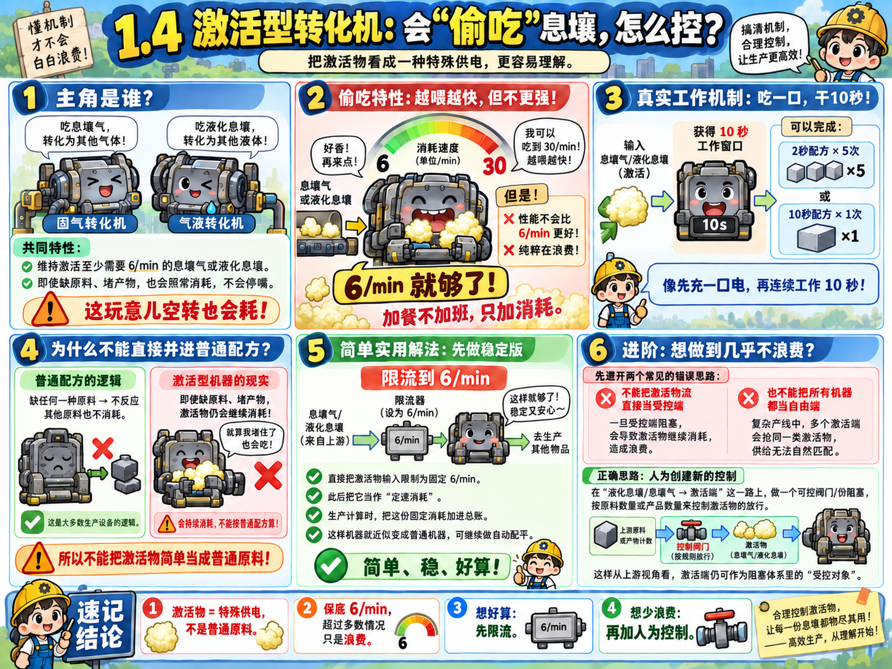
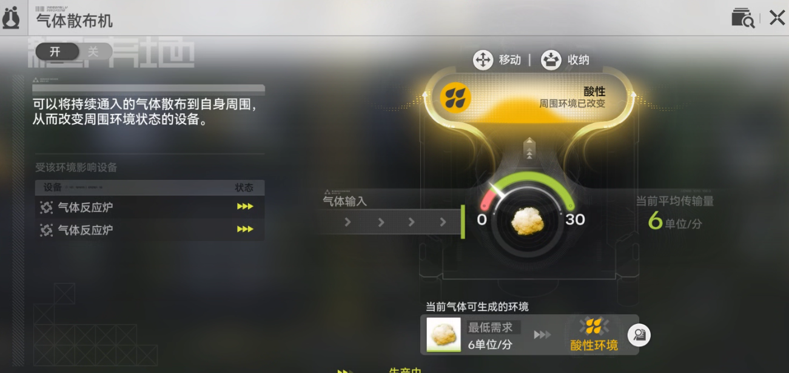
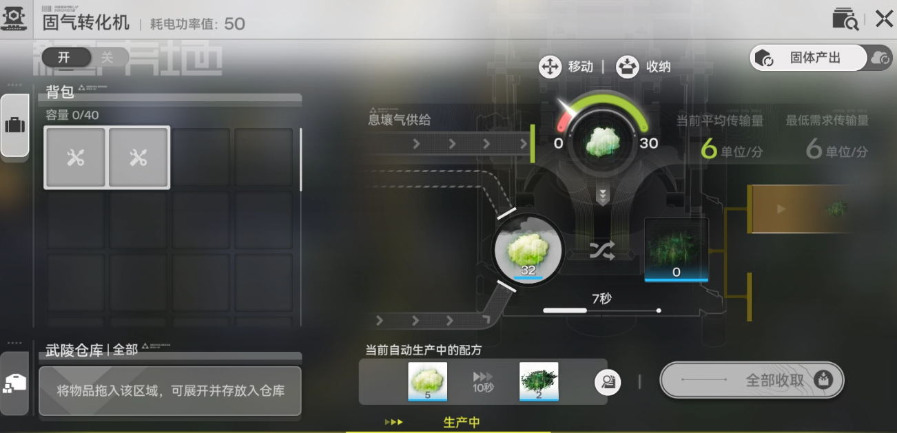
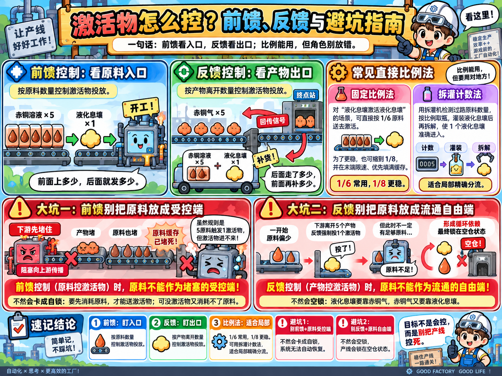

# 3.3 你……你这头白吃息壤的猪！

> 原文：https://docs.qq.com/aio/DTmluZ1diWlpQZldw?p=PiMuthOkzu4i6PbMZSv662　上级：[反应控制与前沿研究](反应控制与前沿研究.md)

在1.4版本中，出现了固气转化机与气液转化机。这两类机器的一个特性是：维持运转（激活）至少需要每分钟输入6的息壤气或液化息壤。即使机器缺原料或者堵满产物，也会照常消耗不误。并且输入的息壤气或液化息壤越多，也消耗越快，最大消耗速度为每分钟30，但是比起每分钟6而言并没有任何性能改进，纯粹在偷吃息壤。

> 其实可以视为一种特殊的供电

相关视频

🔗 [【终末地/基建】1.4葛朗台小技巧，30息壤→25息壤气](https://www.bilibili.com/video/BV1FfNZ62EGW) — 新机器也太搞了，不干活都要一直消耗材料，白吃电量也就算了，还白吃息壤上了。这下还得琢磨琢磨有没有办法减少其他不满速转化机的消耗，感觉有点费劲。  拉了两天产线感觉已经能做好几个葛朗台视频了

🔗 [【终末地/基建】1.4葛朗台小技巧2，酸气环境限速6液化息壤？不不不我只能给1.2](https://www.bilibili.com/video/BV11rKN63EFJ) — 让我看看有多少人第一反应是限速6液化息壤的。。。。。（反正我也是） 唉唉这猪太能偷吃了\[doge\]

经过大家初步探查后发现，实际的机制是进入一个息壤气或液化息壤，机器工作10秒，能够生产5次2秒的配方或者1次10秒的配方。因此，事实上可以将原配方中，如

$$
5息壤+1息壤气（激活） → 5息壤气
$$

$$
10赫铜气+5息壤气+1酸气（激活）→5灼铜气（单核灼铜）
$$

因此，可以通过此类扩展配方，来计算配平时的生产情况，并安排生产方案。

但是！这一方法存在一个问题。如果我们把配方写成如上的形式，其实暗含了一个条件：

<b>任意一种原料缺少，都不会进行反应，其他原料不会消耗</b>

这对于激活用的气体或液体，实际上是不成立的。由于机器特性，无论机器工作与否，激活物都会被消耗。因此，如果我们无法控制此类消耗，实际生产必然会出现大量激活物没有按照配方进行生产，导致结果不正确。

解决这个问题，首先来看简单的路径：我们直接使用限流器给这些机器限制固定消耗（显然，直接限6是最好的，多给又没好处）。在这样处理后，激活物不再按照配方中比例消耗，而是改为<b>定速消耗</b>。在这一情形下，我们仍然能够核算出最终的生产方案，在将这些定速消耗考虑到产线生产中后，机器就退化为了普通机器，此时可以采用前两节的思路方法进行自动配平。

如果我们进一步要求<b>不能有激活物浪费</b>，也就是最大产出的要求，就<b>必须按照原料或产物量</b>来供给激活物。这一条件，在前面两节的自动配平中实际上是可以实现的，但是在这里，一个大问题就是

<b>息壤气/液化息壤激活物不能直接作为受控端</b>

为什么？<b>因为受控端必定阻塞，会导致浪费</b>。那作为自由端行吗？<u>如果只有一个</u>，其实是可以的，表现为其他材料已经装满了，激活物直接限速6，每来一个就能做对应数量的产品。但是，整套流程中有多处使用息壤气、液化息壤激活的转化机，<b>不能把每个都作为自由端</b>，否则息壤如何供给这些自由端是无法确定的，全部供给一个/对半分，都有可能，无法和生产状态匹配。

显然，如果我们确实要在这些复杂产线使用如同前面两节的自动配平手法，这些<u>激活端只能作为受控端</u>。但是，激活端又不能阻塞，如何调和这二者的矛盾呢？我们必须要采取一些手段，依据原料数量或者产物数量，<b>人为地创建新的控制</b>，使得在液化息壤/息壤气到激活端<b>这一路径中途形成阻塞</b>，接下去由原料或产物量来控制接下去放行的激活物。由此<b>从液化息壤/息壤气的视角而言</b>，这些激活端仍然可以作为阻塞的受控端；从而继续应用阻塞生产原理。

就具体控制方式而言，存在<b>前馈</b>与<b>反馈</b>两种形式。用赤铜溶液液气转化为赤铜气。前馈是通过赤铜溶液数量的进入来控制液化息壤数量，而反馈是通过赤铜气的离开数量来控制。形象点的话来说，

<b>前馈</b>：始发站每有五个赤铜溶液上车，就安排一个液化息壤司机发车，到了终点站直接放下五个赤铜气

<b>反馈</b>：车在终点站下了五个赤铜气之后空出来了，这辆车直接被传送回首发站，然后直接让五个赤铜溶液和一个液化息壤司机上来开车

该想法最初提出时，并未采用当前的液气反馈方案，而是以直接控制比例为主，即按物料量比例分配激活物量。这一思路的两个直接体现方案（我、君、智乃等）就是：

1. 对于液化息壤激活液化息壤制息壤气，这种同产物自己激活自己的情况，直接把1/6原料送入即可。有时为了避免相位或分流失败的影响，也会把比例缩小到1/8之类，确保缓存先存满，并在末端限速6，加强可靠性。

2. 使用拆灌机来检测过路的原料数量，然后从中取出对应比例的瓶子，灌装液化息壤再拆解，使得1个液化息壤进入。

此类比例方法，几乎没用用到阻塞特性或局部自适应的方法，从某种意义上来说<u>更接近于按照比例进行精确分流</u>。不过，至少这个方案在局部确实可行。但将其应用于整套产线时，发现了新的问题：

<b>前馈控制（原料控制激活物）时，原料不能作为堵塞的受控端；</b>

<b>同理，反馈控制（产物控制激活物）时，原料不能作为流通的自由端；</b>

为什么呢？首先来看第一条。如果原料作为受控端，<u>其流量最初会超过下游所能承接的量</u>，最终形成阻塞。此时，下游的阻塞源向上游传播，导致产物堵塞，进一步导致原料堵塞。之后，即使下游的阻塞解除，此处的转化机也无法自动恢复：<u>我们的规则是，每上车五个原料，才能上液化息壤；但是原料缓存已经堵满，要想降缓存，只能供应液化息壤让机器激活消耗原料；但是又要先消耗掉原料，才能进五个原料上液化息壤</u>。此时，<b>产线就锁死在了满仓的状态。</b>

再来看第二条。如果原料作为自由端，其流量最初是偏少的，起码不是满速。这一情况下，当下游出去五个产物时，触发反馈，再进入一滴液化息壤。然而，此时无法保证缓存是足够的。由于我们的反馈规则，当有五个产物离开时，就会有一个激活物进入转化机，并不会受到是否有缓存影响，因此最终，就会出现原料不足，液化息壤没有转化出五个产物，从此往后，要液化息壤需要铜气，而铜气需要液化息壤，<b>产线就锁死在了空仓的状态</b>。

当然，目前已经有前后与馈的方案，此处暂且按下不表。

我1.4最大毛产的方案，本质上就是在前两节的自动配平原理基础上，搭配此二条规则所形成的。

由于灼铜是铜的低优先级/自由端，重息壤是铜的高优先级/受控端，因此在铜前往灼铜气、灼铜块的这条路上，<b>铜必须做前馈控制</b>。同理，铜前往重息壤，息壤前往灼铜，并不需要特别控制，因为<b>这些路径上基本不存在液气转化的问题</b>（息壤前往灼铜中途的气化，直接部分包含在后续息壤-重息壤路径中）。而息壤前往重息壤的路径，息壤理论上必须做前馈控制，但是实际上直接做小比例分流即可。

此外，在以下视频中，我还对酸气采用了基于拆灌机的反馈控制的方案。不用前馈的主要原因是，这个产线设计是固定部分的3酸气+自动配平部分的可变酸气，前馈还需要考虑增加固定这部分的酸液供应，而反馈直接检测就行了。

🔗 [【终末地/基建】挑战1.4基建最高的山！按需供料自动配平26.097重息壤14.19灼铜零件](https://www.bilibili.com/video/BV1yp3q6GEK3) — UP最近很忙，做完这个视频又要忙别的去了，游戏里任务都没打，b站评论也都没空看和挨个回复，还请评论区大家多多互帮互助，也欢迎工头来群里讨论1095487306（什么主人的任务（不是）@Xersyo    事实上我并不推荐大家为了产能抄这个自动模块。。太麻烦了，要拉一堆暗管，还要知道哪些是该塞爆的。。我也没空出详细的安装说明和提供售后。但是基本上绝大多数的要点我想都在视频里提到了，这个视频的重点主要是技术分享。  景玉谷蓝图@奶瓶奶盖的奶爸  （不知道发了没） 反向检测供料开发者@卖兔子的小智乃   进行了通宵的超绝大量的分析讨论优化（一个匿名群友）和@樊二のいすぼくろ赛高

后来，言老大就启动了“<b>狂野，震撼亚洲！</b>”计划，和君bear等一起开发了一系列液气反馈自适应装置。值得一提的是，传统比例方案的思想是<b>直接严格依据比例</b>进行调配。而液气反馈自适应，实质上是创造两种比例（例如进5原料进0.5激活物1：0.1，进5原料进1激活物1：0.2），<b>通过阻塞信号切换两种状态</b>，而阻塞信号又受剩余库存量控制，由此形成反馈，最终的结果为稳定的震荡，生产与停工的时间比例<b>自适应地调配出了所需的比例</b>。

须知，此类方法更能体现阻塞生产自动收敛的特点：<b>我们创造两个容易实现的端点，包住我们的目标值，然后我们设法控制两个端点生产状态的转换条件，使得长时间平均下自动收敛到目标值</b>。这一思想也能推广开来，例如类似的[固体反馈/整流](固体反馈_整流.md)，通过自动低档与高档的切换实现爆仓到空仓的大震荡，甚至实现电量的控制等。

液气反馈装置具体的工程实现，可参考[较简单的自适应装置们](较简单的自适应装置们.md)

[3.2 最高的山山？！重息壤AND灼铜](3.2%20最高的山山？！重息壤AND灼铜.md)

言：液气反馈的开发其实也是很有意思的过程，有空我在这个位置写一下简单的发展史，呃这有必要吗鸟老大

kkb：写啊写啊，难道有人要看论文不要看故事吗（

## 液气反馈开发小野（正）史
