# 4.0 从阻塞流理论基石上建起阻塞生产学的大厦（缓更）

> 原文：https://docs.qq.com/aio/DTmluZ1diWlpQZldw?p=SI1crfpBOI1mEcT4TsqTBX　上级：[反应控制与前沿研究](反应控制与前沿研究.md)

### 1 阻塞流理论简要回顾

阻塞流理论[理想系统的流量理论](理想系统的流量理论.md)可谓是终末地工业生产的一块基石。基本上，它只依赖于分流器、汇流器轮询规则，负责描述如果出现分汇流器连接的路径存在阻塞或流通情形，就按照规则跳过轮询，从而正确描述物品分配和传送带的行为。这就是说，只要基于传送带送货这个形式不变，即使优先级，四卡一等被当作bug修复了，这套理论大概率可以一直用下去。

> 传送带堵了当然只能送其他传送带了，你还想咋的，如果yj连这个都改了那老鹰神了

不严格的说，物品能够在传送带和各种物流元件中运输流动，就称为流通状态；而物品如果停着不动了，就称为阻塞状态。一个简单直观的结论是，如果流动路径没有形成环（有向图），即任意物品都不会回过头汇入较上游的位置，那么各条通路基本上都是流通的，至多只会由于相位冲突，以及线路缓存不足形成短暂的阻塞。

下图所示的简单震荡发电，以及更复杂的分流结构都属于此类。

<table>

<tr>

<td valign="top" width="40%">

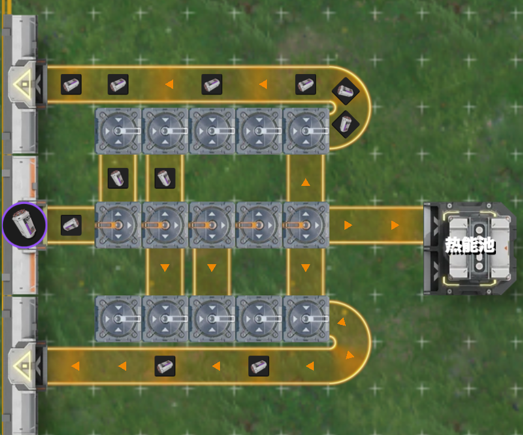

</td>

<td valign="top" width="60%">

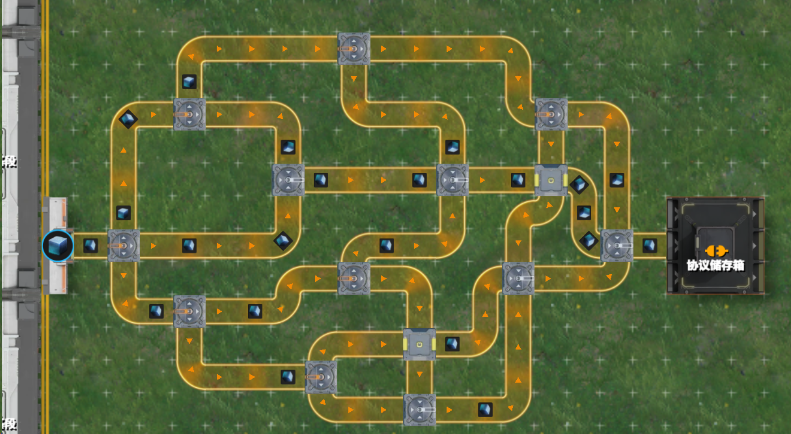

</td>

</tr>

</table>

形成阻塞的一个最简单例子是如左下的二分限流器，部分产物会回流到开头的汇流器，如果全部汇入，中间一小段的流量就会变成传送带速度上限的1.5倍，这当然是不可能的，所以必定会形成某种程度的堵塞。实际上，最终的结果是仓库取货口出货的速度降低到15，中间支路仍然保持30满速，一半分流，最终输出15的速度。

当然，存在回流也不一定会形成阻塞。如右下图所示的2x5分器，六分中一路支流回流，但汇流器处流量为进入15+回流3=18，并不超出传送带运力上限。

<table>

<tr>

<td valign="top" width="53%">

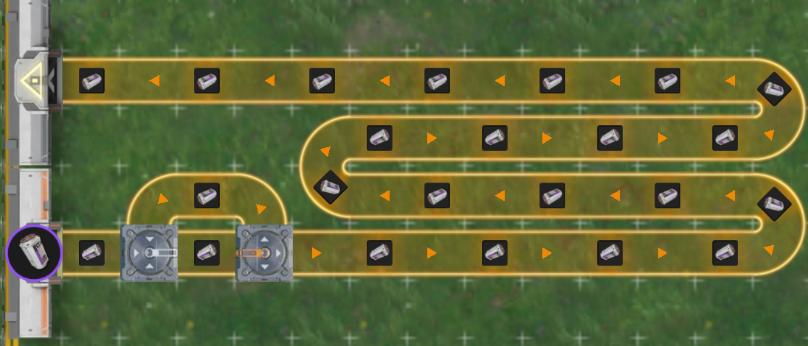

</td>

<td valign="top" width="47%">

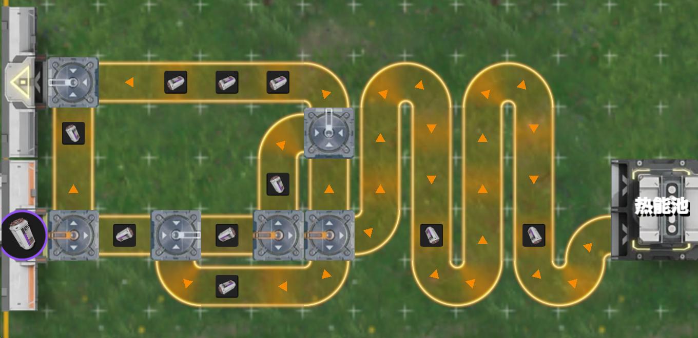

</td>

</tr>

</table>

阻塞流理论所研究的重要问题之一：<b>阻塞图的流量求解</b>，即给定分流器、汇流器与路径连线，计算在给定最大输入和最大输出的条件下，各条内部路径的流量实际是多少。如下图是一个2/5限流器的构造图与求解结果，它省略了实际传送带长度，形状等次要信息，主要表示了分流器与汇流器之间的连接结构。图中红色的线表示相应的连接路径发生阻塞，灰色线则表示没有阻塞。

这一个问题带来的启示是：<b>设计的流量分配 ≠ 实际流量分配</b>。图中的1号分流器，三条出路的流量为2/5，2/5，1/5，其中本应当为1/3流量的路径（指向左下），求解结果为1/5。这是因为5号汇流器接收到的输入量过大，只能阻塞这一条路径，流量降低，降低的流量就被均分到剩余两路，使得另外两路流量提高。这里就体现出<b>发生阻塞的边影响了流量，使得流量发生重新分配</b>。

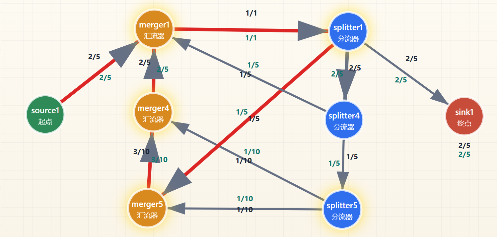

### 2 与阻塞生产学的联系

阻塞流理论主要考虑由于分汇流结构形成的阻塞。而在阻塞生产中，一个显著的区别是出现了<b>机器</b>。绝大部分机器只忠实地执行一个功能：<u>当原料满足要求时，开始生产，把原料转化为产品</u>。

例如下图所示的结构，配件机把紫晶纤维1：1加工成零件，其处理速度也与传送带流速匹配。其唯一的影响只是造成了2秒的加工时延（不过事实上，传送带走三格还需要6秒），其产品在下游物流结构中的表现，与不存在配件机时的紫晶纤维完全一致。<b>对于包含此类简单机器的结构，如果仅作阻塞分析，完全可以沿用阻塞流的理论</b>。

> 未来要是出了一个加工后在传送带上跑的更慢的东西就神了

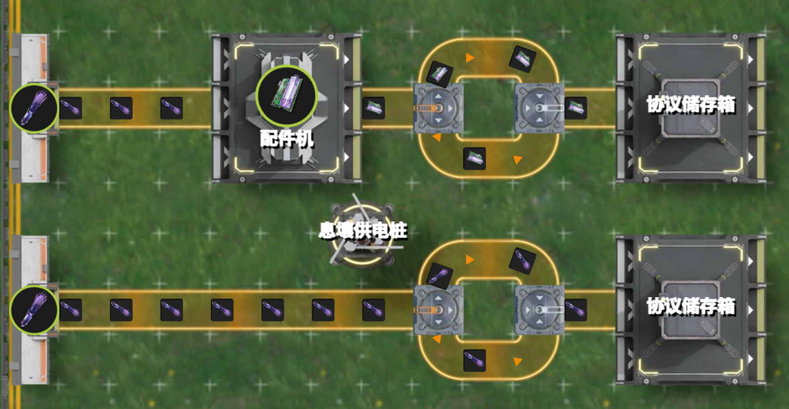

稍微复杂的一些机器，如塑形机，会把<b>进入的原料按1/2的比例做成成品</b>。从阻塞流理论的角度，这属于凭空拿走了一半的路径上的流量。目前阻塞流理论没有处理这种中途流量消失情形的方案，是阻塞生产需要研究的新课题。但是，对于机器下游的物流结构，即使输出流量变为了原来的1/2，某些原本会阻塞的边不再阻塞，也仍然可以用阻塞流理论继续分析。这就需要我们在阻塞流研究中，探讨不同最大输入流量的情况。

如下图所示，30紫晶纤维被做成15紫晶瓶，然后通过一个二分限流器。15紫晶瓶能完全通过限流器，而30紫晶纤维直接进入则只能通过15紫晶纤维。阻塞流理论已经研究的很明白，这种结构当输入超过15时就限制到15，否则就保留输入流量。

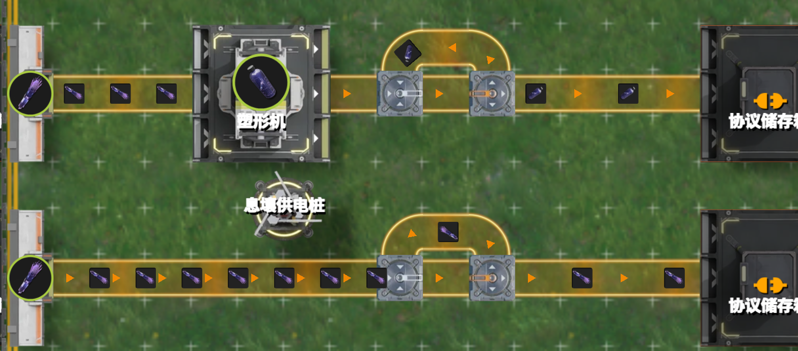

更复杂的情况来源于机器的<b>多原料配方</b>。对于这类机器，如果其中一种原料不足，另一种原料就会发生阻塞。如下图所示，当晶体外壳供应过少时，紫晶纤维就会在机器中阻塞，从而经过分流器溢流到下游。而如果没有机器，紫晶纤维则能够被二分分流而进入下游。此时，在机器产生了新的阻塞，但阻塞形成后流量的分配，则仍然<b>遵循与阻塞流理论类似的规律</b>。

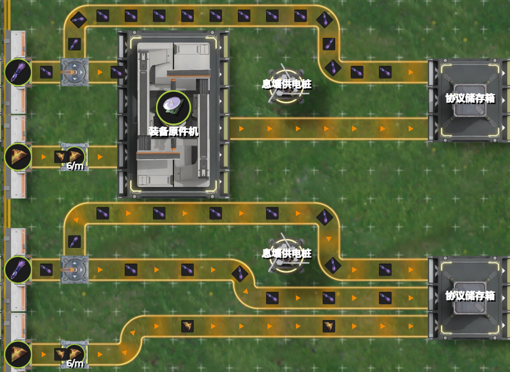

除了这些基本机器外，还有一些机器也具有独特的性质，例如反应池会优先将外入的物料输出，形成透传现象；转化机会偷吃息壤等。一般来说，我们需要总结出这些机器的物流规律，然后看是否适用于相关的阻塞流理论分析。

此外，由于产品加工后一般不会再次加工，在阻塞生产中很少会出现带环的情况。这一定程度上会简化一些分析。

### 3 所关心的共通问题

在阻塞生产原理中，我们经常研究物料在机器缓存或者仓库中，由于某种限制而形成的阻塞。这种阻塞，当然也会借由物流结构形成<b>流量的重分配</b>，从而进一步<b>引起生产的变化</b>。因此，阻塞生产原理的一个研究重点同样是：<b>阻塞生产图流量的求解</b>。此时，求解不仅需要考虑分汇流结构，还需要考虑机器的产速，以及处于瓶颈地位的原料供应。

这里我们直接借用2.5节的图。按照分流器的比例，图中60铜块的3/4用于生产耐压罐，1/4用于生产赤铜瓶。但是，分离芯下游阻塞，只能每分钟消耗22的耐压罐，使得铜块在塑形机中阻塞，<b>多余的流量转向塑形机</b>。沿用2.5节中的记号，<b>铜块流向耐压罐塑形机的设计速率为45-，流向赤铜罐塑形机的设计速率为45+</b>。在平衡型阻塞形成后，前者的实际速率为44，后者为46，这就形成了流量的重分配。

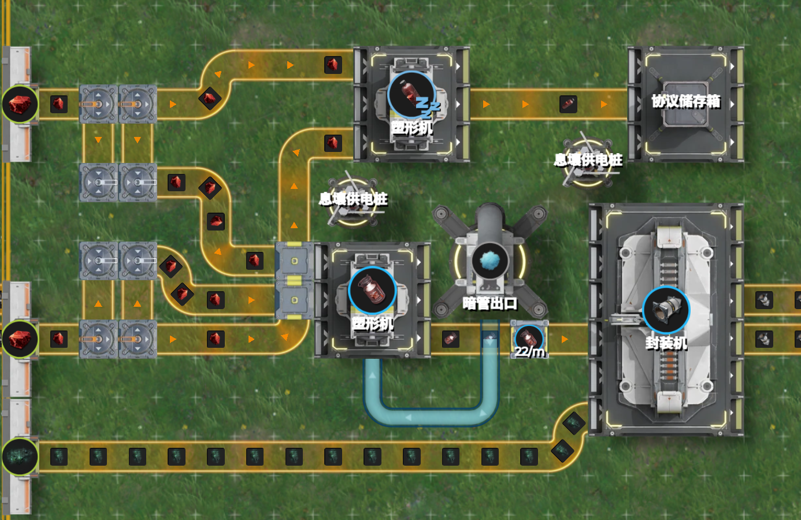

除了达到平衡生产的时的流量与产速计算，还需要讨论是否能够达到平衡，在阻塞图流量求解中，我们发现给定阻塞图，其求解结果并不唯一。不同的初值状态可能演化到不同的结果上，这一现象在游戏中也已经有所发现。

<s>（此处需要补充例子或者引用</s><s>@jnk</s><s>）（我哪来的例子，给定图的输入输出流量就是只有一种啊ww）</s>

<table>

<tr>

<td valign="top" width="50%">

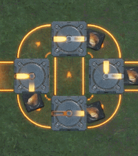

</td>

<td valign="top" width="50%">

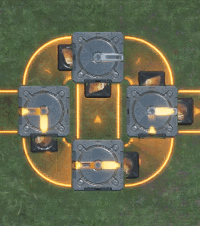

</td>

</tr>

</table>

如图所示，观察左侧分流器，在不同阻塞情况下其会有不同表现，原因在于右侧物流系统中原先已有一些源石。<b>这两个系统的分汇流结构设计是一致的</b>，但是这两个状态，任意一个无法自然演化到另一个状态。

考虑到底层逻辑的相似性，我们需要探讨阻塞生产是否也具有类似的问题。两个比较重要的问题是：<b>给定阻塞生产的规划，是否存在多个可行的流量与生产分配结果，还是具有唯一性？</b>

或者说，我们<b>从空仓状态出发，能否演化到我们希望达到的阻塞生产结果？</b>这个问题直接影响着我们的蓝图是否能够从拍下开始自动达到我们的需求的稳定生产状态。

在[3.1 自动配平思想的萌芽：息壤与源石粉末的爱恨情仇](3.1%20自动配平思想的萌芽：息壤与源石粉末的爱恨情仇.md)一节中，已经发现了当优先级不正确时，产线演化收敛到不同结果的情形。当优先级正确时，虽然目前尚未发现多解的情况，也没有发现无法达到稳定生产的情况，但这件事仍然需要证明。相关的一些讨论，可以见论文。
