# 625挡可调自适应小龙泡泡+重息壤配平玩具

> 原文：https://docs.qq.com/aio/DTmluZ1diWlpQZldw?p=oLIUvr9nC3NoBkw14JZZnw　上级：[「雪凇幽梦」版本](「雪凇幽梦」版本.md)

负责人：kokobird

致谢：压地の神 ssnighter

b站连接占位符

#### 更新记录

up很忙，问题尽量处理

- 26/09/17：发布视频

#### 已知问题

1. <b>96息壤30铜挡位</b>，由于息壤部分中间下部箱子<b>汇入优先级不生效</b>，会每分钟卡掉一两个息壤留在开头的协议箱内。由于12重息壤要求每分钟94.2息壤30铜，所以刚好差一点点12重息壤，产能表上表现为一个小凹槽。不过这样有个好处就是不会多给息壤让息壤全变液化息壤卡在池子里。 
   相邻挡位没有问题，36铜的时候前两路息壤会需要往龙泡泡去一些，增加消耗了；

2. 息壤：铜大于3.14：1时（息壤过量），会短缺分离芯，使得没有重息壤气时，息壤气也会堵塞，漏过去激活固气机（<b>偷吃息壤的猪</b>）。最终输入的息壤比按配方所得的要多，<b>息壤实际输入细表中已经包括此部分数值</b>。具体分析如下。 
   a. 设息壤产量为X，铜产量为T，此时状态铜全部生产T个分离芯消耗T/2的息壤，剩余X-T/2息壤做成息壤气，为（X-T/2）/1.2，其中有2T个息壤气在提纯机中提纯，得到T个重息壤气。多余的息壤气为（X-T/2）/1.2-2T=X/1.2-(5.8/2.4)T。这部分要么全部漏完，要么最大以每分钟6的速度漏过去，也就是息壤气堆积的速度为max(X/1.2-(5.8/2.4)T,6)-6。 
   b. 当X=3.14T时，上式成为max(0.2T-6,0)。由于这里最多生产30/m分离芯，所以表达式总为0。同理，X\>3.14T时，如果X足够大，X/1.2-(5.8/2.4)T-6就是息壤气堆积速度。 
   c. 如果按照原始配方，每T个重息壤气就需要0.2T个息壤气来激活固化。此处，实际用于激活固化的息壤气量为min(X/1.2-(5.8/2.4)T,6)，息壤气消耗修正量为min(X/1.2-(5.8/2.4)T,6)-0.2T，换算成息壤为min(X-2.9T,7.2)-0.24T。同理，当X=3.14T时，表达式为min(0,7.2-0.24T)=0。 
   d. 作为分段表达式，当X-2.9T\>7.2时，修正息壤消耗量为7.2-0.24T。这表明铜很少时，难得有重息壤气生产，但一直有息壤气溢流，其中没被浪费的比例为0.24T。当X-2.9T\<7.2时，修正息壤消耗量为X-3.14T，表明息壤气也没有一直被溢流浪费，只有稍微偏离比例的那部分浪费了。 
   e. 考虑到产能上限，T最多为30，T\>30时，由于息壤充足，重息壤气肯定还是满速了，对应6/m的息壤气消耗限制，没有产生更多浪费。

#### 蓝图码

<b>放完01如果提示要制造设备，要先制造好设备并提交再放02</b>

《明日方舟：终末地》蓝图 \[龙息壤自适应01\]分享码EF01I43EoEE2O9aa5o08 请复制后前往游戏中使用。

《明日方舟：终末地》蓝图 \[龙息壤自适应02\]分享码EF01i1U9e99602oa72U4 请复制后前往游戏中使用。

液气分离式，要自己放一下暗管

《明日方舟：终末地》蓝图 \[小大暗管\]分享码EF01ao6i2E847Aueoe5e 请复制后前往游戏中使用。

《明日方舟：终末地》蓝图 \[三核自适应壤气\]分享码EF01U9eEoI684Ou07Oa8 请复制后前往游戏中使用。

《明日方舟：终末地》蓝图 \[龙息壤本体01\]分享码EF014AE7577Ue3U5E71A 请复制后前往游戏中使用。

《明日方舟：终末地》蓝图 \[龙息壤本体02\]分享码EF01o5u28224E6E1IieO 请复制后前往游戏中使用。

#### 推荐挡位

<b>偏龙泡泡</b>

30息壤+60铜→3龙泡泡+0重息壤

60息壤+120铜→6龙泡泡+0重息壤

<b>两种都生产</b>

60息壤+60铜→2.4龙泡泡+4.5重息壤

78息壤+84铜→3.5龙泡泡+5.5重息壤

90息壤+90铜→3.6龙泡泡+6.8重息壤

120息壤+120铜→4.9龙泡泡+9.1重息壤

150息壤+150（实际148.7）铜→6龙泡泡+11.5重息壤

<b>偏重息壤</b>

90息壤+30铜→0.1龙泡泡+11.4重息壤

96（实际约94）息壤+30铜→0龙泡泡+11.96重息壤

#### 配平情况

液气路线7.85息壤+2.5铜=1重息壤，10息壤+20铜=1息壤龙泡泡

重息壤部分息壤：铜=3.14:1，息壤龙泡泡部分息壤：铜=1：2，因此只要在这个范围内均可以配平

- [x] 插图：7.85息壤+2.5铜=1重息壤，10息壤+20铜=1息壤龙泡泡

- [x] 插图：0-150息壤，0-150铜平面上可以配平消耗的区域示意

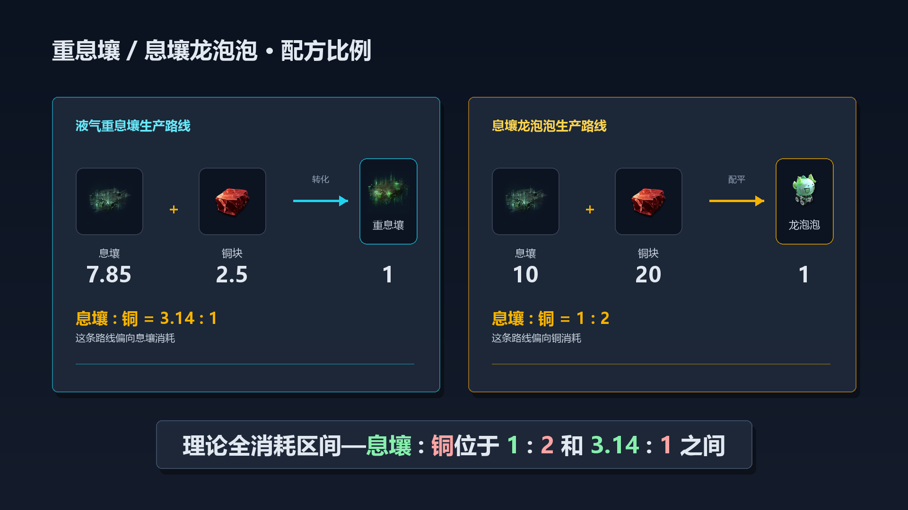

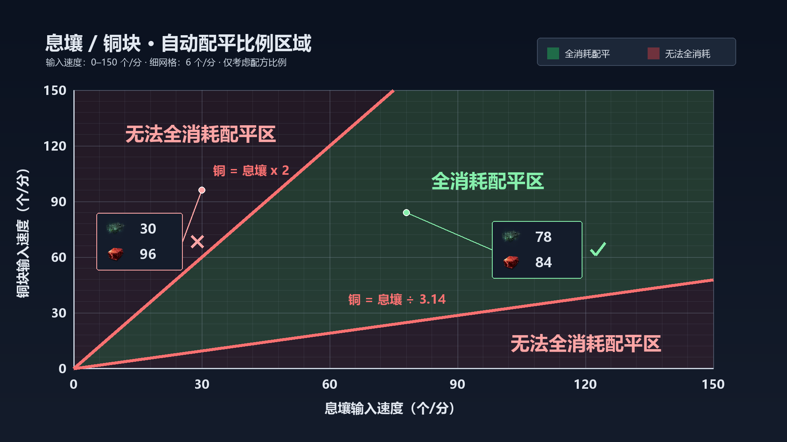

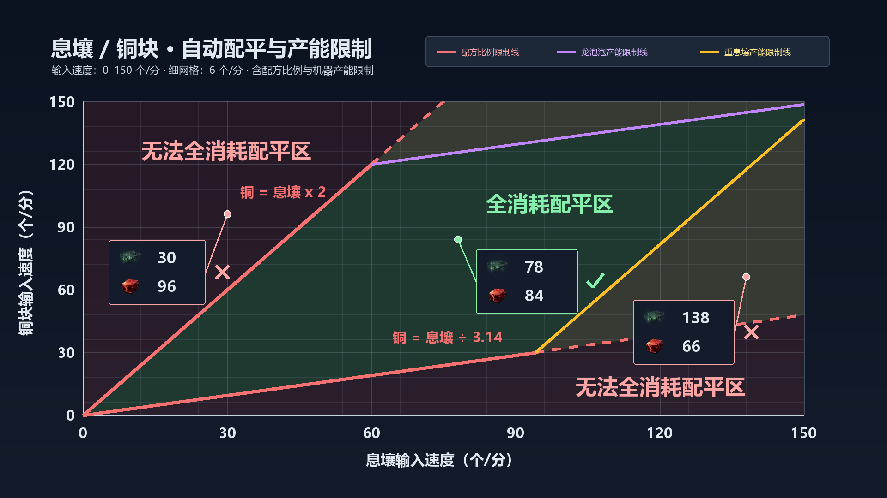

#### 产能粗表

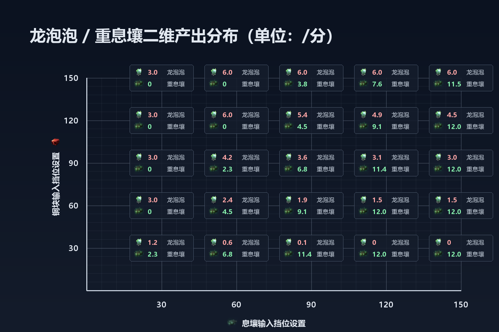

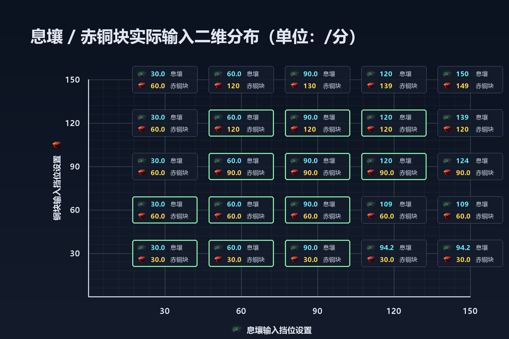

#### 产能细表

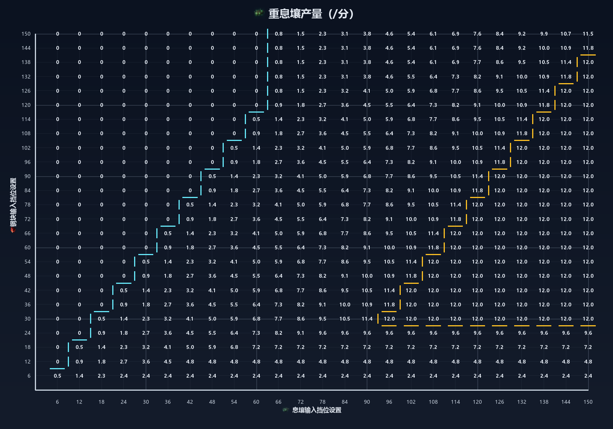

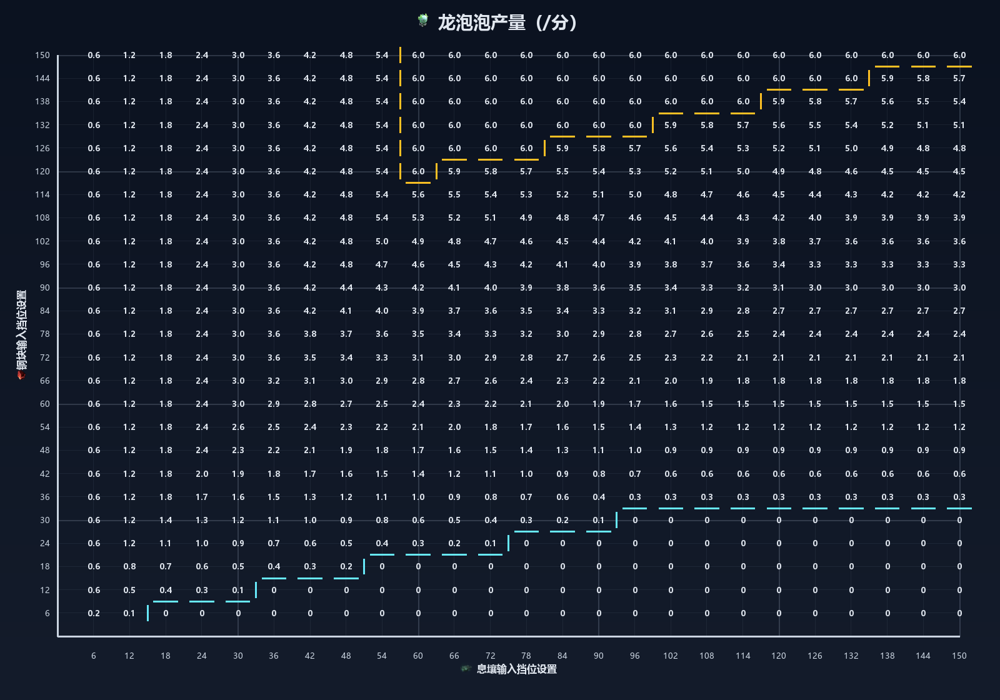

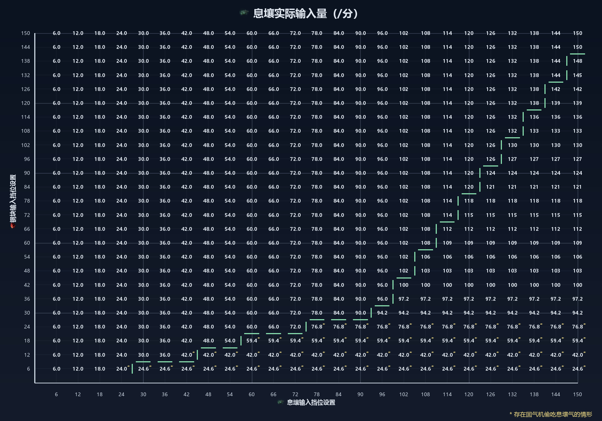

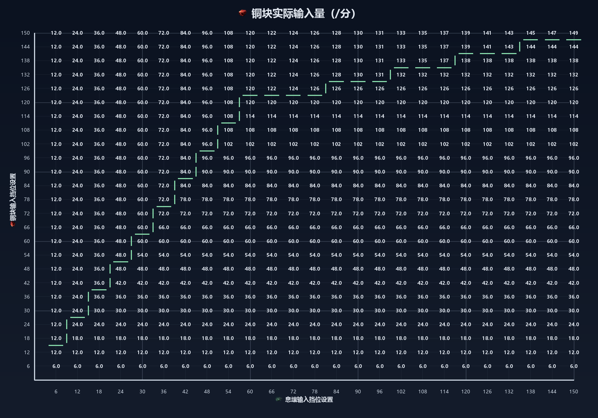

#### 产线图片和优先级图片

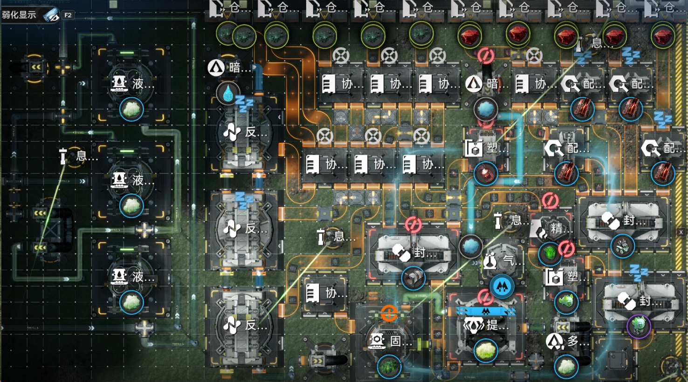

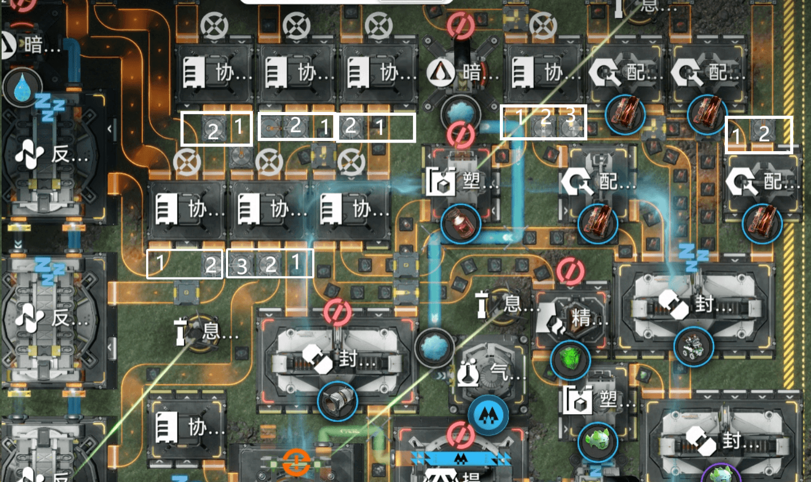

#### 暗管堆积慢的ai漫画

图片

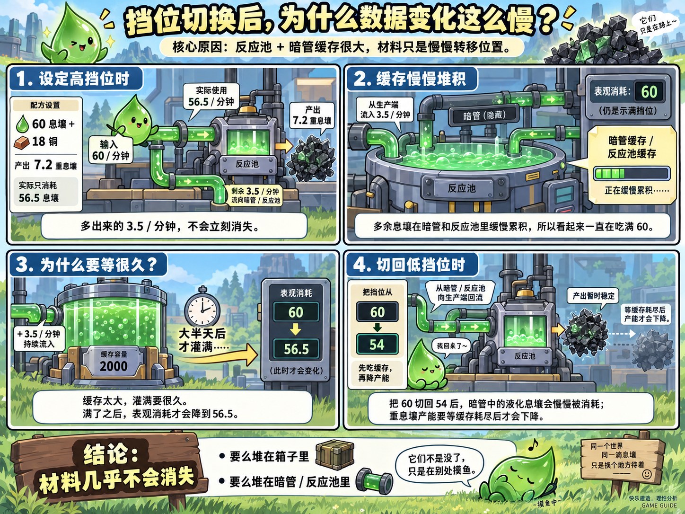

#### 库存堆积情况

只考虑比例：

- 息壤：铜小于1：2（息壤更少铜更多）——息壤无堆积，铜堆积在配件机、骨骼封装机和塑形机-分离芯线中；全部做成龙泡泡

- 息壤：铜正好1：2——铜堆积在塑形机-封装机中，息壤堆积在精炼炉和龙泡泡骨骼封装机中，全部做成龙泡泡

- 息壤：铜大于1：2小于3.14：1——铜堆积塑形机-封装机线，息壤堆积精炼炉、龙泡泡骨骼封装机；下排右侧协议箱，封装机；液化息壤堆积三个液气机，息壤气、重息壤气堆积提纯机、固气机；混合生产龙泡泡和重息壤

- 息壤：铜正好3.14：1——铜堆积塑形机-封装机线，息壤堆积精炼炉、龙泡泡骨骼封装机；下排右侧协议箱，封装机；液化息壤堆积三个液气机，息壤气、重息壤气堆积提纯机、固气机；全部做重息壤

- 息壤：铜\>3.14：1——铜无堆积，息壤堆积精炼炉、龙泡泡骨骼封装机；下排右侧协议箱，封装机；液化息壤堆积三个液气机、反应池、暗管，息壤气堆积提纯机、暗管；全部做重息壤

额外考虑具体绝对流量值：

- 5路无息壤，1-3路息壤流量较大（例如90），铜块流量较少时（例如36），进入下排中间的协议箱流量超过75，会填满该协议箱。反之铜块流量只要大于60中间的箱子很少会满

- 5路有息壤，且总息壤过多时，下排左侧协议箱会堆满息壤

#### 优先级分析

总体优先级：

铜块：分离芯→零件；息壤：实验块/实验骨骼→分离芯→液化息壤

事实上息壤并不一定要先去分离芯和液化息壤。

当仅有一路铜块时，

当有两路以上铜块时，至多仅需有1路铜块进入分离芯，因为最大重息壤速度为1

两路铜块必须连接两个配件机，因为可能出现60铜30息壤全做龙泡泡的情形

当仅有一路息壤时，该路息壤需要去往实验块/实验骨骼→分离芯→液化息壤四个方向

当有两路息壤时，两路息壤均需要去往实验块/实验骨骼→分离芯→液化息壤四个方向。根据铜的情况，实验部分的息壤用量在0-60之间，因此两路均都需要溢流到分离芯、液化息壤。

当有三路息壤时，第三路息壤无需去实验块/骨骼，因为实验部分至多用60。但是第三路息壤需要作为最末优先输入补充前往分离芯，以应对前两路都去实验部分的情况。此外，第三路还需要溢流到反应池。

<s>当有四/五路息壤时，第四/五路息壤直接进入反应池作为补充。</s>

<s>反应池如何分配？只有三路息壤时，铜少时可能出现多于60的息壤溢流到反应池，因此这三路需要连接到三个不同的反应池。有第四路息壤时，应该补充这三路最末优先的反应池，第五路息壤则补充次末优先</s>

<s>实际上第四路次优补入第三路，次优补入次末优先反应池</s>

我投降了，第三路在分离芯溢流后剩余的部分跟四五两路一起扔进箱子C。箱子C首先供应1-3路溢流去不到的反应池，因为只给30铜时会变成1-3路溢流75息壤去两个反应池，此时3路一定在分离芯箱子前溢流到第三个反应池，所以3-5路的箱子只能去这第三个池子作为补充。箱子C其次供应分离芯箱子最末溢流去的反应池，因为铜稍微有一些时可能分离芯箱子还会溢流出满带的息壤去优先的反应池，不能去抢。

#### 流动图

红色线表示某个入口的主流，占比大于50%，相应绿色表示占比不到50%的情形。分离芯由于流量一直不到15所以息壤多的时候经常是绿色，即使其优先级最高

物品进入箱子后的出口其实并非和进入口有对应关系，只是便于理解

息壤多铜几乎没有

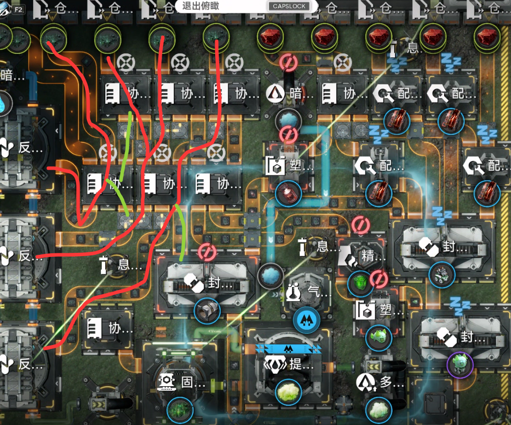

息壤中等铜多

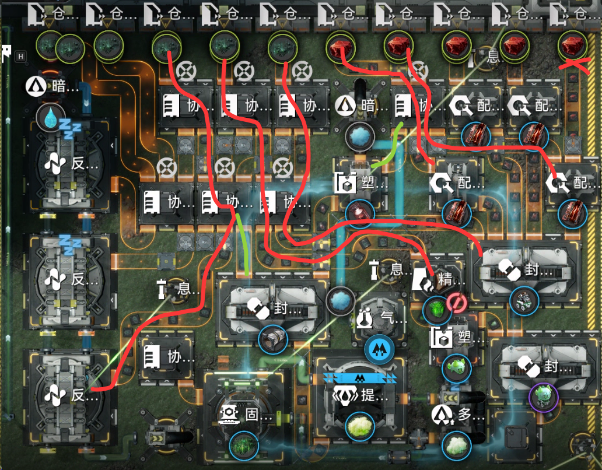

息壤多铜多

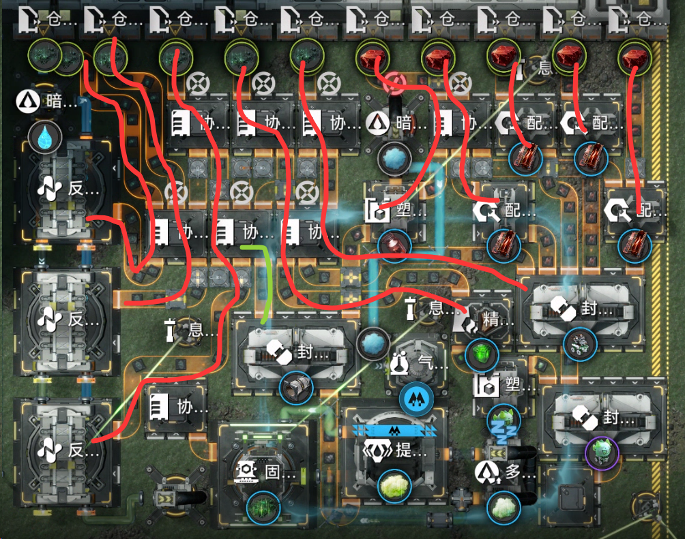

#### 模拟器实验结果

[https://beta.enka.network/endfield/aic/?id=j9B2B8F9t1y1F8](https://beta.enka.network/endfield/aic/?id=j9B2B8F9t1y1F8)

并非游戏内最新版，但差不多了

图

<table>

<tr>

<td valign="top" width="50%">

</td>

<td valign="top" width="50%">

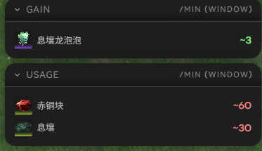

</td>

</tr>

<tr>

<td valign="top" width="50%">

</td>

<td valign="top" width="50%">

</td>

</tr>

<tr>

<td valign="top" width="50%">

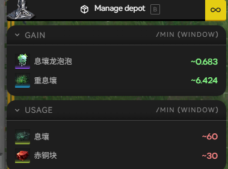

</td>

<td valign="top" width="50%">

</td>

</tr>

<tr>

<td valign="top" width="50%">

</td>

<td valign="top" width="50%">

</td>

</tr>

<tr>

<td valign="top" width="50%">

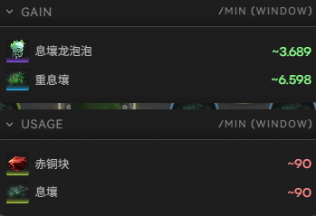

</td>

<td valign="top" width="50%">

</td>

</tr>

</table>

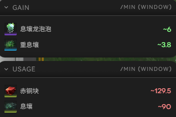

120息壤150铜仍存疑 120息壤60铜/30铜的情况疑似缓存太多填不完

150/120息壤30/60铜当然是一样的

150/150的情况找不出哪里堆积息壤但是少了0.4息壤，可能是模拟程序bug

确定，液化息壤流入管道速度是76.16，息壤气流出是60.97，理论5/6转化率应该是63.47

还是图

<table>

<tr>

<td valign="top" width="50%">

</td>

<td valign="top" width="50%">

</td>

</tr>

<tr>

<td valign="top" width="50%">

</td>

<td valign="top" width="50%">

</td>

</tr>

<tr>

<td valign="top" width="50%">

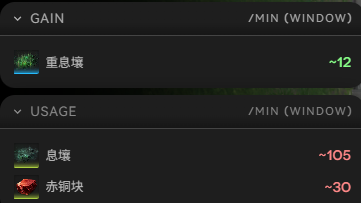

</td>

<td valign="top" width="50%">

</td>

</tr>

<tr>

<td valign="top" width="50%">

</td>

<td valign="top" width="50%">

</td>

</tr>

<tr>

<td valign="top" width="50%">

</td>

<td valign="top" width="50%">

</td>

</tr>

</table>

#### 视频脚本

大家好，这次给大家分享一个息壤跟铜的自动配平小玩具 
这个模块有五个息壤输入口和五个铜块输出口，每个输出口都带有限速器

你可以调节限速器来控制你想要进到这个模块里的息壤和铜块量

如果配比合适，这个小玩具就会自动帮你消耗原料配平成重息壤和龙泡泡。

（具体配比在后面讲）

比如我现在设置是60息壤和120铜，这时候它是全部帮我做成6龙泡泡

如果觉得费铜太多费息壤太少，我们调节一下，变成78息壤和84铜

等上一段时间，它就自动开始混合做重息壤和龙泡泡来消耗息壤和铜了。

总之你们看完安装和注意事项也可以拿去调速玩儿了

那么先来说安装

我们只需要一个连接两个水泵的水暗管

和连接有两个矿点的惰气暗管（若后续查表发现重息壤产量不到11.2一个矿点也行）

然后我们找个空地，拍下蓝图

如果蓝图形状不合适，也可以用评论区中本体和液气模块分离的版本

只需要手动再放一对液化息壤和息壤气暗管即可

放完后再放一下02分汇流器蓝图确保优先级顺序

然后关闭上方的七个箱子，这样就算安装好了

初次启动会比较慢，需要消耗约1000息壤和300铜填充缓存。

然后来讲使用说明

使用规则第一条，息壤和铜不能空仓过度消耗，否则取货口会跑不满速

然后可能就无法达成配平

你可以仓库没有材料，只要设计的消耗量和生产能力匹配就行

使用规则第二条，速度必须中间大两侧小。

举个例子，如果你想要调42的息壤速度，就要拆成30+12

然后让最中间一路开满限速或者直接不限，往外的一路限12

再外侧的三个就直接关闭。

同理，如果要调66的铜速度，就是拆成30+30+6

开中间两路满速，第三路限6，最外两路关闭。

调完速度放着，然后产线逐渐就会开始稳定到配平产出上。

稳定产出是多少呢？这里准备好了配平表给大家直接查。

借着配平表，也说几个产能的注意事项。

首先，并不是所有息壤和铜的挡位组合都能全消耗地配平

受到几方面限制。

息壤龙泡泡的配方是10息壤+20铜=1息壤龙泡泡

息壤和铜的消耗比率是1：2。

另一方面，液气路线的重息壤配方是7.85息壤+2.5铜=1重息壤

息壤和铜的消耗比率是3.14：1

所以只有输入的息壤和铜在这两个比例之间时，才可能全消耗配平

此外，还会受到单核龙泡泡和重息壤产能的限制。

单核龙泡泡最多消耗120铜60息壤，剩下的铜壤就无法正好全配成重息壤。

不过呢，在这些没法全消耗配平的情况

大部分时候表现为输入堵住，输入的速度低于设定的挡位值。

也有些极端条件会出现提纯机缺分离芯，固气机偷吃息壤的情况。

所以除了产出表外，我这里还给出另外两张表

分别是设置的挡位下息壤和铜块的实际消耗量

如果实际消耗量和设置挡位不符，就说明受到某些限制没法全消耗配平。

再顺便说几个注意事项。

第一，不保证龙泡泡一定满速产，你不给材料我又没法给你变出龙泡泡

而且这个产线只管配平，部分铜会用去做分离芯

具体各个挡位配平产出的情况要去查表

回头小龙泡泡产量不够不要来找我

第二，某些无法全消耗的挡位配比，可能达到稳定生产的时间比较久。

主要源于息壤液气部分的暗管缓存比较大。

例如设定为60息壤18铜，这时候生产7.2重息壤，消耗56.5息壤

剩余的每分钟3.5息壤就在反应池和暗管中缓慢累积

因此，表观上息壤消耗会一直是60。

如果缓存容量有2000，就需要将大半天才能累积满缓存，

之后息壤消耗才会降到56.5。

此时再把60息壤切回54，暗管中的液化息壤又会缓慢消耗，

重息壤产能要等到缓存全部耗尽后才会降低。

当然，无论如何材料几乎不会消失 

要么堆在箱子里，要么堆在暗管或者反应池里。

另外好消息是如果你处在铜壤能配平的区间内，

需要填满的库存只有中间的一些协议箱和分离芯的铜路线

响应基本上是很快的

第三，优先级问题，如果优先级莫名其妙损坏会导致配平失效。

具体要检查的点有：

铜箱子优先输出塑形机，次优输入两个配件机

第五路铜次优先进入配件机

两路息壤优先送往龙泡泡产线

两路息壤次优进入箱子，箱子优先输出封装机

次优连接最下方反应池，最后才输出中间反应池

第三路息壤次优进入下排左侧箱子

下排左侧箱子优先进入最上方反应池，次优进入中间反应池

液化息壤优先进入液气机，次优激活

息壤气优先进入提纯机，次优激活

关于这次的原理，简单聊两句

说到底就是交叉溢流，跟息壤和源石粉末配小电没有本质区别

跟重息壤灼铜自动配平也没有区别

甚至在某种抽象结构上和言老大的液气反馈装置也是同质的

不过之前我做产线的时候，经常偷懒用分流器替代优先级

虽然能很方便地达到目标产率，但是并没有很大的自适应范围。

所以这次我就仔细琢磨了一下，发现要想实现如此大范围的自适应

基本上是无法离开优先级。

举个例子来说，如果只有30息壤，给30铜的时候

而如果给60铜，这一路息壤就只能去做龙泡泡

别的地方是一滴都不能漏过去

所以在这里，分流器无法实现这么极端的产线控制

就只能使用优先级来做

最后，希望这个自动配平玩具能给大家在这个无聊的版本增加一些乐趣

对自动配平相关内容感兴趣的朋友

也可以来看看我们的文档整理，以及相关的视频讲解

#### 实际游戏内验证

- [x] 24息壤+36铜 → 1.7龙泡泡+0.9重息壤

- [x] 60息壤+120铜 → 6龙泡泡+0重息壤

- [x] 60息壤+18铜 → 0龙泡泡+7.2重息壤

- [x] 90息壤+30铜 → 0.1龙泡泡+11.4重息壤

- [x] 60息壤+60铜 → 2.4龙泡泡+4.5重息壤

- [x] 78息壤+84铜 → 3.5龙泡泡+5.5重息壤

- [x] 96息壤+30铜 → 0龙泡泡+12重息壤 （存在小问题导致每分钟2息壤卡在外面）

- [x] 138息壤+66铜 → 1.8龙泡泡+12重息壤

- [x] 78息壤+102铜 → 4.6龙泡泡+4.1重息壤

- [x] 90息壤+150铜 → 6龙泡泡+3.8重息壤

- [x] 150息壤+150铜 → 6龙泡泡+11.5重息壤

- [x] 150息壤+120铜 → 4.5龙泡泡+12重息壤
