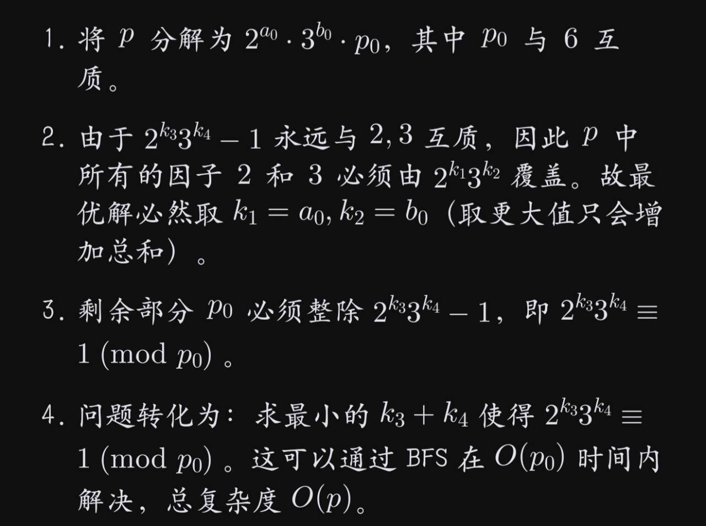

# x=A/(B-1)

> 原文：https://docs.qq.com/aio/DTmluZ1diWlpQZldw?p=zuwPWLseAY9gfuwAmfAjHB　上级：[完美均匀有理数输出器相关理论整理与教科书化](完美均匀有理数输出器相关理论整理与教科书化.md)

对[完美均匀有理数输出器相关理论整理与教科书化](严格均匀有理输出的物流系统.md)中，x=A/(B-1)可生成任意（分母非6的倍数之外的）有理数的补充证明。若分母是6的倍数，仅靠分流就可以生成。所以结合起来可以生成任意有理数。

来自@xyIvneu\_：

由于

$$
\frac pq=x=\frac{A}{B-1}<1
$$

所以$A<B$。又$B=2^n3^m$，仅需

$$
B=2^n3^m \equiv 1 \pmod{q}
$$

就能得到整数A：

$$
A=p \times \frac{B-1}{q}
$$

因为q不是6的倍数，所以由欧拉定理，如果2，q互质，那么

$$
2^{\phi(q)}\equiv 1 \pmod{q}
$$

成立（如果3，q互质就用3）。所以B必然存在，A也必然存在。不过$n+m$的大小意味着操作次数，我们希望过$n+m$越小越好（操作指/2，+1/2，/3，+1/3，+2/3），所以找一个最小的$n+m$即可。

（这里+1/2并非$+\frac 12$，而是$x_{n+1}=\frac{x_n+1}{2}$，并入1条满带后再用箱子2分，其他同理）

给定p/q，我们已经挑选出了一个B，并计算出了整数A，但是为什么A必然能通过这5种操作生成呢？

对于给定的分母的除数序列，这5种操作本质上是带余除法，然后余数构成了二三混合进制，而这就是A本身。具体来说，/2，+1/2，/3，+1/3，+2/3分别代表2进制的0，1和3进制的0，1，2。且每次输出都小于1，因此是合法的。

给定$B=2^n3^m$的除数序列，对任意$A<B$，都存在一个（二三混合进制的）唯一表示，恰好我们的A小于B，因此该方法可以生成任意$0<\frac pq<1$。

例如，

$$
\frac pq =\frac{8}{17}
$$

首先找到一个

$$
B=2\times3^2=18\equiv 1\pmod{17}
$$

分母的一个除数序列为$2，3，3$，且$A=8$，于是将A转化为二三混合进制：

$$
\begin{cases}
8 = 2 \times 4 + 0\\
4 = 3 \times 1 + 1\\
1 = 3 \times 0 + 1
\end{cases}
\quad
A=0\times1+1\times2+1\times6=8
$$

低位到高位依次是$0_{(2)}$，$1_{(3)}$，$1_{(3)}$，所以操作为/2，+1/3，+1/3：

$$
x=\frac{\frac{\frac{x+0}{2}+1}{3}+1}{3}=\frac{\frac{(x+2)}{6}+1}{3}=\frac{(x+2)+6}{18}=\frac{x+8}{18}
$$

于是

$$
x=\frac{A}{B-1}=\frac{8}{17}=\frac pq
$$

除数序列并不固定，我们当然也可以用3，3，2构造：

$$
\begin{cases}
8 = 3 \times 2 + 2\\
2 = 3 \times 0 + 2\\
0 = 2 \times 0 + 0
\end{cases}
\quad
A=2\times1+2\times3+0\times6=8
$$

二三混合进制是$2_{(3)}$，$2_{(3)}$，$0_{(2)}$，操作为+2/3，+2/3，/2：

$$
x=\frac{\frac{\frac{x+2}{3}+2}{3}+0}{2}=\frac{\frac{(x+2)+6}{9}+0}{2}=\frac{x+8}{18}
$$

两者看似一样，实际前者更优，后者两次+2意味着需要4个取货口，所以即便操作次数一样，不同的除数序列之间也有优劣。实际上，如果A含有因子2或3，就尽可能先用/2，/3，直到2，3用完，或分子和2，3互质，再从除数序列中任意挑选2，3来使用。这样算出来的就是最优的。
