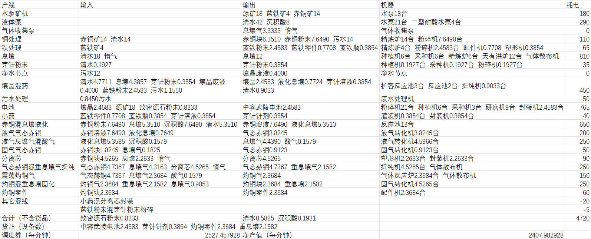
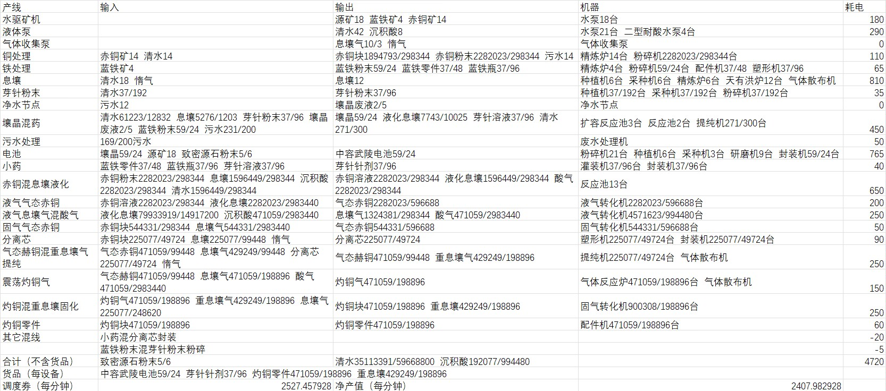

# 「向渊行」版本

> 原文：https://docs.qq.com/aio/DTmluZ1diWlpQZldw?p=boTDvjjajGMZwqYv7p9ws5　上级：[各版本基建生产方案及逻辑与布局实现研究](各版本基建生产方案及逻辑与布局实现研究.md)

毕业矿产

源矿540，蓝铁120，赤铜420，息壤气100，惰气460/min

震荡灼铜气

震荡激活液气/固气

[自适应产线节点元件构造](单个反应池生产壤晶废液.md)

📄 [壤晶产线对接](壤晶产线对接.md)

📄 [小药分离芯混合封装](小药分离芯混合封装.md)

📄 [灼铜混重息壤固化](灼铜混重息壤固化.md)

📄 [1.4自适应最大净产](1.4自适应最大净产.md)

