# 一些理论的应用实例

> 原文：https://docs.qq.com/aio/DTmluZ1diWlpQZldw?p=zV1c50L6fzQlPin20eYPSO　上级：[任务板](任务板.md)

本子页面由@c 编辑并维护

#### 武陵有理均匀发电

理论参考：

[任务板](关于二进制稳流器控电的最低配置功率证明.md)

[BV17tfVBmE8v](https://www.bilibili.com/video/BV17tfVBmE8v/?share_source=copy_web&vd_source=d27eb273314c269c7c5618c1541df911) 
武陵中容电池功率3200W，持续40s，取货口输出物品速度为0.5个/s，所以满带输出的能量为3200\*0.5\*40=64000，由于设备耗电量是5的倍数，不妨设耗电量为5x+200（200是自带发电），因此我们需要的发电比例为

$$
\frac{5x}{64000}=\frac{x}{12800}
$$

注意到12800/25=512=2^9是2的幂次，因此只需构造出$\frac{2^t}{25}$输出比例的物流线，再配合二进制，就能做到任意耗电量（$64000\times\frac{16}{25}$以下）的精确发电。

 
但是为了兼顾均匀性，我们采用

@Cipolla\_设计的 24/25阻塞限流器 + @Edward Kerman设计的 均匀二进制 + 1/3来实现

 
24/25阻塞限流器：

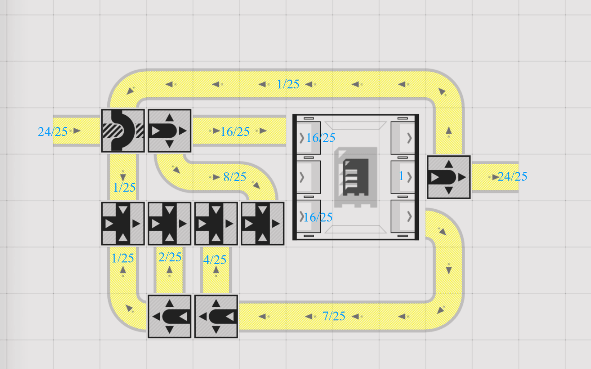

注意：箱子要关闭传输且填满才生效。

此装置存在更优的做法，见下文【4n卡1s】。

均匀二进制:

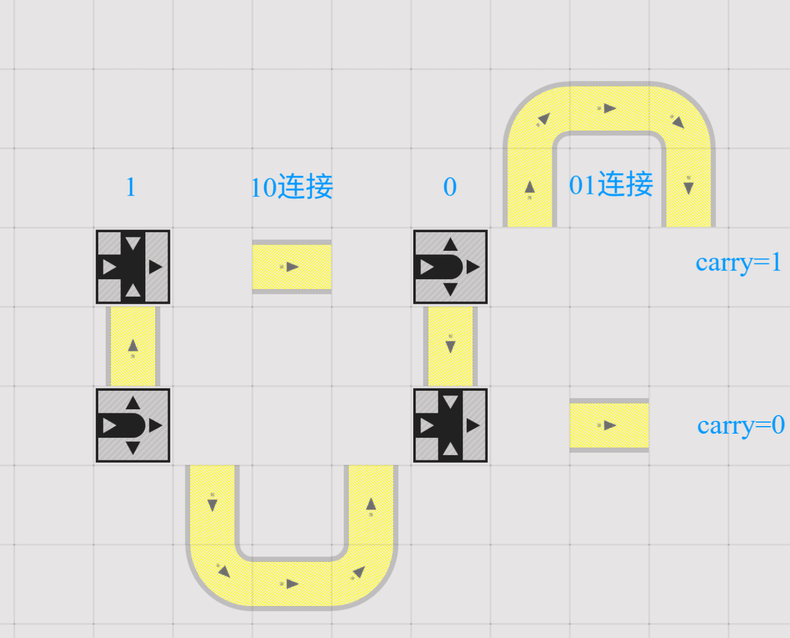

这里参照原视频，以分流器在下作为1，分流器在上作为0（不过也有将两者掉转的做法），此时整个装置是左侧低位，左下角输入，右上角输出，右下角废弃。

连接处传送带这样摆放是为了每一位到下一位距离距离相等，上图中距离皆为6（0、1切换处，低位分流器到高位汇流器的距离）。视频原话：

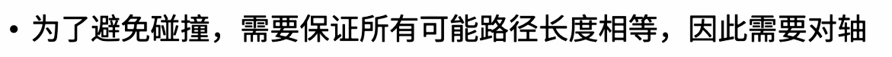

另外，分汇流直连会有bug（产生优先级之类），所以要空开一格

均匀二进制需要构造的比例为

$$
\begin{align*}
\frac{x}{12800}&=\frac{24}{25} \times\text{均匀二进制比例}\times\frac 13\\
\text{均匀二进制比例}&=\frac {x}{2^{12}}\\
\end{align*}
$$

即 x=(耗电量-200)/5 转化为12位二进制。

这里以耗电量5600为例，(5600-200)/5转化为12位二进制是 010000111000。

左侧低位，所以实际的摆放为000,111,0000,1,0

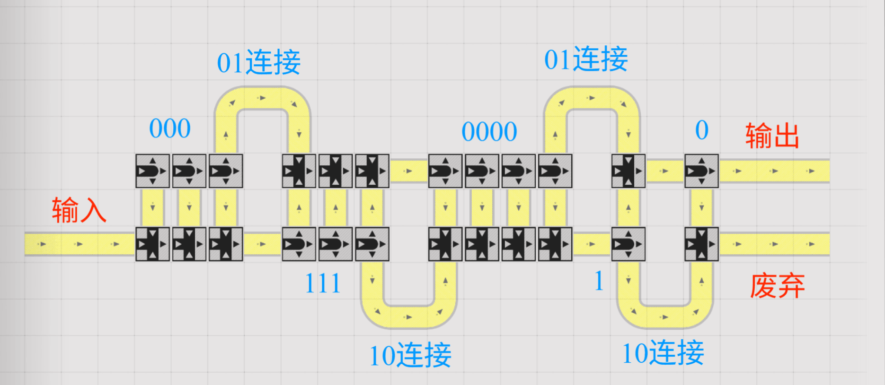

显然左侧的0是无效的，可以直接省略变为111,0000,1,0：

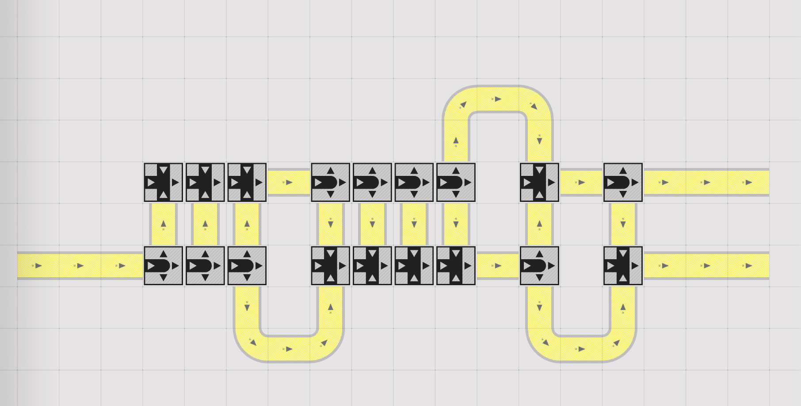

武陵耗电一般不超过两颗电池，再配合1/3：

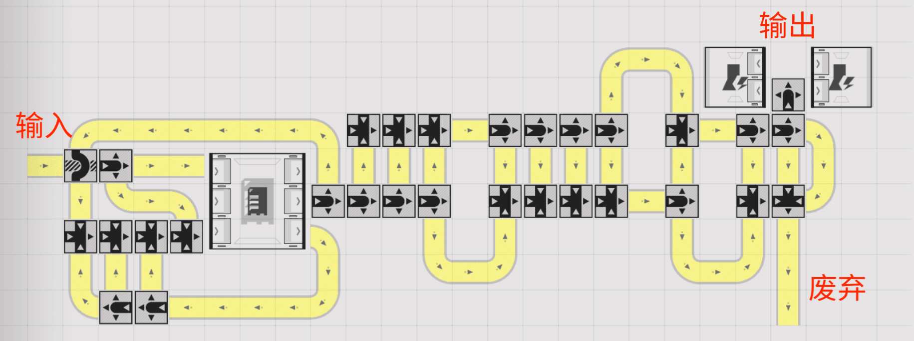

即得有理均匀发电。

此装置极差小于2，已在参考理论中有证明，但支持的最低耗电量为770，支持的最高耗电量为20480，建议整体震荡效果更好。

一些补充：

密度为有理数且满足beatty-1（参见[任务板](四种均匀性的等价关系.md)）的序列，若密度为p/q，则其Cipolla-1时间均匀极差为$1-\frac{1}{p}$（证明见[任务板](完美均匀的理论下界.md)）。

AI的结论：

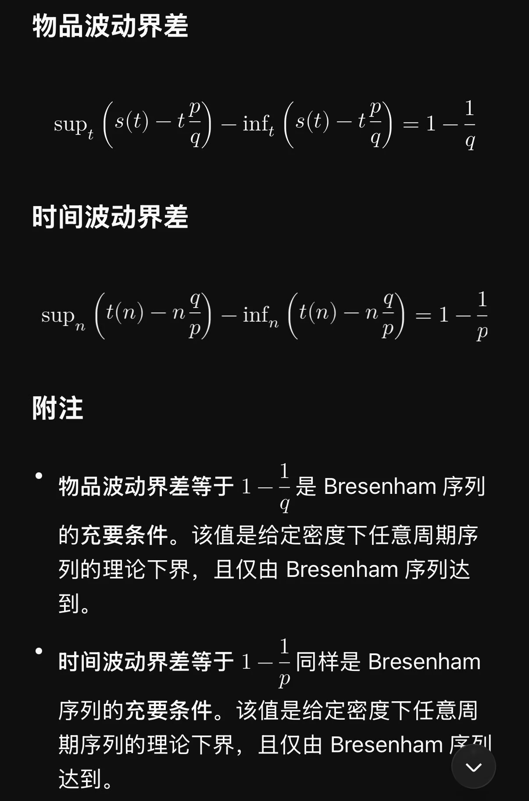

若一个序列作为另一个序列的输入，AI算出来的串联极差为：

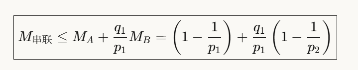

此部分@jnk也有证明：[任务板](串联结构的误差传播.md)

在此例子中，24/25阻塞限流器的密度为$\frac{p_1}{q_1}=\frac{24}{25}$，均匀二进制的密度为$\frac{p_2}{q_2}$

24/25阻塞限流器的极差为

$$
M_A=1-\frac 1{p_1}=\frac{23}{24}
$$

均匀二进制的极差为

$$
M_B=1-\frac 1{p_2}<1
$$

且后接1/3分流不改变均匀性（证明见[任务板](关于二进制稳流器控电的最低配置功率证明.md)，或[任务板](两种beatty-1的等价性.md)基础上的[严格均匀有理输出的物流系统](严格均匀有理输出的物流系统.md)），所以此装置的极差小于2：

$$
M_{\text{串联}}\leq M_A+\frac{25}{24}M_B+0 < \frac{23}{24}+\frac{25}{24}=2
$$

如果两个序列同时进入箱子，再出来两条带，AI算出来的合流（再均分之后的）极差为：

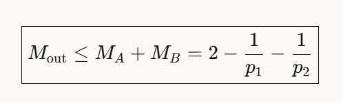

貌似没有具体证明，但姑且认为是对的，也就是说一个严格均匀的序列并上严格均匀的序列出来不一定严格均匀，但严格均匀的序列并上满带出来的必然是均匀（满带绝对均匀，或者[严格均匀有理输出的物流系统](严格均匀有理输出的物流系统.md)中也有证明）。简而言之，严格均匀并上多条绝对均匀，再均分也是严格均匀。

另外，若二进制最右侧是1，连接1/3时最好也要保持相同距离：

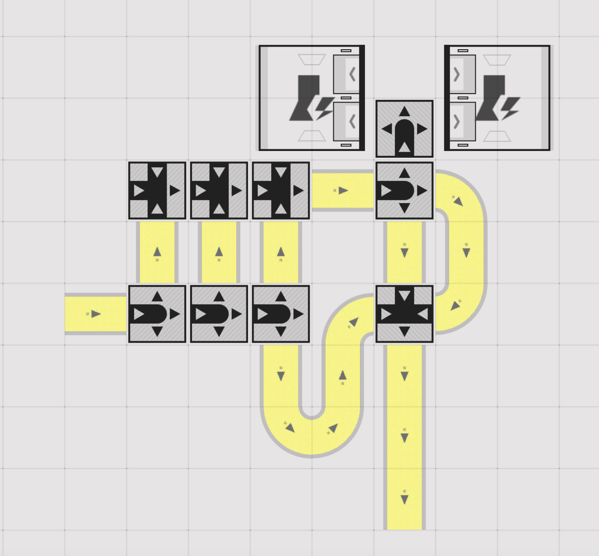

在均匀二进制前接半速输入可以允许分流汇流直连，但均匀二进制的极差会翻倍，缺点是不够均匀，优点是占地小一些（貌似也没有很小）：

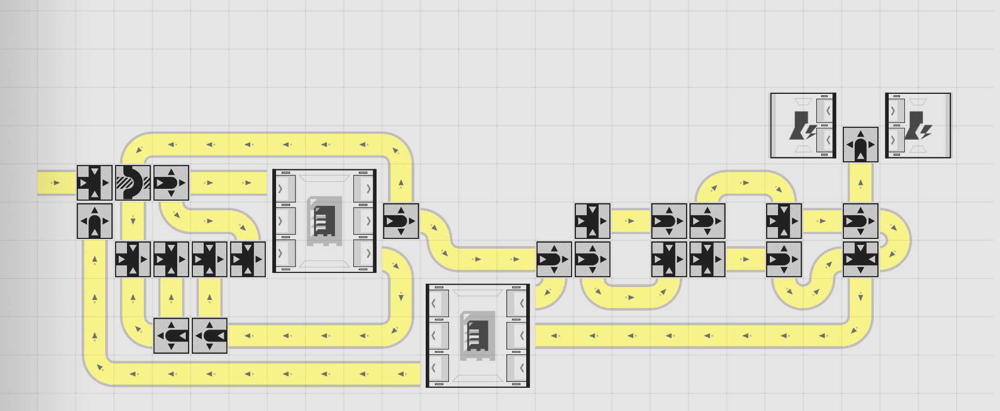

这里废弃部分用了优先级回流入口，要是半速输入的话记得二进制的比例要翻倍。

谷地，我的耗电量为4620，自带发电200，多余20源矿发电为133.333，仍需4286.667。

此装置发电量约为4286.6678，0 0 1 1 0 0 0 1 1 1 1 0 0 0 0 1 1 0 0 1 1

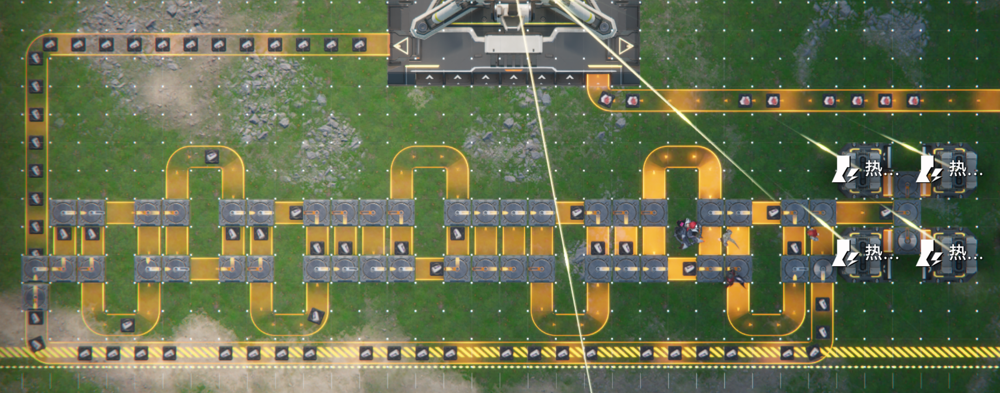

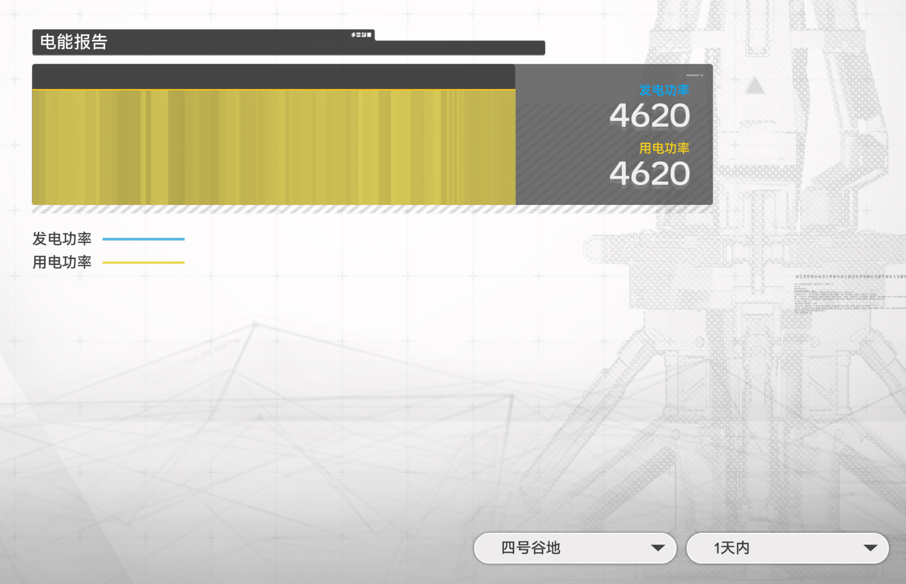

#### 4n卡1s

理论参考：[任务板](迟滞输出现象%284n物品卡半格%29整理与原理探究.md)

经@jnk的提醒，$n=3$时有

$$
\frac pq= \frac{4n}{4n+0.5}=\frac{12}{12.5}=\frac{24}{25}
$$

可以替代24/25阻塞限流，并且更加均匀（在占地和元件数上是大优）。

Cipolla-1时间均匀极差为$0.5\times(1-\frac{1}{12})=\frac{11}{24}$

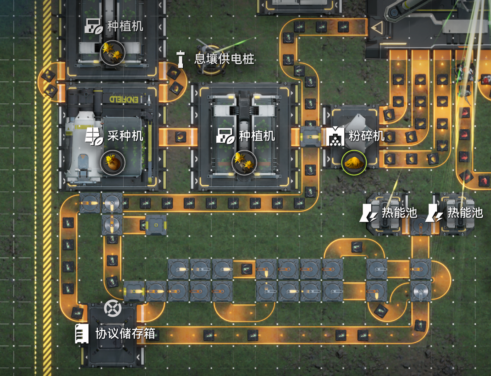

串联后极差$M_{\text{串联}}<\frac{11}{24}+\frac{25}{24}=1.5$。上图发电5400，加上自带200：

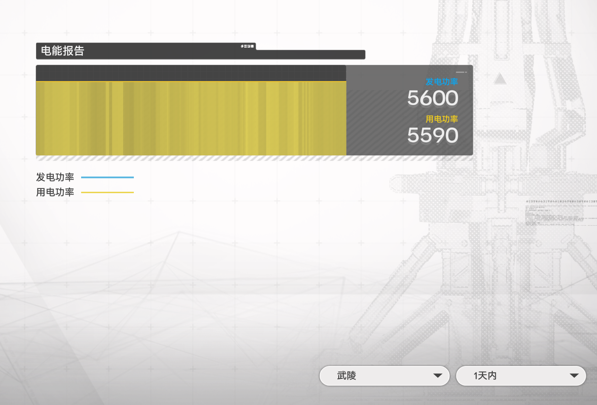

另外，此特性可以联合均匀二进制或其他方法，构造出更多较为均匀（极差小于2）的有理数。

#### 阻塞流计算

理论参考：[任务板](阻塞_轮询输入输出流量理论.md)

貌似还没有通用的方法，这里只给出特定结构的通项：

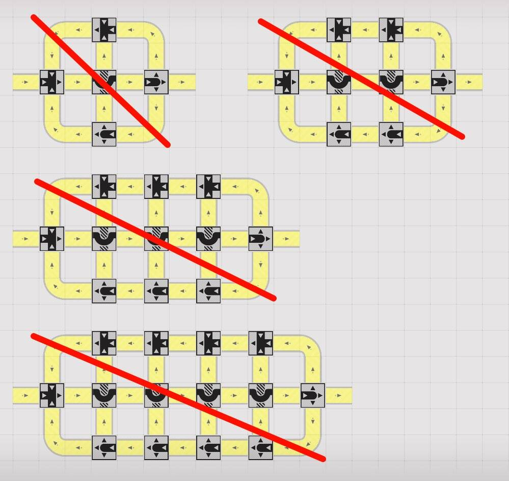

一对分流器-汇流器记作1，上图n分别为1，2，3，4，其输出x为：

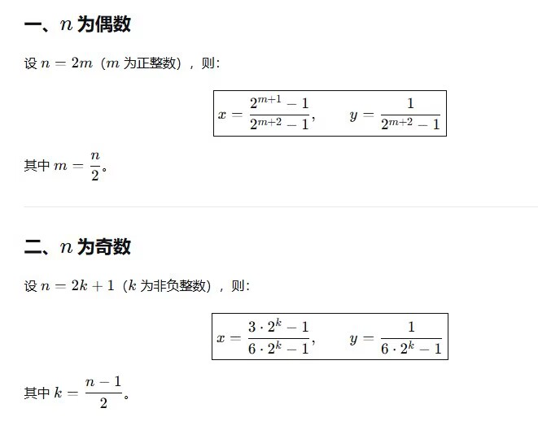

计算思路来自@苍孤狼，原理是汇流器接受的输入中存在阻塞的话，那么非阻塞带流量小于阻塞带流量，设x慢慢推出矛盾。此结构由于对称性，在n为偶数时左半通，右半堵，在n为奇数时最中间恰好为通（最中间汇流器两个输入相等，最中间分流器两个输出相等），其余左半通右半堵。在这里通/堵指的是中间的n条传送带。

貌似@Orirock还有个无需提前知道通阻，一步到位算出来的方法：[https://docs.qq.com/doc/DZW5GRmJDQXZDVUtm](../外链文档/分流.md)，但是我还没看懂（

这是具体值：

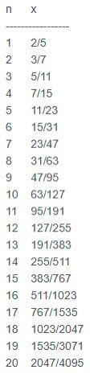

另外[任务板](阻塞_轮询输入输出流量理论.md)中，n=1时两种结构完全等价（图同构？），输出为2/5：

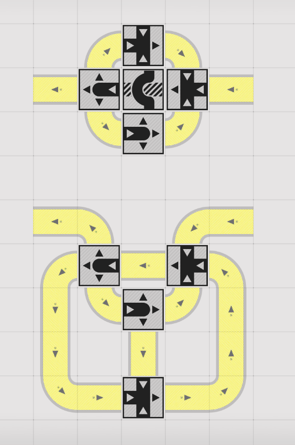

@苍孤狼还提出了一种分流汇流不同连接顺序的结构：

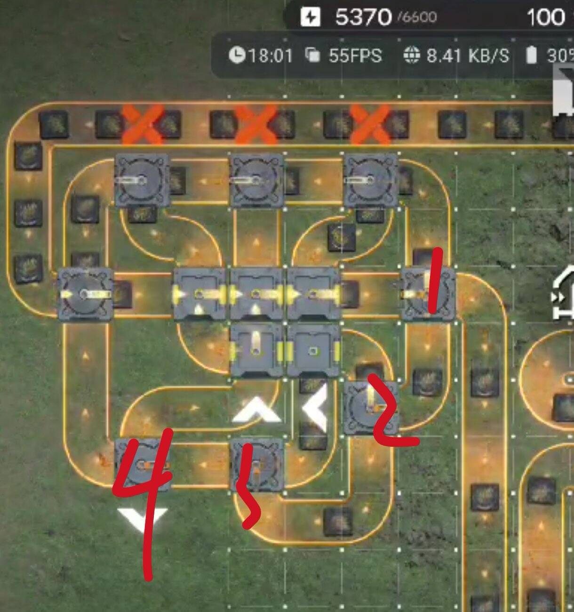

判断复杂度O(n)？，貌似实用性很低，还没什么人研究

#### 阻尼理论

理论参考：[任务板](阻尼理论与其修正和扩展（优先输出）.md)

常用于溢流器，水管与传动带都符合该理论。

下面是一个计算示范：

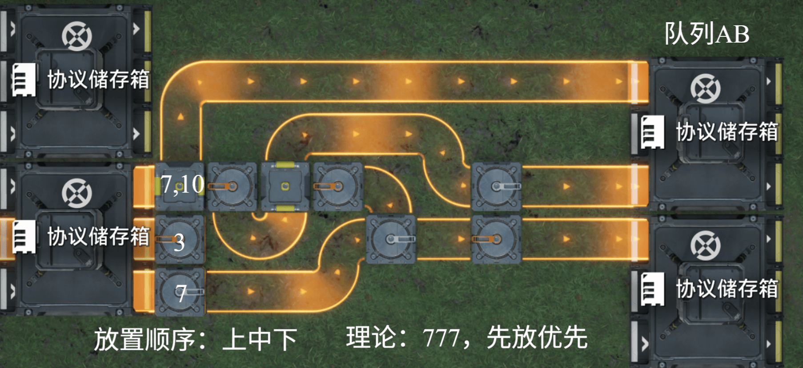

右上箱子为A，右下箱子为B，右上箱子先放，按照理论，箱子队列为AB，左侧箱子三个出口的物流器放置顺序为上中下。

先按照A计算所有可能的阻尼（按照理论来说的话工厂入口还要+1，这里没有断尾所以忽略）：首先得到物流桥所属物流线阻尼为7，10（有两条），分流器所属物流线阻尼为3，汇流器所属物流线阻尼为7。

由于左侧三个物流线入口都算过了，所以B不用再算

同一个物流线入口取小，再加上非汇流器开头共享最大阻尼，所以从上往下阻尼为7，7，7。

由于物流桥先放，先放优先，因此物流桥和分流器轮询输出，若是汇流器先放，则汇流器优先输出。

简单溢流器：

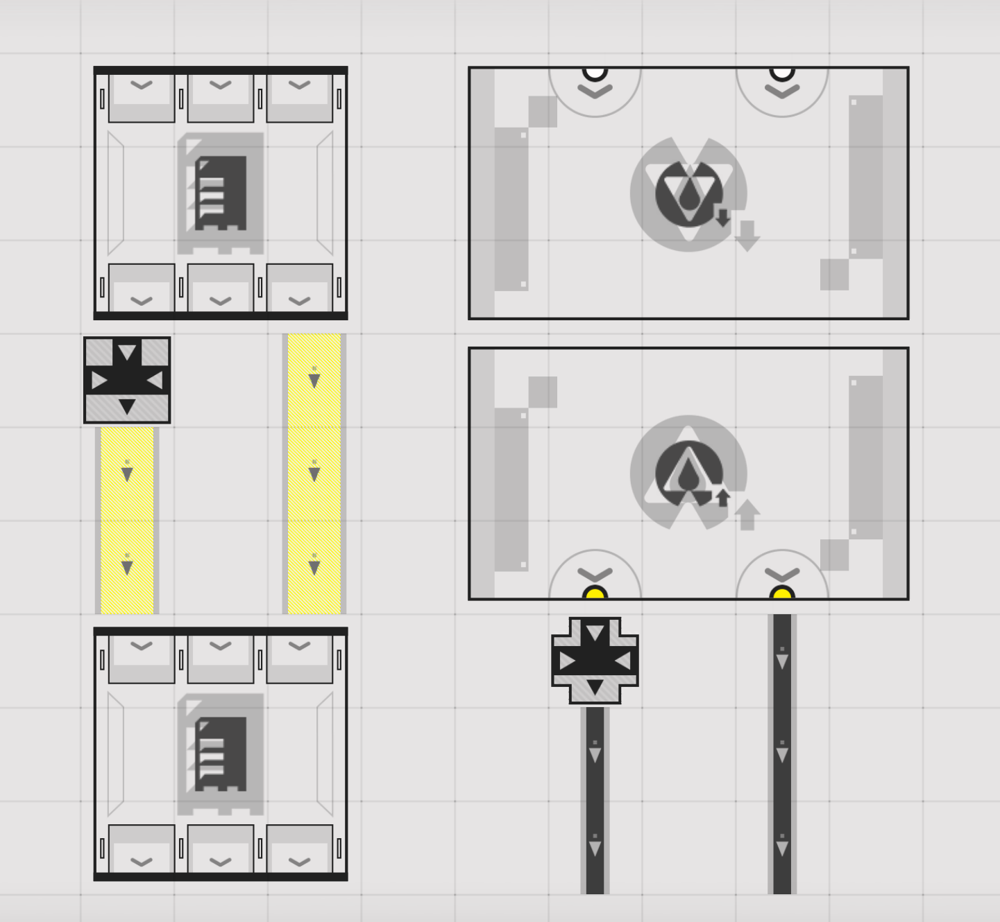

左边是箱子，右边是双口暗管。右边阻尼小，右边先出。

#### 浮动货组价格规律

理论参考：

[BV1zgRAByECH](https://www.bilibili.com/video/BV1zgRAByECH/?share_source=copy_web&vd_source=d27eb273314c269c7c5618c1541df911)

[任务板](调度物资价格规则视频制作（视频已发布）.md)

[任务板](调度物资价格规则探究（未完成但视频已发布）.md)

先说结论：每个人的每种货组每周价格仅有8种可能（影子数据除外）

首先通过相关性分析，发现上周价格与下周相关性很强。

于是画出本周价格与下周价格的关系图：

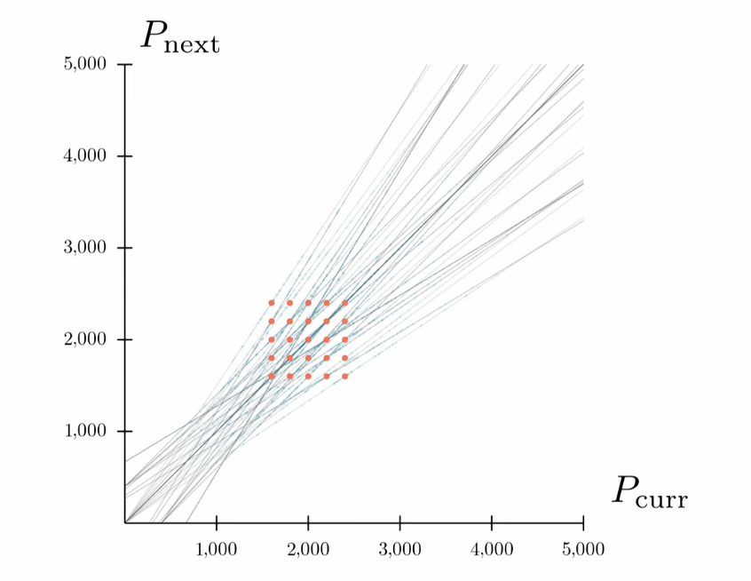

此图横坐标是本周一价格，纵坐标是下周一价格，由@xyIvneu\_的惊人注意力发现此散点图构成若干直线，并穿过25个格点，且格点横纵坐标全是整百数（1600到2400）。

将过原点的直线改写后，发现直线与相对偏差有关：

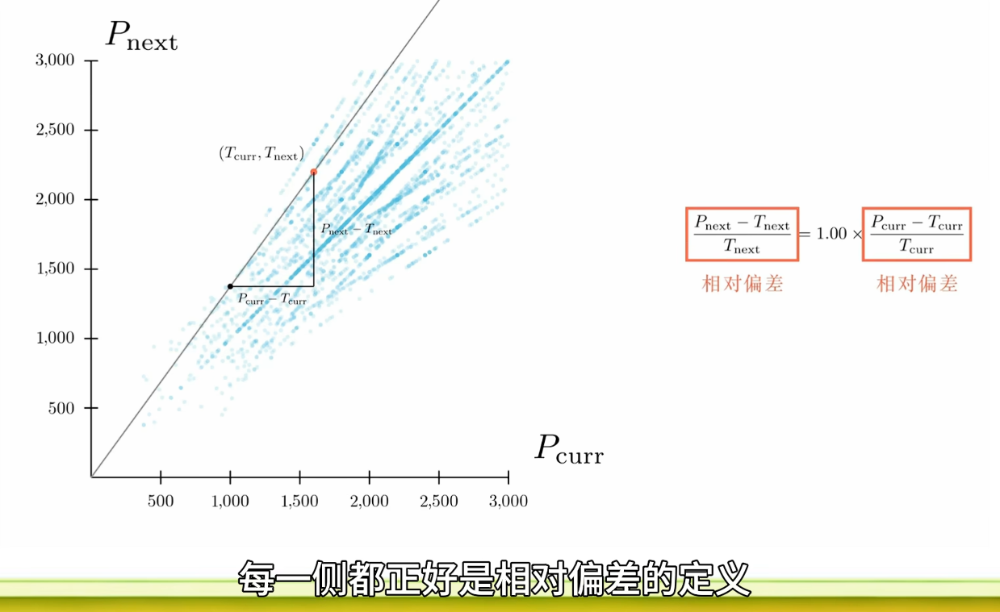

其中T指格点坐标。而不过原点的直线也可以用相对偏差比来定义：

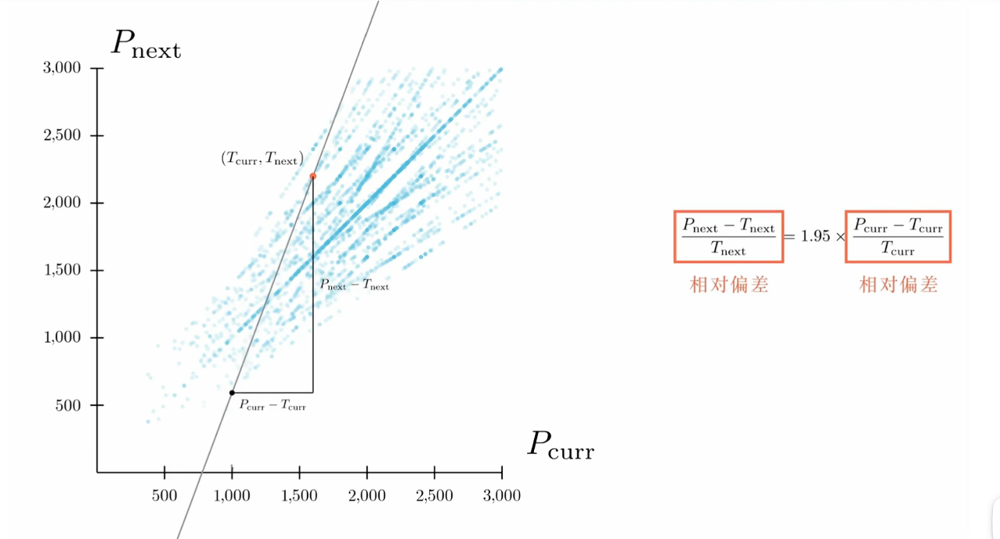

过同一格点的不同的直线之间，斜率比正好是一些简单整数比：

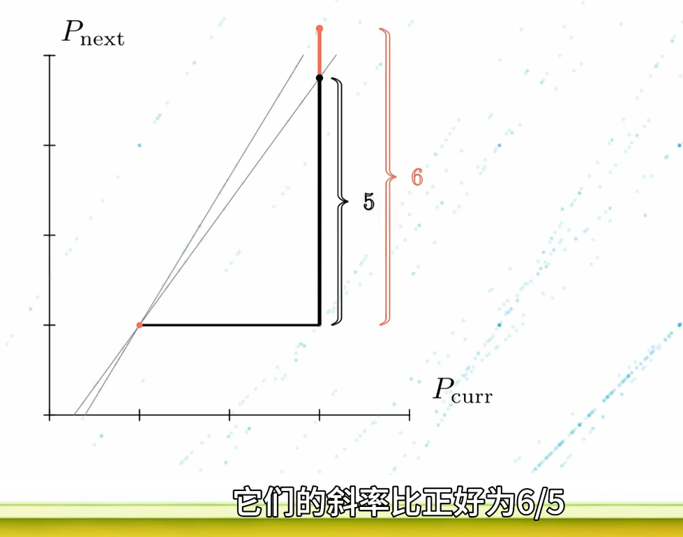

而这斜率比正是相对偏差比。统计整理后发现，相对偏差比都可由4，5，6生成：

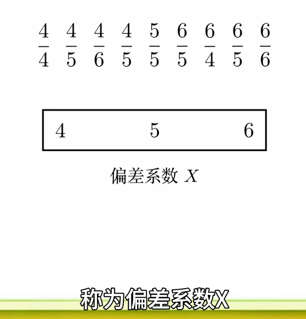

4，5，6被称作偏差系数。于是只要有格点坐标以及相对偏差比以及本周价格，就可以算出下周价格：

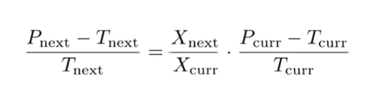

进一步变量分离得到标准化相对偏差的定义：

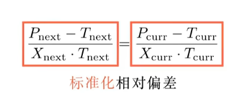

标准化相对偏差仅由玩家和物品决定。

周二到周日也类似，格点位置整百，偏差系数4，5，6，只有格点位置有变化。于是对于一周七天的价格，都可以用7个格点价格和7个偏差系数来描述。

统计发现，一周七天的偏差系数相同，且格点价格与偏差系数的组合有且仅有8种，我们将7个格点价格与偏差系数结合，称其为模板：

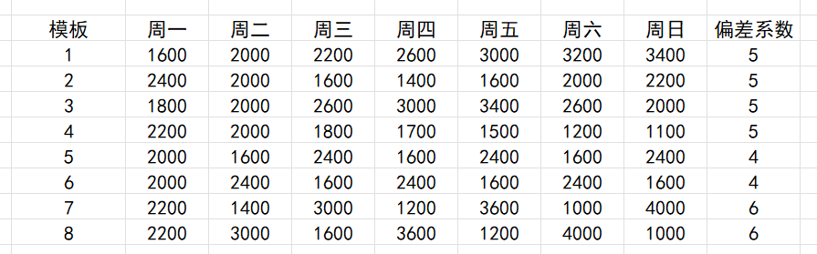

刚才说过，标准化相对偏差仅由玩家和物品决定，于是对同一种物品，可以得到标准化相对偏差向量：

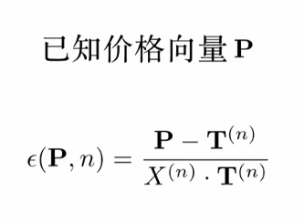

其中T是格点坐标，X是偏差系数，模板有8种，因此我们可以用本周价格计算出8个标准化相对偏差向量。但其中只有一个是正确的。将正确的标准化相对偏差向量代入8种模板，可以计算出8个价格向量：

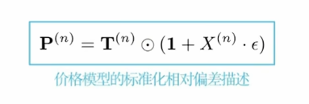

物品每周价格就是8种情况之一。

例：某玩家的武陵\_岳研避瘴茶货组三周价格如下：

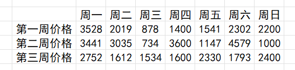

用第一周数据计算标准化相对偏差向量。给定模板n，公式为

$$
\text{模板n对应的周i标准化相对偏差}=\frac{\text{本周i价格}-\text{周i格点坐标}}{\text{偏差系数}\times\text{周i格点坐标}}
$$

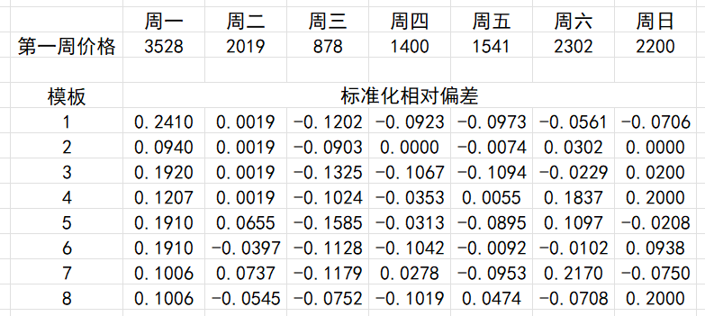

这里是用第一周价格和8种模板计算出来的标准化相对偏差向量。但其中只有一个正确。我们还不知道是哪个，所以需要验证。

下面将【模板n计算出来的标准化相对偏差向量】称作【标准化相对偏差向量\_n】

有了标准化相对偏差向量，利用本周价格和模板可以计算出下周价格。给定模板n，公式为

$$
\text{模板n对应的下周i价格}=\text{周i格点坐标}\times(1+\text{偏差系数}\times\text{周i标准化相对偏差})
$$

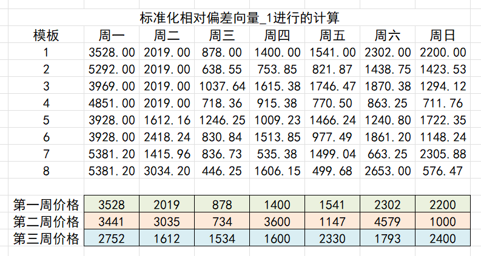

这里是用标准化相对偏差向量\_1算出来的下周价格预测值，显然与实际值不符，因此标准化相对偏差向量\_1是错误的，接下来再用标准化相对偏差向量\_2进行计算下周价格预测值：

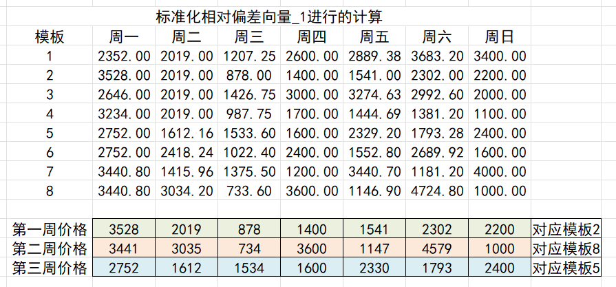

可以看出，三周价格都有对应，因此我们知道了标准化相对偏差向量\_2是正确的，从此以后每周价格有且仅有这8种，只要知道下周前几天的数据，就能预测出一整周的数据。

此外，存在一些因为偏离值太大不符合模板的数据，被称作影子数据，此处不做讨论。

#### 闰年规则

理论参考：[任务板](完美均匀有理数输出器相关理论整理与教科书化.md)

没看懂，待群友补充（
