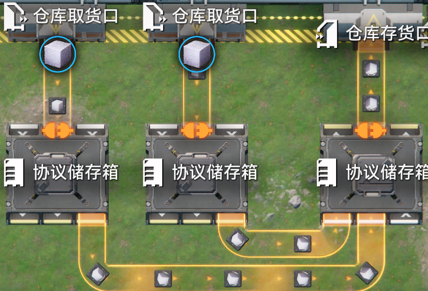
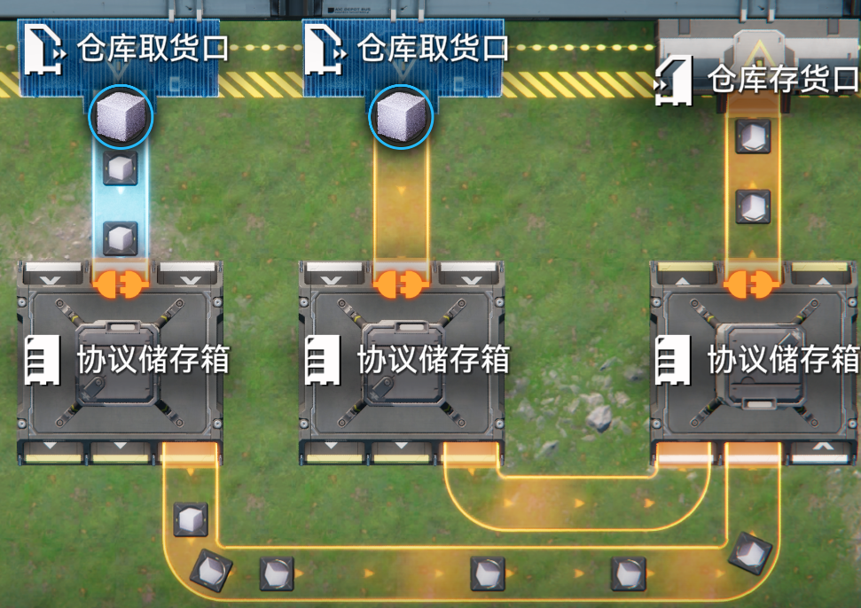

# 仓库相关优先级现象

> 原文：https://docs.qq.com/aio/DTmluZ1diWlpQZldw?p=pgnaI2HtL8UdrJqoloJQvA　上级：[异常物流现象研究及底层逻辑推测](异常物流现象研究及底层逻辑推测.md)

<table>

<tr>

<td valign="top" width="50%">

</td>

<td valign="top" width="50%">

</td>

</tr>

</table>

该结构中，将两个仓库取货口AB与其中一个A连接的传送带重放，会使得A优先，存货口疑似必要。

单独重放存货口可能使其进入低优先状态，但是无法稳定达到，无法确定结果与所需次数。

经测试，该现象几乎总是会在下线后被修正，通常可以忽略，然而无法稳定，甚至有时下线反而会引发该问题

仓库存货口存在与反应池相同的优先输入现象，具体为先连接先输入，此外协议核心亦有相同现象，不确定反应池是否有类似现象
