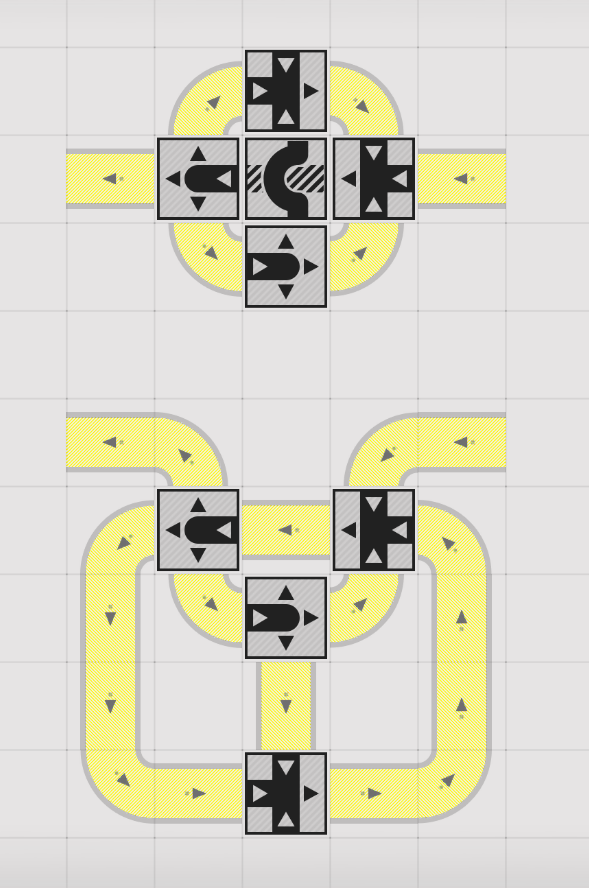

# 以理想系统限流器为核心的阻塞流研究

> 原文：https://docs.qq.com/aio/DTmluZ1diWlpQZldw?p=1kjqZ2UDFnqzhG8DpI00Pt　上级：[旧页面](旧页面.md)

以下是一个例子：

相关解释

聊天记录

xyIvneu\_(1526885897) 2026/5/9 12:47:38

这还挺清晰的吧

xyIvneu\_(1526885897) 2026/5/9 12:47:49

3带空的时候45轮询

xyIvneu\_(1526885897) 2026/5/9 12:47:59

3带的占空比是1/2

xyIvneu\_(1526885897) 2026/5/9 12:50:20

这个东西其实感觉还有发展的潜力的

xyIvneu\_(1526885897) 2026/5/9 12:51:06

因为他是定速和分流比不同的一个物件

xyIvneu\_(1526885897) 2026/5/9 12:51:14

相当于有点非线性的意思

苍孤狼(1208613094) 2026/5/9 12:52:46

(\*^▽^\*)

@(\*^▽^\*) 3号位置必须是1格

苍孤狼(1208613094) 2026/5/9 12:53:19

这样才能发货挥阻塞的作用吗

Cipolla\_(2366523929) 2026/5/9 12:53:33

这东西之前早就讨论过了

(\*^▽^\*)(844089440) 2026/5/9 12:53:38

假设2秒为1单位时间

那单位时间内

1流量是1个

2\.6.7三个口流量是均分1/3，即每6单位时间各走2份

但是实际上由于暖机完成后4口会堵死，7口会少走一份，变成5单位时间走2份

此时2和6口是5单位时间走2份

3口是2的一半，即5单位时间走1份

于是对于右侧的345汇流

每5个单位时间，3口会过来一份素材，45是堵住常供，那该设备的进入来源变成了34545循环

4口在5单位时间内的2份来源是7和一半的2，刚好配平

此时，每5个单位时间，5口进入2份素材，6口出2份素材，内部配平稳定

Cipolla\_(2366523929) 2026/5/9 12:53:43

正好看看各路大佬的看法

苍孤狼(1208613094) 2026/5/9 12:54:20

只是想总结一个通用的好用的理论出来，拜托协议箱的限制

苍孤狼(1208613094) 2026/5/9 12:54:28

摆脱

(\*^▽^\*)(844089440) 2026/5/9 12:54:57

最核心的问题是每个分流和汇流之间必须有一个以上的流水线，直接贴卡bug的概率太大了

xyIvneu\_(1526885897) 2026/5/9 12:55:44

协议箱就是厉害呀

xyIvneu\_(1526885897) 2026/5/9 12:56:16

不用协议箱有点自限了

(\*^▽^\*)(844089440) 2026/5/9 12:56:40

协议箱的强大在于可以出现超流量均分，同样的3分机制在流水线可能得分开做两份

苍孤狼(1208613094) 2026/5/9 12:56:44

协议箱占地大主要是

苍孤狼(1208613094) 2026/5/9 12:56:56

别的地方都很完美

jnk(2150891328) 2026/5/9 12:57:41

协议箱占地很小了，要代替它几乎一定要付出更大的代价

(\*^▽^\*)(844089440) 2026/5/9 12:59:19

(\*^▽^\*)(844089440) 2026/5/9 12:59:40

我优化一下 即刻启动 2/5速

caution

caution

(2768704564) 2026/5/9 12:59:46

苍孤狼   
@(\*^▽^\*) 3号位置必须是1格

@苍孤狼 不用啊

(\*^▽^\*)(844089440) 2026/5/9 12:59:59

我不确定物流桥会不会卡bug

xyIvneu\_(1526885897) 2026/5/9 13:00:06

不会

(\*^▽^\*)(844089440) 2026/5/9 13:00:06

但不卡的话这个就是最帅的

xyIvneu\_(1526885897) 2026/5/9 13:00:14

因为这个之前

xyIvneu\_(1526885897) 2026/5/9 13:00:16

试过

(\*^▽^\*)(844089440) 2026/5/9 13:00:52

(\*^▽^\*)(844089440) 2026/5/9 13:00:58

那我优化完了

xyIvneu\_(1526885897) 2026/5/9 13:01:10

如果没有意外的话这个东西可以加长

(\*^▽^\*)(844089440) 2026/5/9 13:01:27

10秒出2个稳定速

xyIvneu\_(1526885897) 2026/5/9 13:01:37

然后搞出4/9之类的

xyIvneu\_(1526885897) 2026/5/9 13:02:23

但是目前只需要五分器件

xyIvneu\_(1526885897) 2026/5/9 13:02:31

所以理论上说是够用的

c(1991965685) 2026/5/9 13:03:26

(\*^▽^\*)

@(\*^▽^\*) 似曾相识

苍孤狼(1208613094) 2026/5/9 13:03:59

@

caution

caution

☢caution☢caution☢   
@苍孤狼 不用啊

@

caution

caution

确实

(\*^▽^\*)(844089440) 2026/5/9 13:04:01

拿群友的缩了一下面积就这样了，挺好的结构

苍孤狼(1208613094) 2026/5/9 13:04:09

吗

caution

caution

(2768704564) 2026/5/9 13:04:28

其实已经缩过了（

xyIvneu\_(1526885897) 2026/5/9 13:05:03

主要是群友都已经协议箱堕了可能

桜夜天華(1270467668) 2026/5/9 13:05:20

并非

caution

caution

(2768704564) 2026/5/9 13:05:22

苍孤狼   
吗

@苍孤狼 上次不是已经有证明过程了

桜夜天華(1270467668) 2026/5/9 13:05:25

我是守旧派

(\*^▽^\*)(844089440) 2026/5/9 13:05:28

我这一个就和协议箱一个尺寸了

桜夜天華(1270467668) 2026/5/9 13:05:58

如果能有纯物流构造我会很开心的

(\*^▽^\*)(844089440) 2026/5/9 13:06:03

再加个对半分流就是1/5慢速线了

madSUN(3518099957) 2026/5/9 13:06:23

xyIvneu\_   
主要是群友都已经协议箱堕了可能

已经……回不去了……

(\*^▽^\*)(844089440) 2026/5/9 13:06:44

Cipolla\_

所以这个哪位群友设计的@Cipolla\_

c(1991965685) 2026/5/9 13:06:53

就是他（

(\*^▽^\*)(844089440) 2026/5/9 13:06:56

天才般的阻断

Edward Kerman(3429647417) 2026/5/9 13:07:05

他还有一堆神秘设计

madSUN(3518099957) 2026/5/9 13:07:11

阻塞神了

c(1991965685) 2026/5/9 13:07:20

我说阻塞都是他来了之后我们才知道的

Edward Kerman(3429647417) 2026/5/9 13:07:29

而且是均匀的

桜夜天華(1270467668) 2026/5/9 13:07:49

限流器之父了

Edward Kerman(3429647417) 2026/5/9 13:07:53

但目前还没有提炼成公式

Edward Kerman(3429647417) 2026/5/9 13:07:59

这东西太神奇了

苍孤狼(1208613094) 2026/5/9 13:08:01

太强了

madSUN(3518099957) 2026/5/9 13:08:11

tql

(\*^▽^\*)(844089440) 2026/5/9 13:08:17

jnk(2150891328) 2026/5/9 13:08:31

Edward Kerman   
但目前还没有提炼成公式

所以什么时候谁来提炼一下（

Edward Kerman(3429647417) 2026/5/9 13:08:39

提炼不出来啊

(\*^▽^\*)(844089440) 2026/5/9 13:08:59

以前也是做合并线路做的一坨

后来发现汇入器本身就自带，量少的来源优先耗尽的性质

Edward Kerman(3429647417) 2026/5/9 13:09:18

目前只能尝试解析已有结构不能指导设计

(\*^▽^\*)(844089440) 2026/5/9 13:09:28

以前我的4炉的水 是3路接自来水，一路接反水

(\*^▽^\*)(844089440) 2026/5/9 13:09:42

但是后来发现直接汇流就行了

(\*^▽^\*)(844089440) 2026/5/9 13:09:57

配平？汇流器会解决的

苍孤狼(1208613094) 2026/5/9 13:11:46

@

caution

caution

☢caution☢caution☢   
@苍孤狼 不用啊

@

caution

caution

还真是

苍孤狼(1208613094) 2026/5/9 13:11:52

苍孤狼(1208613094) 2026/5/9 13:12:01

也就是说这绝对不是一种特调结构

苍孤狼(1208613094) 2026/5/9 13:12:12

而是可以被通用描述的

c(1991965685) 2026/5/9 13:12:28

如果两种阻塞比例相同 是不是可以叫同构

苍孤狼(1208613094) 2026/5/9 13:12:31

只是我们还不会

(\*^▽^\*)(844089440) 2026/5/9 13:12:37

你只要知道他的运行机制就可以自行修正了

苍孤狼(1208613094) 2026/5/9 13:13:24

我的意思是总结出理论可以直接做出2/7，2/11，7/23等

(\*^▽^\*)(844089440) 2026/5/9 13:13:34

并没有那么抽象的需求

caution

caution

(2768704564) 2026/5/9 13:13:47

这个结构可以通过纸面推出最终结果

(\*^▽^\*)(844089440) 2026/5/9 13:13:51

素材配比里面出现的质数最大的也就5

苍孤狼(1208613094) 2026/5/9 13:13:52

搞赤石的还在乎需求？

苍孤狼(1208613094) 2026/5/9 13:14:16

从均匀分流时，需求这个东西就可有可无了

(\*^▽^\*)(844089440) 2026/5/9 13:14:25

你可以直接做最优的1/5,3/5，4/5速的限速器

caution

caution

(2768704564) 2026/5/9 13:14:31

路线长度不会影响结果

(\*^▽^\*)(844089440) 2026/5/9 13:14:34

现在2/5速已经是最优解了

(\*^▽^\*)(844089440) 2026/5/9 13:14:48

来 优化他，我想看最小的

xyIvneu\_(1526885897) 2026/5/9 13:15:03

这个确实可以作为有理均匀的一个新思路

(\*^▽^\*)(844089440) 2026/5/9 13:15:06

话说我们这样追求小的流水线是不是也是一种炼铜

xyIvneu\_(1526885897) 2026/5/9 13:15:16

本质就是迭代法

(\*^▽^\*)(844089440) 2026/5/9 13:15:22

还把蓝图往群里搬是不是也是一种露出癖

Fatal Error A1012(865494051) 2026/5/9 13:15:22

xyIvneu\_(1526885897) 2026/5/9 13:15:32

靠迭代法是不是还可以做出均匀无理？

苍孤狼(1208613094) 2026/5/9 13:15:36

数学发展到现在，早就不是因为物理需要它而进一步研究发展了

xyIvneu\_(1526885897) 2026/5/9 13:15:41

那也太厉害了

caution

caution

(2768704564) 2026/5/9 13:15:43

为什么这个是迭代

Fatal Error A1012(865494051) 2026/5/9 13:15:49

所以你可以叠加乘1/2阻塞是吧

(\*^▽^\*)(844089440) 2026/5/9 13:16:00

Fatal Error A1012

@Fatal Error A1012 制革我知道，但是我建议你汇流和分流直接不要直接连接，很容易卡点什么东西出来

xyIvneu\_(1526885897) 2026/5/9 13:16:04

他是用一个1/2均匀流来迭代

jnk(2150891328) 2026/5/9 13:16:19

(\*^▽^\*)   
还把蓝图往群里搬是不是也是一种露出癖

？

xyIvneu\_(1526885897) 2026/5/9 13:16:24

xyIvneu\_   
他是用一个1/2均匀流来迭代

把占位迭代成1/3，空位迭代成1/2

Fatal Error A1012(865494051) 2026/5/9 13:16:43

没 分流出口不接汇流就行了

(\*^▽^\*)(844089440) 2026/5/9 13:16:55

c(1991965685) 2026/5/9 13:17:46

新人一进来就看见群友的露出癖

caution

caution

(2768704564) 2026/5/9 13:17:50

这么理解吗

Ekichuro(2389571984) 2026/5/9 13:18:04

Fatal Error A1012(865494051) 2026/5/9 13:18:22

压缩空间是没有通用解的 但不考虑空间可能可以有通用结构

c(1991965685) 2026/5/9 13:18:46

不是已经有了吗

(\*^▽^\*)(844089440) 2026/5/9 13:18:48

压缩得考虑到不能被鹰角小巧思

c(1991965685) 2026/5/9 13:18:50

二进制的阻塞

c(1991965685) 2026/5/9 13:18:54

(\*^▽^\*)(844089440) 2026/5/9 13:19:13

之前震荡发电最大的死因不就是分流汇流卡bug然后崩盘嘛

Fatal Error A1012(865494051) 2026/5/9 13:19:18

但是我们要的是有理

jnk(2150891328) 2026/5/9 13:19:21

xyIvneu\_   
他是用一个1/2均匀流来迭代

迭代过程会因为传送带长度受限而被截断吧www

(\*^▽^\*)(844089440) 2026/5/9 13:19:38

长度过大会导致暖机时间过长

xyIvneu\_(1526885897) 2026/5/9 13:19:39

jnk   
迭代过程会因为传送带长度受限而被截断吧www

我考虑了一下，有可能

xyIvneu\_(1526885897) 2026/5/9 13:19:55

因为闰年法说实话也是本质迭代

c(1991965685) 2026/5/9 13:20:06

是说二进制编码废弃/回流的有理阻塞

jnk(2150891328) 2026/5/9 13:20:10

(\*^▽^\*)   
之前震荡发电最大的死因不就是分流汇流卡bug然后崩盘嘛

最大死因不是不均匀导致电量极差太大吗（

xyIvneu\_(1526885897) 2026/5/9 13:20:13

这两个优化好了复杂度等价的

(\*^▽^\*)(844089440) 2026/5/9 13:20:59

jnk   
最大死因不是不均匀导致电量极差太大吗（

@jnk 那是太极限了，外加电池的输入频率不稳定导致有一个时间点触发了0储能事故

Ekichuro(2389571984) 2026/5/9 13:21:24

yj何时出个限速器结束比赛）

(\*^▽^\*)(844089440) 2026/5/9 13:21:41

在更改震荡回路的时候很容易出现汇流器分流器只往一个方向输出的情况的

(\*^▽^\*)(844089440) 2026/5/9 13:21:59

我的谷地就吃过一次，明明算的很好结果发电器里面全是50

(\*^▽^\*)(844089440) 2026/5/9 13:22:14

重摆就好了

(\*^▽^\*)(844089440) 2026/5/9 13:22:33

或者最开始的地方就二分分走一半可以减少卡死可能性

xyIvneu\_(1526885897) 2026/5/9 13:22:42

分流汇流放一起就是有问题的

xyIvneu\_(1526885897) 2026/5/9 13:22:56

那个都不知道是哪个远古版本的震荡发电了

(\*^▽^\*)(844089440) 2026/5/9 13:23:14

是的 所以我现在没有任何机构是连着分流汇流的

(\*^▽^\*)(844089440) 2026/5/9 13:23:25

鹰角的小巧思还是太强了

c(1991965685) 2026/5/9 13:24:07

Cipolla\_   
\[图片\]...

@Cipolla\_ 翻了半天终于翻到了

(\*^▽^\*)(844089440) 2026/5/9 13:24:10

不过现在也没有震荡发电的需求了所以也没啥

c(1991965685) 2026/5/9 13:24:34

c   
@(\*^▽^\*) 似曾相识...

我说怎么似曾相识

Fatal Error A1012(865494051) 2026/5/9 13:24:53

太好了 我一堆这样的结构 只要不动它就不会有问题

(\*^▽^\*)(844089440) 2026/5/9 13:25:34

所以这个优化款其实他也发过吗

(\*^▽^\*)(844089440) 2026/5/9 13:25:37

我看不到记录

caution

caution

(2768704564) 2026/5/9 13:25:51

他一开始就发了（

c(1991965685) 2026/5/9 13:26:00

(\*^▽^\*)(844089440) 2026/5/9 13:26:15

我进群后只看到过后面那个

jnk(2150891328) 2026/5/9 13:26:15

c(1991965685) 2026/5/9 13:26:24

\[群聊的聊天记录\]

(\*^▽^\*)(844089440) 2026/5/9 13:26:28

这个似乎有点太古早了

c(1991965685) 2026/5/9 13:26:48

限流器之父说是（

(\*^▽^\*)(844089440) 2026/5/9 13:26:56

不过下面那个很助于理解

(\*^▽^\*)(844089440) 2026/5/9 13:27:13

上面那个，恕我无从解释

Fatal Error A1012(865494051) 2026/5/9 13:28:38

这个压缩法其实和22混带有点像 只是形状像

Fatal Error A1012(865494051) 2026/5/9 13:28:57

xyIvneu\_(1526885897) 2026/5/9 13:29:49

Fatal Error A1012

这个更是暴力调相位

(\*^▽^\*)(844089440) 2026/5/9 13:30:27

话说我们这样追求小的流水线是不是也是一种炼铜癖

还把蓝图往群里搬是不是也是一种露出癖

还转发别人的蓝图是不是一种ntr

互相交换蓝图是不是一种换妻play

把别人的蓝图乱改导致跑不起来是不是一种恶堕

jnk(2150891328) 2026/5/9 13:30:47

xyIvneu\_(1526885897)  13:32:17

你群应该还不至于改别人的蓝图导致跑不起来

jnk(2150891328)  13:32:49

你群会在跑不起来的时候改别人蓝图（）

c(1991965685)  13:33:05

(\*^▽^\*)   
上面那个，恕我无从解释

@(\*^▽^\*) 不就是下面的翻折一下到上面吗

(\*^▽^\*)(844089440)  13:33:12

嗯

(\*^▽^\*)(844089440)  13:33:27

但是如果一开始就给我这个我就没法理清楚了

Fatal Error A1012(865494051)  13:33:44

是的 压缩就是这么来的

(\*^▽^\*)(844089440)  13:33:44

理清楚也没法解释清楚

c(1991965685)  13:34:00

所以两个本质是一样的 这在几何叫啥来着

Fatal Error A1012(865494051)  13:34:24

\-\>

xyIvneu\_(1526885897)  13:34:28

拓扑同构吧

jnk(2150891328)  13:35:15

图同构（）

xyIvneu\_(1526885897)  13:35:29

图也行吧？

xyIvneu\_(1526885897)  13:35:37

但是这个东西不太图

xyIvneu\_(1526885897)  13:36:38

c(1991965685)  13:36:46

jnk   
图同构（）

@jnk 嘶 我想说的就是这个

xyIvneu\_(1526885897)  13:36:51

所以像这种集成的结构就很难讲

caution

caution

(2768704564)  13:41:16

xyIvneu\_   
本质就是迭代法

@xyIvneu\_ 感觉有点思路，又好像不对

caution

caution

(2768704564)  13:41:49

现在这是个什么结果（

caution

caution

(2768704564)  13:41:46

(\*^▽^\*)(844089440)  13:42:24

有点难评

苍孤狼(1208613094)  13:42:57

我觉得

苍孤狼(1208613094)  13:43:24

caution

caution

(2768704564)  13:43:32

哦好像是8/23？

苍孤狼(1208613094)  13:43:36

12的倍率负责控制基础间隔

xyIvneu\_(1526885897)  13:43:37

@

caution

caution

☢caution☢caution☢   
现在这是个什么结果（

这个理论上是8/17

xyIvneu\_(1526885897)  13:43:49

相位良好的情况下

xyIvneu\_(1526885897)  13:43:56

但是相位不对就不知道了

苍孤狼(1208613094)  13:44:00

3的倍率负责控制增加间隔的均匀性

caution

caution

(2768704564)  13:44:02

我好像有点明白了

caution

caution

(2768704564)  13:44:14

xyIvneu\_(1526885897)  13:44:25

哦是8/23没错

苍孤狼(1208613094)  13:44:26

3是均匀的就等于23223里的3间隔是均匀的

xyIvneu\_(1526885897)  13:44:28

我看错了

caution

caution

(2768704564)  13:44:41

@xyIvneu\_ 我的想法是该这一部分，然后变这样

苍孤狼(1208613094)  13:44:48

基础间隔是2也就是12所决定的

caution

caution

(2768704564)  13:45:03

(\*^▽^\*)(844089440)  13:45:15

@

caution

caution

☢caution☢caution☢

@

caution

caution

我算了一下 上面那个暖机只要8s就可以从13/变成2/5

(\*^▽^\*)(844089440)  13:45:33

第五个输出开始就可以视作为稳定输出

caution

caution

(2768704564)  13:45:41

暖机是缩回流

(\*^▽^\*)(844089440)  13:45:49

暖机巨快

caution

caution

(2768704564)  13:45:50

这个优化一下就行

caution

caution

(2768704564)  13:46:04

你们懂我意思吗？

caution

caution

(2768704564)  13:46:29

写顺手了

caution

caution

(2768704564)  13:46:39

不是次方，是相乘

xyIvneu\_(1526885897)  13:47:12

这个的最好结果是把闰年法的箱子优化掉

xyIvneu\_(1526885897)  13:47:31

但是可能很遗憾的是不会变小多少

xyIvneu\_(1526885897)  13:47:45

不过也还不赖吧

xyIvneu\_(1526885897)  13:47:47

可以试试

c(1991965685)  13:48:11

阻塞取补不是变分流吗，意思是分流可以优化掉箱子？

Cipolla\_(2366523929)  13:48:20

这东西的优点有一条是暖机时长好算

Cipolla\_(2366523929)  13:48:49

不像有的东西，我到现在都不知道怎么算暖机时长

来自 @Orirock 的快速计算法，受到一定限制，在文章后半段包含了阻塞计算是否正确的判定方法

🔗 [分流](../外链文档/分流.md)

@Orirock 提出的新内容见群文件 阻塞的判断及计算.docx

📄 [Cipolla\_、Edward Kerman等人的模块化流量变更结构](Cipolla_、Edward%20Kerman等人的模块化流量变更结构.md)

[JNK的阻塞流初步介绍文章](https://www.skland.com/article?id=6033639&c_c=COPY)

上面的文章包含一种利用阻塞构造分流实现任意有理数限流器的方法，与一种被证明不总是正确的流量计算算法。

madSUN规则（端口流量变量，贴近实现）

1\. 流量守恒

2\. 每条边给到四个变量 v\_H\_in, v\_L\_in, v\_H\_out, v\_L\_out（H = High，L = Low，对应阻塞和流通时的高低流量关系）和一个 binary 变量 is\_blocked 表示是否阻塞 
2\.1. 如果 is\_blocked == 1（阻塞），则 v = v\_H\_in = v\_L\_out；如果 is\_blocked == 0（非阻塞），则 v = v\_L\_in = v\_H\_out；同时要求 v\_H\_\* \> v\_L\_\*（这条规则对应阻塞与非阻塞只能二选一，要么阻塞要么不阻塞，且高流量永远大于低流量） 
2\.2. 如果上游是分流器，则分流器的多个下游共享一个 v\_H\_in；如果下游是汇流器，则汇流器的多个上游共享一个 v\_H\_out（这条规则对应非阻塞的分流器下游和阻塞的汇流器上游均分流量）

3\. 输出非阻塞

恒星泰斗规则（端口是否轮询）

轮询端口流量最大

轮询端口流量相等

节点出入总流量相等

满秩（根据流量关系无多解）

Cipolla_规则（阻塞/流通与满带）

1. 分流器上游流通\<=\>下游存在一个流通的

2. 分流器上游阻塞\<=\>下游全部阻塞（上游满带时此条失效）

3. 汇流器下游阻塞＜=＞存在一个汇流器上游阻塞 

4. 汇流器下游流通\<=\>上游全部流通（下游满带时此条失效） 

5. 分流器下游存在流通分支时，所有最高流速分支都流通，其他分支都不流通。 

6. 汇流器上游存在阻塞分支时，所有最高流速分支都阻塞，其他分支都不阻塞。 

7. 所有传送带必然流通或者阻塞，可能同时流通且阻塞。满带必然流通且阻塞。 

8. 流量守恒

9. 系统所有输入阻塞，所有输出流通。

jnk规则（三态阻塞/流通与满带）

0．每条传送带必为非阻塞、流通且阻塞、非流通三态之一。 
1．分流器输入流通则至少一个输出流通，输出全部非流通则输入非流通。 
2．分流器输入非流通则至少一个输出非流通。 
3．分流器输入非阻塞则至少一个输出非阻塞。 
4．分流器所有流通输出流量相等，非流通输出流量不超过该值。 
5．分流器输入非流通且存在流通输出时该输入流量为1。 
6．汇流器输出非流通则至少一个输入非流通。 
7．汇流器输出非阻塞则所有输入非阻塞。 
8．汇流器所有阻塞输入流量相等，非阻塞输入流量不超过该值。 
9．汇流器输入非流通且输出流通时该输入流量为1。 
10．流量守恒，系统所有输出非阻塞，源输出边流量相等且非阻塞时必有真实流量。 
（线性规划求解规则）所有流通边流量不低于全局最小值，求解目标为最大化该最小值。

物流系统命名之争-聊天记录

君\<netmousetlb@gmail.com\> 2026/8/6 20:50:05 
为什么叫古典（） 
 
jnk(2150891328) 2026/8/6 20:50:11 
不知道 
 
madSUN(3518099957) 2026/8/6 20:50:15 
不知道 
 
c(1991965685) 2026/8/6 20:50:17 
不知道 
 
kokobird(3566307686) 2026/8/6 20:50:23 
草（ 
 
kokobird(3566307686) 2026/8/6 20:50:41 
但感觉这个叫法确实很合适怎么回事 
 
Cipolla\_(2366523929) 2026/8/6 20:50:43 
总归要有个名字的 
 
君\<netmousetlb@gmail.com\> 2026/8/6 20:50:47 
来点现代系统（？） 
 
c(1991965685) 2026/8/6 20:51:15 
4n卡1（ 
 
jnk(2150891328) 2026/8/6 20:51:25 
其实全群只有Cipolla\_坚持用古典系统这个名词吧（ 
 
kokobird(3566307686) 2026/8/6 20:51:25 
是不是有种跟摆放次序无关的感觉 
 
jnk(2150891328) 2026/8/6 20:53:05 
我说不如叫 等价图物流系统 简称图物流系统( 
 
madSUN(3518099957) 2026/8/6 20:53:24 
jnk   
我说不如叫 等价图物流系统 简称图物流系统( 
可以 
 
madSUN(3518099957) 2026/8/6 20:53:39 
或者理想物流系统 
 
jnk(2150891328) 2026/8/6 20:54:10 
madSUN   
或者理想物流系统 
理想不错，确实挺理想 
 
Cipolla\_(2366523929) 2026/8/6 21:01:22 
君   
为什么叫古典（） 
@君 参考了古典概率模型，感觉名字很适合就用上了 
 
Cipolla\_(2366523929) 2026/8/6 21:02:46 
本来想叫简单系统的，但看样子一点不简单 
 
Cipolla\_(2366523929) 2026/8/6 21:10:41 
其实这个系统命名很有讲究 
 
Cipolla\_(2366523929) 2026/8/6 21:11:27 
像“古典系统”这种词，见过几次面后根本不会忘，某种意义上也挺好的 
 
Cipolla\_(2366523929) 2026/8/6 21:12:37 
当然也有可能只是我不太容易忘，不知道你们感受如何 
 
桜夜天華(1270467668) 2026/8/6 21:13:27 
挺好的 
 
桜夜天華(1270467668) 2026/8/6 21:13:31 
古典概型 
 
桜夜天華(1270467668) 2026/8/6 21:13:34 
classic 
 
桜夜天華(1270467668) 2026/8/6 21:13:44 
不依赖版本 
 
madSUN(3518099957) 2026/8/6 21:21:03 
桜夜天華   
classic 
我竟然觉得"classic"比古典好，这是什么原理。 
 
jnk(2150891328) 2026/8/6 21:22:55 
Cipolla\_   
当然也有可能只是我不太容易忘，不知道你们感受如何 
容不容易忘的，这个命名无论学习了我们目前什么理论都不能第一眼看懂是什么意思就不太好；等价图物流系统 只要学了阻塞流就会知道指的是他所学的，需要缓冲而且没有优先级的物流系统；理想物流系统 只要了解了各种bug的存在就会知道理想情况没有这些bug，即不考虑bug的物流系统；古典系统，总不能让学过古典概型的来问有没有贝叶斯学派系统，学新不学旧吧www 
 
桜夜天華(1270467668) 2026/8/6 21:24:13 
叫通用系统 
 
桜夜天華(1270467668) 2026/8/6 21:24:25 
简单系统 
 
桜夜天華(1270467668) 2026/8/6 21:24:29 
经典系统 
 
桜夜天華(1270467668) 2026/8/6 21:24:35 
还是什么的 
 
c(1991965685) 2026/8/6 21:24:47 
虽然但是 不是应该先证明出来吗（ 
 
c(1991965685) 2026/8/6 21:24:51 
叫啥倒是其次 
 
Cipolla\_(2366523929) 2026/8/6 21:26:58 
jnk   
容不容易忘的，这个命名无论学习了我们目前什么理论都不能第一眼看懂是什么意思就不太好；等价图物流系统 只要学了阻塞流就会知道指的是他所学的，需要缓冲而且没有优先级的物流系统；理想物流系统 只要了解了各种bug的存在就会知道理想情况没有这些bug，即不考虑bug的物流系统；古典系统，总不能让学过古典概型的来问有没有贝叶斯学派系统，学新不学旧吧www 
@jnk 我感觉其实一个名字很难直接传达出什么东西 
 
Cipolla\_(2366523929) 2026/8/6 21:27:19 
算了不管了，名字是小事 
 
jnk(2150891328) 2026/8/6 21:27:40 
叫滚木系统吧（ 
 
c(1991965685) 2026/8/6 21:27:51 
jnk   
叫滚木系统吧（ 
@jnk 印象深刻

[限流器流量唯一性证明](仓库边流量唯一性证明-Cipolla_.md#DaI5609aPCGFi8pXm0ZKdT)

📄 [阻塞流理论完整版](阻塞流理论完整版.md)

来自@madSUN 的[求解特定限流结构构造代码](https://github.com/hongshan-academy/TopoConstructor)
