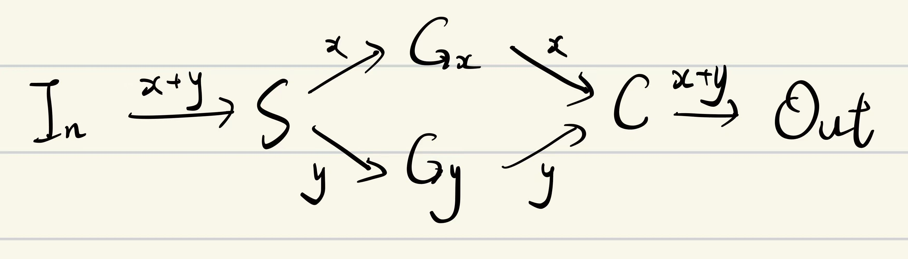
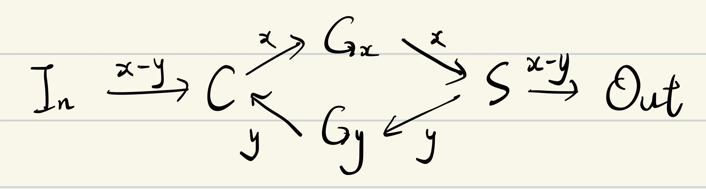

# 任意 p/q 阻塞流的高效搜索算法

> 原文：https://docs.qq.com/aio/DTmluZ1diWlpQZldw?p=Y42aDe4xcQvaf0pwbojSMQ　上级：[理想系统的流量理论](理想系统的流量理论.md)

算法的最新实现及算法细节请以 [GitHub: hongshan-academy/TopoConstructor](https://github.com/hongshan-academy/TopoConstructor) 为准！

本算法主要基于 @Orirock 的三分三汇构造算法和 @madSUN 的 $1/n$ 阻塞流算法，且其正确性建立在其余既有工作的结论之上。

### 算子

本算法的思路大致是：对于给定的 $p/q$，使用下列算子将目标流规约为若干个单位分数 $1/n$ 和若干个位于 $[1/3, 1/2]$ 内的分数，并使用 DP 搜索较优构造。

#### 算子一览

|  |  |  |
| --- | --- | --- |
| 算子 | 记号 | 说明 |
| 单位分数 | $U(q)$ | 表示 $1/q$ |
| 区间分数 | $I(p, q)$ | 表示位于 $[1/3, 1/2]$ 区间内的分数 |
| 和 | $(\cdot) + (\cdot)$ | 两个分数的和（要求和 $< 1$） |
| 差 | $(\cdot) - (\cdot)$ | 由 $a>2b$ 构造 $a-b$ |
| 缩放 | $(\cdot)/m$ | 将原分数乘以 $1/m$ |

#### 算子原理

##### 单位分数

参见 [关于 1/n 阻塞流的一些研究和搜索](关于%201_n%20阻塞流的一些研究和搜索.md)[关于 1/n 阻塞流的一些研究和搜索](关于%201_n%20阻塞流的一些研究和搜索.md)、<code>[unit.py](https://github.com/hongshan-academy/TopoConstructor/blob/main/topo_constructor/leaves/unit.py)</code>。

对于 $U(n)$，先写成 $n=2^a r$，其中 $r$ 为奇数。$2^a$ 部分由若干个 $U(2)$ 通过满边替换相乘；奇数部分则搜索两组反馈置换，使相应递推的分母恰为 $r$。小搜索层直接枚举置换对，较大搜索层可转为 MILP。

##### 区间分数

参见 [以理想系统限流器为核心的阻塞流研究](以理想系统限流器为核心的阻塞流研究.md)[以理想系统限流器为核心的阻塞流研究](以理想系统限流器为核心的阻塞流研究.md)、[JNK的阻塞流初步介绍文章](https://www.skland.com/article?id=6033639)、<code>[interval.py](https://github.com/hongshan-academy/TopoConstructor/blob/main/topo_constructor/leaves/interval.py)</code>。

对于 $I(p, q)$，将流量拆成二分或三分片段，再分别合并到三组端口。默认优先使用目标导向的混合进制链；若不存在合适的链，则使用只细分边界片段的紧凑二进制构造。开启额外优化后，还会在给定范围内进行有界搜索，并选择元素数更少的方案。

##### 和

如图：

其中 $G_x$ 和 $G_y$ 分别为流量 $x$ 和 $y$ 的子阻塞流图。当 $x+y<1$ 时，所得图的总流量即为 $x+y$。

##### 缩放

将 $1/n$ 图中的满边替换为一个 $p/q$ 的子阻塞流图，则总流量变为 $p/(nq)$，即实现乘法

##### 差

如图：

其中 $G_a$ 和 $G_b$ 分别为流量 $a$ 和 $b$ 的子阻塞流图。严格条件 $a>2b$ 保证所得图构造 $a-b$；$1-x$ 是 <code>Full(1)-x</code> 的特例。

### 规约

#### 符号树与开销

使用以上算子，我们可以写出一棵符号树 <code>ReductionRecipe</code>，使得：

1. 该树的所有叶子节点都是满流、单位分数或区间分数；

2. 该树的值恰等于原分数。

在此基础上，我们可以在生成图之前计算该树的拓扑开销。

<code>ReductionRecipe</code> 同时记录节点数、边数和固定边数。组合算子的开销可以直接由子树递推：

- 若两个子图 $G_1, G_2$ 的开销分别为 $(N_1,E_1)$ 和 $(N_2,E_2)$，则 $G_1 + G_2$ 与 $G_1 - G_2$ 的开销均为 $(N_1 + N_2, E_1 + E_2 + 2)$；

- 用 $U(m)$ 缩放子图时，二者在一条固定满边处拼接，开销为 $(N_U + N - 2,E_U + E - 1)$；

规划器按节点数优先、边数次优的顺序选择方案。

#### DP 搜索

- DP 状态由“当前分数”和“剩余搜索深度”组成。

- 每个状态会比较旧规约、二进制余项、<code>Full(1)</code> 减法、缩放、加法和减法拆分等候选。

- 加减法只保留子分母不大于当前目标分母的拆分，并优先尝试由目标分母的质数幂块得到的组合。

- 搜索达到深度或状态数上限时回退到旧规约，始终将其作为兜底方案。

- 尚未搜索的 $U(n)$ 先以下界估价；当它出现在胜出方案中时，再求出实际拓扑并重新运行规划，直到所有开销都精确。

### 图生成与验证

符号树确定后，程序才递归生成图：

- “和”在两个模块外增加一对 $S_2/C_2$ 并联

- “缩放”用内层模块替换外层模块唯一的固定满边

- “差”用一对新的 $C_2/S_2$ 将满足 $a>2b$ 的两个模块组合为 $a-b$

所有流量均使用精确分数计算。

程序最终会检查构造结果的节点类型与度数、流量守恒、固定边流量、边状态传播、局部最大规则和平行边等流量。随后把这些条件写成关于所有边流量的线性方程组，并用精确高斯消元计算秩；秩等于边数时，说明该流量解被约束唯一确定。

### 一些猜测

当前能严格写出的复杂度结论需要区分图规模与搜索耗时：

- 对 <code>Interval</code> 构造，确定性 <code>fallback</code> 给出节点数和边数的 $O(q)$ 上界，现有模型同时有 $\Omega(\log q)$ 下界；是否存在 $\operatorname{poly}(\log q)$ 的通用上界仍未证明。

因此，任意 $p/q$ 的 $O(\log q)$ 图规模目前仍是条件性猜想，不是定理。

外层 DP 虽受深度和状态数限制，<code>Unit</code>/<code>Interval</code> 的内部搜索却没有关于输入位长 $\log q$ 的多项式时间保证；即便我们已经证明 $k=\Theta(\log q)$，Unit 穷举仍可能达到 $q^{\Theta(\log\log q)}$。

以及还是希望能有一种统一的构造性方法（而不是现在的这种搜索性的工程妥协）来构造 $(0, 1)$ 中的任意 $p/q$。

不过现在的这个实现应当是完全够用<s>（甚至相当不错）</s>的。
