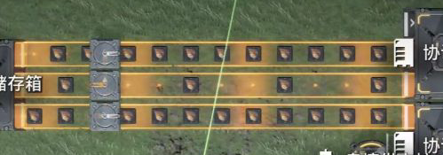
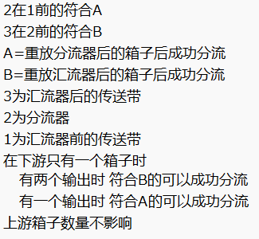
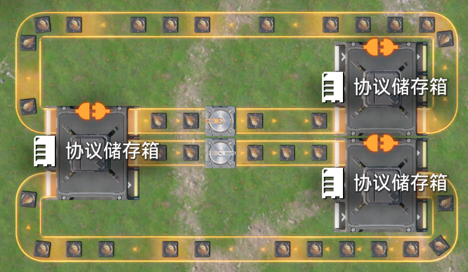
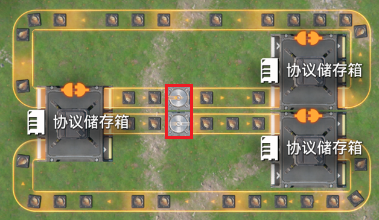

# 优先汇入结构的末端箱子放置顺序影响优先级现象研究

> 原文：https://docs.qq.com/aio/DTmluZ1diWlpQZldw?p=3e6Q3Y7LbtinO72F4eucBI　上级：[优先汇入现象](优先汇入现象.md)

通常的优先汇入（分流器无其他输出）逻辑如下：在分流器，传送带（非分流器）直接连接汇流器时，先连接优先，非分流器优先时在多个非分流器之间轮询。

该结构的情况下，修改下游的存储箱的时候，会导致汇流器的优先级发生无法预测的变化，该问题可能是元件计算顺序的问题

目前暂且将以jnk的层级BFS论可解释的实验结果标记为A，与之相反的结果标记为B，可能需要进一步分类或整合

根据最新的实验结果，某特定结构（如下图）符合以下规律

新的实验结果说明，可以用以下经验概括

将红圈结构视为整体，计算出口阻尼，若分流器处阻尼较小（类似高优先）且汇流器下游（紧贴的）物流元件比分流器先放，则成功分流，或者汇流器处阻尼较小且分流器比汇流器上游（紧贴的）物流元件早放，则成功分流，否则不成功，分流器只向汇流器以外的方向输出，可以轮询

以下是@madSUN 的实验结果

📎 附件：[test\_priority\_with\_stash.txt](../附件/test_priority_with_stash.txt)（59412 字节）

对于该实验结果，jnk如下解释

群聊聊天记录-解释

jnk(2150891328) 2026/6/29 20:29:49 
反之c-l在c-r前则分流器先计算阻尼，此时与分流器和汇流器下游连接顺序有关，由分流器主导的，这两个方向中哪个方向先连接则哪个方向先计算，汇流器的另一个上游则总是最后计算，此时若分流器先连接，则计算顺序为“分流器输入-输出-传送带输入”\[0\]，由于尚未输出就尝试分流器输入，所以分流器无法输入，分流失败，反之分流成功， 从对应三种情况来看，认为放置汇流器时先顺时针连接上游再连接下游\[1\] 
"c, c-l, c-r, s" 
"c-l, c, c-r, s" 
"c-l, c-r, c, s" 
 
jnk(2150891328) 2026/6/29 20:29:57 
假设\[1\]是对的，那么此时要求c-l在c-r前的情况分别由于 
1\. c在最后则先连接上游分流器再连接下游传送带 
2\. c-r在最后则已经放下c和s将两者连接，然后再连接c-r下游传送带 
3\. c-l必须在c-r前，所以不能在最后 
导致s必须作为结尾 
 
jnk(2150891328) 2026/6/29 20:30:11 
这是剩下九种情况 
l,r,s,c最后放汇流器导致先连接了分流器再连接下游传送带 
l,s,r,c 
s,l,r,c 
l,s,c,r最后放下游传送带，导致其最后连接 
l,c,s,r 
c,l,s,r 
s,l,c,r 
c,s,l,r 
s,c,l,r 
 
jnk(2150891328) 2026/6/29 20:30:16 
\[0\]中提到输入比输出先计算的情况，由4n卡1s的触发条件可以看出这里可以触发4n卡1s现象，通过另一支传送带输入始终为空且分流器的传送带方向输出阻塞无法输出可以构造4n卡1s的出现

