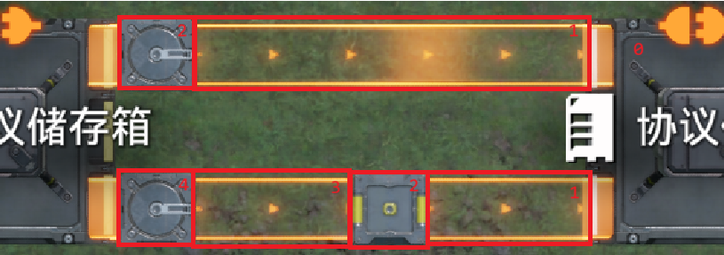
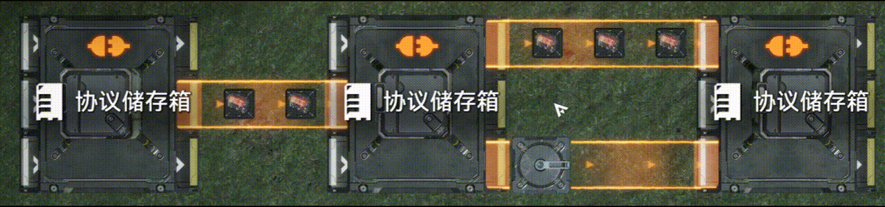
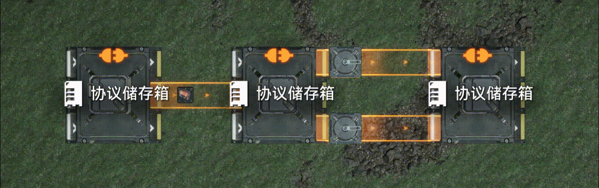
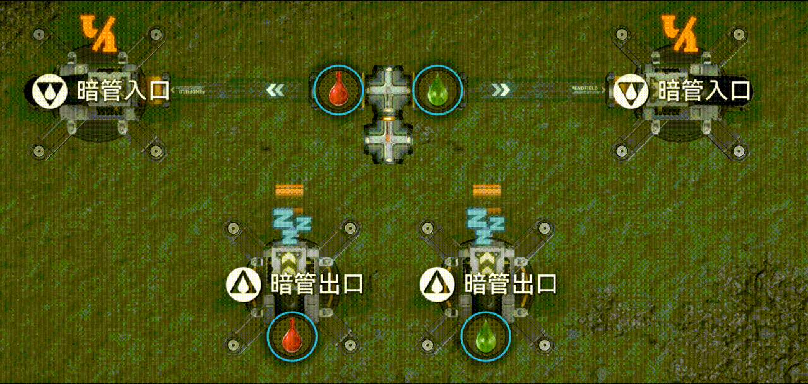

# 优先输入/输出/汇入理论

> 原文：https://docs.qq.com/aio/DTmluZ1diWlpQZldw?p=AA41FJVehHzDTC97GcFV5F　上级：[任务板](任务板.md)

本页面主要面向不了解基本的优先输入输出而难以直接阅读[终末地物流bug分析导论](终末地物流bug分析导论.md)的读者

## 优先输出 协议箱-汇流器/多口暗管出口-汇流器

简单来说，当协议箱/多口暗管出口和汇流器紧贴放置时，产生输出优先级。以上图为例，我们数出两路上传送带（管道）和物流件（管道件）数量（即阻尼），少的一路优先输出，多的一路次优先。

更复杂的情况请移步[终末地物流bug分析导论-优先输入/输出/汇入现象](终末地物流bug分析导论.md)

## 优先汇入 分流器-汇流器

简单来说如果存在分流器出口紧贴汇流器入口时，汇流器的汇入产生优先级，其上游先放的优先，如果是先放的是非分流器的话会与后放的其他非分流器轮询。

更详尽的优先级与放置顺序的关系：对于分流器之间，先放置的分流器向汇流器的输入优先于后放置的；对于管道、储液/气罐、暗管出口、汇流器之间，优先级一致且以最先放置的为准；对于分流器和管道、储液/气罐、暗管出口、汇流器之间，先放置的一方向汇流器的输入优先于后放置的（注意管道等一方的优先级将相同，比如对一汇流器先连管道A再连分流器B再连管道C，优先级为A=C\>B）

机器与分流器与管道等之间的关系尚未完全厘清，主要是反应池令人不解，请以实际情况为准。

更复杂的情况请移步：[终末地物流bug分析导论-优先输入：先有下游连接的元件优先输入。](终末地物流bug分析导论.md)

## 通过正常轮询达成的输出/输入优先

输出优先：多口暗管出口A正在输出120/min的息壤气，两个口分别连接消耗30/min息壤气的暗管入口B和消耗120/min息壤气的暗管入口C，可以得到B的消耗被优先供应满的结论。严格地说，只要暗管入口B/C的消耗量小于A流量的1/2（多口暗管在两个口都不堵时轮询输出，即足够长时间中两口输出相等，所以这里是1/2）就能保证供应充足（可以说是广义上的优先输出）

输入优先：多口暗管入口A正在消耗120/min的息壤气，两个口分别连接输出30/min息壤气的暗管出口B和输出120/min息壤气的暗管出口C，可以得到B的输出被优先消耗完的结论。严格地说，只要暗管入口B/C的输入量小于A流量的1/2（多口暗管在两个口都阻塞时轮询输入，即足够长时间中两口输入相等，所以这里是1/2）就能保证消耗完全（可以说是广义上的优先输入）

更系统的解释我在这里引用kokobird的[2.5 箱子不就是特殊的分流器吗？（核心内容⭐）](2.5%20箱子不就是特殊的分流器吗？（核心内容⭐）.md)

## 四卡一（迟滞输出）造成的输入优先级损坏

优先级可能会因为分流器四卡一（迟滞输出）使得优先级损坏为不完全的优先级，如果发现优先级损坏且上游阻塞时输出方式为优先一方进2液体而次优先一方输出1液体（而不是正常轮询的你进1我进1）则大概率发生四卡一，简单的修复方法有二：（正在验证方法充分性）

详细内容请移步[终末地物流bug分析导论-层级化理论与迟滞输出现象](终末地物流bug分析导论.md)
