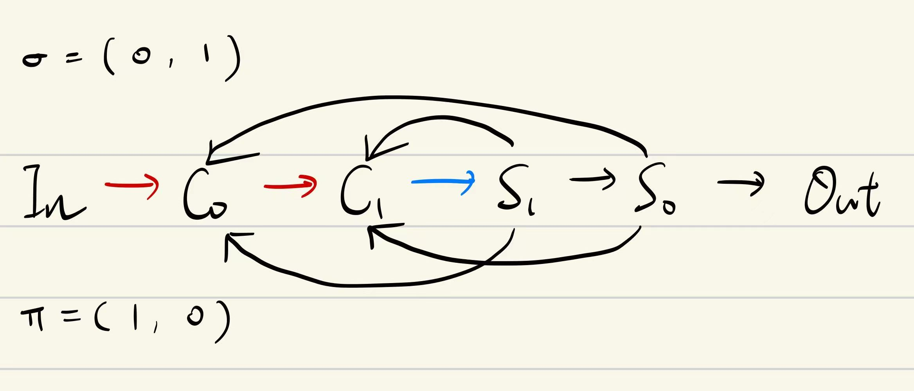
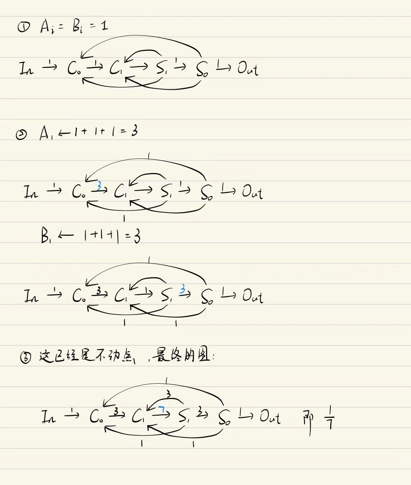

# 关于 1/n 阻塞流的一些研究和搜索

> 原文：https://docs.qq.com/aio/DTmluZ1diWlpQZldw?p=7IIqNDoItC2dFP65ZsyOaQ　上级：[理想系统的流量理论](理想系统的流量理论.md)

### 一些定义和记号

<b>以下所有算法都只对奇数 </b><b>$q$</b><b> 有效</b>，若要构造偶数 $q$，先把含有 $2$ 的部分拆出来即可。

#### 图结构

整个图长这样：

$$
\text{In} \rightarrow C_0 \rightarrow \cdots \rightarrow C_{k-1} \rightarrow S_{k-1} \rightarrow \cdots \rightarrow S_0 \rightarrow \text{Out}
$$

一共有 $k$ 个分流和 $k$ 个汇流，其中每个分流都是三分，每个汇流都是三汇。这条称为<b>主链</b>，剩下的连接称为<b>回流</b>。

#### 排列

引入两个 $(0, \cdots, k - 1)$ 的排列 $\sigma$ 和 $\pi$，在主链上增加 $S_i \rightarrow C_{\sigma_i}$ 和 $S_i \rightarrow C_{\pi_i}$ 的回流。其中如果 $\sigma_i = \pi_i$，就意味着有二重边。

#### 主链流量和回流流量

##### 主链流量

记 $A_i$ 为第 $i$ 个汇流器的输入流量，$B_i$ 为第 $i$ 个分流器的输出流量。即：

$$
\text{In} \overset{A_0}{\rightarrow} C_0 \overset{A_1}{\rightarrow} \cdots \overset{A_{k-1}}{\rightarrow} C_{k-1} \overset{A_k = B_k}{\rightarrow} S_{k-1} \overset{B_{k-1}}{\rightarrow} \cdots \overset{B_1}{\rightarrow} S_0 \overset{B_0}{\rightarrow} \text{Out}
$$

##### 回流流量

第 $i$ 个分流器到第 $j$ 个汇流器的回流流量记作 $F_{i \rightarrow j}$，我们有：

$$
F_{i \rightarrow j} = \min \{B_i, A_j\}
$$

因为：

1. 所有 $A_0, \cdots, A_{k-1}$ 都是阻塞的，所有 $B_0, \cdots, B_{k-1}$ 都是流通的，而 $A_k = B_k$ 是满的。

2. 如果 $S_i \rightarrow C_j$ 阻塞，则 $F_{i \rightarrow j} = A_j$ 且有 $A_j \leq B_i$

3. 如果 $S_i \rightarrow C_j$ 流通，则 $F_{i \rightarrow j} = B_i$ 且有 $B_i \leq A_j$·

#### 例：$1/7$



这里 $\sigma = (0, 1), \pi = (1, 0)$

### 根据排列计算流量

对于某个 $k$ 和两个给定的排列 $\sigma$ 和 $\pi$，我们始终有

$$
\begin{aligned}
A_{i+1} &= A_i + F_{\sigma^{-1}_i \rightarrow i} + F_{\pi^{-1}_i \rightarrow i} \\
B_{i+1} &= B_i + F_{i \rightarrow \sigma_i} + F_{i \rightarrow \pi_i}
\end{aligned}
$$

先把所有 $A$ 和 $B$ 都设成 $1$，然后开始迭代。由于

1. $A_i^{(t)}$ 和 $B_i^{(t)}$ 都只能关于 $t$ 单调递增

2. $A_{i + 1} = A_i + F_{\sigma^{-1}_i \rightarrow i} + F_{\pi^{-1}_i \rightarrow i} \leq 3A_{i - 1} \Rightarrow A_i \leq 3^i A_0 = 3^i$，所以有界；同理 $B_i \leq 3^i$

3. 所有 $A_i$ 和 $B_i$ 都只能取整数值

因此最终会收敛到一个不动点，这个不动点中 $A_k$ 和 $B_k$ 的流量就是分母 $q$.

#### 算法流程

```
把所有 A 和 B 暂时设成 1

do
    按 j = 0,1,...,k-1 更新 A
    按 i = 0,1,...,k-1 更新 B
while 本轮结果与上一轮不同

输出 q = A[k] = B[k]
```

#### 例：$1/7$ 的计算



### 给定分母 $q$ 寻找排列

#### 方法一：直接穷举

自己写出来不会笑吗🤣

虽然但是，其实由于 [图的复杂度猜想](#图的复杂度猜想) 中观察到的情况，当 $k = \lceil \log_3 q \rceil$ 时，直接穷举其实是更快（甚至秒出）的。

穷举的复杂度是 $O(\lceil \log q \rceil !) \approx O(q^{\log \log q})$，超多项式但亚指数。

#### 方法二：MILP 可行解搜索

我们就可以直接把上述递推关系写成约束，剩下的交给求解器😋

以下是变量和约束。对于一个目标分数 $1/q$:

##### 主链流量（整数）

$$
\begin{aligned}
1 \leq A_i \leq q \\ 
1 \leq B_i \leq q
\end{aligned}
$$

其中 $i = 0, 1, \cdots, k$

##### 选择反馈边的二元变量

由于没法在 MILP 里写排列，所以我们只能写“一对一的选择”外加一个“只能选一个”的约束：

$$
\begin{aligned}
z_{i \rightarrow j}^\sigma \in \{0, 1\} \\
z_{i \rightarrow j}^\pi \in \{0, 1\}
\end{aligned}
$$

其中 $i, j \in \{0, 1, \cdots, k - 1\}$。$z_{i \rightarrow j}^\sigma = 1$ 意味着 $\sigma_i = j$，$\pi$ 同理

为了保证只选一个，增加约束：对于每一个 $i = 0, \cdots k - 1$

$$
\begin{aligned}
\sum_{j=0}^{k-1} z^\sigma_{i \rightarrow j} = 1 \\
\sum_{j=0}^{k-1} z^\pi_{i \rightarrow j} = 1
\end{aligned}
$$

对于每一个 $j = 0, \cdots k - 1$

$$
\begin{aligned}
\sum_{i=0}^{k-1} z^\sigma_{i \rightarrow j} = 1 \\
\sum_{i=0}^{k-1} z^\pi_{i \rightarrow j} = 1
\end{aligned}
$$

人话：其实就是让 $[z_{i,j}]$ 构成一个 Permutation 矩阵。

##### 候选反馈边流量（整数）

$$
\begin{aligned}
0 \leq F^\sigma_{i \rightarrow j} \leq q \\
0 \leq F^\pi_{i \rightarrow j} \leq q
\end{aligned}
$$

如果该流量没有被选中，则流量强制为 0；如果该流量被选中，则要求其满足之前提到的公式：

$$
\begin{cases} 
F^\sigma_{i \rightarrow j} = 0 & \text{if}\,z^\sigma_{i \rightarrow j} = 0 \\
F^\sigma_{i \rightarrow j} = \min\{A_j, B_i\} & \text{if}\,z^\sigma_{i \rightarrow j} = 1
\end{cases}
$$

$$
\begin{cases} 
F^\pi_{i \rightarrow j} = 0 & \text{if}\,z^\pi_{i \rightarrow j} = 0 \\
F^\pi_{i \rightarrow j} = \min\{A_j, B_i\} & \text{if}\,z^\pi_{i \rightarrow j} = 1
\end{cases}
$$

当然，这里的 $\min$ 是需要 Big-M 线性化后才能扔进 MILP 的，这里取 $M = q$ 就已经安全。

##### 主链递推

$$
\begin{aligned}
A_{j+1} = A_j + \sum_{i = 0}^{k-1}F^\sigma_{i \rightarrow j} + \sum_{i = 0}^{k-1}F^\pi_{i \rightarrow j} \\
B_{i+1} = B_i + \sum_{j = 0}^{k-1}F^\sigma_{i \rightarrow j} + \sum_{j = 0}^{k-1}F^\pi_{i \rightarrow j} \\
\end{aligned}
$$

##### 边界条件

$$
\begin{aligned}
A_0 = B_0 = 1 \\
A_k = B_k = q
\end{aligned}
$$

##### 目标函数

当前问题只需寻找任意可行解，所以目标函数是常数：

$$
\min 0
$$

#### 图的复杂度猜想：$O(\lceil \log_3 q \rceil)$

因为我们有 $A_k = q \leq 3^k$，因此我们始终有 $k \geq \lceil \log_3 q \rceil$。而且实验证据也表明了这一点。不过这只给出了下界，没有给出上界。

其中可以找到一些 $q = 23$ 和 $q = 25$ 需要 $k = \lceil \log_3 q \rceil + 1$ 才能被表达（由穷举算法证明）。

由此猜测 $\lceil \log_3 q \rceil \leq k \leq \lceil \log_3 q \rceil + 1$.

至于算法复杂度，我也不知道喵。不知道能否找到一种快速的逆算法。

> 💡 $\lceil \log_3 q \rceil \leq k \leq \lceil \log_3 q \rceil + 1$ 已被证伪，见[图复杂度猜想](图复杂度猜想.md)
>
> 但我们依然给出了很好的上界，证明了 
>
> $$
> k = \Theta(\log q)
> $$

📄 [图复杂度猜想](图复杂度猜想.md)


### 遗留问题

1. 快速的逆算法

2. 推广到普通 $p/q$

📄 [基于图复杂度猜想中上界的证明中涉及的方法的 1/n 图构造](基于图复杂度猜想中上界的证明中涉及的方法的%201_n%20图构造.md)
