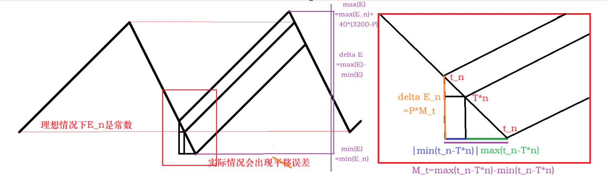

# 关于二进制稳流器控电的最低配置功率证明

> 原文：https://docs.qq.com/aio/DTmluZ1diWlpQZldw?p=zmwxaYgt5aotQWWadn9BqP　上级：[任务板](任务板.md)

由 Cipolla\_ 提出使用 二进制稳流器 控电的方式。

具体的，该结构为24/25限流器+均匀二进制+1/3分流组成，我们希望得到该装置最低可以控制多低的功率可以不断电。

<details>
<summary>相关蓝图</summary>

中武精准控电EF01081eu89O0i17E179

EF01U9eE19A3UOEu7Oa8不受离线降速影响

固定间隔供电EF01A672a6iuAEIU9ieO

</details>

<details>
<summary>相关讨论-1</summary>

Cipolla\_ 2026/3/19 22:07:50

二进制稳流严谨性论证：考虑同一情况下，某电池以当前时刻和晚4秒时刻的电量峰谷值之差。设需要处理的耗电功率为x（\<3200)，两者差为(3200-x)\*40+4x=128000-36x

Cipolla\_ 2026/3/19 22:09:21

然后列不等式128000-36x\<=100000-x，解得x\>=800

苍孤狼 2026/3/19 22:09:50

啥意思？

Cipolla\_ 2026/3/19 22:10:51

结论：配置功率为800～3200中任意值，均可保证不断电

Cipolla\_ 2026/3/19 22:11:54

如果配置功率小于800，将无法对是否能避免间歇断电进行保证

c 2026/3/19 22:12:23

啥意思？

Cipolla\_ 2026/3/19 22:13:06

算一下二进制稳流器的额定功率配置区间

苍孤狼 2026/3/19 22:14:04

二进制稳流器又是什么

jnk 2026/3/19 22:15:17

我们需要统一用词

c 2026/3/19 22:15:20

均匀二进制呗

Cipolla\_ 2026/3/19 22:15:24

Cipolla\_

EF01U9eE19A3UOEu7Oa8改了版新的，现在应该不会受代理影响了

苍孤狼 2026/3/19 22:15:48

显然不是均匀二进制，均匀二进制不需要稳流

c 2026/3/19 22:16:47

看起来是某种堵塞二进制的控电方法

jnk 2026/3/19 22:17:16

24/25限流+均匀二进制

Cipolla\_ 2026/3/19 22:18:55

为了灵活调配没进行压缩，搭出来面积可大了

苍孤狼 2026/3/19 22:19:09

Cipolla\_

然后列不等式128000-36x\<=100000-x，解得x\>=800

@Cipolla\_ 还记得电量掉到5%就会立刻亏空停电吗

Cipolla\_ 2026/3/19 22:19:50

严谨测试过了，是电量低于实际耗电量会立即停电

苍孤狼 2026/3/19 22:20:53

原来如此

苍孤狼 2026/3/19 22:21:28

这是在算电池容量过大的情况耗电功率在哪个范围才能用均匀二进制避免断电？

Cipolla\_ 2026/3/19 22:21:32

不过有道理，我这里只考虑单台机运作，如果还有高谷在发电就又不一样了

Cipolla\_ 2026/3/19 22:22:31

更多意义在于不断电保证

Cipolla\_ 2026/3/19 22:24:25

毕竟电池发电能力太强了，你用中武如果只配个精准200的电是肯定会断的

苍孤狼 2026/3/19 22:24:33

3200\*40=128000已经超过基地蓄电范围

苍孤狼 2026/3/19 22:25:12

所以才有这种情况

xyIvneu\_ 2026/3/19 22:26:04

我感觉还是同时均匀两个热能池管用点

苍孤狼 2026/3/19 22:26:08

不如我们考虑从x开始充电到电量掉回x所用时间

Cipolla\_ 2026/3/19 22:26:34

那也要证出来

苍孤狼 2026/3/19 22:26:38

以这个时间减4s为均匀发电基准

Cipolla\_ 2026/3/19 22:26:52

3200往上的不会证，感觉有点困难

苍孤狼 2026/3/19 22:27:47

只考虑不断电，不考虑溢出，不管什么功率，保持在刚好不断电的频率进行均匀有理数

xyIvneu\_ 2026/3/19 22:28:43

你那个蓝图我还没看，但是均匀二进制限流来滤波我确实早就提过了

xyIvneu\_ 2026/3/19 22:28:48

肯定是可以的

xyIvneu\_ 2026/3/19 22:29:36

对每个电池是存在一个发电量临界

xyIvneu\_ 2026/3/19 22:29:57

低于这个发电量临界就要有盈余

xyIvneu\_ 2026/3/19 22:30:14

发电量更多只会更均匀

xyIvneu\_ 2026/3/19 22:30:41

这个800其实对于目前基地来说很容易接受了

xyIvneu\_ 2026/3/19 22:30:52

目前发电量基本都三千起步

Cipolla\_ 2026/3/19 22:33:17

重新改下最低临界，忘考虑基地的200电了

Cipolla\_ 2026/3/19 22:34:10

最低临界（仅此装置）：805.7

Cipolla\_ 2026/3/19 22:34:54

最低临界（外补一高容）：837.1

Cipolla\_ 2026/3/19 22:35:20

最低临界（外补二高容）：868.6

xyIvneu\_ 2026/3/19 22:35:32

补了个高谷还更菜了

xyIvneu\_ 2026/3/19 22:36:36

没道理呀

苍孤狼 2026/3/19 22:36:48

x+3200<i>t=100000</i>

<i>t=(100000-x)/3200</i>

<i>理想电池间隔T</i>

<i>=40+(100000-x)/x  (t\<=40)</i>

<i>=40+(x+3200</i>40)/x (t\>40)

均匀有理数目标电池间隔

\_T=T+1(完美均匀)

\_T=T+3(广义均匀)

xyIvneu\_ 2026/3/19 22:36:48

是不是算错了

Cipolla\_ 2026/3/19 22:37:21

yj的神秘小巧思：只要耗电量同时大于发电量和库存电量就会断电

xyIvneu\_ 2026/3/19 22:37:48

同时大于吗

苍孤狼 2026/3/19 22:37:51

广义均匀指现在容许极差1的均匀定义

xyIvneu\_ 2026/3/19 22:37:52

我以为是和

苍孤狼 2026/3/19 22:39:02

Cipolla\_

重新改下最低临界，忘考虑基地的200电了

@Cipolla\_ 哦对，断电判定是包含着一部分的

c 2026/3/19 22:43:36

Cipolla\_

yj的神秘小巧思：只要耗电量同时大于发电量和库存电量就会断电

@Cipolla\_ 那这不是意味着，整个精度极高的均匀二进制，从0开始发电，永远满不了电？

Cipolla\_ 2026/3/19 22:44:00

没错

c 2026/3/19 22:44:17

但是我谷地有电啊

c 2026/3/19 22:44:43

emm

Cipolla\_ 2026/3/19 22:44:46

你的库存电量会一直维持下去

c 2026/3/19 22:45:13

我是说我谷地从0开始发电，到满电了

c 2026/3/19 22:45:21

精度0.01

c 2026/3/19 22:45:34

我再试一次

Cipolla\_ 2026/3/19 22:45:51

这玩意儿精度应该比0.01还小

苍孤狼 2026/3/19 22:46:03

200+(3400-x)\*t=100000

t=99800/(3400-x)

理想电池间隔T

\=40+99800/(x-200)  (t\<=40)

\=40+(3400-x)\*40/(x-200) (t\>40)

均匀有理数目标电池间隔

\_T=T+1(完美均匀)

\_T=T+3(广义均匀)

这样？

c 2026/3/19 22:46:17

这样吗

Cipolla\_ 2026/3/19 22:47:07

我不知道你是以什么方式考虑这件事的

Cipolla\_ 2026/3/19 22:47:12

不妨说说看

苍孤狼 2026/3/19 22:47:53

考虑从200开始充电到重新掉回200用时

苍孤狼 2026/3/19 22:48:07

这是一个极限，这种情况会刚好断电

苍孤狼 2026/3/19 22:48:35

而只要我们有理数均匀的电池间隔低于这个极限间隔就不会断电

苍孤狼 2026/3/19 22:48:54

200+(3400-x)\*t=100000

t=99800/(3400-x)

理想电池间隔T

\=40+99800/(x-200)  (t\<=40)

\=40+(3400-x)\*40/(x-200) (t\>40)

均匀有理数目标电池间隔

\_T=T-1(完美均匀)

\_T=T-3(广义均匀)

正负号写错了

c 2026/3/19 22:50:02

主要是看一个周期内，发电带来的正收益比不比得上多消耗的电量，正收益就是平均每秒误差\*周期

xyIvneu\_ 2026/3/19 22:50:08

实际上对于均匀发电只有一个判断条件吧

xyIvneu\_ 2026/3/19 22:50:17

两秒电会不会掉完

xyIvneu\_ 2026/3/19 22:50:32

xyIvneu\_

两秒电会不会掉完

对于单热能池均匀而言

Cipolla\_ 2026/3/19 22:50:36

我其实做的算法并不一样

xyIvneu\_ 2026/3/19 22:50:50

如果两秒会掉完那就炸了

xyIvneu\_ 2026/3/19 22:50:59

我觉得这是不太可能的事

Cipolla\_ 2026/3/19 22:51:04

考虑一均匀发电机在正常工作，不考虑电池容量

Cipolla\_ 2026/3/19 22:51:43

我们可以将其化为一个条件判断机，当电量小于某个值时自动投放一颗电池

xyIvneu\_ 2026/3/19 22:51:48

电池容量的话确实是另一个限制条件

Cipolla\_ 2026/3/19 22:52:50

在这条线上，考虑发电机的两种不同行为，就可以得到系统电池容量的最高值和最低值

苍孤狼 2026/3/19 22:53:10

但你那个其实是不允许溢出电量的吧

Cipolla\_ 2026/3/19 22:53:11

然后就可以算出极差

c 2026/3/19 22:53:12

Cipolla\_

我们可以将其化为一个条件判断机，当电量小于某个值时自动投放一颗电池

@Cipolla\_ 这个要看你耗电量吧

Cipolla\_ 2026/3/19 22:53:54

简化模型嘛，你就把电池容量看成是一个简单的计数器就行

Cipolla\_ 2026/3/19 22:55:50

Cipolla\_

然后就可以算出极差

我们都知道，长时间过后电池容量最高值是不会超过100000的，那只要把最高值减去极差看看是不是会低于红线就行了

xyIvneu\_ 2026/3/19 23:06:22

Cipolla\_

二进制稳流严谨性论证：考虑同一情况下，某电池以当前时刻和晚4秒时刻的电量峰谷值之差。设需要处理的耗电功率为x（\<3200)，两者差为(3200-x)\*40+4x=128000-36x

这里肯定是2x，怎么会是4x呢

xyIvneu\_ 2026/3/19 23:06:31

晚两秒呀

Cipolla\_ 2026/3/19 23:06:57

前面装了个24/25，就不知道是否真的均匀了

xyIvneu\_ 2026/3/19 23:06:58

不过也不太影响结果

苍孤狼 2026/3/19 23:07:31

如基础产电200，需要在t时刻投放电池为刚好断电，也就是t时刻基地蓄电是200

t+40时刻充电结束，设电池发电功率为p

当200+40\*(p+200-x)\>100000时

t+40时刻蓄电为100000，其掉回200用时(100000-200)/(x-200)=99800/(x-200)

也就是总周期为40+99800/(x-200)

当200+40\*p\<100000时

总周期40+(200+40(p+200-x)-200)/(x-200)=

40+40(p+200-x)/(x-200)

这是刚好断电的周期T

\_T=T-1(完美均匀)

\_T=T-3(广义均匀)

苍孤狼 2026/3/19 23:07:43

这不就和我的一样了

xyIvneu\_ 2026/3/19 23:07:56

有回流肯定是真均匀呀

xyIvneu\_ 2026/3/19 23:08:10

不可能没回流吧

苍孤狼 2026/3/19 23:09:08

Cipolla\_

我们都知道，长时间过后电池容量最高值是不会超过100000的，那只要把最高值减去极差看看是不是会低于红线就行了

@Cipolla\_ 这是在不溢出为前提考虑能不断电支持的耗电功率

苍孤狼 2026/3/19 23:09:34

我是在不断电为前提允许溢出算出对应的电池间隔

xyIvneu\_ 2026/3/19 23:11:58

只能说均匀发电在耗电小于四热能池前提下目前仍然是优解

xyIvneu\_ 2026/3/19 23:12:18

在四热能池前提下可能还会有一个上界

Cipolla\_ 2026/3/19 23:12:25

毕竟以我的角度，溢出就意味着亏损，就埋下了断电的可能性

苍孤狼 2026/3/19 23:12:57

溢出意味着亏损是因为在追求精确模拟耗电功率

xyIvneu\_ 2026/3/19 23:13:31

xyIvneu\_

在四热能池前提下可能还会有一个上界

毕竟在电池极端大前提下总会有一个电池四热能池还会溢出

xyIvneu\_ 2026/3/19 23:13:42

感觉几年内不用考虑这个可能

苍孤狼 2026/3/19 23:13:46

我的角度是舍弃精确模拟转而求不断电情况下偏差最小的解

Cipolla\_ 2026/3/19 23:15:12

感觉你这样思考的话做的就不该是这里的二进制均匀，更像是固定间隔分配的思路

苍孤狼 2026/3/19 23:15:34

是

AI总结：

```md
核心讨论内容
1. Cipolla_ 的二进制稳流器数学论证
提出一个电力稳定方案：通过控制电池投放节奏，使耗电功率在 800～3200 范围内时，可以保证基地不断电。
关键计算：
电量峰谷差公式：(3200-x)*40 + 4x = 128000 - 36x
安全不等式：128000 - 36x ≤ 100000 - x
解得临界值：x ≥ 800
修正后考虑基地基础产电200，最低临界调整为 805.7（单装置）、837.1（外补一高容）、868.6（外补二高容）。
2. 技术方案细节
"24/25限流 + 均匀二进制"：先用限流器控制，再用二进制节奏投放电池
设计取舍：为了灵活调配未做压缩，导致设施面积较大
已修复代理bug影响：新版蓝图不受离线后设施降速问题干扰
3. 两种优化思路的对比
表格
思路	提出者	核心原则	计算目标
不溢出前提下的不断电保证	Cipolla_	溢出即亏损，埋下断电隐患	最高电量 - 极差 ≥ 红线
不断电前提下的最小偏差	苍孤狼	允许溢出，追求偏差最小	电池间隔 < 临界断电周期
苍孤狼的临界周期公式：
当 200 + 40*(p+200-x) > 100000 时：T = 40 + 99800/(x-200)
否则：T = 40 + 40(p+200-x)/(x-200)
4. 关键机制发现
断电判定条件：耗电量 同时大于 发电量和库存电量时立即断电（非"之和"关系）
推论：精度极高的均匀二进制从0开始发电，理论上永远无法满电，库存电量会长期维持
单热能池安全底线：两秒内电量不会掉完即可保证安全
5. 方案评价
xyIvneu_ 认为均匀发电在耗电小于四热能池前提下仍是最优解
四热能池以上可能存在上界，但"几年内不用考虑"（电池容量极端大时才需考虑）
结论
确立了800-3200功率区间为安全配置范围，低于800无法保证不断电。讨论形成了两种数学建模路径：Cipolla_的"极差控制法"和苍孤狼的"周期临界法"，分别适用于"精确模拟耗电"和"允许溢出求最小偏差"的场景。
```

</details>

由caution承接了视频制作的任务，正在等待解释清楚要怎么做或文案，视频已完成但未发布

jnk自称完成了其模拟代码并说明该设备最低支持5功率，但是哪怕功率足够高也可能会断电（后续补充：相应代码已由 Cipolla\_ 修复，目前结果显示与理论分析相吻合），jnk后改正代码，得到结果为最低支持770， 相关代码见： [代码链接](https://gist.github.com/jnk1698ReSetTime1/0c7f61d8143619a9af3ea6bc1ab2aa8a#gistcomment-6054573)

<details>
<summary>相关讨论-2</summary>




需要文本化

</details>

衍生子任务：特定均匀度电池序列控电震荡发电是否会溢出相关研究
