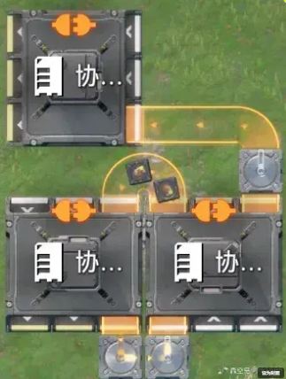

# 关于神秘常数11.8/h的相关探究（已被抛弃）

> 原文：https://docs.qq.com/aio/DTmluZ1diWlpQZldw?p=Aoh27KC22zbHpXeBVPKXpY　上级：[任务板](任务板.md)

问题简述：

1. 在反应池吞液现象研究中，满材料反应池反应5小时5\*1800=9000次反应有59次吞液，约每小时吞液11.8次，两次测试结果相同，在一小时实验中1800次反应吞液11次，得到满材料反应池吞液速度约为11.8次/h

2. 在如下图实验中，每次输出卡顿都会导致溢流箱中物品增加1，经测试，约每5分钟1个物品，折合12/h，时间较长后该速度降低，可能接近11.8/h

   

3. 在天井院进行同时<s>抽水和放水</s>水泵和给水器同时工作的水循环，损失液滴为11\~11.92/h约为11.8/h

以上的巧(必)合(然)引起我们注意，如果后续有相关的降速现象或许可以尝试测速，可能与这个常数相关，值得注意的是，其可能是以11.8次延迟/1800次输出为单位而不是以h^-1为单位

在2026/3/21时反应池吞液被修复，而另外两者没变化，考虑它们之间的联系可能并不紧密，该探究可能并不成立

在2026/3/30清晨时传送带降速被修复，该命题将在不久后抛弃
