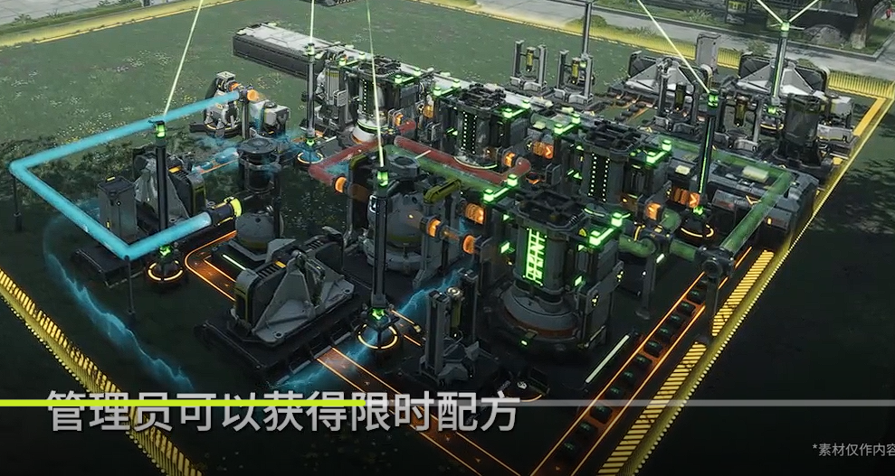
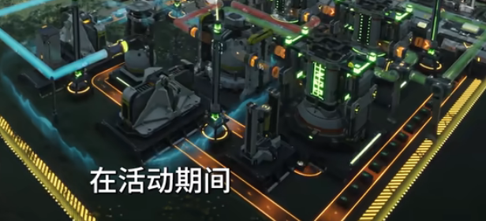
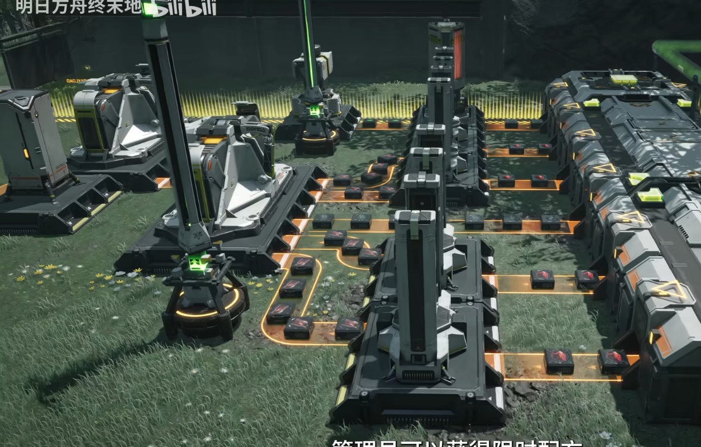
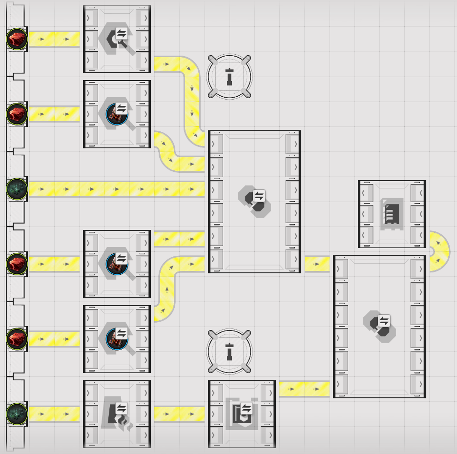
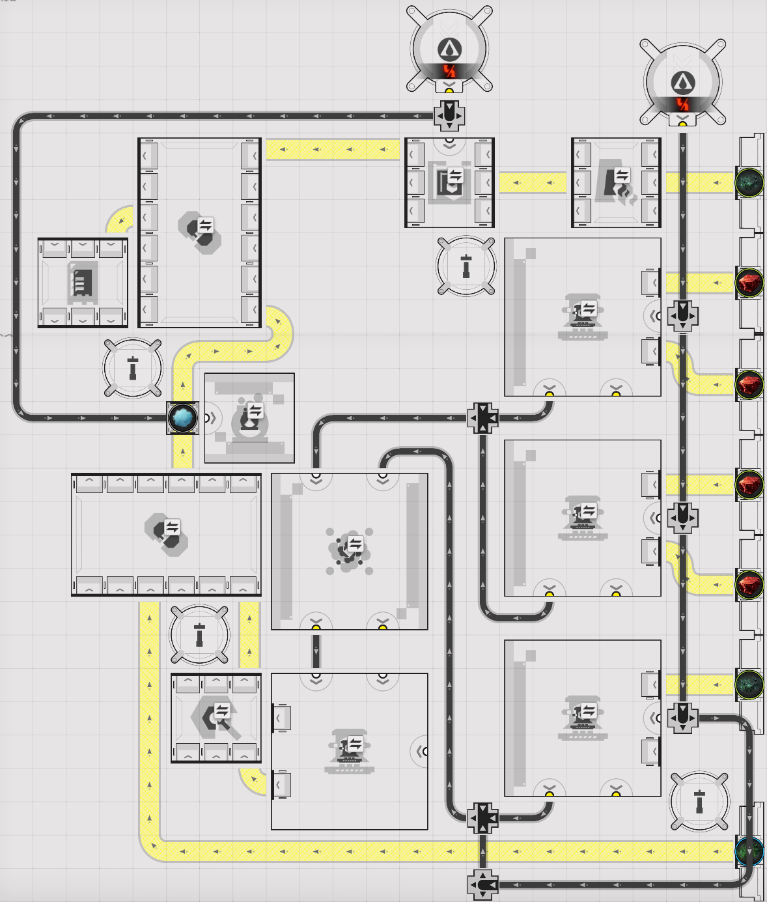

# 前瞻基建相关信息

> 原文：https://docs.qq.com/aio/DTmluZ1diWlpQZldw?p=B6p5P8ptZmUGDgDRCVTZdJ　上级：[「雪凇幽梦」版本](「雪凇幽梦」版本.md)

新物品/机器

添加活动配方

泄露产线截图

泄露产线平面图

配方推测 
1\. 1息壤=1材料a（精炼炉，2s） 
2\. 4赤铜+1息壤=1材料b（封装机，10s） 
3\. ?材料a+？材料b=1小龙泡泡（封装机，？s） 
4\. 2赤铜气+1息壤气=1材料c（气体反应炉，2s） 
5\. 1材料c=1材料d（气固转化机，2s） 
6\. 1材料d=1材料e（配件机，2s） 
7\. 1材料e+1息壤或者重息壤（？）=1材料f（封装机，2s） 
8\. 1材料a+1惰气=1材料g（塑形机，2s） 
9\. 1材料g+1材料f=1大龙泡泡（封装机，？s） 
总而言之，？铜+？息壤=1小龙泡泡（计入转化机消耗息壤气）

配方分析
