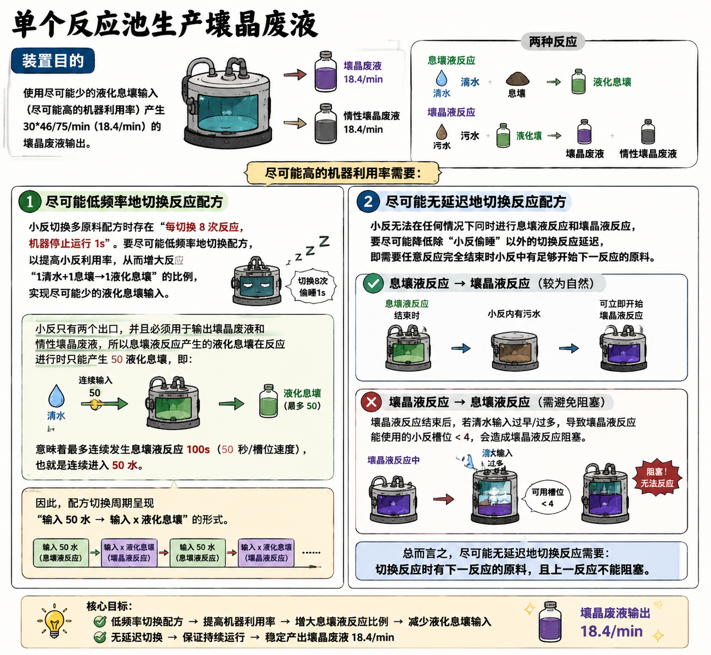
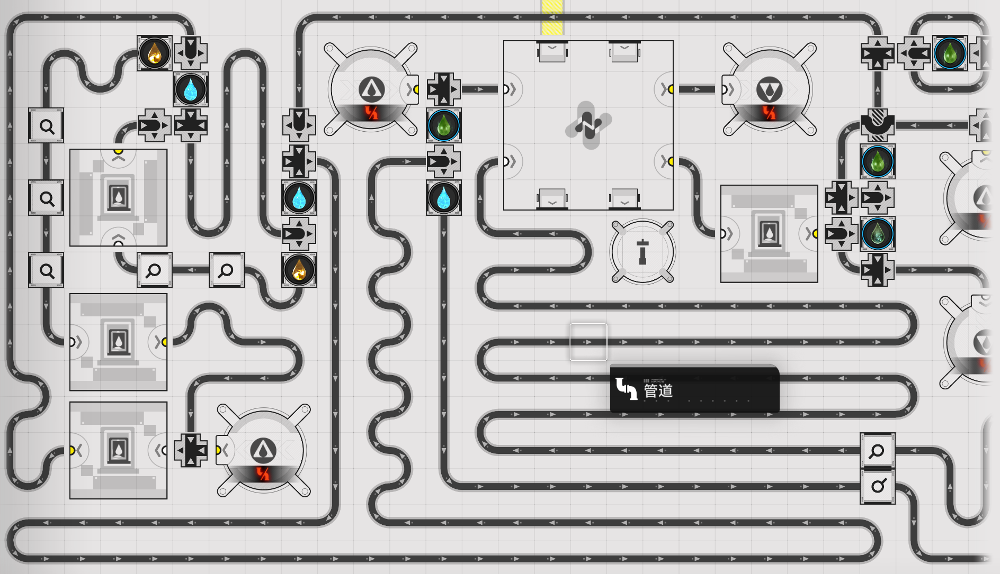
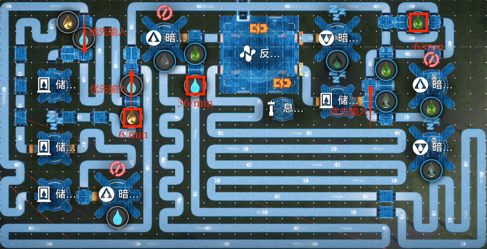
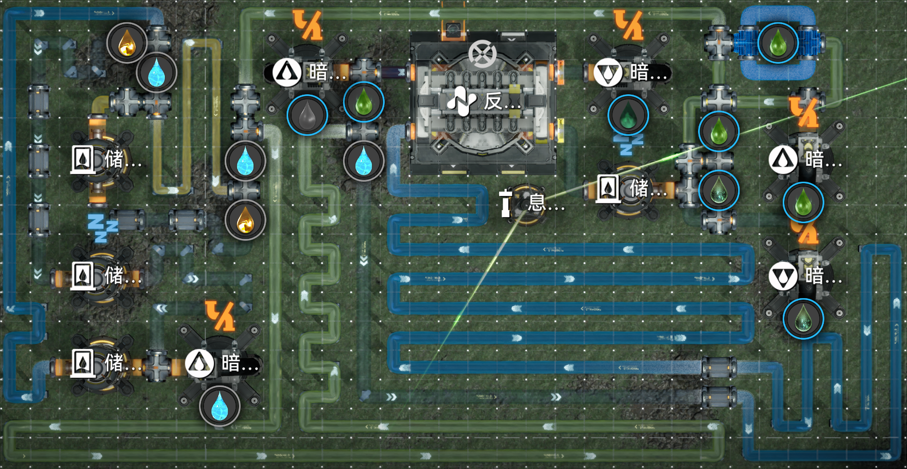
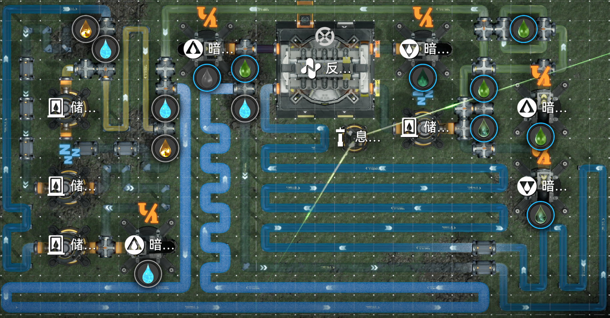
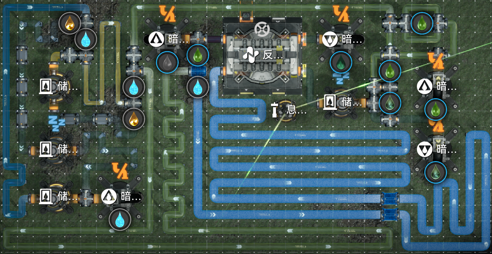
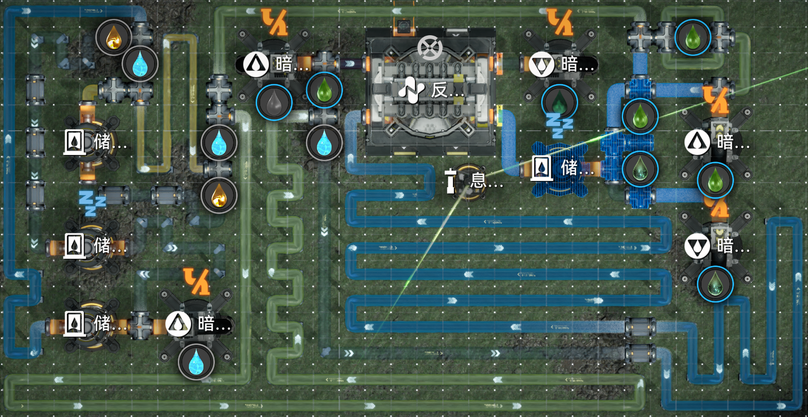
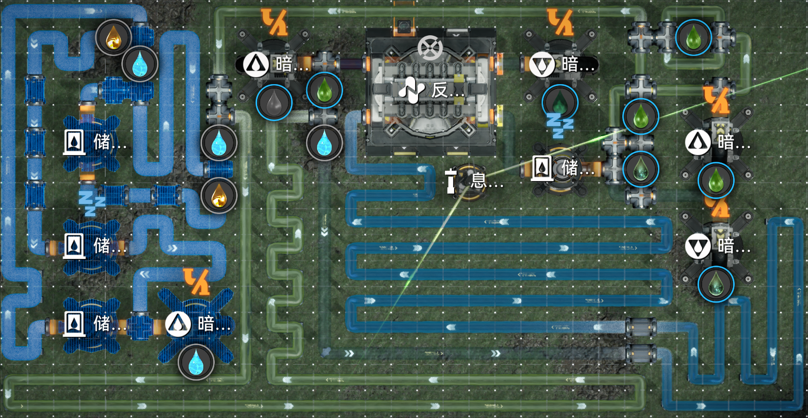
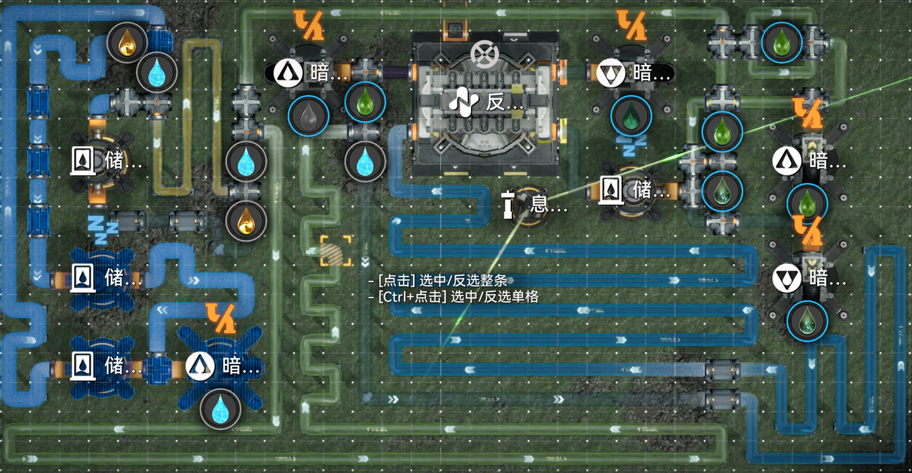
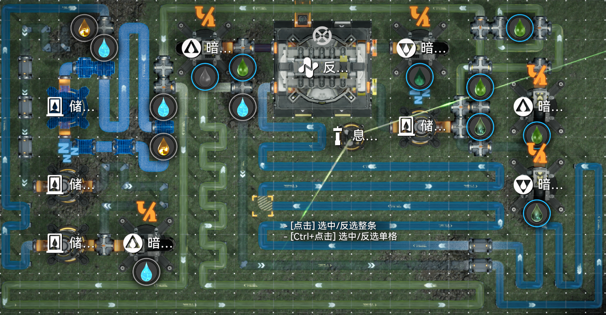

# 单个反应池生产壤晶废液

> 原文：https://docs.qq.com/aio/DTmluZ1diWlpQZldw?p=sZuRWF2FUyP9OGGU2XJnPP　上级：[自适应产线节点元件构造](自适应产线节点元件构造.md)

## 装置目的

使用尽可能少的液化息壤输入（尽可能高的机器利用率）产生30\*46/75/min（18.4/min）的壤晶废液输出。

尽可能高的机器利用率需要：

- 尽可能低频率地切换反应配方

> [多原料配方切换时设备4卡1s输出问题](多原料配方切换时设备4卡1s输出问题.md)

由于小反（即反应池，后文都用小反指代）切换多原料配方时存在[每切换8次反应机器停止运行1s](多原料配方切换时设备4卡1s输出问题.md)（不清楚具体原理，若完全解析可能存在避开的方式）（尚不清楚是每次切换停止运行0.125s还是每8次切换反应机器停止运行1s，目前证据指向后者，未有周密实验），要尽可能低频率地切换配方以提高小反利用率从而增大反应“1清水+1息壤→1液化息壤”的比例实现尽可能少的液化息壤输入；然而小反只有两个出口并且必须用于输出壤晶废液和惰性壤晶废液，所以反应“1清水+1息壤→1液化息壤”的产物液化息壤在反应进行时只能产生50液化息壤，意味着最多连续发生反应“1清水+1息壤→1液化息壤”100s也就是连续进入50水，反应配方切换周期呈现以输入50水和输入x液化息壤的形式。

- <s>尽可能</s>无延迟地切换反应配方

小反无法在任何情况下同时进行反应“1清水+1息壤→1液化息壤”（后文都用息壤液反应代指）和反应“1污水+1液化息壤→1壤晶废液+1惰性壤晶废液”（后文都用壤晶液反应代指），要尽可能<s>降低</s>归零除了上文提到的小反偷睡以外的切换反应延迟，即需要任意反应完全结束时小反中有足够开始反应的另一反应的原料。其中息壤液反应切换为壤晶液反应较为自然，当息壤液反应结束后小反内有污水自然可以发生壤晶液反应；壤晶液反应切换为息壤液反应前如果清水输入使得壤晶液反应能使用的小反槽位低于4时会造成壤晶液反应阻塞。总而言之，<s>尽可能</s>无延迟地切换反应需要切换反应时有下一反应的原料且上一反应不能阻塞。

（趁言大人不注意悄悄加一张图片）（居然是抽鞭子领域大神kokobird大人）

## 重要突破

1. 将污水被使用作为壤晶液反应已开始的信号，完全杜绝息壤液在息壤液反应未结束时进入小反，消灭了息壤液反应切换为壤晶液反应所需要的计时。

2. 引入极低的息壤液固定输入，保证起到信号传递作用的息壤液充足从而避免使用第三介质/避免反馈部分来提供有足够的用于信号传递的息壤液。（路径2逻辑不同故未采用）

3. 控制污水和清水/息壤液等量并在壤晶液反应将结束时保持小反内有一定量的壤晶液和惰壤液，完全杜绝清水在壤晶液反应尚未结束时进入造成壤晶液反应阻塞，消灭了壤晶液反应切换为息壤液反应所需要的计时。（路径1暂未被此突破优化）

## 工程实现

### 路径1：壤晶废液过多时停止液化息壤输入

\[壤晶小反v1\]分享码EF014AE7Oa4eU30aE71A 注意放置后需要如图设置优先级 
输出壤晶废液的自适应区间：大致16.4-21.6/min

#### 外部准备

充足的液化息壤/污水/清水供应

#### 周期简述

本次周期将输入x（由于下图中被选中的结构，x一定大于4）液化息壤和50水进入小反

初始状态：壤晶液反应将开始，小反中50液化息壤50污水50息壤0惰性壤晶废液0壤晶废液。

2s：第二次壤晶液反应发生，第二滴污水进入小反。48液化息壤49污水50息壤0惰性壤晶废液0壤晶废液。

2\.5s：第一滴外部液化息壤进入小反。49液化息壤49污水50息壤0惰性壤晶废液0壤晶废液。

4s：第三次壤晶液反应发生，第三滴污水进入小反。48液化息壤49污水50息壤0惰性壤晶废液0壤晶废液。

......

2(x-3)s：第(x-2)滴污水进入小反，第x滴外部息壤离开79m混管，50清水进入混管（将行进212m耗时106s后进入小反）。48液化息壤49污水50息壤0惰性壤晶废液0壤晶废液。

(2(x-3)+0.5)s：第(x-3)滴外部液化息壤进入小反。49液化息壤49污水50息壤0惰性壤晶废液0壤晶废液。

......

2(x+1)s：第(x+2)次壤晶液反应发生，第(x+2)滴污水进入小反。48液化息壤49污水50息壤0惰性壤晶废液0壤晶废液。

2(x+50)s：第(x+50)次壤晶液反应完成，此时清水进入小反。

2(x+50)s+一次反应切换中若存在的偷睡时间：清水开始反应，100s后息壤液反应结束。

2(x+50)s+100s+两次次反应切换中若存在的偷睡时间：回到初始状态。

#### 反馈部分

当反馈部分的储液罐中积累壤晶废液——也就是小反的壤晶废液产出速度大于下游消耗壤晶废液的速度时——液化息壤不再被允许通过，仅保留左上的结构输入2/min液化息壤保证息壤液反应切换为壤晶液反应前有至少一个液化息壤处于80m混管之中隔离将进入的清水，从而使得小反从下一个周期开始后壤晶废液产出速度低于下游消耗壤晶废液的速度。总而言之，达成产物变多→产物变少的反馈调节。 
其他产物反馈控制的设计及详解请移步[任务板](反应控制与前沿研究.md)中的“前馈与后馈”章节。

#### 限流阀部分

<s>值得一提的是该结构深受4n卡1的困扰，可以看到结构中有不少准入口以增加分流后阻尼，详情见</s><s>[迟滞输出现象(4n物品卡半格)整理与原理探究](迟滞输出现象%284n物品卡半格%29整理与原理探究.md)</s><s>和其他相关页面。</s>已通过[终末地物流bug分析导论](终末地物流bug分析导论.md)解决，具体方式为先不放置罐子及其到上游第一个分流器的管道结构，布置完优先级后最后接入，先接入最下的罐子再接入上面两个，即可通过控制末端消灭四卡一。

限流阀本体是通过用沉积酸在固定路程的环路（储液罐（上）在该环路的作用是改变路程奇偶性，因为储液罐长三格的同时单一储液罐的通过液体延迟可忽略不计）中行进的时间来限制水量为50，并且上一周期的50水还未离开限流阀时下一周期的水无法进入储液罐（下），只有本次周期的50水开始走212m的空管道一小段时间后下一周期的清水才开始进入储液罐——此时沉积酸在固定路程的环路中前进；等沉积酸重新回到储液罐（下）前的汇流器阻止清水输入时下一周期的50水恰好进入限流阀中。

阻塞器是通过混管中沉积酸离开混管限速6/min实现较长计时（但因为10s一周期和不固定时间间隔的清水输入存在相位差，所以并不是准确计时），每次清水抵达阻塞器时需要等待混管中17沉积酸从6/min的限速口中离开从而实现较长计时，作用是延长两次清水输入79m混管的间隔从而允许液化息壤在此期间进入79m混管。

### 路径2：壤晶废液过多时输入50水

注意到【反应池槽位被占满引发入口堵塞】这一信号是可以利用的，我们就可以进一步优化控制而达到由于没有时序控制而“理论不会损坏”的装置。

拆解反应池工作状态和条件：

反应一：清水+息壤→液化息壤

反应条件：

1、由于液化息壤在单台反应池内不允许输出，若清水和息壤均在液化息壤反应至50完成后有残余，则占三槽，此时无法执行反应二所需的四槽反应（重合仅液化息壤，所以其需额外三槽），发生锁死。

2、反应池内在反应未开始时存在三个槽位。

反应二：液化息壤+污水→壤晶废液+惰性壤晶废液

反应条件：

1、壤晶废液及惰性壤晶废液若恒输出，且此刻除反应四槽外另一槽占有物品，则不允许其他物品或液体进入，否则发生其产物卡在虚空槽位无法降落，发生锁死。

2、反应池内在反应未开始时存在四个槽位。

先从液体考虑，假设息壤通入恒过量，可给出以下理论阶段：

1、污水及液化息壤1:1通入反应池，壤晶废液及惰性壤晶废液恒输出，此时反应池内：50污水、50液化息壤、50息壤、0壤晶废液、0惰性壤晶废液

2、检测到末端壤晶废液发生堵塞，停止壤晶废液及惰性壤晶废液输出，此时反应池内：50-a污水、50-a液化息壤、50息壤、a壤晶废液、a惰性壤晶废液（此过程可令壤晶废液与惰性壤晶废液仍然流出一些）

3、即刻通入50清水，此时反应池内五槽均被反应二产物及原料占满，需等待其反应完毕后才能通入

4、反应池反应完毕，接收50清水，此时反应池内：50-b清水，b液化息壤，50息壤，50-p壤晶废液、50-p惰性壤晶废液

5、即刻通入50污水，此时反应池内五槽被反应二产物与反应一产物及原料占满，需等待清水反应完毕后才能通入，与此同时壤晶废液及惰性壤晶废液的通行指令等待接收【污水进入反应池运动】信号

6、反应池反应完毕，接收50污水，且开启壤晶废液及惰性壤晶废液通道，此时反应池内：50-c污水、50-c液化息壤、50息壤、0壤晶废液、0惰性壤晶废液

7、污水及液化息壤仍1:1过量通入反应池，此时反应池内：50污水、50液化息壤、50息壤、0壤晶废液、0惰性壤晶废液

此为一个周期。

仅从逻辑上而言，若50阈值阀控制严格，则该反应池不被允许发生损坏。
