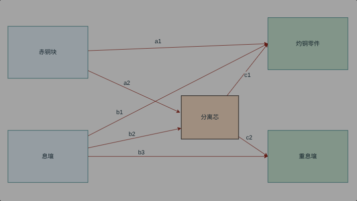

# 反应控制与前沿研究

> 原文：https://docs.qq.com/aio/DTmluZ1diWlpQZldw?p=0iirIEzxWlkfel2jMLIWJJ　上级：[任务板](任务板.md)

## 阻塞生产原理（又名：爆仓动力学）

（咕咕咕，大部头施工中……要忙毕业开始缓更）

<table>

<tr>

<td valign="top" width="50%">

撰写人：kokobird（1-4节）有问题请找我

</td>

<td valign="top" width="50%">

b站

蓝海露花\_kokobird，但我难得看b站，还不如在群里找我

</td>

</tr>

</table>

最后更新：2026年9月13日

状态：1-2节基本内容已经按规划完成，但还会继续完善。3-4节缓慢施工中，同时可参考本人的相关（伪）论文pdf和视频。

### 1 引言

欢迎来到智能生产小课堂，管理员。也许你刚刚按配方建设了简单的产线，对进阶内容跃跃欲试；又或许你已经能独立完成全地区基建的规划与布局，正在百无聊赖地四处冲浪。无论如何，希望本文能在闲暇时光带来或理论或实践的启发，领略到终末地工业独特的魅力所在。也许未来，你也能够建造出别具一格的产线，开创基建的新流派。

📄 [1.1 那我问你，什么是阻塞生产](1.1%20那我问你，什么是阻塞生产.md)

📄 [1.2 采用阻塞生产形式有什么好处](1.2%20采用阻塞生产形式有什么好处.md)

📄 [1.3 术语表（我自己也没法完全定义清楚，不看也罢）](1.3%20术语表（我自己也没法完全定义清楚，不看也罢）.md)

📄 [1.4 前置基础知识（待写）](1.4%20前置基础知识（待写）.md)

### 2 阻塞生产的基本概念与简单例子

本节介绍阻塞生产的一些基本概念和简单例子。掌握理解本节内容，可以设计针对<b>单种原料的多种成品</b>的阻塞生产方案，达成大部分简单的智能生产需求。<b>如果你认为已经掌握此部分内容，可以直接看完2.5节，能看懂就可以直接去第3节。</b>

值得在开篇处点明的是，在讨论阻塞生产时，往往存在<b>理论规划</b>与<b>工程实现</b>两个步骤。在<b>理论规划</b>阶段，我们讨论<u>需要生产什么成品，多少原料，需要什么生产环节，物料的流向与分配如何，优先级如何设计</u>等问题，例如我们分析需求发现需要把120蓝铁中X磨粉Y做蓝药，但这个阶段我们并不特别关心如何造一个X个蓝铁磨粉的产线。

而<b>工程实现</b>阶段，我们讨论<u>设备的布局，具体用什么结构实现优先级，如何优化结构</u>等问题。事实上，在<b>理论规划</b>充分的情况下，绝大部分时候工程实现只需要机械地按照方案进行连线即可，优化布线也不是本文所关注的重点（但是仍然很需要技术含量）。因此，后面大部分内容是侧重于<b>理论规划</b>的分析讨论，而<b>工程实现</b>中一些常用的工程结构则会放在附录中。

📄 [2.1 Hello World：蓝铁矿的命途分叉](2.1%20Hello%20World：蓝铁矿的命途分叉.md)

📄 [2.2 花开两朵：切换型阻塞与平衡型阻塞](2.2%20花开两朵：切换型阻塞与平衡型阻塞.md)

📄 [2.3 受控的受控端 \& 不自由的自由端 （考虑弃用）](2.3%20受控的受控端%20&%20不自由的自由端%20（考虑弃用）.md)

说明：考虑抛弃受控端和自由端的叫法，换成阻塞端和流通端。因为只考虑分流时，外部限制控制受控端再控制自由端；但是考虑汇流时，方向是反过来的，所以不如还是叫阻塞端和流通端，再单独区分控制关系好了。后面的叫法暂时还没调整

📄 [2.3 阻塞端与流通端：你控控我，我控控你](2.3%20阻塞端与流通端：你控控我，我控控你.md)

📄 [2.4 阻塞信号の“超光速”反向传播规律](2.4%20阻塞信号の“超光速”反向传播规律.md)

📄 [2.5 箱子不就是特殊的分流器吗？（核心内容⭐）](2.5%20箱子不就是特殊的分流器吗？（核心内容⭐）.md)

📄 [实战演练 120蓝铁的壤晶-蓝药耦合产线解析](实战演练%20120蓝铁的壤晶-蓝药耦合产线解析.md)

📄 [2.6 空仓？满仓？我们需要更多的加压！](2.6%20空仓？满仓？我们需要更多的加压！.md)

📄 [附录 常见的优先级结构设计](附录%20常见的优先级结构设计.md)

### 3 进阶阻塞生产

还有进阶？！

恭喜你，伟大产线的建设者，当你来到这里时，你已经了解了阻塞生产的基本概念，也就是大概明白了它到底是一个什么玩意儿，以及要如何实现它。现在，更广阔的天地已经为你敞开大门，请稍作休息，然后自由翱翔，并享受无尽的可能性吧。

本节定位为更难的生产需求的阻塞生产方案分析，包括：<b>多原料多成品的自适应配平生产方案，固气、液气转化机零浪费的阻塞生产方案</b>等。掌握本节内容，能够了解如何将阻塞生产原理与随版本更新出现的新需求相结合，达成更复杂的生产需求，并深入理解阻塞生产的动力学规律。

3-4节的大部分内容都会在论文中有更详细的阐述

📎 附件：[溢流供料系统的动力学与稳定性v2.pdf](../附件/溢流供料系统的动力学与稳定性v2.pdf)（2910720 字节）

2026/9/9更新v3版本，内容更丰富，形式更严格，<s>看起来更累</s>。可以直接从第一部分开始看，前面是数学建模的严格抽象化过程。

📎 附件：[溢流供料系统的动力学与稳定性v3.pdf](../附件/溢流供料系统的动力学与稳定性v3.pdf)（4337949 字节）

📄 [3.0 配平，自适应，最大价值产出，叽里咕噜说什么呢](3.0%20配平，自适应，最大价值产出，叽里咕噜说什么呢.md)

📄 [3.1 自动配平思想的萌芽：息壤与源石粉末的爱恨情仇](3.1%20自动配平思想的萌芽：息壤与源石粉末的爱恨情仇.md)

📄 [3.2 最高的山山？！重息壤AND灼铜](3.2%20最高的山山？！重息壤AND灼铜.md)

📄 [3.3 你……你这头白吃息壤的猪！](3.3%20你……你这头白吃息壤的猪！.md)

#### 3.4 中电池满仓切换低电池，赫铜满仓切换灼铜等

### 4 阻塞生产中的若干动力学问题

本节定位为阻塞生产的理论数值分析，提供一些应用于生产设计的结论的数学推导与证明。对于阻塞生产产线设计无需掌握此节内容，仅需了解结论即可。

📄 [4.0 从阻塞流理论基石上建起阻塞生产学的大厦（缓更）](4.0%20从阻塞流理论基石上建起阻塞生产学的大厦（缓更）.md)

📄 [4.1 阻塞生产动力分析的建模：从离散模型，连续模型到机器动力系统模型](4.1%20阻塞生产动力分析的建模：从离散模型，连续模型到机器动力系统模型.md)

#### 4.2 两种原料两种成品的稳定性条件与分流区间

#### 4.3 中间原料的情形（分离芯）

目前存在中间原料的典型情况就是分离芯，如下图所示，生产灼铜需要分离芯+息壤（气）+赤铜块，生产重息壤需要分离芯+息壤（气）。

具体的生产方案，见3.2节，此处仅作数学讨论。

#### 4.4 多种原料多种成品的情形

#### 4.5 达到稳定前的暂态过程的时间估计，振荡周期计算

📄 [4.6 自适应过程与线性方程组求解的等价性](4.6%20自适应过程与线性方程组求解的等价性.md)

## 零激活物浪费到更广泛的自适应

> 具体装置讲解已移动到：[自适应产线节点元件构造](较简单的自适应装置们.md)

“<b>通过阻塞信号切换两种状态</b>，而阻塞信号又受剩余库存量控制，由此形成反馈，最终的结果为稳定的震荡，生产与停工的时间比例<b>自适应地调配出了所需的比例</b>。”——kokobird

## 大周期反应震荡

该课题基础前提二选一（可实现性：1\>2）：

1、工厂生产端对原料的适应区间覆盖两种状态的震荡。

2、可增加缓存来让机器在积累阶段消耗缓存，且机器过量输入不浪费。（存在击穿的风险）

我们存在有三种信号检测手段，分别为针对仓库存储的【满仓信号】、【空仓信号】，以及人为控制的【时钟信号】，由此，我们可两两组合以实现长周期震荡，保证仓库内始终存有原料，用以减少空仓配平课题导致的取货口数目增加，也用于减少直接满仓溢流而受取货波形影响造成的原产地无法存入的损耗。

### 满仓-时钟控制

其设计流程为：检测到仓储无法存入（满仓）→放行反应原料，增加消耗→信号存入时钟延时一段时间后，反应终止，开始积累。此为一个工作周期。

其构图为：

### 空仓-时钟控制

其设计流程为：检测到取货存在空缺（空仓）→阻塞反应原料，开始积累→信号存入时钟延时一段时间后，反应开启，增加消耗。此为一个工作周期。

其构图为：

### 满仓-空仓控制

其设计流程为：检测到仓储无法存入（满仓）→放行反应原料，增加消耗→检测到取货存在空缺（空仓）→阻塞反应原料，开始积累。此为一个工作周期。

其构图为：

### 时钟-时钟控制

<s>我觉得这玩意很诡异兄弟，为什么不直接限速 30p/q unit/min呢.jpg</s>

按照前文，我们可以在堵塞前后均增设时钟，此时等效调控积累阶段时长 T1 s，过耗阶段时长 T2 s，受控工厂消耗速率为v unit/min，T1与T2可调控时钟结构及内容物来更改，若是相同结构，在考虑传导信号迟延恒为 t s时，可以得到其消耗为 vT2/(T1+T2+t) unit/min，可以一定程度上实现p/q的限制消耗。

---

以下是群主老大负责部分内容

## 数字电路控制系统

### 周期点信号的生成

如图所示，利用[基础基建原理-内部阻塞的有理限流器](基础基建原理.md#7R9931VccE38fQGWecdJ9R)，可以做到每100秒输出一个蓝铁矿。

定义一种下游流通的物流，称为点信号物流，在这种物流稳定后，下游的每个物品的输出间隔都为尽可能大的固定时间间隔T的倍数，其中T相当大。显然，上面给出的蓝铁矿物流线是一个点信号物流，其T取100s，称T为该点信号物流的时钟周期，1/T为该点信号的时钟频率f，即10mHz。

### 时钟采样

反馈的要求是，将反馈源的流量状态转化为表示状态的数字信号0和1，其中0代表反馈源无效，1代表反馈源有效，容易想到，如果能够将反馈源的输出进行一定的整流，将其在一定时钟周期内的输出集中在周期内的同一段，例如：

1010101010——\>1110011000

利用[物流原理与前沿研究-滤波器](物流原理与前沿研究.md#f5f4WE5OyQHLDbhWbKgmAv)的结果，可以构造如图的装置，来达到上面的需求。

就可以通过对于时钟周期内某一个点进行采样来比较反馈源在一段时间内的输出总量与某个设定值的大小，如果更大，则采样为1，反之则采样为0。这个设定值的选取由采样点在单个时钟周期中的位置决定。

这个采样装置很好搭建，如图所示：

### 信号放大

我们有时需要复用点信号，利用两次取补可以复制流量，这种功能可以集成为如下的信号放大器，其中每个出口都能输出一个复制信号：

### 信号运算

利用协议存储箱的优先级，可以对点信号进行逻辑运算，其规律与[基础基建原理-逻辑与、逻辑或、逻辑非](基础基建原理.md#EHhBNcPi9z2GuxnXC3X587)中的简单逻辑运算完全相同。这种逻辑运算中的1为点信号物流在单个时钟周期中有一个输出，0为点信号物流在单个时钟周期中没有输出。

需要额外注意的是，如果信号运算的最后一次非运算后没有与运算，就意味着产生的运算将会是一个几乎是满的补带，不符合点信号物流要求，需要额外与高电平信号做一次与。

### 信号还原

经过运算后，需要将运算结果转化为输出，这里运算结果的含义为，如果运算产生了输出信号，则下游在本周期则不会持续输出反应原料。可以构造如图所示的装置来完成这一功能：

其中运算产生的输出信号蓝铁矿进入协议箱后，协议箱被阻塞，电池无法经过协议箱输出，其补带在延时一个周期时间后抵达协议箱出口，如果此时运算产生的输出信号停止，蓝铁输出，协议箱阻塞解除，在下个周期电池将持续输出。反之则蓝铁同时输入输出，蓝铁在协议箱中依然保有一个，协议箱阻塞保持，电池无法被输出。

### 利用延时器来改善性能

[物流原理与前沿研究-滤波器](物流原理与前沿研究.md#f5f4WE5OyQHLDbhWbKgmAv)中提到的滤波器消耗反应元件数和空间数极大，对于实际运用并不友好，而信号还原也要求延时一个周期时间，需要拉很长的传送带。可以通过一个内部流通的限流器来达到延时的作用，比如这就是一个100s的延时器：

利用这个延时器，可以简化信号还原的延时步骤，也就是说，能够依靠一个周期为2T的高电平点信号和一个延时为T的信号还原器来构造一个周期为2T的标准方波信号。依靠这个方波信号，可以将采样器的滤波装置简化如下，大大减少了占地和元件数：
