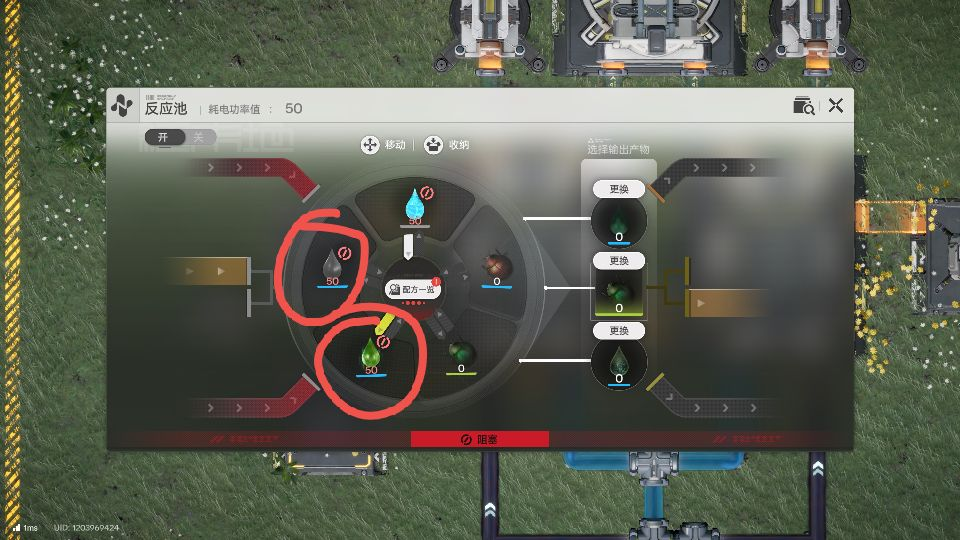
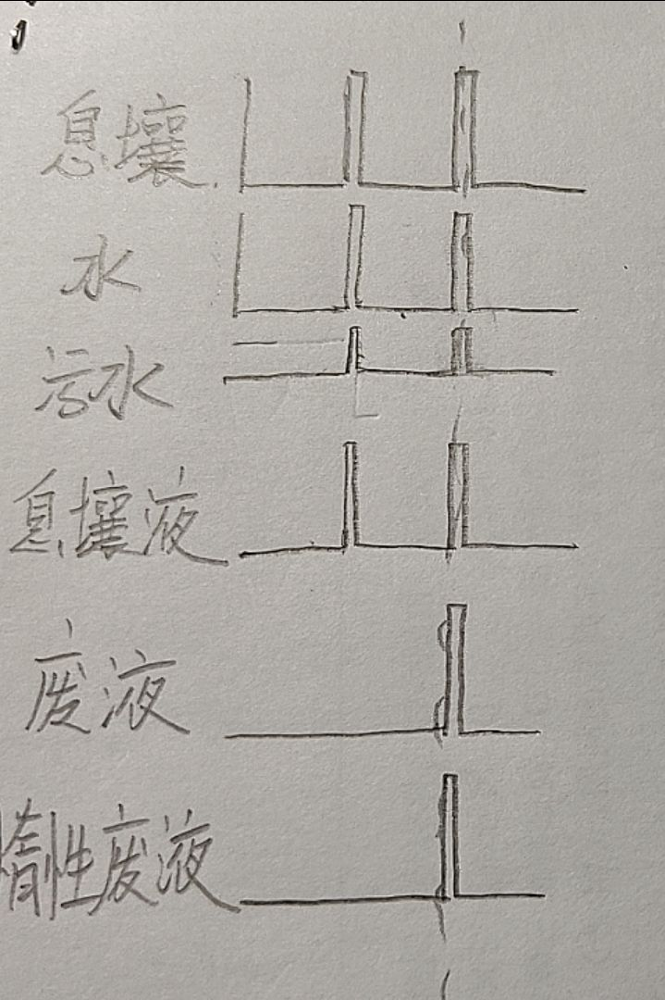

# 反应池混用实用可能性探究

> 原文：https://docs.qq.com/aio/DTmluZ1diWlpQZldw?p=K6SafK2pga7sxAXZOBkB8m　上级：[任务板](任务板.md)

<b>数据表视图：看板视图</b>

| 标题 | 数字 | 单选 | 日期 | 图片 |
| --- | --- | --- | --- | --- |
|  |  |  |  |  |
|  |  |  |  |  |
|  |  |  |  |  |
|  |  |  |  |  |

聊天记录-1

xyIvneu\_:

给句话，反应池能不能压，如果不能，困难在哪里

?caution?caution?:

等我复现一下那个bug

压可以压，但是这个状态感觉十分脆弱

@xyIvneu\_ 就是这么个情况

视频再传。你无法保证不堵塞

合成两种废液

两个配方不能同周期

一旦有一个配方阻塞，那么反应池就不工作了

Cipolla\_:

看来风险不小

c:

所以是同时反应的吗

这不就和箱子一样，要是两种东西进箱子，一种仓库满了，另一种就堵了

?caution?caution?:

必定会同时反应吧

回复xyIvneu\_:给句话，反应池能不能压，如果不能，困难在哪里

@xyIvneu\_ 困难在你很难保证水和污水不积压

madSUN:

谁来描述一下反应池的现状

多个反应不是无法同时进行吗

?caution?caution?:

无法避免死锁问题

madSUN:

我没看懂，究竟是哪一步的问题，是多个反应本来就无法同时进行，还是进行后会卡？

?caution?caution?:

格子只有5个，但是6个要同时存在

一旦反应池某个反应卡死，那么反应池就会直接卡死

无法一个反应不能完成，但是另一个反应继续的情况

应该是，如果A反应卡死了，即使可以通过B反应脱离卡死，但是一旦卡死，机器就停了，所以B反应无法进行

聊天记录-1AI总结：反应池不能压，困难在于死锁风险：两个配方不能同周期，格子不足（5格需同时存6物），一旦某反应卡死，整个池停止，无法通过其他反应自救。

实验结果-1

水\*50+废液\*50+液化息壤\*50+占位符A\*0+占位符B\*0→阻塞

...

