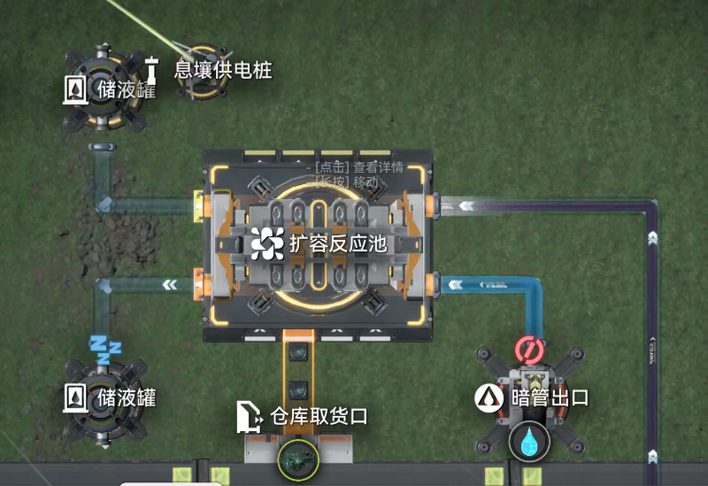
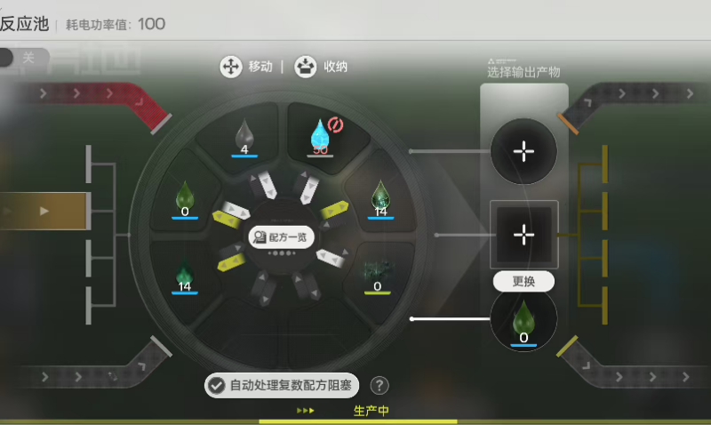
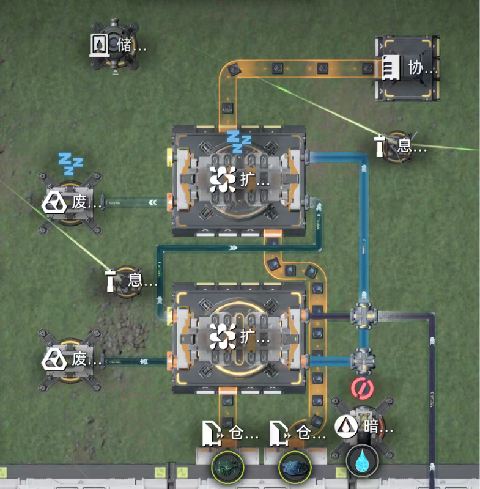
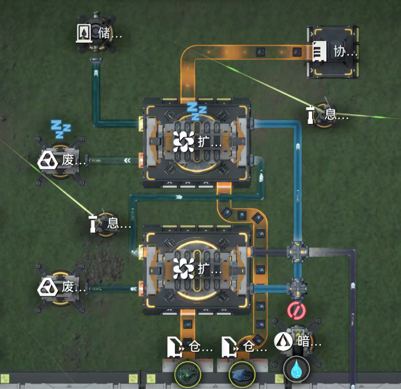
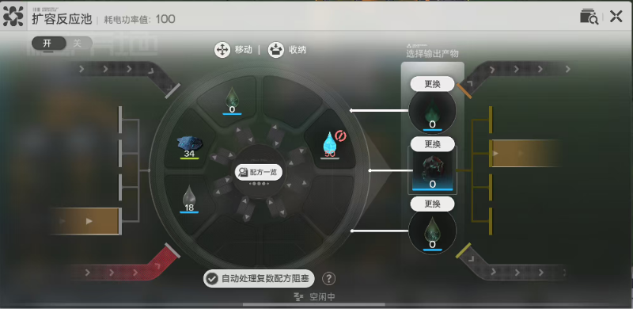
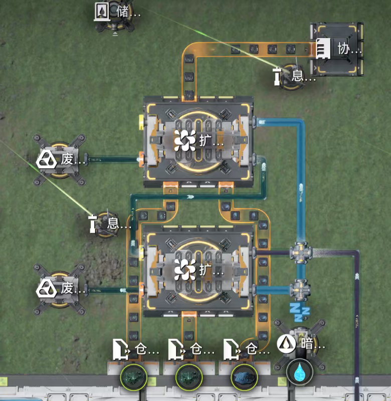
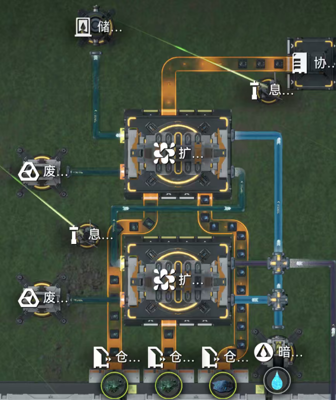
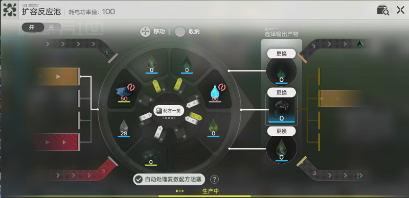
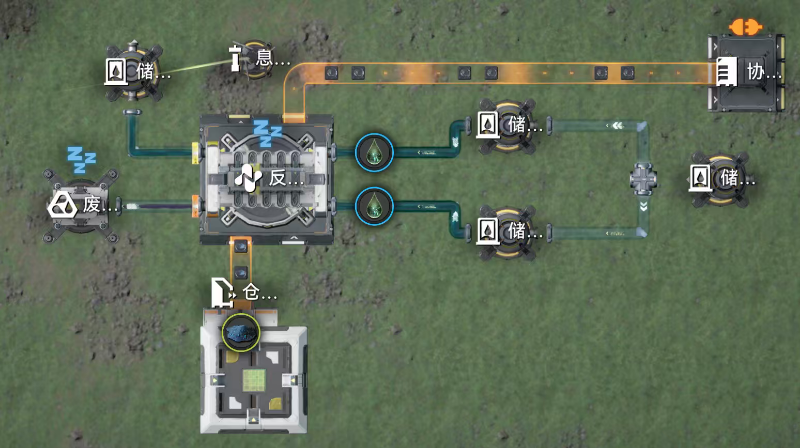
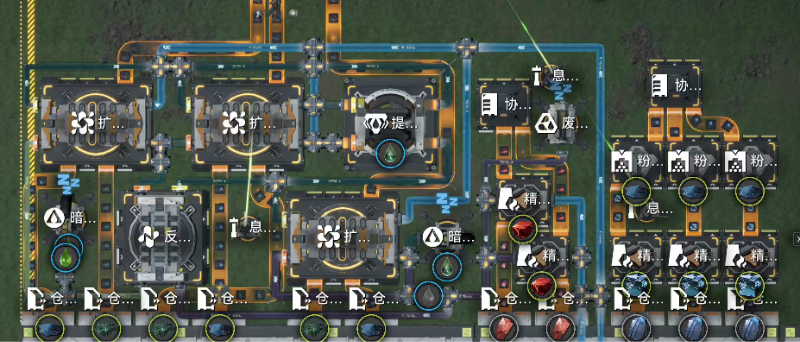

# 反应池物流异常

> 原文：https://docs.qq.com/aio/DTmluZ1diWlpQZldw?p=vgX94GkmwkrVct7UWZN3bJ　上级：[异常物流现象研究及底层逻辑推测](异常物流现象研究及底层逻辑推测.md)

## 反应池/扩容反应池输出优先级初步

当反应池发生反应，设置输出口，则会遇到两种情况：产物优先输出，若溢出则参与下一步反应；产物优先参与下一步反应，若溢出则输出。

实验1：

如图，扩容反应池发生两步连续反应：

息壤+水→液化息壤

液化息壤+污水→壤晶废液+惰性壤晶废液

其中液化息壤为中间产物，此时将输出口设置为液化息壤则并没有输出液体，而直接参与第二步反应，反应池可以正常进行。原因是反应物的系数是1，在生成的同时立刻进入下一步反应。

实验2：

如图，为半速壤晶产线，此时上方扩容反应池发生一步反应：

2\*壤晶废液+蓝铁粉末→壤晶+污水

其中壤晶废液作为反应物，是由下方扩容反应池生产而来，反应系数为2，此时设置输出口为壤晶废液，则壤晶废液不再参与反应，而是直接输出。原因是，让经费液以每2秒1单位的速度进入第二个扩容反应池，当第一滴进入后不能发生反应，而是直接输出，第二滴进入后，由于上一滴已经输出，依然无法反应，以此类推。

实验3：

如图，上方扩容反应池发生多步反应：

息壤+水→液化息壤

液化息壤+污水→壤晶废液+惰性壤晶废液

壤晶废液（原位底物）+壤晶废液（外源底物）+蓝铁粉末→壤晶+污水

此时，参与第三步反应的壤晶废液存在两种来源，下方扩容反应池生产，以及自身生产，将输出口设置为壤晶废液后则不再参与反应，全部壤晶废液输出。原因是，下方反应池的壤晶废液输入时机与自身生产壤晶废液的时机几乎无法同步。而壤晶废液的平均输入周期远小于，管道运输周期，因此不会有壤晶废液留在上方扩容反应池参与反应。

实验4：

如图进行控制变量实验，讲壤晶废液储存在两个储液罐中，提前设置好反应池的出口，以及连接储液罐与反应池之间的水管，将水管选中，并同时移到反应池与储液罐之间连接，发现壤晶为不连续周期性生产（12/min）<i>原因未知</i>

实则为两个准入口进行限速，限速得到的序列是连续1加连续0（取决于输入，满输入开始总是会得到连续的前几滴液体），例如限速12/min会得到\[1\]\*2+\[0\]\*18，限速24会得到\[1\]\*4+\[0\]\*16，限满30则会得到(\[1\]\*5+\[0\]\*15)\*n而不是\[10\]\*n，当准入口同时输入时，反应池积攒液滴（输出2输入4/s），每积累两滴便会反应一次

应用：

利用实验1的逻辑可以制作定量产线《73.75壤晶》适配14.75中融武陵电池。

生产轴为“自己看着办轴”下方输入3条满速息壤，左下角输入18.4/min 液化息壤则对应73.75/min 壤晶生产；输入30/min 液化息壤咋对应81/min 壤晶生产，最核心目的就是将3条液化息壤消耗完。

不难看出上方扩容反应池，以及左上方扩容反应池为不满速，即无法消耗30/min 液化息壤，又有一个出货口空余，因此可以将液化息壤输出，与左下角输入液化息壤汇流进入小反应池生产壤晶废液。由于液化息壤作为反应物，系数为1，因此会优先在扩容反应池内反应，溢出的部分才会输出。

这种方法可以大幅减少管件数量，避免传统的污水输入的精确分流导致的大量管件数上限占用。
