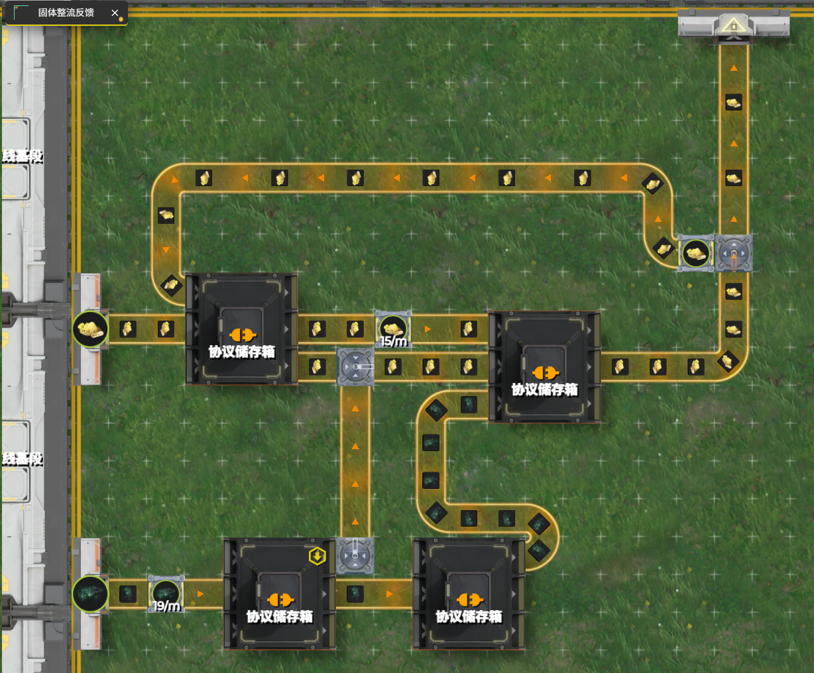
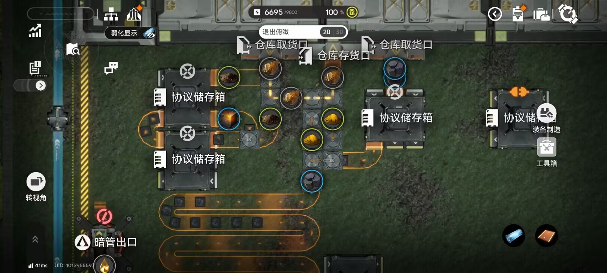

# 固体反馈/整流

> 原文：https://docs.qq.com/aio/DTmluZ1diWlpQZldw?p=pBac1odUlClSBZoxZFu995　上级：[自适应产线节点元件构造](自适应产线节点元件构造.md)

谁开的这页：kokobird

为何：存一下未来科技佬的固体反馈蓝图，有空再详细琢磨以及放到合适的地方

[https://beta.enka.network/endfield/aic/?id=w2N2A5u7H2t0w2](https://beta.enka.network/endfield/aic/?id=w2N2A5u7H2t0w2)

原理：协议箱首先进粉末，然后粉末形成循环；末尾的箱子虽然会进息壤，但是只会先出位置靠前的粉末。等息壤填满中间段缓存后，溢流和粉末汇流，此时箱子中应该已经填满粉末和息壤，汇流后息壤在门口等待，同时把粉末阻断在外面。剩余一条路径只剩半速粉末，因此箱子中粉末逐渐减少，最终息壤开始满速输出，直到中间的缓存排尽为止

全君出击固体整流器，左侧源石粉末和致密粉末形成周期钟，源石粉末进入源石循环，会在循环中卡出一个空位，这个空位会被砂叶粉末进入。原本砂叶粉末循环刚好有三个，堵住右侧碳块输出，砂叶粉末进入一个后会让碳块满速输出，然后再重新关上。

