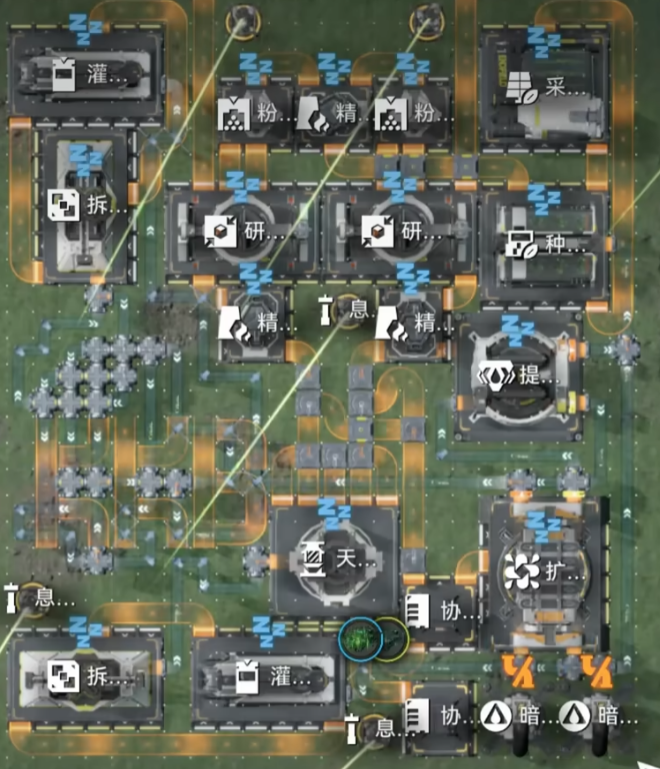

# 基于时钟信号的单烘炉重息壤方案

> 原文：https://docs.qq.com/aio/DTmluZ1diWlpQZldw?p=zfM2Zf9DLRvNytZWjXcqpG　上级：[有理数天有烘炉或单烘炉重息壤生产](有理数天有烘炉或单烘炉重息壤生产.md)

当五年后人们带着塔罗斯高容电池回到重返武陵，或许会挖出这一份失传的科技……

——kokobird

### 演示视频

[https://www.bilibili.com/video/BV1yfdQBFEu7](https://www.bilibili.com/video/BV1yfdQBFEu7)

### 基本原理解说

1. 使用两组拆灌机+一组采种机，利用传送带控制相同周期，同时启动产生稳定同步的时钟信号。每生产14块息壤，10块息壤转而生产1块息壤，4块息壤变为5壤晶废液

2. 传送带设置为17格长度，连同两个机子产生38秒周期（视频中为18格40秒周期，比较稳，后来发现调成17格也可以）

3. 稳定碳块信号用锦草种子控制，做息壤用的水由拆灌机控制，做重息壤用的壤晶废液由拆灌机控制

4. 调整传输传送带和水管的长度来控制信号延迟，来使得生产对轴

### 难点

1. 烘炉门口的分流器轮询顺序不好控制。生产重息壤前必须10块息壤在门口2x5列队，并在两步内塞进。如果分流器中的息壤下一步不向前出而是侧路出，就会多2秒等待间隔导致崩溃（为什么最开始说40秒有点容错）

2. 5壤晶废液必须很快地进入烘炉，但是拆灌机只能按2秒1个生产。所以用管道做了个整流器，通过不同的管道长度让间隔2秒出来的5废液接近同时到达烘炉。然而，这个整流器做起来很麻烦，我调整管道长度多了管道桥以后分流顺序都变了。

3. 生产出的14息壤，如果用七分器其实也有同样整流问题，这里直接让4块息壤优先进反应池，剩下的溢流来解决。

4. 对轴问题。2路息壤输入10块息壤，但是必须要在最短时间内全部进入烘炉。所以水必须要后进，才能让碳块把息壤卡在外面让它们排好队。同时排队时间不能太长，否则就会让后面生产出的碳块卡住，下一轮能容纳息壤进来的空间就不到10个。

5. 基本上允许烘炉待机的时间越长难点会越少。能待机10秒的话以上四点可能直接消失。

### 踩过的坑

1. 试图用固体准入口来复制信号形成同步时钟——下线就烂了

2. 试图用一个拆解机拆两种瓶子达成10水5壤晶废液的顺序，用准入口做分拣——下线就烂了

3. 试图用磁带法把七分五的息壤整流——下线就烂了

4. 试图用管道磁带法来整流壤晶废液——混管时钟我算不清

### 未解之谜

1. 虽然传送带周期是38秒，但是实测下来稳定运行时周期是非常严格的38.5秒。。。。。。找不到0.5是哪来的

2. 1\.3版本更新后烂了，1.4版本更新后竟然没烂
