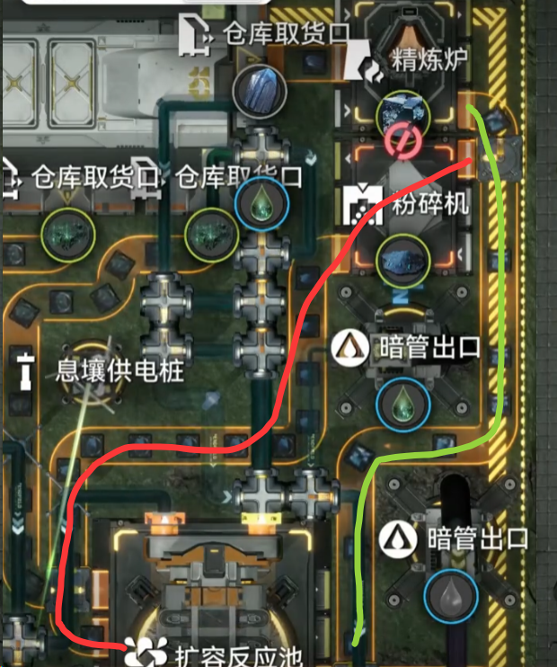
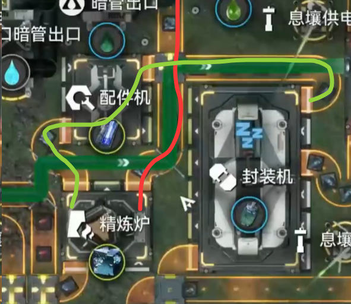
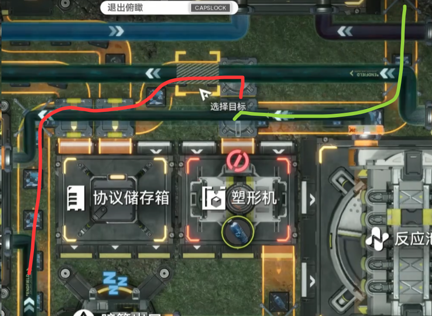
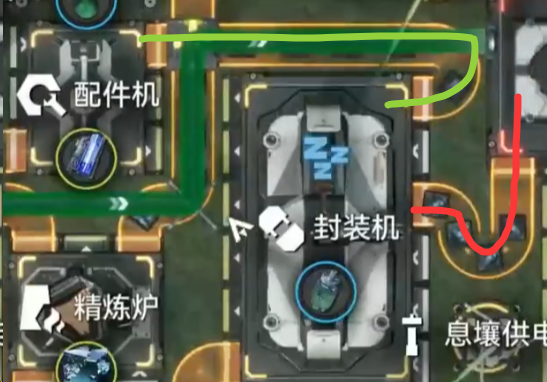
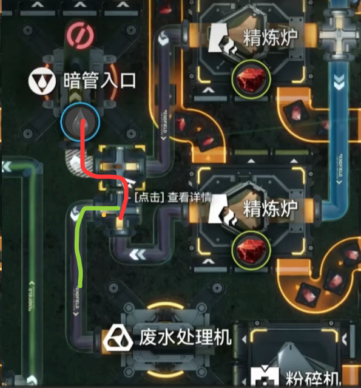
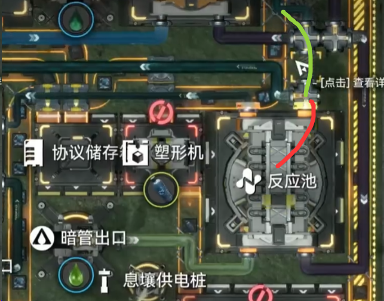

# 实战演练 120蓝铁的壤晶-蓝药耦合产线解析

> 原文：https://docs.qq.com/aio/DTmluZ1diWlpQZldw?p=LYKER2bG6lsxJFNfTATAAO　上级：[反应控制与前沿研究](反应控制与前沿研究.md)

在这个例子中，我们将解析复杂产线中的控制链

### 参考视频

【【终末地/基建】无需空仓的满速口配平方案-首墩，210壤+150铜+120铁+55致密=重息壤赫铜蓝药中电壤晶】 【精准空降到 05:04】

🔗 [【终末地/基建】无需空仓的满速口配平方案-首墩，210壤+150铜+120铁+55致密=重息壤赫铜蓝药中电壤晶](https://www.bilibili.com/video/BV11eYi6hEwt/?share_source=copy_web&vd_source=3b974227efd90987cb6375fbe49d61b8&t=304) — 总之这个方案算是我的1.5作业了，后续不再设计全图产线，准备摸点大范围铜壤自适应的小玩意儿。  壤晶产线来源高级干员君@樊二のいすぼくろ赛高  ，暂时不具备完全自适应功能，粉末少了会使息壤用量减少，粉末多了会堵粉末，但是不用净水节点会传导到铜壤模块重息壤一侧。 @bear-冰梦潇湘  改了一个应龙关和首墩全部合并到主基地的版本，但是很难放出来，要求主基地外不能有管道件，并且要跨区拉惰气和酸液，实在有需要再私他或者我  应龙关部分 BV1RdtU6TECG 记得抄带息壤气放生的版本，或者自己改一下把混酸机的24息壤直接供应四台固化机运作，这样不会堵。 景玉谷部分直接抄最强基建BV1tgbW6RE6W或者@Xersyo  的1.4方案，都差不多  另一个不建议抄的原因是放了这个马上又要换龙泡泡，不如直接把壤晶丢主基地拉倒（

### 蓝铁路线

我们的需求是：有120蓝铁，73.75拿去做壤晶，剩下46.25的做成蓝药

以下是一种情况，由于空间限制，没法把蓝铁摇匀后均分做成蓝药，也无法设计较大占地的精确分流器，因此需要逐层采取阻塞生产，并控制线路流量满足生产要求。我们希望在蓝铁块的分配中（<u>类分流性质</u>产线）的控制方向为：<b>外部条件→受控端流量→自由端流量</b>。要形成这一点，必须使得<u>设计中的受控端实际形成阻塞，而设计中的自由端实际保持流通</u>。

首先，扣除60蓝铁磨粉做成60壤晶部分。剩余仍需做13.75壤晶。我们当然希望保证壤晶的蓝铁供应充足，再剩余的流量供应蓝药，因此控制方向为：<b>壤晶产量→蓝铁粉供应量→蓝药的蓝铁供应量</b>。因此，必须使得蓝铁粉供应成为受控端。正好，30蓝铁通过精炼后，<u>只需不到一半即可够用</u>，因此采用<b>二分</b>即可。如图所示，红色线路从粉碎机到反应池一路阻塞，形成受控端，理论速度为15-，实际速度为13.75；而与此同时，绿色线路直接向下运送蓝铁块，成为自由端，理论速度为15+，实际速度为16.25。

同时，下路有满速30蓝铁进入精炼炉，它全部用于供应蓝药，但是需要<b>处理配件机和塑形机的流量分配</b>。此处，由于蓝药末尾的封装机会使得塑形机和配件机的流量同步，<u>无论选取哪端作为受控端，最终均能成立</u>。简单起见，直接从精炼炉各拉两条带子输出，<u>等同于二分</u>。此时由于上方已经有16.25蓝铁进入塑形机，实际我们知道两机器只需要23，因此此处二分向上进入塑形机的路线（红线）会形成阻塞，所以它成为受控端，理论速度为15-；而一路进入配件机（绿线）成为自由端，理论速度为15+。控制链为：<b>受控端蓝铁流量→自由端蓝铁流量</b>

在塑形机处，如果简单地采用同时汇入，会使得两路各消耗约11.5蓝铁。但上路输送下来16蓝铁，如此自由端无法畅通。因此，必须优先让自由端蓝铁优先进入塑形机，下路输送的受控端蓝铁补足剩余。此处形成控制：<b>上路自由端蓝铁流量→下路受控端蓝铁流量</b>

最终，在封装机处，由于封装机部分具有<u>类汇流</u>的性质，塑形机-灌装的阻塞一路，其流量反而受到配件机流通一路的流量控制，即：<b>进入封装机自由端蓝铁流量→进入封装机受控端蓝铁流量</b>。

由此，形成总控制链：壤晶生产速度→蓝铁粉生产量（上路受控端）→上路蓝铁块去塑形机量（上路自由端）→下路蓝铁块去塑形机量（下路受控端）→下路蓝铁块去封装机量（下路自由端）。这里，下路蓝铁块去塑形机的量还受到封装机的工作速度影响，而由于封装机的类汇流性质，其工作速度受下路自由端影响，因此事实上还存在一个下路自由端到下路受控端的反向控制，形成一个控制的环路。而这个环路入口就是上路蓝铁块去塑形机的量。

> 应当如此理解：下路蓝铁块-封装机-塑形机构成了一个合理运作的模块，它能顺利接收外部输入的蓝铁块，将其转化为更多的蓝药。

### 产线中其余的阻塞情形

污水部分，壤晶产线需求污水为34.65。上路30污水具有较高的优先级，能全部进入暗管中。我们希望下路暗管污水能补足需求，同时又不堆积能被处理掉。此时需求只剩4.65，因此二分后，红色路径为受控端，速度为15-。绿色路径为自由端，速度为15+，和我们的计划一致。根据受控端实际需求，自动平衡到4.65和25.35。

如果不设置上路污水的优先级，则其流量会受到以汇流器视角的自由端限制（红线），使得上路污水阻塞。

小反应池出口的汇流器，具有降低反应池出口优先级的功能。此处，出口管道需求流量为32.9壤晶废液，该位置另一支路为2.5壤晶废液和净流节点的12壤晶废液，而反应池由于液化息壤供给充足，最多能提供30壤晶废液，因此出口管道必定阻塞。若用普通方法把反应池输出和2.5+12壤晶废液汇流合并，由于14.5壤晶废液不到32.9壤晶废液的一半，也能得到反应池阻塞降速为消耗18.4液化息壤的结果。只不过把汇流器放在反应池出口更稳一些。

[2.5 箱子不就是特殊的分流器吗？（核心内容⭐）](2.5%20箱子不就是特殊的分流器吗？（核心内容⭐）.md)

[2.6 空仓？满仓？我们需要更多的加压！](2.6%20空仓？满仓？我们需要更多的加压！.md)
