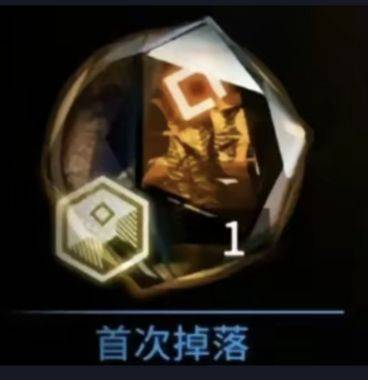

# 指路板

> 原文：https://docs.qq.com/aio/DTmluZ1diWlpQZldw?p=v1G6i7lCYtLa2g34Hcn8AR　上级：[任务板](任务板.md)

[当期蓝图答疑指路](1.5智能最大毛产.md#yDRC0KVhKSyTDPUKCagyWK)

bug分析（[物流bug](终末地物流bug分析导论.md)做了；机器bug还没摸透）

[货组价格](浮动货组价格规律.md#fCpkUqDX7dSuluwlnNAo1Y)相关

[信用商店](信用商店出货相关.md)

均匀理论（[均匀度](四种均匀性的等价关系.md)、[震荡发电均匀度下限](蓄电量极差计算.md)、[完美均匀构造理论](完美均匀有理数输出.md)）

[理想系统的流量理论](理想系统的流量理论.md)（[分流器分流比例相关内容](通用分流器理论整理.md)、[限流器流量计算、理想系统流量规则、通用限流器构造理论](以理想系统限流器为核心的阻塞流研究.md)、[1/n限流器构造理论](关于%201_n%20阻塞流的一些研究和搜索.md)）

非标准机器理想化（[前馈](较简单的自适应装置们.md#yBdOI7e7VxOKNuCxesmFBs)/后馈，理想情况设备特点与要求）

[自动配平](反应控制与前沿研究.md#DWqjx1xibQYINqsd5UEFOm)/爆仓动力学（还没太整明白）

[可用产线插件](自适应产线节点元件构造.md#kXUgC0EOTqKh09bVHL9EPN)（壤晶小反，断电反应池之类的东西）

可用蓝图（当期蓝图：[1.5最大毛产](1.5智能最大毛产.md)、[1.5智能全物品](1.5智能全物品.md#Mu3OZc5tLKlcIjlHny4exR)、[龙泡泡活动](625挡可调自适应小龙泡泡+重息壤配平玩具.md#mZCeICjJW8LES9bKRR9lVC)）

特殊物流设备设计原理（什么混带限速，基本控制模块之类的）

<table>

<tr>

<td valign="top" width="50%">

</td>

<td valign="top" width="50%">

</td>

</tr>

</table>
