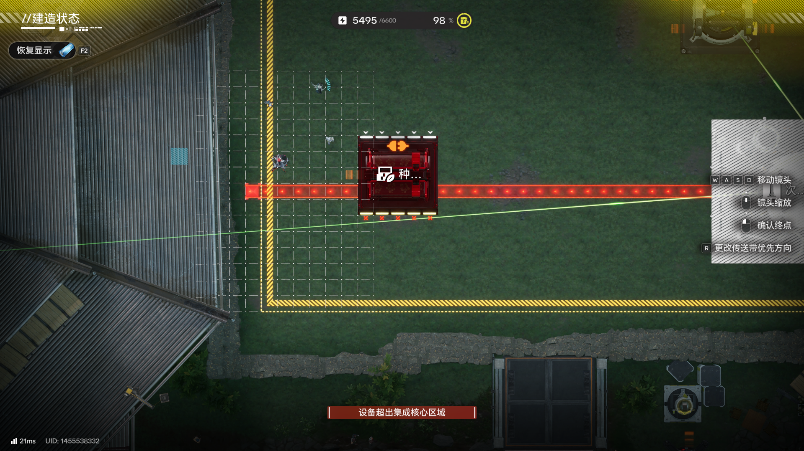
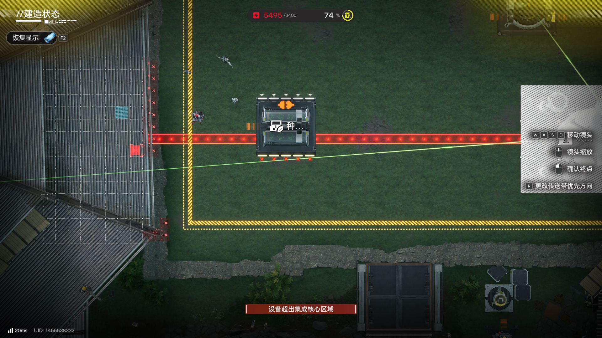

# 管道及传送带的分层现象

> 原文：https://docs.qq.com/aio/DTmluZ1diWlpQZldw?p=feO9v8bYahZcFBLue5rPC3　上级：[异常物流现象研究及底层逻辑推测](异常物流现象研究及底层逻辑推测.md)

众所周知，管道从高处向低处拉存在多层管道可以放在同一位置，传送带有类似的高处低处不在同一位置的效果，如图所示

传送带在后一张图中与种植机不在同一层，不发生位置冲突（种植机没有标红）。不过由于超出区域，无法放置下来进行研究

此外，应该将管道不同层导致的特别现象记录，例如可以叠放，连接到分流/汇流时的特性（优先？轮询？）
