# 终末地物流bug分析导论

> 原文：https://docs.qq.com/aio/DTmluZ1diWlpQZldw?p=oWvEDex0yuejzwpcwzyxUP

本文档上次更新 2026/09/20 13:09:03，暂时缺乏校对。

## 前言

文档中的"上/下游"通常指邻接的物流元件或工厂；只有在明确说明"上/下游工厂"时，才指物流元件链末端的工厂。物流元件指传送带、管道、分流器、汇流器等物流器件；工厂指协议存储箱、精炼炉、封装机等设备（除了反应池、提纯机、协议核心和仓库取存货口）。

本篇介绍目前终末地底层逻辑导致的 bug 研究成果。行文上每一节都先给出现象或疑问，再在真正用到它的那一刻补上解释所需规则。过程中必要的大量实验被略去，直接给结论。

<i>灰色正文表示不太重要的内容，通常面向已经了解过终末地物流 bug 的人，而不是第一次接触的人。</i>

## 层级化理论与迟滞输出现象

先从一个现象看起。给分流器的下游接一段固定长度的传送带，让它连续输出数个物品，它会突然停一下再继续。这个现象称为<b>迟滞输出</b>。 
经过实验，卡顿的出现频率与图中红框传送带的长度相关：每通行 4n 个物品出现一次卡顿。

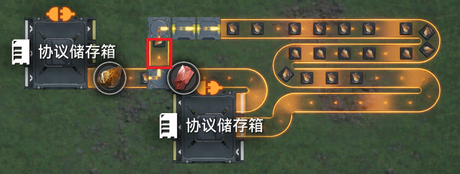

可以推断：当上游意图输出而下游还未输出时，上游会卡顿一个最小单位时间，等下游空出来之后再输出。

故而提出以下<b><i>元件计算输出论断</i></b><i>（残缺）：元件在计算时都是推出到下游，而不是从上游拉取。</i>

结合实验中观察到的"4 卡 1s"——四个最小单位时间等于 1s，所以最小单位时间即 1/4s。屏幕上能显示的最小时间是 1s，攒够 4 个 1/4s 才凑齐 1s 显示出来，于是看起来就是"4 卡 1s"。

<b><i>单位时间：最小单位时间</i></b><i> 1tick = 1/4s；</i><b><i>最小服务器数据通信</i></b><i>（能显示出不同）</i><b><i>时间 </i></b><i>1s = 4tick；</i><b><i>传送带的最小单位距离</i></b><i> x = 1tick / (2s/格) = 1/8 格。</i>

要解释"上游为什么会先算"，得先知道游戏是怎么给元件排序的：游戏使用从<b>下游向上游</b>的 BFS 为每个物流元件赋予层级，层级越小的通常在下游；每一层内按照类放置顺序计算输出，每个元件被计算到时输出。

<b><i>层级化理论</i></b><i>（残缺）：游戏会使用从</i><i>下游向上游</i><i>的</i>[BFS](https://oi-wiki.org/graph/bfs/)<i>算法为每个物流元件赋予层级，层级越小的通常在下游，每一层内按照类放置顺序计算输出。</i><i>其与阻尼基本等价。</i>

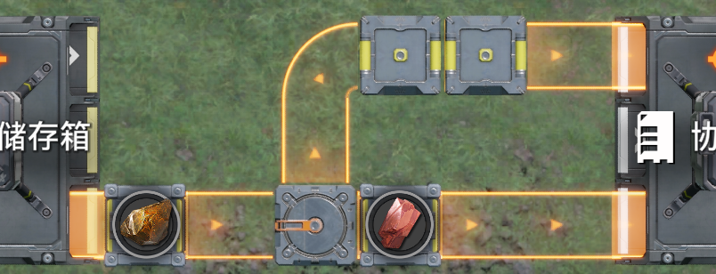

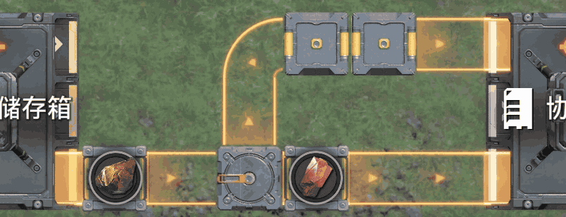

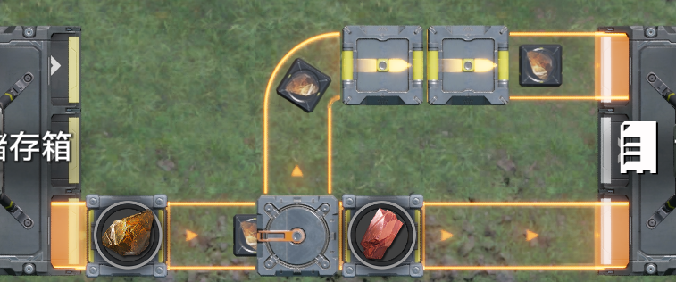

层级化通常让下游层级较小，但 BFS 的特性使得它也能做到"下游层级反而更大"，这时上游反而比下游先算——上面那个结构卡住的原因就在这里。

那为什么公式里会出现一个 n？一个合理的推断是：只有当下游 n 个物品位都塞满、且上下游物品对齐时，上游才无法输出。而要让"下游没塞满时上游一定能输出"成立，就要求下游元件在输出时，其内部物品的移动比上游更早。由此得到使动-转移-移动模型。

<b><i>使动-转移-移动</i></b><i>：元件计算时会先使下游元件内部物品移动，再转移自身内部物品到下游，最后移动自身内部物品。</i>

在该模型下，上游元件 <code>0x</code> → 下游元件 <code>0x,0x,X</code>（两个即将转移的物品和一个空位，右侧为下游；7x\~0x 表示位置，7x 表示刚进入该格，0x 表示即将离开该格，X 表示该格上没有物品）时，会先使下游变成 <code>X,7x,7x</code>，随后上游的 <code>0x</code> 再转移到下游的 <code>7x</code>——下游未满时不卡顿。而 <code>0x</code> → 下游 <code>0x,0x</code> 时，使动无法把下游的物品再往下游推，转移无效，上游卡顿 1tick。

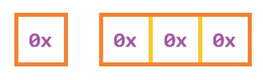

## 优先输入/输出/汇入现象

接着看另一个实践中经常遇到的现象：优先汇入。

通过简单的实验，可以得到其规律是汇流器上游先放先算。

<b><i>优先汇入</i></b><i>（残缺）：汇流器上游先放优先进入汇流器。</i>

<b><i>优先汇入</i></b><i>：汇流器计算后，上游中先算者若为非分流器，则优先在该汇流器的非分流器的上游元件中轮询让物品进入汇流器中；若先算者是分流器，则该分流器的物品优先进入汇流器。</i>

如何为先算？层级小先算或者在同层中先算（同一层级间的顺序逻辑会在后续说明，现在可以认为先放先算）。

为什么会这样？显然的，先算者先输出到汇流器先占据位置，很合理；为了实现汇流器轮询 又保证汇流器只计算输出，就只能让它的上游计算输出时负责选择轮询；但是分流器因为还要写轮询输出的代码，所以漏了这个选择轮询的代码。进而进一步补充<b><i>元件计算输出论断</i></b><i>：元件在计算时输出；非分流器在尝试输出到汇流器时，会使得该汇流器的其他非分流器上游也输出，并且由汇流器的轮询计数器决定接受哪一个；分流器在输出时会根据其轮询计数器尝试决定输出方向。</i>

面对工厂时，也有类似现象，由于工厂的存储能力远比汇流器强，而且与"汇"没什么关系，所以叫做优先输入。

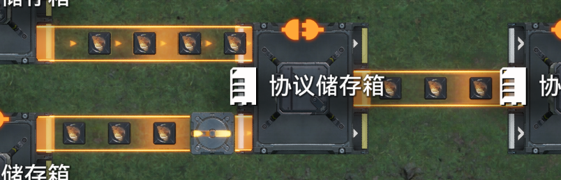

<b>优先输入</b>：输入元件先算优先，非分流器优先时在非分流器之间轮询。

虽说工厂入口与汇流器非常相似，但是此时有另一个现象说明工厂出口与分流器差距极大。

简单实验后可以得到

<b><i>优先输出</i></b><i>：工厂出口直接连接的元件，层级越低越优先，非分流器共享最低优先级；最优先的那个如果是非汇流器，就在非汇流器内部做轮询；如果层级相同，则先连接上游者优先。</i>

优先输出为什么会发生？首先需要对工厂正常的输出进行<b><i>工厂计算输出论断</i></b><i>：工厂为了正常轮询输出（不出现类似分流器的迟滞输出现象），会记录每一个下游非汇流器元件，在都计算过了后再计算输出。</i>但是其作为汇流器的上游时，会因为 元件计算输出论断 中提到的问题而直接输出，导致不能等到所有层级更高的非汇流器输出，自然就不会向非汇流器轮询输出了。取货口与反应池出口采用的是完全不同的逻辑，必须等到整个物流系统之后才输出，因此不受上述轮询影响。

这里提到一个特别的情况，层级相同时，先连接上游者优先，同样的，因为元件计算输出论断中的问题，汇流器的其他上游（显然与工厂出口属于同一层级）计算时也会使得工厂输出。（具体的同一层级的计算顺序问题留在后面再说）

优先输出现象作为<b>检查元件层级的工具</b>非常方便，本身也是优先级产线构建的重要一环。

## 末端序的提出

在使用水管的过程中，经常会出现"单格水管会卡水"之类的说法。在了解了迟滞输出现象之后，不难想到两者之间存在某种关联：研究相关案例容易发现，这种现象有时会因为下游放置顺序的改动而消失。把它换到传送带来直观测试。

这里采用准入口限速 6/min 模拟"液体消耗只有 0.5/s 而输入为 2/s"的情况，并将下游输出汇流，方便观察相位。

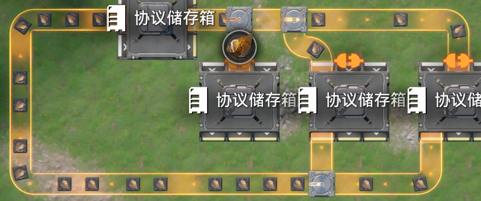

实际搭建后可以观察到第一个分流器处会出现迟滞输出——图中表现为有的物品对齐传送带箭头、有的没有，这说明分流器的层级比传送带更少。接下来用优先输出现象来更方便地观察层级变动。

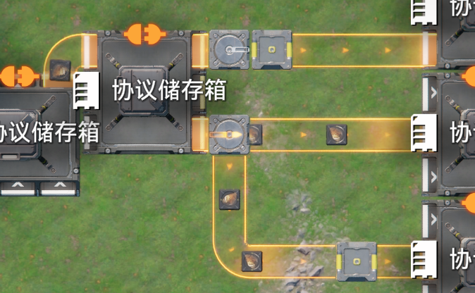

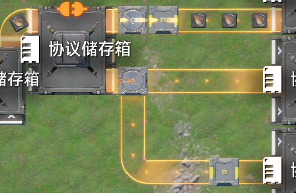

通过修改分流器下游两个箱子的放置顺序，可以改变分流器的层级。这说明并不是所有最下游元件都会一起落在层级化 BFS 的初始层里——即使连在一起的元件，层级化过程也可能经过多次 BFS 才完成。

由此需要一个特殊的数据结构：它要求有序，每个元素包含多个元件、作为一次 BFS 的初始层。由于它存储的是下游末端元件，所以这里称为<b>末端序</b>。

末端是指什么？如图所示，指贴近工厂入口的物流元件。

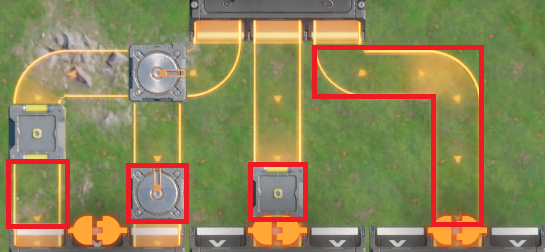

<i>末端元件：与工厂入口连接的物流元件。</i><i>特别的，没有输出的物流元件也可以视作工厂。再特别的，分流器如果有其他</i><i>[非工厂入口的下游](终末地物流bug分析导论.md#vSoy4l00CJ8AS1vizNCMdL)</i><i>，则不为末端元件。</i>

<i>末端序：物流元件连接下游时，如果成为了末端元件，就会加入末端序。此时，如果末端序中已存在下游工厂相同的其他末端元件组，则合并到其中；否则作为单独的组，排在末尾。</i><i>特别的，分流器加入末端序时，不会合并至其他组，而是排在末尾。</i><i>当然，当元件不再是末端元件或被删除时，离开末端序。</i>

上面这段可能有点绕，可以参照一个同结果的描述：末端序就是末端元件按与工厂连接的顺序排序；再检查每个工厂，把同一个下游工厂的非分流器元件，合并到其中位置最靠前的那一个作为一组。这个描述更加针对结果而不是过程。

末端序的每一个单元都会作为一次层级化 BFS 的起始层级；不同次的起始层级有着同样的层级序号，且每次计算的层级不会覆盖之前的计算结果。

<b>示例 1</b>

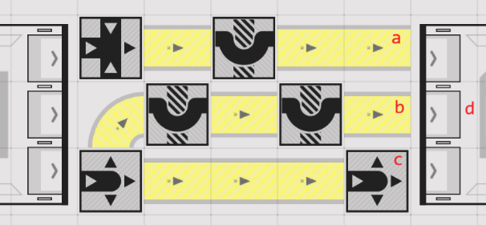

其中 a、b 连接同一个下游工厂，c 连接特殊的下游工厂。最先放置的是哪个元件，结果不同：a、b 中有一个先放置时（记作 \[(a)\]），剩下两个再放置，得到的末端序是 \[(a,b),(c)\]；c 先放置时（记作 \[(c)\]），得到 \[(c),(a,b)\]；否则，无论 abc 的放置顺序如何，工厂都会以逆时针的方式即 c、b、a 的顺序连接，得到 \[(c),(a,b)\]。

两种情况分别对应上路优先和下路优先。通过同时重放 a、b（不同时的话还是会合并两次、回到原本状态）或者重放 c，可以改变结果。

<b>示例 2</b>

无论如何，三个末端元件都会合并，所以总是从下路输出。

<b>示例 3</b>

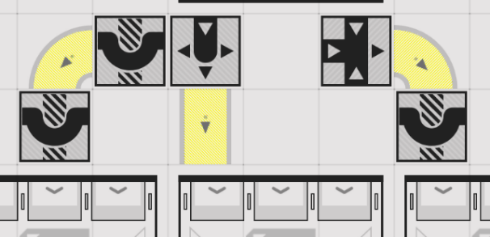

三个末端元件总是不合并。通过重放改变左中两个下游箱子的放置顺序，或者重放末端元件，可以改变优先级。

<b>示例 4</b>

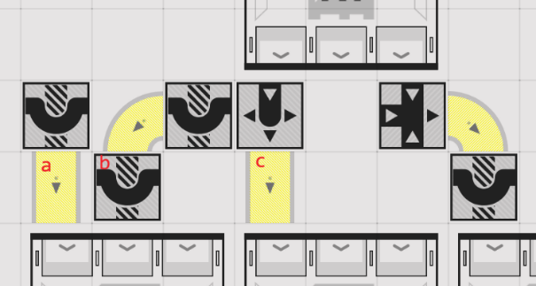

让 a 和各协议箱先放置、bc 后放置，之后重放 bc 不会再改变优先级（b 总是合并到最靠前的 a 处）。

当分流器作为汇流器上游时，由于它可以存在其他下游，其层级可能不为"汇流器层级+1"，此时需要对优先汇入具体情况具体分析。

## 末端序影响下的迟滞输出

在定义末端元件时提到过：没有输出的物流元件也可以视为工厂并参与末端序运算。这促使我们得到一个非常方便的迟滞输出结构。

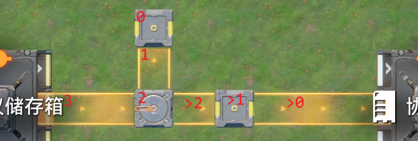

只要标着 0 和 1 的两个元件先放，就可以直接创造一个排名非常靠前的末端序单元；之后再连接后面 \>0 方向的工厂输入，就能保证触发分流器的迟滞输出。

对于前面提到的"一格管道"问题，现在也能拿出解决方案了。

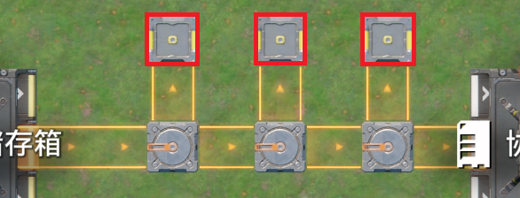

只要把红框（称为"接近分流器链上游的元件"）重新放置（移动重放相当于断开后重新连接），使以它们为下游工厂的末端序单元被重新排到后面去，让分流器的层级以最高的情况计算，就不会再卡顿了。

有了这样简单的迟滞输出结构，就可以很方便地构造 4n/(4n+0.5)=8n/(8n+1) 限速器，比较经典的分母有 n=3→25=5\*5、n=6→49=7\*7、n=9→73，而且这样做的限速器的均匀性甚至超过了传统的通过序列定义的均匀性上限。

需要特别说明的是：由于分流器有其他非工厂下游就不会作为末端元件，所以下面这样的结构

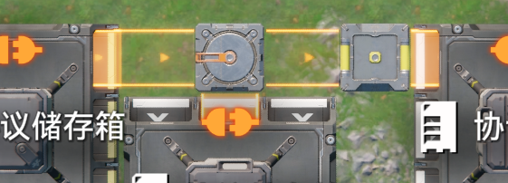

下侧协议箱无论如何放置，都不会从它开始计算层级。同理，下面这个结构也是一样。

## 同层级内的计算顺序

在上一节里换来换去地试元件时，会遇到一个特殊情况。

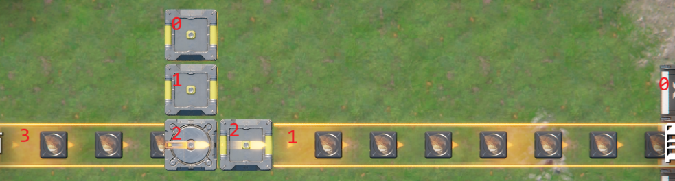

按常规思路，如果分流器后放，就该是 2 个物流桥先算，不会迟滞输出；但实践中，在这种情形下重放 1 传送带，仍然会出现迟滞输出。

实际上，<b>同一层级内，先有下游连接的物流元件先算</b>。同时，物流元件放置时总是先连接上游、再连接下游。

在多数情况下，这几乎等价于放置顺序，所以有时也会直接使用放置顺序。大部分时候可以作为特例看待。在补上了末端序和同一层级内的计算顺序后，层级化理论才算完整了。而层级化理论、两个计算输出论断、使动-转移-移动模型、单位时间 共同组成了物流网络计算基本逻辑。

## 对迟滞输出结果优先汇入/优先输出溢流问题简析

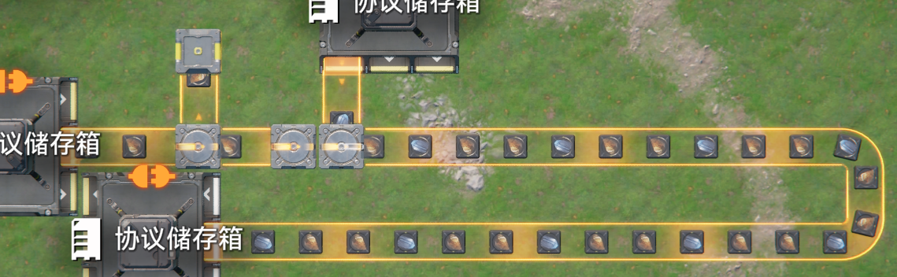

如图所示结构，触发迟滞输出结果后，源石应该每过一个卡一个最小单位，为什么优先汇流不是一蓝铁矿一源矿？

通过观测可知：当蓝铁矿汇入时会使得迟滞输出结构停止输出，此时分流器下游传送带和再下游的分流器都各有一个源矿，分流器触发迟滞输出，其内部源石矿迟滞 1tick 输出，这里留下的空位在前面两个源矿之后，而蓝铁矿插入的正是这个空位，所以是二源矿一蓝铁矿。

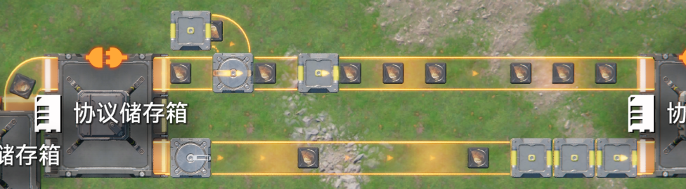

如图所示结构，触发迟滞输出结果后，得到上 3:下 1 的输出，其原理是什么？

观察可知：当源矿来到分流器下游传送带后，上路一共进入三个源矿，此时分流器想要再输出，触发了迟滞输出，上路优先输出路无法再接受物品，输入的物品就向次优先的下游输出了；而迟滞输出也因为有一格空位，不会导致上一轮三个源矿之间的迟滞影响下一轮的输入。

## 分流器分流失败问题简析

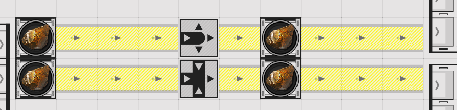

如图所示的结构综合了多种因素产生物流bug，初步实验呈现两种结果，如图所示（准入口用于方便的控制某一路是否流通，并且将部分上下游分割）

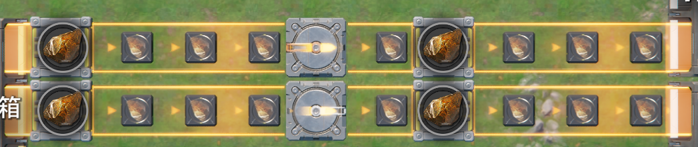

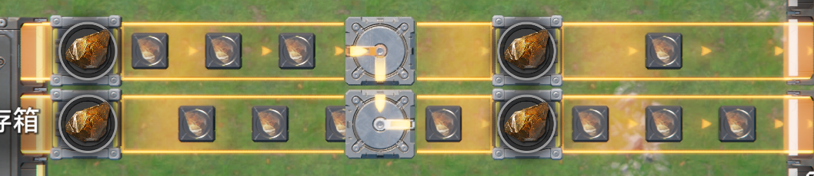

左图中分流器没有进行分流，称为分流失败，右侧分流器进行分流，并且阻塞汇流器的另一上游，称为成功分流。接下来我们分析不同情况。

首先，分析不同末端序情况的层级

　　当右下的末端元件在末端序中靠前时（相当于重放分流器下游箱子）

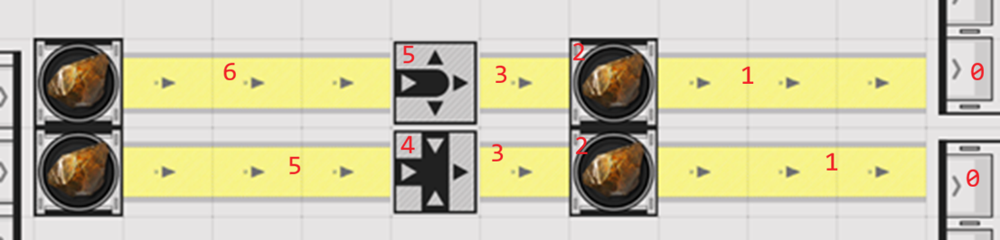

　　此时触发优先汇入，当分流器先放置时成功分流。

　　\[0\]当右上的末端元件在末端序中靠前时

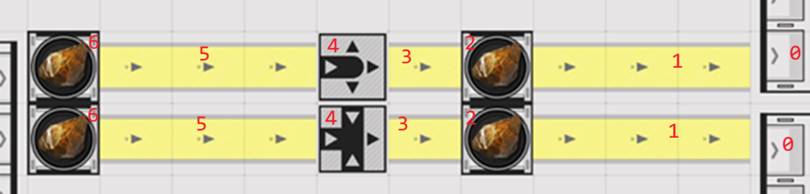

　　此时需要考虑同层级内的计算顺序问题

　　　　当汇流器比分流器先放时

　　　　　　\[1\]如果分流器比汇流器下游传送带先放置(先连接)则分流器先算

　　　　　　\[a\]此时汇流器尚未输出，分流器就尝试输出，自然无法成功分流，分流失败

　　　　　　\[2\]如果分流器比汇流器下游传送带晚放置，分流器后算

　　　　　　汇流器输出后，分流器比汇流器上游传送带更早计算（层级低），可以输出到汇流器，成功分流

　　　　\[3\]当分流器先放时，由于汇流器放置时先连接上游，无论如何都是分流器先算，得到\[a\]

为了验证\[0\]中不同情况下的计算顺序问题，我们使用计数准入口断开分流器下游路和汇流器上游路的流通，显然\[1\]\[3\]总是触发迟滞输出，\[2\]则不会。这一点的实验验证交由读者自行尝试。

## 如何避免迟滞输出问题简析

一、迟滞输出是由于分流器的一路输出层级低，而另一路层级高，而分流器按照层级较低的路计算了层级。

a.对于这一点，我们可以修改末端序，使得分流器按照层级较高的路计算来解决。

b.此外，对于无法稳定末端序的情况（例如要保存为蓝图），可以将两路层级调整至一样高。这样无论是按照那一路计算层级，都不会出现分流器层级比下游低了。

c.在高层级路添加协议箱/储液罐之类的设备。可以隔断层级计算，降低高层级，进而实现b的结果。

二、迟滞输出要求分流器下游堆满之后分流器还要再输出。

d.对于这一点，我们可以通过增长分流器下游元件，提升其存储量来解决。如果其足以存储连续的所有输入，则不会触发迟滞输出，或者将迟滞输出的结构视为限速器8n/(8n+1)，提升n增加其最大通行速度，这样即使触发了迟滞输出，总体流量也可以不变。

e.让分流器有多个同样物料过滤的输出方向，然后再汇流，此时每个下游不到一半的输入不会堆满，自然不会触发迟滞输出。

关于这个问题，读者可以自行思考还有什么方法可以避免，这里列出的只是笔者见过的方法，而非全部。

## 关于管道运输与特殊的工厂们

相比传送带运输，管道运输存在特殊性质：

- 同一根管道中不允许同时存在两种液体。

- 管道的最小距离为 1/2 格。这使得液体流速是固体的 4 倍，也使得触发迟滞输出时现象略有不同。

此外的内容目前认为完全一致；在定性迟滞输出、或者只有单种液体的情况下，多数时候可以用传送带代替管道来做可视化研究。

相比其他工厂，(扩容)反应池、存货口取货口、协议核心非常特殊，这可能与其特殊的选择输出模式有关，它的输入可能存在优先输入和轮询输入随机变化的情况，即使是两个非分流器之间也不会总是轮询输入；反应池的输出遵循类似元件轮询而非工厂轮询的逻辑，取货口和协议核心则随机表现出优先级和轮询；紧贴它们出口的汇流器则存在特别的优先汇入现象，反应池总是低优先汇入；反应池和取货口在关闭后都不再输出（取货口以前没有开关www）

提纯机的输出是配方固定对应输出口的，不能通过一个口输出所有液体，自然没有优先输出现象。

## 工厂配方切换卡 1tick 问题

目前认为工厂的运行满足以下逻辑

<b><i>工厂的运行</i></b><i>：在1tick内，以(物流网络与工厂输入输出)→结束生产→开始生产的顺序执行操作，由于输出至少是第2层级，输入依赖第1层级，所以总是认为工厂的输入在输出之前。</i>

生产过程时长比描述的少1tick

如图所示

tick1 收下a 开始生产A

tick2 收下b

tick8 结束生产A

tick9 输出A 开始生产B

tick10 收下a

tick16 结束生产B

tick17 输出B 开始生产A = tick1，在一个周期16tick内生产AB各一个

tick1 收下a 开始生产A

tick8 结束生产A

tick9 收下b 输出A 开始生产B

tick16 结束生产B

tick17 收下a 输出B 开始生产A = tick1，在一个周期16tick内生产AB各一个

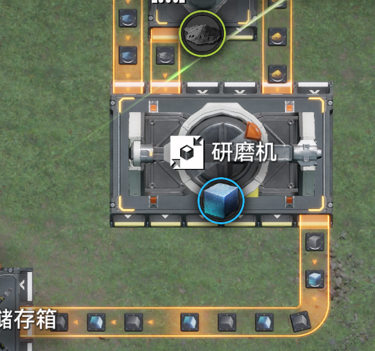

tick1 收下a

tick9 收下a 开始生产A

tick10 收下b

tick16 结束生产A

tick 17 输出A

tick18 收下b 开始生产B

tick19 收下a

tick25 结束生产B

tick26 输出B

tick27 收下a 开始生产A = tick9，在一个周期18tick内生产AB各一个

## <b>阻塞传播卡1tick现象</b>

如果箱子/储液罐是满的，阻塞信号穿过它时会延迟 1tick。具体来说，下游由阻塞变流通，协议箱输入但没有空位无法输入，直到下1tick协议箱输出，协议箱输入才成功，空位才穿过协议箱。这一点并不显著：普遍情况下即使延迟这 1tick，只要输出是 n-tick 一次，输入也会是 n-tick 一次；可以通过串联的箱子来查看该延迟的累计（每个箱子延迟 1tick）。

## <b>反应池反应输出优先关系现象</b>

这一部分目前存在问题有待解决

我们说反应池的输入物料优先输出，反应生成物料优先反应。

前者是因为反应池输入在输出前，同1tick内总是输入后立刻就输出了，物料没有留到开始生产的时机，自然没有开始生产。

后者则是因为生产结束后立刻就是生产开始，自然也没有等到输出的时候，此外存在一个虚空槽位猜想，认为反应结束后的物品会放在虚空槽位，导致其不需要实际槽位放下产物就可以再进行下一步。

反应池在反应结果满时，若同时有外源输入和生产结果试图进入反应池时尝试输出一滴液体，会先输出生产结果。用上面的顺序读就很自然：输出与结束配方发生在同一 tick 内，而这次输入要等到下一 tick 才生效。

## 附录

这些并不被视为bug，不过你都看到这里了，说不定会想要编写一个完美模拟程序，那么你可能会想知道这些。

#### 关于轮询顺序。

存在两种按照不同逻辑运作的轮询

<b><i>元件轮询逻辑</i></b>：总是按连接顺序轮询，一旦不能输入/输出就跳过，不存在优先输出。在什么都没有输出的时候是从第二个连接的开始的。工厂的输入也遵循元件轮询逻辑 
<b><i>工厂轮询逻辑</i></b>：按最久未输出的顺序轮询，不能输出时在下一次会先轮询到，存在优先输出。在什么都没有输出的时候是按照连接顺序。

#### 关于放置元件时的连接顺序。

认为总是先连接上游，再连接下游，并且按照逆时针方向尝试连接。

#### 关于蓝图放置顺序

认为蓝图在保存时会使得 传送带/管道 后放置，其余的工厂、物流元件放置顺序无法正常确定，只有两个工厂/物流元件或者两个传送带时会按照选择顺序保存。在放置时认为是按照保存的顺序放置，也就是同一个蓝图只会放出一种结果，但是由于无法稳定保存顺序，所以这只能保证 传送带/管道 后放置。

简单来说就是传送带/管道在其他之后，此外都无法确定顺序。放置顺序+选择顺序 影响 保存顺序，保存顺序保存后几乎不变，保存顺序几乎等价于放置顺序。

## 关于尚未完成的研究或未解释的现象

读者须谨记：本文档所记并非攻破鹰角拿到源码得到的成果，而是以大量实验为基础、伴随诸多猜想而来，所以并不总是正确。

尚未完成的研究：

- 没有下游工厂的环带：目前尚且无法判断其中末端元件为何者、计算顺序如何。

- 反应池、存货取货口的规律：其输入输出尚且存在某些特殊现象，对它的描述并不完全精确。
