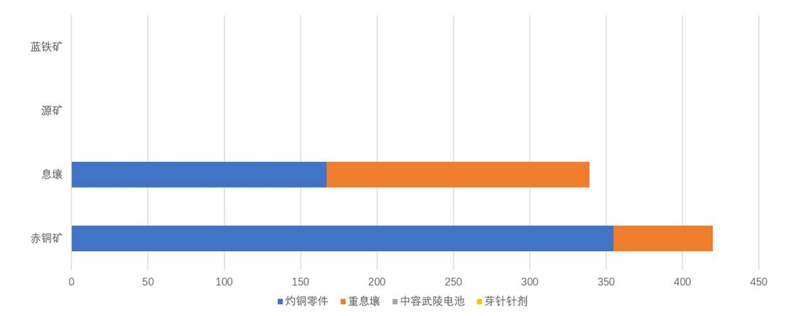

# 自动配平讲解 脚本

> 原文：https://docs.qq.com/aio/DTmluZ1diWlpQZldw?p=QRCRN4XRWoQFThOwgWYo8s　上级：[「雪凇幽梦」版本](「雪凇幽梦」版本.md)

## 脚本草稿02（2026.09.20 23:26）

### 0. 为什么要自动配平

在1.4版本伊始，气体工业的加入带来两位大人：

<b>\<（°0°）\>灼铜大人和重息壤大人\\（°0°）/</b>

我的天哪灼铜大人售价70，超凡脱俗的复杂工艺震撼人心！

【一段展示灼铜工艺复杂性的长难句神秘文本作为画面】

经过各路up各显神通的计算，

我们现在知道所谓最高产能就是多多地做灼铜大人和重息壤大人，加上两位前朝显贵中容武陵电池大人和芽针针剂，呃，小人，

最好是一点铜和息壤都不要剩下，源矿和蓝铁也是一样。

为了做到这一点，up们先是给出了14.4灼铜24重息壤的配平组合，然后给出了更极限的14.2灼铜26重息壤的配平组合，后者非常非常接近理论解！

呃但是我只是一个普通玩家，比起压榨产能我想说：

<b>原料都配平掉了，自己要吃的优质芽针针剂没原料做了怎么办？我的矿没开齐，不够产线用怎么办？我不想拉净水节点，这破暗管谁爱拉谁拉，但是极限产能必须要用怎么办？我的谷地没拉满，没有超库存传输......（考虑单独占据画面）</b>

欸，普通玩家还要求这多，那为什么不用使用原料更少的低产量产线呢？

那咋了，我就是想要高产能又能满足这些要求，不行吗？

<b>于是经过我们的努力，自动配平产线就此诞生。</b>

### 1. 局部自动配平

一上来就理解四种原料自动配平然后做成四种产物也太难了，我们先只制作灼铜和重息壤。

【画面：灼铜零件、重息壤的复杂配方先展示】

虽然灼铜零件和重息壤的配方十分复杂，但是先不要被配方吓到，归根结底，它们终究只是使用同样的两种原料：<b>铜</b>和<b>息壤</b>。

让我们忽略掉中间的弯弯绕绕吧。

【动效：复杂配方淡出，只留下“铜+息壤→ 灼铜 /  铜+息壤→ 重息壤”的简化图】

现在请想象这样的一个账号：

l  铜产量 360/min；

l  息壤和息壤气产量拉满；

我们只做灼铜和重息壤，此时的产出是这样的：

【画面：当前铜和息壤条件下，灼铜和重息壤配平，用柱状图形式呈现】

柱状图示意

现在把剩余矿点都连上，铜产量提高到 510/min。

【动效：柱状图里新增加的铜用虚线框标出】

多出来的这些铜怎么消耗掉呢？如果我们增加重息壤产量，

【动效：保持重息壤柱高亮，重息壤柱增加灼铜柱降低，此过程中息壤柱始终被完全占据，赤铜柱自然地减少了】

欸不对不对，怎么铜消耗还变少了！那增加灼铜柱产量呢？

【动效：保持灼铜柱高亮，灼铜柱增加重息壤柱降低，此过程中息壤柱始终被完全占据，赤铜柱自然地增加直至占满代表新增加的铜的虚线框部分】

欸对了对了，这样一来多出来的铜就全部被消耗掉了。

<b>也就是说为了配平多出来的铜，灼铜产量要增加而重息壤则随之减少。（考虑单独占据画面）</b>

【动效：当前柱状图中用更浅的颜色高亮在此时的柱状图时原来的灼铜柱长度和重息壤长度作为对比，高亮的时机与“灼铜产量要增加”和“重息壤则随之减少”对齐】

但是要自动配平的话，得让产线随着铜增加自发地增加灼铜产量、减少重息壤产量。

这该怎么做到呢？这里先给出结论：

【这两句话可以考虑单独占据画面】【或者配一个体现这种供料顺序的动图】

l  <b>息壤：先喂饱灼铜产线，剩下的给重息壤。</b>

l  <b>铜：先喂饱重息壤产线，剩下的给灼铜。</b>

### 2. 供料顺序不能反

为什么必须是“息壤先喂饱灼铜产线，铜先喂饱重息壤产线”？我们一个个来看。

#### 如果灼铜产线的息壤不够

让我们回到上一节的例子中，刚连上矿点的时候：

【画面：新增加的铜已用虚线框标出的柱状图】

尝试增加灼铜产量，但是息壤供应不够，增加到一半卡住了！

【动效：保持灼铜柱高亮，灼铜柱增加重息壤柱降低，此过程中息壤柱始终被完全占据，赤铜柱自然地增加，但是加到一半停止了，此时让在息壤柱的灼铜柱闪烁红光表示供应不足】

这时我们可以看到，多出来的铜没有被全部消耗掉。

【动效：铜柱没有占满虚线框部分——剩余的虚线框部分闪烁红光表示没有被消耗掉/利用干净】

<b>于是我们得到结论：想利用掉增加的铜，必须先用息壤喂饱灼铜产线，保证它息壤足够。</b>

#### 如果重息壤产线的铜不够

类似的，我们增加息壤，然后尝试增加重息壤产量。

【动效：保持重息壤柱高亮，重息壤柱增加灼铜柱降低，此过程中铜柱始终被完全占据，息壤柱自然地增加，但是加到一半停止了，此时让在铜柱的重息壤柱闪烁红光表示供应不足】

结果是类似的，因为重息壤产线的铜供应不足，所以我们没花光增加的息壤。

【动效：息壤柱剩余的虚线框部分闪烁红光表示没有被消耗掉/利用干净】

那么结果和灼铜产线缺息壤的情形非常类似了，想要利用掉增加的息壤，必须先用铜喂饱重息壤产线，保证它铜足够。

【画面：上一节的结论[讲解：自配平产线和自适应装置](讲解：自配平产线和自适应装置.md#wVS0ApujtfVS9Z5WXU56RO)】

到这里我们已经回答了为什么必须是“息壤先喂饱灼铜产线，铜先喂饱重息壤产线”，但是我们给出的结论还有一部分——“剩下的息壤给重息壤产线，剩下的铜给灼铜产线”

【画面：仅有重息壤柱子的柱状图，铜柱空缺的部分仍是用虚线框表示】

我们试想如果只做重息壤，那重息壤产线自己当然用不掉这么多铜，

【动效：高亮铜柱空缺部分的虚线框】

那这些剩余的铜就需要让灼铜产线来消耗掉。

【动效：柱状图中开始出现灼铜柱并不断增加，直至铜柱被填满】

因为我们需要所有原料被利用干净，所以一定需要一条产线来消耗掉剩余的原料。方便起见，这种专门吃“其他产线用剩下的某种原料”的产线，我们叫它：

<b>末端 产线（</b>可以考虑单独占据画面<b>）</b>

那么灼铜产线可以称为铜这一原料的末端产线，也就是说灼铜产线是消耗铜的产线里最末尾的产线。

【画面：仅有灼铜柱子的柱状图，息壤柱空缺的部分仍是用虚线框表示】

类似的，只做灼铜用不掉的息壤则是由重息壤产线来消耗掉，那么重息壤产线可以称为息壤这一原料的末端产线。

【动效：柱状图中开始出现重息壤柱并不断增加，直至息壤柱被填满】

### 3. 更多原料！？

【画面：原本的铜和息壤柱状图，但是坐标轴上加入了源矿和蓝铁】

截至目前，我们处理了两种原料 铜 息壤 两种产物 灼铜 重息壤

但是1.5版本我们还有另外两种原料 源矿蓝铁另外两种产物 中电 小药（用小字标注 小药上小字标注芽针针剂 中电上用小字标注中容武陵电池）

现在我们把他们加进来：

【动效：从“铜、息壤 → 灼铜、重息壤”扩展到“铜、息壤、源矿、蓝铁 → 灼铜、重息壤、中电、小药”】

是不是一下子眼花缭乱了？别心急，别忘了我们的目的是让所有原料均被消耗，所以每一种原料都需要一条产线来消耗掉其他产线用剩下的部分——<b>也就是说，我们可以让原料和末端一一对应！</b>

可能有细心的观众已经发现了，在之前的讲解中有时我们会用特定颜色来表示原料和产物，其实相同的颜色就表示原料与之对应的末端：

铜-灼铜 息壤-重息壤 源矿-中电 蓝铁-小药

在之前的讲解中我们已经知道了消耗铜为主的灼铜产线是原料铜的末端产线，消耗息壤为主的重息壤产线是原料息壤的末端产线，

那么，消耗源矿为主的中电产线就是原料源矿的末端产线，消耗蓝铁为主的小药产线就是原料蓝铁的末端产线！

【画面：中电柱、小药柱随着讲解依次高亮】

同样的，和灼铜重息壤类似，为了让中电产线可以顺利吃完源矿以及让小药产线可以顺利吃完蓝铁，我们需要让中电产线除了源矿之外的其他原料都供应充足，也就是中电产线所需要的息壤和蓝铁都被优先供满，

【动效：高亮息壤柱和蓝铁柱中的中电柱】

而小药产线只吃蓝铁，所以就没有需要供应充足的地方了

我们可以把这些整理成一张表格：

|  |  |  |  |
| --- | --- | --- | --- |
| 原料 | 先保证谁 | 剩余给谁 | 末端 |
| 铜 | 重息壤 | 灼铜 | 灼铜 |
| 息壤 | 灼铜 中电 | 重息壤 | 重息壤 |
| 源矿 | 无 | 中电 | 中电 |
| 蓝铁 | 中电 | 小药 | 小药 |

### 4. 小结

【画面：铜、息壤、源矿、蓝铁 → 灼铜、重息壤、中电、小药】

整套自动配平，只需要抓住三件事：

1\.     <b>一种原料对应一种末端，就像是铜和息壤分别对应灼铜和重息壤。</b>

2\.     <b>每种原料都先喂饱其他产线，然后剩下的原料才给末端，比如铜先喂饱重息壤产线然后剩下的铜给到作为铜末端的灼铜产线。</b>

3\.     <b>末端不一定是一种产物，也可以是多种产物的组合。</b>

这就是自动配平的铁律了，接下来让我们在实际的产线中去实现这套逻辑。

### 5. 更多样的末端

【画面：1.5 智能最大毛产示例】

末端只能是一种产物吗？当然不是！

比如在 1.5 智能最大毛产中，当赫铜未满仓时，赫铜和灼铜产出保持 1:2。这时铜的末端就不是单纯的灼铜，而是：

<b>1:2 的赫铜和灼铜。</b>

【动效：铜流向“赫 + 灼”的组合图标】

其实可以把多种产物组合成的末端看成是一个自定义配方的产物，那就和前面的单产物作为末端的情形一样了。

### 6. 回到实际的产线中去

让我们将目光放回到最强基建（智能最大毛产）的实际产线中去，一个个找出被优先供应的产线：

l  灼铜产线不是息壤的末端产线，所以灼铜产线用的息壤被优先供应【展示灼铜产线的息壤液的加压和分离芯产线的息壤的加压】

l  重息壤产线不是铜的末端产线，所以重息壤产线用的铜被优先供应【展示分离芯产线的铜的加压】

l  中电产线是既不是息壤的末端产线也不是蓝铁的末端产线，所以中电产线用的息壤和蓝铁被优先供应【展示中电产线的息壤的加压和蓝铁打粉产线的蓝铁的加压】

l  小药除了蓝铁没有其他组成嘞，所以它只是蓝铁的末端产线，没什么被优先喂饱的

不要被增加取货口保证优先供应的思路限制了！有很多很多的办法可以做到优先供应的效果：

洪炉直连溢流以优先供给息壤；满仓震荡；先加压一条带，用这条带溢流；还有我们所未涉及的方案......

### 7. 为什么支持自行添加产线？

在结尾我们来讲点简单的放松一下吧，

还记得视频开头所说的“普通玩家需求”吗？【展示对应视频片段】

到目前为止我们所讲述的大部分内容都是自动配平产线如何实现自动配平。但如果手动加了一条新产线，自动配平产线会怎么处理这个新产线的原料消耗？

其实可以把自行添加的产线所消耗的原料当成没有进入自动配平系统，就像没开的矿点一样。去掉这部分被使用的原料后，自动配平产线会把剩余的原料尽数转化为我们所希望得到的产物。

<b>于是，我们的既要又要的狂想，就这样实现了。</b>

最后留一个思考题：自行添加产线到什么程度，或者说什么样的原料比例，自动配平产线将无法将剩余原料完全配平？（等待10s播放片尾）

片尾：

那么产线的自动配平/自适应讲解到这里就结束了

让我们在下一期“装置的自适应”再会！

【画面：成员签名】（待议）
