# 芽针/荞花放生机

> 原文：https://docs.qq.com/aio/DTmluZ1diWlpQZldw?p=CJl0m5vqcG6gAnt645AywF　上级：[任务板](任务板.md)

负责人：kokobird

最后更新：2026年9月21日

这是什么：利用产线自身消耗以及垃圾桶，生产尽量多的荞花或者芽针，从而刷爆手册中的芽针/荞花计数，<s>吓一跳yj服务器</s>

有什么实际价值：没有，纯闲的蛋疼

## 当前功德：4.32M/day放生速度

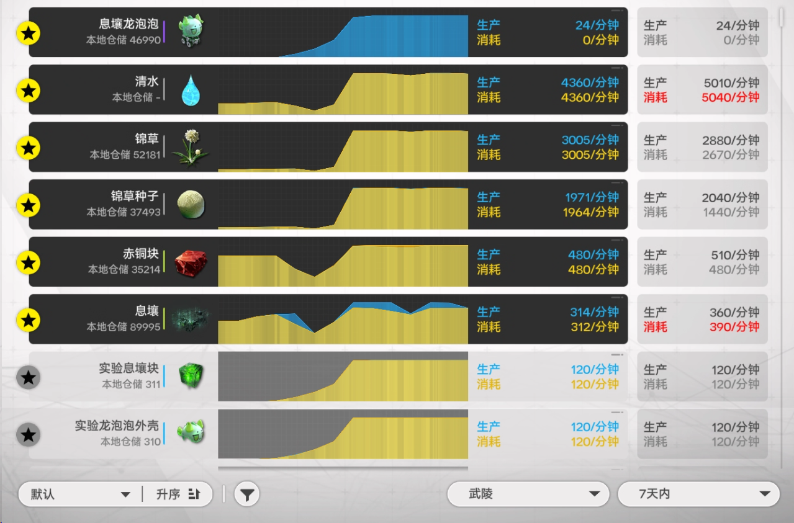

MAN，WHAT CAN I SAY？

实际发现占地面积限制最大，水倒是基本管够（就是要拆掉不少东西）

这套方案基本撑满了全速电池线+4条小龙泡泡+360息壤的所有面积

当前四条龙泡泡够换完券，以后以后再说吧

挂机一个月即可1.3E，16个月可达21E

雷霆图

我们不生产水，我们只做大自然的搬运工

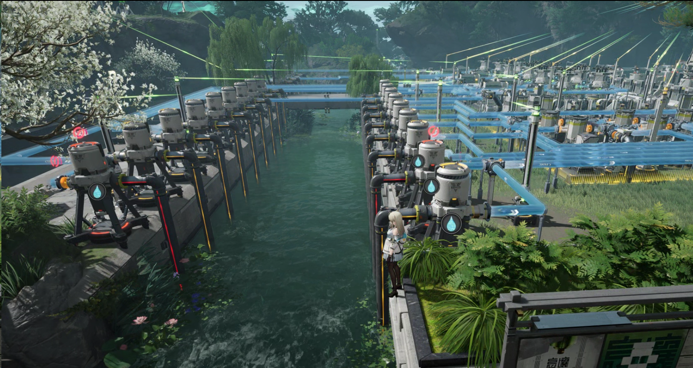

四基地全图，可以看到并没有特别密集。

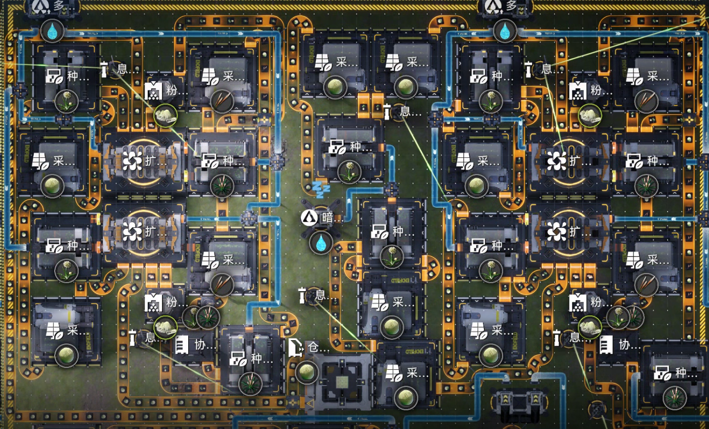

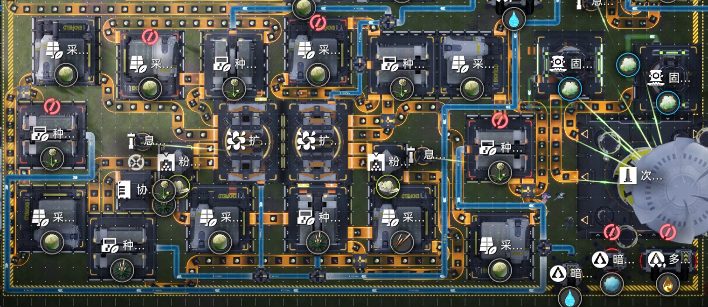

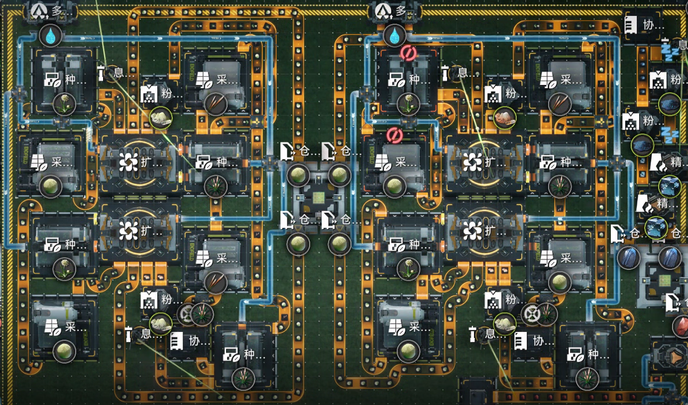

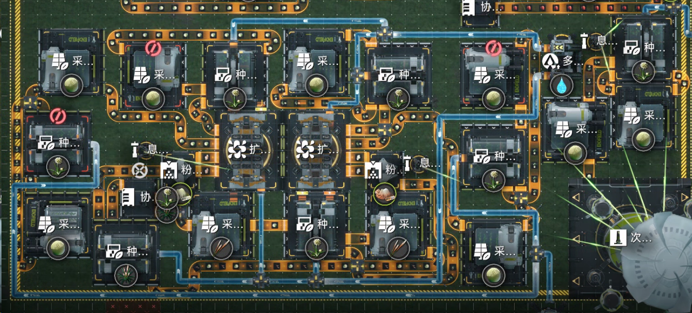

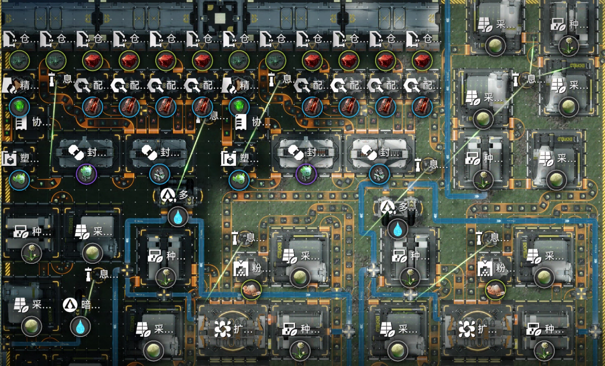

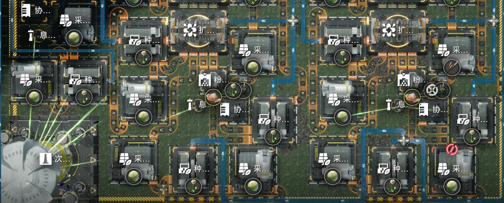

主基地除了这一块和一个采种采就是其他的壤晶红矿之类了，整个天王坪副基地搬过来做电池和息壤

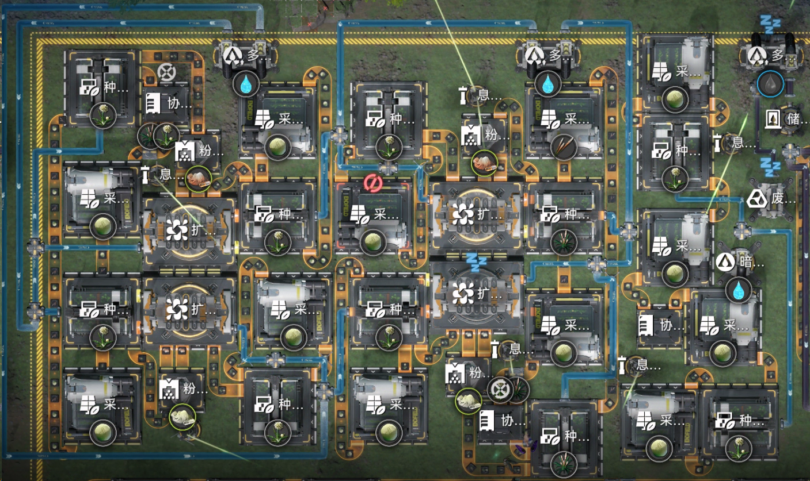

## 一些计算

时间尺度常数：1年=518400分钟

1000/m的产量挂机1年=5.184亿

1年内达到21亿需要产量为4050/m

朋友们……

千里之行，始于足下！！！！！

谷地由于没有垃圾桶，荞花最大产量可以直接由据点产票量计算得出<s>不会有人能坚持十年如一日手动清理库存吧</s> 待计算…………

<u>武陵可以使用芽针/荞花参与息壤生产，需要琢磨让其参与生产划算，还是用高效配方生产然后拿多余的电放生植物划算</u>

<s>甚至可以考虑铜也不炼了发电全部拿来放生</s>

## 方案A1：使用传统垃圾桶的放生单元

耗电：370（采种4x30+粉碎10+扩反200+水泵4x10）放生180/m芽针（近似，由于垃圾桶不稳定）

也可以放生120/m荞花

有空再优化布局

《明日方舟：终末地》蓝图 \[未命名蓝图\]分享码EF018OI434452127UI73 请复制后前往游戏中使用。

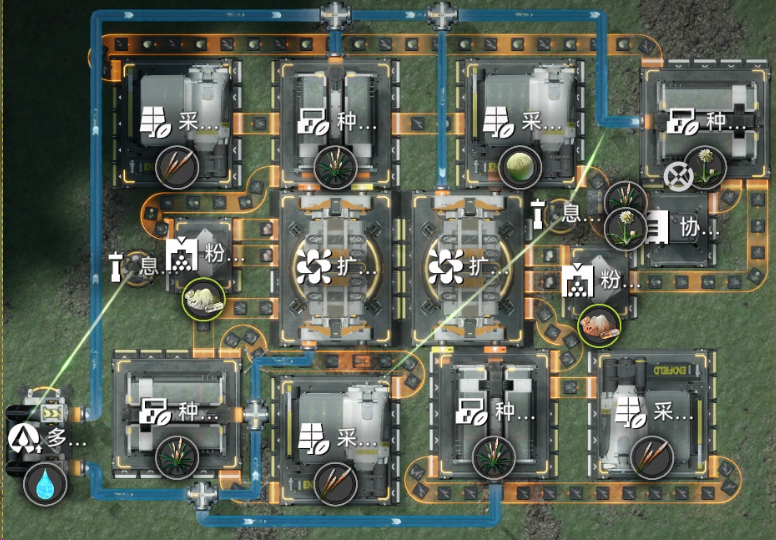

## 方案A2：使用传统垃圾桶的放生机MKII

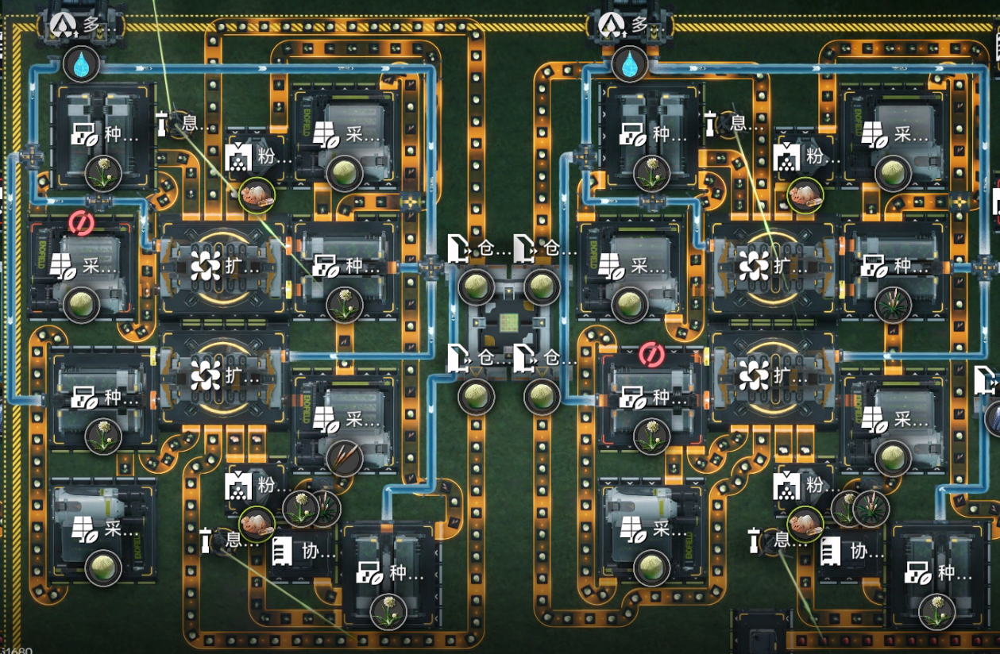

如图所示为两个双核的锦草放生机MKII，把销毁反应池剩下的一个空格也利用起来销毁芽针种子，这样每核相当于多增加了60/m的芽针销毁能力

总之现在每核（每个反应池）来到了150/m芽针的放生速度

当然芽针没有产出什么高级产物，做成蓝药还要大量蓝铁配合没有意义，否则直接销毁高级产物更合算

另一个好处是可以把芽针种子生产分离开来，在某些布局上可能会很方便

## 待研究的问题

我们需要更高效的垃圾桶！！！！！！！！！！！！！

做什么产品能以最小的占地面积换最大的产出？

## 参考资料

### 蓝图

|  |  |  |  |
| --- | --- | --- | --- |
| 名称 | 作者 | BV | 蓝图码 |
| 四核水植模块（18\*18） | 断懒 | BV1Y6LU6PE31 | \[4水植（美观版）\]EF018OI4EuA9i1o5UI73 \[4核水生植物\]EF012UOeA5aI0894eIOo |
| 720/m荞花烧炭做息壤 | ssnighter |  | \[息壤上（先）\]分享码EF01E75207E57oee23uIa   \[息壤下（后）\]分享码EF01A67iu6A76Eee19ieO |
| 9核水生植物 | ssnighter |  | EF01u28IU2u820a58AoOU |
| 密铺荞花 | 断懒 | BV11T4D69EKi | 见视频 |
| 6核水生植物 | 咸鱼 | BV1aWV56cESJ | 
 
图片
 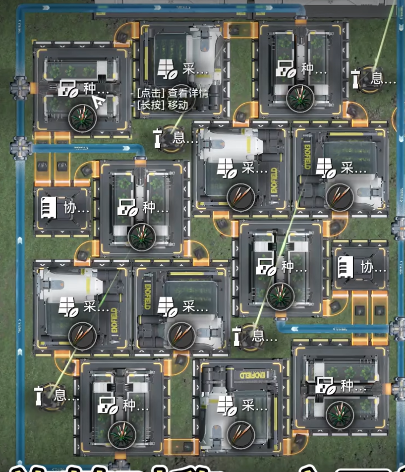 
 |
| 垃圾桶 | pl | 虚空箱子 应对爆仓的最后一块拼图 | \[虚空箱子v3\]分享码EF011I9AaO3aaUeO30O7 |
