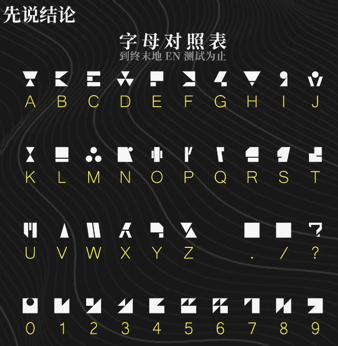

# 萨卡兹文本破解ai的实现

> 原文：https://docs.qq.com/aio/DTmluZ1diWlpQZldw?p=EHhomuyaMq80izpdt5oUgn　上级：[任务板](任务板.md)

对照表来自[https://www.skland.com/article?id=1482942](https://www.skland.com/article?id=1482942)

从utf-8加密到萨卡兹文本：return ''.join(\["gkamztlbdqiyfucxbhsjoprnweygtjmevchdxsanqolkrvwiypjzquhe"\[ord(a)%56\] for a in x\])
