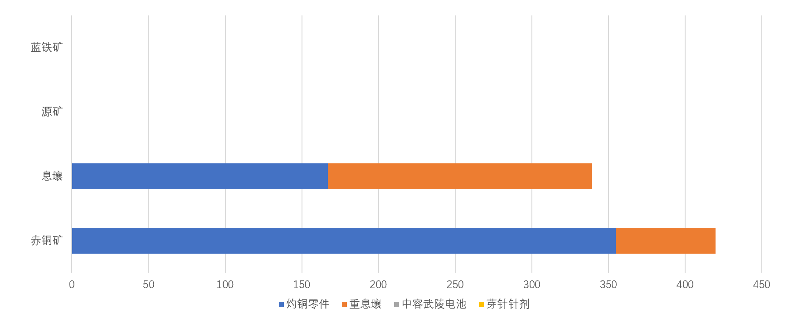
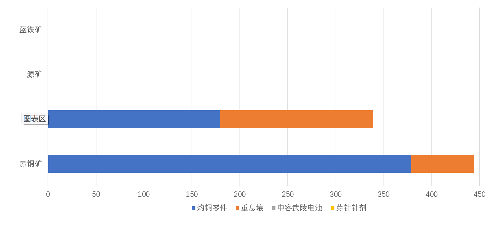
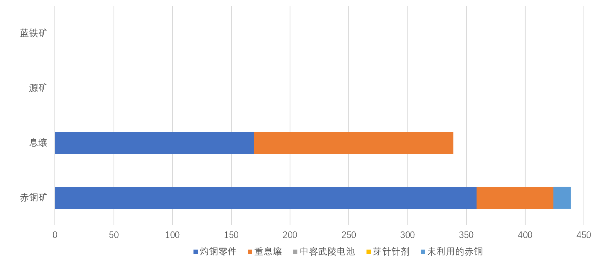

# 讲解：自配平产线和自适应装置

> 原文：https://docs.qq.com/aio/DTmluZ1diWlpQZldw?p=MSyCxO1yMtqlXdUCG6Utsc　上级：[「雪凇幽梦」版本](「雪凇幽梦」版本.md)

该页面目前作为视频文案/脚本

## 素材预览

<i>不管你们听不听 1:左边塞了失真的二进制数字，转换成十进制后再转换成ASCII码是 Hello World 2:最强基建下的英文小字意思是最大调度券产出 3:左侧的黄条被我贴了箭头假装是传送带——盒猫</i>

## 脚本草稿02（2026.09.20 23:26）

### 0. 为什么要自动配平

在1.4版本伊始，气体工业的加入带来两位大人：

<b>\<（°0°）\></b><b>灼铜大人</b><b>和</b><b>重息壤大人</b><b>\\（°0°）/</b>

我的天哪灼铜大人售价70调度券，超凡脱俗的复杂工艺震撼人心！

【一段展示灼铜工艺复杂性的长难句神秘文本作为画面】

经过各路up各显神通的计算，

我们现在知道所谓最高产能就是多多地做灼铜大人和重息壤大人，加上两位前朝显贵中容武陵电池大人和芽针针剂，呃，小人，

最好是一点铜和息壤都不要剩下，源矿和蓝铁也是一样。

为了做到这一点，up们先是给出了14.4灼铜零件24重息壤的配平组合，然后给出了更极限的14.2灼铜零件26重息壤的配平组合，后者已经非常非常接近理论解！

呃但是我只是一个普通玩家，比起压榨产能我想说：

<table>

<tr>

<td valign="top" width="50%">

【口播】

要吃药怎么办？

矿没开齐怎么办？

不想拉净水节点怎么办？

谷地没开超库存传输怎么办？

</td>

<td valign="top" width="50%">

【画面】

<b>原料都配平掉了，自己要吃的优质芽针针剂没原料做了怎么办？</b>

<b>我的矿没开齐，不够产线用怎么办？</b>

<b>我不想拉净水节点，这破暗管谁爱拉谁拉，但是极限产能必须要用怎么办？</b>

<b>我的谷地没拉满，没有超库存传输......</b>

</td>

</tr>

</table>

欸，普通玩家还要求这多，那为什么不用剩下原料更多的低产量产线呢？

那咋了，我就是想利用掉所有原料又高产还要能满足这些要求，不行吗？

<b>于是经过我们的努力，自动配平产线就此诞生。</b>

---

### 1. 局部自动配平

一上来就理解四种原料自动配平成四种产物也太难了，我们先只制作灼铜和重息壤。

【画面：灼铜零件、重息壤的复杂配方先展示】

虽然灼铜零件和重息壤的配方十分复杂，但是先不要被配方吓到，归根结底，它们终究只是使用同样的两种原料：<b>铜</b>和<b>息壤</b>。

让我们忽略掉中间的弯弯绕绕吧。

【动效：复杂配方淡出，只留下“铜+息壤→ 灼铜 /  铜+息壤→ 重息壤”的简化图】

现在请想象这样的一个账号：

- 铜产量 <b><u>325</u></b>/min；

- 息壤和息壤气产量拉满；

我们只做灼铜和重息壤，此时的产出是这样的：

【画面：当前铜和息壤条件下，灼铜和重息壤配平，用柱状图+虚拟报表的形式呈现，之后在柱状图上的变化也同步到虚拟报表上】

现在把剩余矿点都连上，铜产量提高到 510/min。

【动效：柱状图里新增加的铜用虚线框标出】

多出来的这些铜怎么消耗掉呢？如果我们增加重息壤产量，

【动效：保持重息壤柱高亮，重息壤柱增加灼铜柱降低，此过程中息壤柱始终被完全占据，赤铜柱自然地减少了】

欸不对不对，怎么铜消耗还变少了！那增加灼铜产量呢？

【动效：保持灼铜柱高亮，灼铜柱增加重息壤柱降低，此过程中息壤柱始终被完全占据，赤铜柱自然地增加直至占满代表新增加的铜的虚线框部分】

欸对了对了，这样一来多出来的铜就全部被消耗掉了。

<b>也就是说为了配平多出来的</b><b>铜</b><b>，</b><b>灼铜</b><b>产量要增加而</b><b>重息壤</b><b>产量则随之减少。（考虑单独占据画面）</b>

【动效：当前柱状图中用更浅的颜色高亮在此时的柱状图时原来的灼铜柱长度和重息壤长度作为对比，高亮的时机与“灼铜产量要增加”和“重息壤则随之减少”对齐】

但是要自动配平的话，得让产线随着铜增加自发地增加灼铜产量、减少重息壤产量。

这该怎么做到呢？这里先给出结论：

【这两句话可以考虑单独占据画面】【或者配一个体现这种供料顺序的动图】

- <b>息壤</b><b>：先喂饱</b><b>灼铜产线</b><b>，剩下的给</b><b>重息壤产线</b><b>。</b>

- <b>铜</b><b>：先喂饱</b><b>重息壤产线</b><b>，剩下的给</b><b>灼铜产线</b><b>。</b>

---

### 2. 供料顺序不能反

为什么必须是“息壤先喂饱灼铜产线，铜先喂饱重息壤产线”？我们一个个来看。

#### 如果灼铜产线的息壤不够

让我们回到上一节的例子中，刚连上矿点的时候：

【画面：新增加的铜已用虚线框标出的柱状图】

尝试增加灼铜产量，但是息壤供应不够，增加到一半卡住了！

【动效：保持灼铜柱高亮，灼铜柱增加重息壤柱降低，此过程中息壤柱始终被完全占据，赤铜柱自然地增加，但是加到一半停止了，此时让在息壤柱的灼铜柱闪烁红光表示供应不足】

这时我们可以看到，多出来的铜没有被全部消耗掉。

【动效：铜柱没有占满虚线框部分——剩余的虚线框部分闪烁红光表示没有被消耗掉/利用干净】

<b>于是我们得到结论：想利用掉增加的</b><b>铜</b><b>，必须先用</b><b>息壤</b><b>喂饱</b><b>灼铜产线</b><b>，保证它</b><b>息壤</b><b>足够。</b>

#### 如果重息壤产线的铜不够

类似的，我们增加息壤，然后尝试增加重息壤产量。

【动效：保持重息壤柱高亮，重息壤柱增加灼铜柱降低，此过程中铜柱始终被完全占据，息壤柱自然地增加，但是加到一半停止了，此时让在铜柱的重息壤柱闪烁红光表示供应不足】

结果是类似的，因为重息壤产线的铜供应不足，所以我们没花光增加的息壤。

【动效：息壤柱剩余的虚线框部分闪烁红光表示没有被消耗掉/利用干净】

那么结果和灼铜产线缺息壤的情形非常类似了，想要利用掉增加的息壤，必须先用铜喂饱重息壤产线，保证它铜足够。

【画面：上一节的结论[这该怎么做到呢？这里先给出结论：](讲解：自配平产线和自适应装置.md#wVS0ApujtfVS9Z5WXU56RO)】

到这里我们已经回答了为什么必须是“息壤先喂饱灼铜产线，铜先喂饱重息壤产线”，但是我们给出的结论还有一部分——“剩下的息壤给重息壤产线，剩下的铜给灼铜产线”

【画面：仅有重息壤柱子的柱状图，铜柱空缺的部分仍是用虚线框表示】

我们试想如果只做重息壤，那重息壤产线自己当然用不掉这么多铜，

【动效：高亮铜柱空缺部分的虚线框】

这些剩余的铜就需要让灼铜产线来消耗掉。

【动效：柱状图中开始出现灼铜柱并不断增加，直至铜柱被填满】

可以看出，如果我们想要所有原料被利用干净，就一定需要一条产线来消耗掉剩余的原料。 
方便起见，这种专门吃“其他产线用剩下的某种原料”的产线，我们叫它：

<b>末端产线（</b>可以考虑单独占据画面<b>）</b>

那么灼铜产线可以称为铜这一原料的末端产线，也就是说灼铜产线是消耗铜的产线里最末尾的产线。

【画面：仅有灼铜柱子的柱状图，息壤柱空缺的部分仍是用虚线框表示】

类似的，只做灼铜用不掉的息壤则是由重息壤产线来消耗掉，那么重息壤产线可以称为息壤这一原料的末端产线。

【动效：柱状图中开始出现重息壤柱并不断增加，直至息壤柱被填满】

---

### 3. 更多原料！？

【画面：原本的铜和息壤柱状图，但是坐标轴上加入了源矿和蓝铁】

截至目前，我们处理了两种原料 铜 息壤 两种产物 灼铜 重息壤

但是1.5版本我们还有另外两种原料 源矿 蓝铁 另外两种产物 中电 小药（用小字标注 小药上小字标注芽针针剂 中电上用小字标注中容武陵电池）

现在我们把他们加进来：

【动效：从“铜、息壤 → 灼铜、重息壤”扩展到“铜、息壤、源矿、蓝铁 → 灼铜、重息壤、中电、小药”】

是不是一下子眼花缭乱了？别心急，别忘了我们的目的是让所有原料都被消耗，所以每一种原料都需要一条产线来消耗掉其他产线用剩下的部分——<b>也就是说，我们可以让原料和末端一一对应！</b>

可能有细心的观众已经发现了，在之前的讲解中我们会用特定颜色来表示原料和产物，其实相同的颜色就表示原料与之对应的末端：

铜-灼铜 息壤-重息壤 源矿-中电 蓝铁-小药

在之前的讲解中我们已经知道了消耗铜为主的灼铜产线是原料铜的末端产线，消耗息壤为主的重息壤产线是原料息壤的末端产线，

那么，消耗源矿为主的中电产线就是原料源矿的末端产线，消耗蓝铁为主的小药产线就是原料蓝铁的末端产线！

【画面：中电柱、小药柱随着讲解依次高亮】

同样的，和灼铜重息壤类似，为了让中电产线可以顺利吃完源矿以及让小药产线可以顺利吃完蓝铁，我们需要让中电产线除了源矿之外的其他原料都供应充足，也就是中电产线所需要的息壤和蓝铁都被优先供满，

【动效：高亮息壤柱和蓝铁柱中的中电柱】

而小药产线只吃蓝铁，所以就没有什么需要供应充足的地方了

我们可以把这些整理成一张表格：

| 原料 | 先保证谁 | 剩余给谁 | 末端 |
| --- | --- | --- | --- |
| 铜 | 重息壤 | 灼铜 | 灼铜 |
| 息壤 | 灼铜 中电 | 重息壤 | 重息壤 |
| 源矿 | 无 | 中电 | 中电 |
| 蓝铁 | 中电 | 小药 | 小药 |

---

### 4. 更多样的末端

【画面：铜、息壤、源矿、蓝铁 → 灼铜、重息壤、中电、小药】

那末端只能是一种产物吗？当然不是！

比如在 1.5 智能最大毛产中，当赫铜未满仓时，赫铜和灼铜产出保持 1:2。这时铜末端就不是单纯的灼铜，而是“<b>1:2 的赫铜和灼铜”</b><b>。</b>

【动效：灼铜零件变成赫铜零件和灼铜零件的组合图标】

其实可以把多种产物组合成的末端看成是一个自定义配方的产物，那就和前面的单产物作为末端的情形一样了。

引入了组合产物作为末端后，我们能得到更多种产物了！或许这条路的尽头，我们能抵达<b>全物品-自动配平</b>的终极......

---

### 5. 小结

【画面：铜、息壤、源矿、蓝铁 → 灼铜、重息壤、中电、小药】

让我们来整理下目前的内容：

整套自动配平，只需要记住两点：（考虑让这两行字占据画面）

1. <b>一种原料对应一种末端，就像是</b><b>铜</b><b>和</b><b>息壤</b><b>分别对应</b><b>灼铜</b><b>和</b><b>重息壤</b><b>。当然了，末端可以是组合的产物，像是上一节提到的</b><b>“1:2 的赫铜和灼铜”</b><b>作为</b><b>铜末端</b><b>。</b>

2. <b>每种原料都先喂饱其他产线，然后剩下的原料才给末端，比如</b><b>铜</b><b>先喂饱</b><b>重息壤产线</b><b>然后剩下的</b><b>铜</b><b>给到作为</b><b>铜末端</b><b>的</b><b>灼铜产线</b><b>。</b>

这就是自动配平的铁律了，接下来让我们在实际的产线中去实现这套逻辑。

---

### 6. 回到实际的产线中去

让我们将目光放回到最强基建（智能最大毛产）的实际产线中去，一个个找出被优先供应的产线：

- 灼铜产线不是息壤的末端产线，所以灼铜产线用的息壤被优先供应 
  【展示灼铜产线的息壤液的加压和分离芯产线的息壤的加压】 
  欸等等，为什么说用更多取货口就是优先供应？（切换报表展示）因为原料最终会被用干净，然后单个取货口输出物品就不是满速了，所以需要更多的取货口，比如这里的息壤液化（显示息壤液化反应式）需要30/min的息壤输入，因为取货口输出不满速了，所以需要更多的取货口保证反应满速进行<b>（讲得好绕，这里的文本需要想办法精简一下）</b>

- 重息壤产线不是铜的末端产线，所以重息壤产线用的铜被优先供应 
  【展示分离芯产线的铜的加压】

- 中电产线不是息壤或者蓝铁的末端产线，所以中电产线用的息壤和蓝铁被优先供应 
  【展示中电产线的息壤的加压和蓝铁打粉产线的蓝铁的加压】

- 小药产线除了蓝铁不需要其他原料了，所以它只是蓝铁的末端产线，没有需要优先供应的地方

不要被增加取货口保证空仓时的优先供应的思路限制了！有很多很多的办法可以做到优先供应的效果：（我感觉这里可以稍微讲得详细一点）

洪炉直连溢流以优先供给息壤；满仓震荡；先加压一条带，用这条带溢流；还有我们所未涉及的方案......

---

### 7. 为什么支持自行添加产线？

在结尾我们来讲点简单的放松一下吧，

还记得视频开头所说的“普通玩家需求”吗？【展示对应视频片段】

到目前为止我们所讲述的大部分内容都是自动配平产线如何实现自动配平。但如果手动加了一条新产线，自动配平产线会怎么处理这个新产线的原料消耗？

其实可以把自行添加的产线所消耗的原料当成没有进入自动配平系统，就像没开的矿点一样。去掉这部分被使用的原料后，自动配平产线会把剩余的原料尽数转化为我们所希望得到的产物。

<b>于是，我们既要又要的狂想，就这样实现了。</b>

但是目前的自动配平事实上仍有极限，让我们把这个作为思考题： 
自行添加产线到什么程度，或者说什么样的原料比例，自动配平产线将无法将剩余原料完全配平？

（等待10s播放片尾）

---

片尾：

那么产线的自动配平/自适应讲解到这里就结束了

让我们在下一期“装置的自适应”再会！

【画面：成员签名】（待议）

## 脚本草稿01（2026.09.20 14:44）

灼铜重息壤中电小药

铜息壤源矿蓝铁

### 初步讲解——局部的自动配平

让我们先从这次自适应基建的骨架，灼铜零件与重息壤配平赤铜块和息壤讲起（也许可以带上图标）

虽然灼铜零件和重息壤的配方较为复杂（展示原配方），但是本质还是使用息壤和铜（此处贴动效：复杂配方简化为仅铜壤的简化配方）

要理解自动配平，我们不妨先从更简单更局部的情形讲起：现在我们有一个铜产量360/min、息壤和息壤气产量拉满的账号（拿出该铜壤下的柱状图）现在我们去把剩余的矿点都连上使得铜产量达到510/min（柱状图中用虚线框出新开的铜）为了配平这些铜，我们需要增加灼铜产量（让灼铜的铜壤在柱状图上闪烁一下或者其他的高亮方式），而增加的灼铜零件将用掉更多的息壤（类似地高亮灼铜用的息壤），重息壤的产量也随之降低（类似地高亮重息壤的铜壤）（呃这些高亮时其实可以在边界出标箭头？）最终我们靠通过增加灼铜零件减少重息壤来配平新增的铜产量（旧态到新态的柱状图变化动图）

那么该怎么让产线随着铜产量增加，自发地增加灼铜产量和降低重息壤产量呢？我们先给出结论：息壤先保证灼铜产线的息壤供应充足，剩余息壤供给到重息壤产线；铜先保证重息壤产线的息壤供应充足，剩余铜供给到灼铜产线

### 为什么不能非末端供料不足/非末端供料充足

接下来我们从灼铜产线入手，假如灼铜产线的息壤供给不足，会发生什么？让我们回到上一小节的例子我们增加灼铜减少重息壤（仿照上一小节的高亮按顺序高亮，呃具体怎么弄再议）（旧态到新态转化到半路因为息壤不足停止了）可以看到有铜没有被利用上！那么同样的，我们想象一个铜拉满但是息壤气矿还没有连的账号，如果不能保证重息壤的铜供应充足，会发生什么呢（和灼铜类似的动画）可以看到有息壤没有利用上。综上所述，用铜更多的灼铜产线需要保证息壤供应充足，用息壤更多的重息壤产线需要保证铜供应充足。

### 末端不供料充足/末端使用剩余原料

到这里，我们一开始给出的结论“息壤先保证灼铜产线的息壤供应充足，剩余息壤供给到重息壤产线；铜先保证重息壤产线的息壤供应充足，剩余铜供给到灼铜产线”已经完成一半了，剩余息壤供给到重息壤产线和剩余铜供给到灼铜产线该怎么理解呢？我们先从剩余铜给到灼铜产线入手，假设我们先不做灼铜只做重息壤（只有重息壤的柱状图）可以看到我们还有很多铜没有利用，为了利用这些重息壤用剩的铜我们需要增加灼铜减少重息壤（对应动图）也就是说，除了重息壤产线要用到的铜剩余的铜都最终流向了灼铜产线！类似的，我们假设只做灼铜然后增加重息壤以利用剩余的息壤（对应动图）可以看到灼铜的息壤被充分供应时剩下的息壤就流向重息壤产线

### 更多的末端-原料

接下来让我们将这种原理拓展到更多原料！（铜壤-灼重动态变为铜壤源铁-灼重电药）是不是一下子头晕了？其实还是一样的，我们来看新加入的电池和芽针针剂（高亮中电和小药）中电用的源矿多所以我们供满它除了源矿的其他原料需求也就是息壤需求和蓝铁需求，然后让剩余的源矿流向它。当然因为灼重药都不用源，所以其实是全部的源矿给中电；蓝铁没有用到其他原料，那么它就是单纯地得到剩余的蓝铁。我们可以发现，每一种原料都对应着一种产物去使用其他产物用剩下的该原料，我们将其称为末端，比如在这里，灼铜使用重息壤用剩下的铜，灼铜是铜的末端；重息壤使用灼铜和中电用剩下的息壤，重息壤是息壤的末端；然后中电是源矿的末端，小药是蓝铁的末端。

### 更复杂的末端

那么末端只能是一种产物吗？当然不是！比如在1.5智能最大毛产中，在赫铜未满仓时灼铜赫铜产出保持1：2，此时的铜的末端就是1：2的赫件和灼件了，只不过产券角度来说这样的铜末端不如纯灼铜的铜末端值钱

## 原视频模块讲解

### 景玉谷

这是双核中容电池产线，消耗壤晶和源矿生产中容武陵电池；并且额外回收一条砂叶粉末，在主基地会用来生产剩下的半速电池

这是息壤产线，接入水后通过种植机循环产生足够植物，供给给12个洪炉生产息壤

### 主基地

这是剩余的中容电池产线，除了源矿之外还消耗景玉谷的中容电池产线回收的一条砂叶粉末和如果有的超库存传输的致密源石粉末，生产中容武陵电池。

这是赤铜精炼产线，消耗清水将赤铜矿精炼成赤铜块，并产生大量的污水。

这是三扩反一小反防爆仓壤晶产线，输入足量息壤、蓝铁粉末、污水、息壤液，生产壤晶。和常见的四扩反壤晶线和三扩反两小反壤晶线不同，我们将生产息壤液的反应池拿出来，把它和重息壤产线的反应池放在了一起，统一调度息壤液。

这是蓝铁粉末产线，用更多的取货口保证在蓝铁块空仓时有足够原料生产供壤晶线使用的蓝铁粉末。

这是小药产线，用蓝铁粉末产线用剩下的蓝铁块生产小药

这是加压分离芯产线，用更多的取货口保证在铜或者息壤空仓时也有足够原料用于生产分离芯。

这是息壤液化产线，其中一台反应池混产了小药用到的药液。

这是自适应息壤气产线，它在息壤气充足时会自发地停止生产以避免息壤液浪费，并且采用自适应震荡供料实现对任意的息壤液输入量做到0息壤液浪费。

这是自适应重息壤产线，它采用自适应震荡供料实现对任意息壤气输入量做到0息壤气浪费。

这是销毁模块，不同于常见的销毁最终产物的销毁模块，它销毁溢出的污水和溢出的赤铜块。当赤铜块爆仓时它销毁赤铜块保证壤晶产线仍然有足够的污水；当电池和壤晶都爆仓后，壤晶产线使用的污水大幅减少，它销毁溢出的污水保证一旁的赤铜精炼产线正常生产。

这是灼铜装备原件产线，因为灼铜装备元件可以用于制造其他装备原件生产的装备，所以不需要其他装备原件产线了。

这是赤铜打粉产线，产生的赤铜粉末将在应龙关被制作成灼铜零件和赫铜零件。

### 首墩

放置因为缺少水和惰气所以主基地塞不下的加压分离芯产线和赤铜精炼赤铜打粉产线。

### 应龙关

这是赤铜液化产线，两个扩容反应池用于混产赤铜气产线需要用到的息壤液。

这是自适应赤铜气产线，它采用自适应震荡供料实现对大范围的赤铜液输入量做到0息壤液浪费。完美的压缩

这是赫铜气产线，在惰气环境下使用分离芯将赤铜气提纯为赫铜气。

这是震荡酸环境自适应灼铜气产线，它采用自适应震荡供料实现对大范围的赫铜气输入量做到最少的酸液输入以节省气化这些酸液的息壤液，同时这台酸气息壤气混产的液气机同样采取自适应震荡供料实现酸气息壤气生产时的0息壤液浪费。

这是自动赫灼切换的自适应赫灼块产线，它采用自适应震荡供料实现对大范围的赫铜气/灼铜气输入量做到0息壤气浪费。同时，当赫铜块爆仓时，赫铜块会阻断流经断电反应池的液体，被阻断的液体会阻断赫铜气输入，而后该产线在清灰装置的辅助下全自动地将赫铜块生产切换为灼铜块生产。

## 未敲定的议题

## 文案/脚本讨论区

### 2026.9.19 22:43

框架： 
旧态到新态（增加铜）会发生什么——体现自动配平的迭代过程

↓

息壤供应不足会发生什么——表明非末端充分供料的必要性

↓

扩大旧态到新态的过程（新的旧态：仅重息壤 新的新态：加入灼直到铜壤配平）——更突出地表达灼是用剩下的铜

### 2026.9.14 20:58

为了方便，我们暂且将息壤和息壤气都当成息壤

要认识自动配平，我们不妨假设现在有一个赤铜矿没有拉满的账号，它目前的赤铜矿产能是420/min

为了使产券最多，我们要把赤铜、息壤、源矿、蓝铁做成灼铜零件、重息壤、中容武陵电池、芽针针剂

我们先关注灼铜零件和重息壤对赤铜和息壤的配平

然后我们现在去把矿点开了，赤铜矿变多了！进行一个二元一次方程的求解，我们得到新的配平

灼铜变多了而重息壤变少了，欸，但是如果我们给灼铜零件提供的息壤没有完全跟上新的配平中灼铜对息壤的需求，那会发生什么呢

无法完全配平，剩下了赤铜没用上！因此我们需要对灼铜充分供应息壤， 
到底该怎么把优先供应灼铜的息壤但是铜不供应满形象地表达啊啊啊啊啊啊

君：你换个角度思考，铜供应不全→供应剩余赤铜，息壤的过量注入可以让工厂能够完全接收剩余赤铜，可以将其当做最初的【令机器激活】的物品而不是将其当做【反应物】。

产线目标：考虑以旧配平为初状态，新配平为末状态，初状态灼铜＞末状态灼铜，初状态重息壤＜末状态重息壤，由此可确认其需求迭代的增减性

对应的离散迭代过程：瞬时的赤铜增加，其必然去向为灼铜工厂，此时尝试消耗更多息壤，此时重息壤工厂接收的剩余息壤减少，对应赤铜（分离芯）消耗减少，剩余赤铜再次增多，此为一轮迭代，生成中间状态，灼铜工厂重新接收剩余赤铜，以前文相同的迭代方法逐渐降低剩余赤铜量直至趋近0。

其对应的连续过程为：重息壤产量逐渐降低，灼铜产量逐渐升高，很显然符合初状态→末状态的产物增减需求

产物最终敛散性：只需要解释这个迭代过程中，剩余赤铜变量 x 在 迭代轮次 n 趋近无穷时的极限为 0 ，迭代过程可以明显发现 x 关于 n 的函数为指数函数，在灼铜和重息壤的息壤与重息壤的优先级设定中，其底数小于 1 ，<s>读者自证不难</s>，详情可见自动配平相关理论（言：这一段假定的初状态向末状态的迭代可以用迭代过程可视化代替证明过程来表达结果是收敛的

因为多的铜要能进灼铜线所以铜不能是过量供应 因为铜过量供应就会让重息壤配不平息壤 因为我们要让灼铜和重息壤争抢每一份铜和息壤 我感觉这个迭代过程也要结合产线来说 
迭代过程指的是铜变多 灼铜变多 息壤变少 重息壤变少 又多出一点铜 然后循环往复直至所有铜和息壤都被用完并且只产出灼重，根据守恒律我们可以认为足够长的时间中灼重配平了铜壤

我已急哭

直接把这个迭代过程可视化？

然后也可视化如果不给灼铜充分供应息壤在迭代上的表现

### 2026.9.17 1:23 

言：仅从两方面说？在旧状态向新状态的迭代中①如果灼铜的息壤供应不足，就吃不完铜，然后有铜剩下来，重息壤同理②灼铜在息壤供料充足时可以吃掉多余的铜，重息壤在铜供应充足时可以吃掉多余的息壤，最后用干净铜壤，而通过守恒律，消耗完铜壤而只产出灼重显然是配平成功了 
然后可视化这两个进程
