# 较简单的自适应装置们

> 原文：https://docs.qq.com/aio/DTmluZ1diWlpQZldw?p=kXUgC0EOTqKh09bVHL9EPN　上级：[自适应产线节点元件构造](自适应产线节点元件构造.md)

咕咕咕 咕咕 咕咕咕咕咕

言正在施工中......

旨在由浅入深地讲解1.4版本中我们设计\&主要使用的自适应装置。请按照装置顺序阅读。

另外由于笔者过于熟悉下列装置，难免有囿于自身视角的表述，若有不解之处请积极评论。

<s>kokobird评论：猪吓哭……</s>不要劝退读者啊老大TAT

斯改：请保持更新，这是我了解先进自适应的唯一方式（言：先进在哪...

kokobird:老大，我才想起来之前我帮你发的那个视频里面你已经剪了很多装置的讲解了，你看看放在哪里合适 BV1CX3J6ZEhc

JNK:须知前后馈是防止浪费，使得反应可以量化为标准的配方的方法

kokobird：老大，我写好了这节，里面介绍了激活物问题的起因，研发过程以及前馈后馈的概念[3.3 你……你这头白吃息壤的猪！](3.3%20你……你这头白吃息壤的猪！.md)

## 息壤气 液气机-前馈-反馈控制

生产配方：1液化息壤（激活）+5液化息壤=5息壤气

P.S. 虽然机器UI上激活物部分显示“最低速率6单位/min”但是实际的作用方式是每个激活物使机器运转10s，造成激活物浪费的情况有且仅有三种：①机器运转时原料不足②机器运转时产物阻塞③存在两个激活物进入间隔小于10s

前馈：由原料输入速率决定机器运行速率

反馈控制：原料溢出时机器高速率运行，原料不溢出时机器低速率运行

P.S. 第一次阅读时不明白前馈后馈、比例控制反馈控制什么的没关系，请先继续阅读，结合实际的机器慢慢理解这些分类。

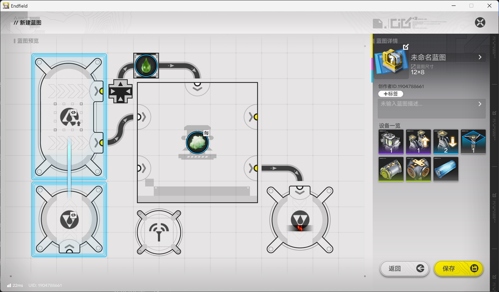

由于图中所示的“多口暗管-管道汇流器”造成的优先级（[优先输入/输出/汇入理论](优先输入_输出_汇入理论.md)），液化息壤会先进入机器的原料入口并填满机器后才会开始进入激活入口。<u>也就是说，当有激活物进入机器时一定有充足原料，</u>此时只要满足产物不堵（产生的息壤气都被下游产线消耗干净了）并且激活物输入速率不超过6/min（通过准入口限速6/min可以轻松实现），就一定不会有激活物被浪费。

在本装置中，原料也就是液化息壤溢出时有液化息壤进入激活入口，使得机器高速率（30/min）运行，若输入液化息壤速率小于36/min此时消耗原料直到液化息壤不再溢出到多口暗管出口；而当液化息壤未溢出到多口暗管出口时将没有液化息壤进入激活入口，使得机器低速率（0/min）运行，此时若输入液化息壤速率大于0/min就会积累原料直至原料溢出到多口暗管出口，如此循环往复使得<u>足够长的时间后装置中缓存的液化息壤既不增加也不减少</u>（缓存在这里可以简单理解为装置中留有的液化息壤的量），<u>这就是所谓的“反馈控制”了。</u>或者说在原料输入为0/min-30/min时：原料溢出→加速运行→原料不溢出→减速运行→原料溢出，如此这般循环往复。

在本装置中，由于“足够长的时间后装置中缓存的液化息壤既不增加也不减少”，从输入原料速率的角度来看就是输入原料速率等于机器消耗原料速率，也就是输入原料速率控制机器运行速率；如果从具体的运行流程出发的话，激活入口每进入1液化息壤就因为机器中一定有充足原料而一定消耗5液化息壤，需要再往原料入口中输入5液化息壤才能再往激活入口输入液化息壤，那么这台液气机的实际反应速率（息壤气产率）就是（原料输入速率v1）：v1/(5+1)\*5 ，（从左到右的 5 1 5 分别是 往原料入口输入5液化息壤 往激活入口输入1液化息壤 产生5息壤气），也可以发现机器运行速率由原料输入速率控制。<u>这就是所谓的“前馈”了。</u>

看到这里你可能觉得上面这两段绕来绕去在讲废话，这是因为这台装置足够简单才显得表述比较多余，如果后文产生对“前馈”与“反馈控制”乃至于“后馈”的困惑时，不妨回到这里以此处简单的情形对更复杂的情况举一反三。

<i>另外图中的多口暗管出口有标注“避免连接多口暗管入口”，这是因为多口连多口允许2-4/s的液气输送，而“多口暗管-管道汇流器”的优先级结构是让流量大于2/s的部分进入次优先的管道，这使得优先级不完全。举个例子，某多口连多口的实时流量是“1/s持续1s 2/s持续1s 3/s持续1s”，那么平均流量是2/s，理应没有任何物品进入“多口暗管-管道汇流器”的优先级结构中的次优先的管道，但实际上在“3/s持续1s”中是持续1s的2/s进入优先的管道而1/s进入次优先的管道，次优先的管道意外进入了1/3/s的物品！而单口多口相连就直接将流速限制在2/s，使得该优先级结构为完全的优先级。</i>

## 息壤气 液气机-前馈-比例控制

生产配方：1液化息壤（激活）+5液化息壤=5息壤气

前馈：由原料输入速率决定机器运行速率

比例控制：直接控制原料和激活物的比例为5：1

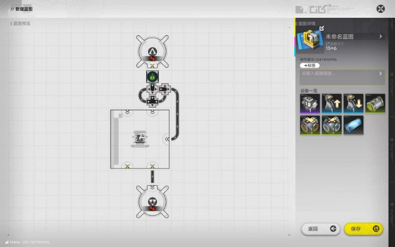

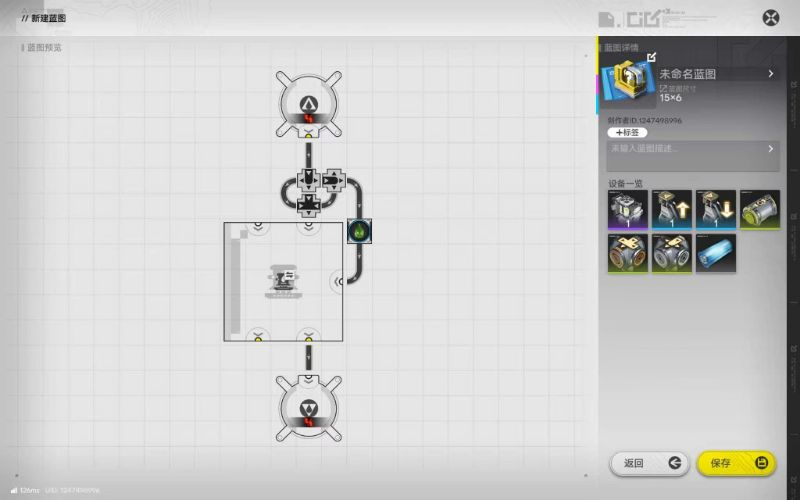

<i>使用时需在输入端限制流量为36/min（实际流量可低于36/min），或在液气转化剂激活口处限制6/min流量。</i>

如图所示的分流结构使得进入原料入口的液化息壤是进入激活入口的五倍，作为原料和激活物相同的配方，<u>这是最简单的比例控制的情形。</u>同时，不难看出激活物输入和原料输入比例固定也就是前者由后者控制，自然的，产物产出速率/机器运行速率就由原料输入速率控制了，<u>也就是“前馈”。</u>

## 赤铜气 液气机-前馈-反馈控制

生产配方：1液化息壤（激活）+10赤铜溶液=5气态赤铜

前馈：由原料输入速率决定机器运行速率

反馈控制：原料溢出时机器高速率运行，原料不溢出时机器低速率运行

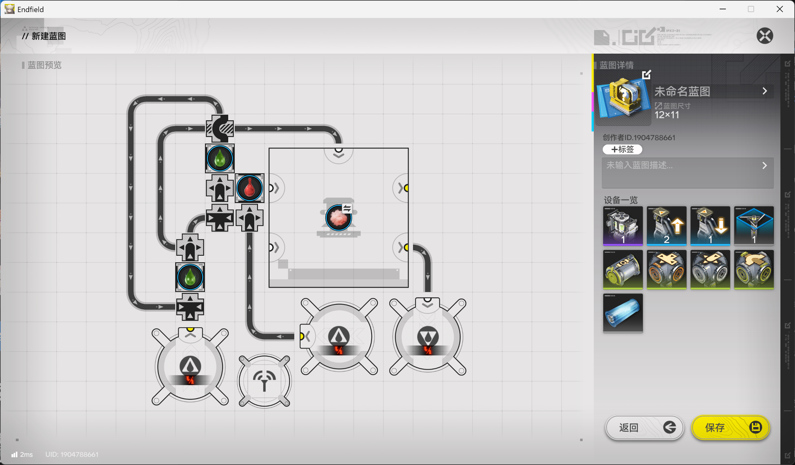

由于图中所示的“管道汇流器-管道分流器”造成的优先级（[任务板](优先输入_输出_汇入理论.md)），<u>当输入的</u><u>赤铜溶液</u><u>处于30/min-60/min时，</u>赤铜溶液会先填满机器后息壤溶液才会提高进入激活入口的速率，由3/min增加到6/min。也就是说，当有激活物进入机器时一定有充足原料，此时只要满足产物不堵（产生的气态赤铜都被下游产线消耗干净了）并且激活物输入速率低于6/min（通过准入口限速6/min可以轻松实现），就一定不会有激活物被浪费。

<u>那么为什么输入30/min-60/min的</u><u>赤铜溶液</u><u>时能确保激活物进入机器时一定有充足原料呢？</u>当赤铜溶液填满机器并满溢到暗管缓存（即保持阻塞）时汇流器只接受优先输入的赤铜溶液而液化息壤无法进入，也就是阻断了液化息壤的回流——而液化息壤不回流时6/min的液化息壤全部输入激活入口，此时消耗60/min赤铜溶液，若赤铜溶液输入小于60/min则装置中的赤铜溶液逐渐减少直到不再占满汇流器，于是液化息壤可以正常回流，输入激活入口的液化息壤变回3/min，此时消耗30/min赤铜溶液，若赤铜溶液输入大于30/min则装置中的赤铜溶液逐渐增加直到再次占满汇流器阻塞液化息壤的回流，如此循环往复使得<u>足够长的时间后装置中缓存的</u><u>赤铜溶液</u><u>既不增加也不减少</u>——当然，同样的做法可以用于重息壤/赫铜/灼铜固化，毕竟区别只是替换原料和激活物。<u>那么这就是原料和激活物不同的装置的“反馈控制”了。</u>或者说在原料输入不满30/min时：原料溢出→加速运行→原料不溢出→减速运行→原料溢出，如此这般循环往复。

由于“足够长的时间后装置中缓存的赤铜溶液既不增加也不减少”，从输入原料速率的角度来看就是输入原料速率等于机器消耗原料速率，<u>即输入原料速率控制机器运行速率也就是“前馈”了。</u>

给言老大送总结图——kokobird

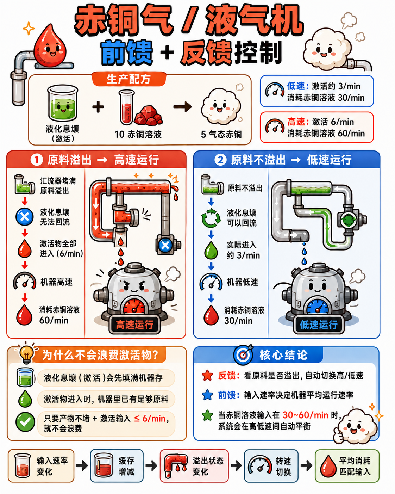

给言老大送视频讲解——kokobird

【【终末地/1.5基建】模块蓝图与技术讲解，120息壤+150铜=18.4息壤液+零浪费赫铜重息壤】 【精准空降到 07:09】 [https://www.bilibili.com/video/BV1Jbt66XECE/?share_source=copy_web&vd_source=ff7e542929960451adc95a08b74266a8&t=429](https://www.bilibili.com/video/BV1Jbt66XECE/?share_source=copy_web&vd_source=ff7e542929960451adc95a08b74266a8&t=429)

接下来是该装置的拓展内容，初次阅读可以跳过，当然也看一看是最好的。

### 稍加修改降低30/min的安全输入下限至20/min

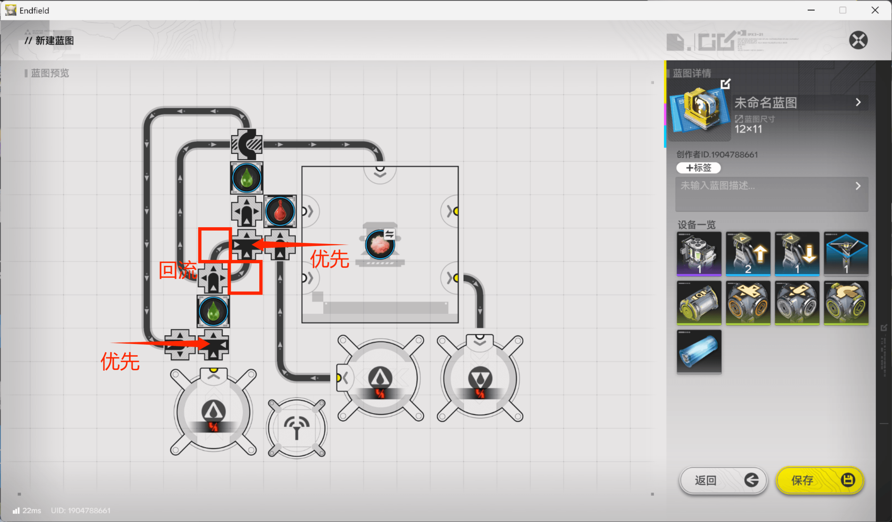

如图所示，让分流器的两个输出口（图中高亮）进行回流，也就是回流不被阻塞时输入激活入口的液化息壤为6/3/min，此时赤铜溶液输入大于20/min即可不浪费息壤液地运行。

### 复用分流器来省下管道元件

息壤液分流需要分流器，优先级形成需要分流器，为什么不能复用呢？（复用的分流器高亮）于是产生以下结构：

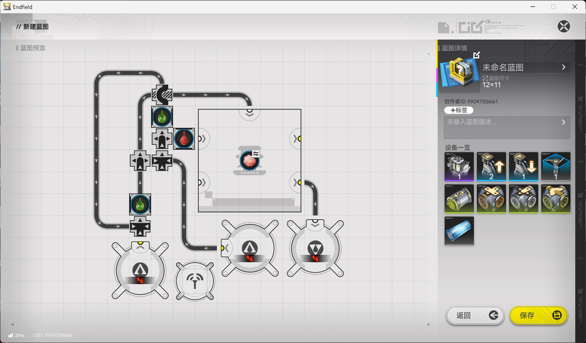

<i>然而因为用于</i><i>息壤液</i><i>分流的分流器紧贴汇流器放置，中间缺乏缓存，如果通过混管的原料过多容易出现息壤液回流被更多地阻塞，在某些输入的情况中会发生明明处于50-100%的安全输入区间却无法积累原料造成机器空烧。不过绝大部分情况下这并不会发生。</i>

### 使用溢流结构消灭安全输入下限

使用溢流使得安全输入下限为0，优点十分显著，缺点是更高的元件数、更大的占地

### 结合息壤液总线简化溢流结构

省去了溢流结构的优先汇入，转而让总线对上游轮询获得广义上的优先汇入，减少了管道件用量和占地。

### 输入震荡带来的隐患

我们假设一种输入形式，x秒输入10/min后x秒输入60/min，平均输入速率即35/min处于安全区间，但是如果这个x足够大以至于在输入10/min的x秒时机器用光了装置中所有原料，就会发生息壤液空烧而浪费。所以上游若存在震荡需要多多注意会不会有这样的隐患，若有必要可以增加缓存或者对输入整流/滤波。一种简单的整流器（将）如下：

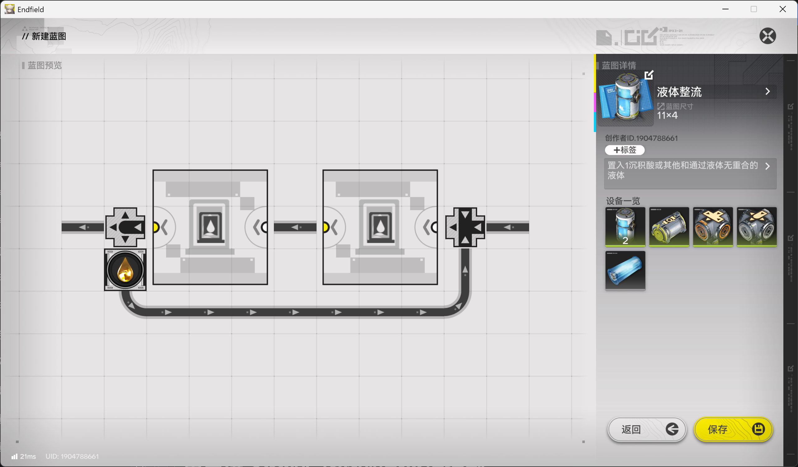

kokobird：四核灼铜就是一个典型雷霆例子，每次赫铜气满时，由于酸气溢流到灼铜气开始生产有延时，总会溢出八九个酸气，但是一个酸气就能让四核灼铜跑10秒，持续运行一分多钟的消耗很恐怖，甚至单口暗管供赫铜气可能供不过来，然后这段时间产生的灼铜气速度也很夸张，产出的速度甚至大于下游固化的速度，导致固化用的息壤气一直溢流，这些息壤气在灼铜气生产完成后还会吃掉几百个灼铜气，所以需要在灼铜气固化前加储气罐

### 控制隔离与断电反应池代替混管

## 重息壤 固气机-前馈-比例控制

控制重息壤气 息壤气5：1，主要使用流量复制，早期的灌拆则是因为液气流量复制技术不成熟而将问题转化为固体的流量复制

直接控制息壤气分流10：1，取巧但有效，但是会降低提纯机利用率 

kokobird：我来给些灌拆法的比例控制例子

以下是控制液化息壤：赤铜气为1：10的方案。赤铜溶液从右上角暗管出口流出，一半流量直接进入转化机，另一半流量进入灌装机进行检测。灌装机中空瓶充足，每有一个赤铜溶液输入，就会灌装一瓶赤铜液。瓶装赤铜液随即进入下一个拆解机，取出这一个溶液，将其还回到液气转化机中。

对这滴赤铜液来说，它只是多走了一段路而已。那么什么变化了呢？拆解机输出了一个瓶子！由于此处拆解机连了五路出口，四路直接连回到放瓶子的箱子，一路瓶子进入了装满了液！化！息！壤！的灌装机，取出一滴液化息壤，再送进拆解机。回想一下，每有一个这样的瓶子，就说明有五个瓶子从拆解机出去，就说明有五滴赤铜溶液进入了灌装机，就说明总共暗管出口流出了十滴赤铜溶液。因此，每出10滴赤铜溶液，就会正好有1滴液化息壤进入液气转化机，实现精确的按需供给。

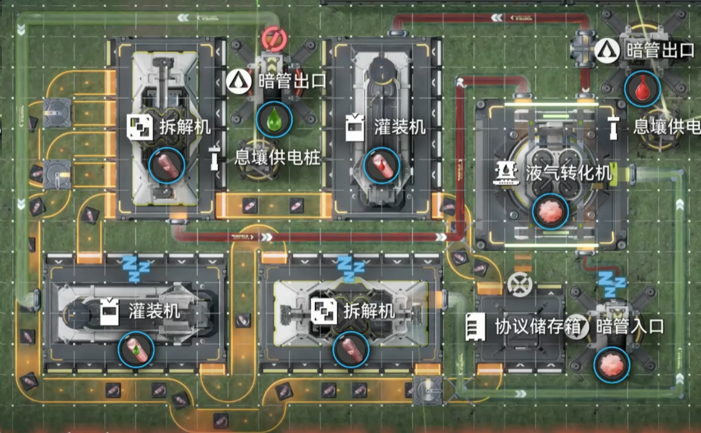

更多例子可以参考[我的1.4自动配平方案视频](https://www.bilibili.com/video/BV1yp3q6GEK3/?share_source=copy_web&vd_source=3b974227efd90987cb6375fbe49d61b8&t=393)，主要包括赤铜液前馈（检测赤铜液），灼铜固化前馈（检测赫铜气）与酸气（检测赫铜气）的反馈装置。

由于拆灌机比较耗电，占地也大，后续大家基本都用本页面中的其他机制结构进行控制了。不过就我看来，拆灌比例控制方案可能还是对新手来说最容易理解的。<s>另外不需要特别多管道件，还自带五分器，并且不依赖于优先级，运转像齿轮咬合般精确，响应速度较快，震荡幅度小</s> 
<s>言：真的假的，像我这种1.4刚回坑的看到这个固体流量复制结构其实直接吓晕过去了</s>

## 重息壤 多核固气机-前馈-反馈控制

将多个设备视为一个整体，比如将三核固气视为至多消耗原料灼铜气90/min和激活物息壤气18/min的单个机器，然后接入反馈控制模块。

并确保低运行速率时原料积累——没有直连控制模块的核的消耗量要小于等于直连控制模块的核的消耗量，在息壤气通入三核的三个激活物入口采用均分时可以认为没有直连控制模块的核的输入量要大于等于直连控制模块的核的输入量（当然可以不均分，保证消耗量如上文所说，但是在三核的情境里不均分也不会更省管道件了）；同时也要避免因为流经控制模块的原料流量过大且采取分流器复用而造成实际下限升高，即直连核数为2/2或者1或者1/2（更低则无意义）此处直连核数为1

## 灼铜气 多核气体反应炉-前馈-反馈控制

在息壤气供应充足的前提下，将三核气反视为至多消耗原料赫铜气180/min和激活物酸气6/min的单个机器

并确保低运行速率时原料积累——没有直连控制模块的核的消耗量要小于等于直连控制模块的核的消耗量，因为酸气散布机对三个气反的控制完全一致所以可以直接认为没有直连控制模块的核的输入量要大于等于直连控制模块的核的输入量；同时也要避免因为流经控制模块的原料流量过大且采取分流器复用而造成实际下限升高，即直连核数为2/2或者1或者1/2（更低则无意义）此处直连核数为1

## 酸气 液气机-后馈-反馈控制

保持充足酸气供应并不浪费息壤液，可能是毛产中唯一刚需后馈的地方（其实不然，后面会讲到巧妙的方式避开 
优先走酸气，溢出的酸气将阻塞激活物息壤液进入激活入口

### 酸气 液气机-前后与馈-反馈控制

让息壤液流入前馈的反馈控制模块前先经过后馈的反馈控制模块即实现与逻辑，即仅允许息壤液在原料充足且产物不阻塞时进入激活入口。

前馈部分当然可以选择100%自适应的溢流式。

没错，对酸气来说这毫无必要——事实上这里给出的是原料 产物 激活物均不同时的前后与馈的通用方案。

## 赤铜气 多核液气机-后馈-反馈控制

前馈能多核，后馈也一样，把多核视为一个机器

### 赤铜气 多核液气机-前后与馈-反馈控制

多核当然也能做前后馈的与逻辑了，视为一个机器然后接入前后与馈的控制模块

### 隔离控制？集中控制！均分控制！？

如果用以下结构则反馈过程从机器的“原料溢出→加速运行→原料不溢出→减速运行→原料溢出”循环变为多口暗管加上机器的“原料溢出→加速运行→原料不溢出→减速运行→原料溢出”循环，可支持流量显然达到240/min，由此可以接入更多核，也就是隔离控制天然适合集中控制多核。 
那240就是上限吗？当然不！参考多核固气多核液气中的反馈结构，为了避免流量过高而无法使用分流器复用，流经控制模块的只是一部分的机器接受的输入，同理我们可以将多个240中调取比如30汇流后流经隔离控制模块，就能对所有模块实施均分控制，也就是说实际上一个控制模块能控制120/min激活物以内的核数，当然比120/min激活物更多也是可以的但是这个需求在可预见的未来中有点不太可能（1200赤铜溶液输入，加上显然存在的固体赤铜使用，比谷地的蓝矿还多得多）

## 酸气 液气机-后馈-比例控制

通过阻塞控制产物和激活物五比一，优雅的设计，但是不能简单地做成隔离控制乃至集中控制

## 酸气 混用满速息壤气液气机-后馈-比例控制

注意到产出酸气和输入酸液的比例是一比一，为什么不用酸气使用来控制酸液输入呢？如此简洁

### 混用满速赤铜气液气机-后馈-比例控制

混息壤和混赤铜其实区别不大，需要注意的只有赤铜液是两滴两滴反应，需要有额外输入保证不会卡在机器中仅一滴铜然后机器睡觉

### 混用不满速息壤气液气机-后馈-比例控制

那一定要满速吗？无论机器反应酸气还是反应息壤都会反映到息壤液溢出上（因为酸气足够少，如果酸气需求足够多的话就是下面的灼重混固气的双料自适应结构了。尽管如此为了避免部分方案（比如最大净产出）震荡，事实上也可以考虑这么做），所以让溢出的息壤液顺理成章成为激活物就可以混不满速了。

### 混用满速息壤气液气机-前馈-例外

一比一控制还是太吃管道件了，整整两个！那么让三核气反直接反馈酸液，酸液直接混机变成酸气后进入三核气反如何呢？这种做法甚至直接杀死了酸气的后馈需求，缺点是气反的反馈响应多少会慢点

### 混用不满速息壤气液气机-前馈-例外

那一定要满速吗？总之同上。

## 重息壤 混用满速灼铜固气机-前馈-反馈控制

灼气过量 重息壤最多25

### 双原料自适应

双料自适应就是让两个原料都能反馈息壤气

## 赤铜气 固气机-前馈-反馈控制

断电反应池传递固体阻塞至液体

## 灼铜 固气机-后馈-反馈控制

断电反应池传递固体阻塞至液体

本质是改变多核灼铜固气中原料的构成，并用该结构自动清炉灰

### 灼铜赫铜息壤-三原料不满速固气机

加上禁区息壤气作为原料并不会让情况变得复杂，因为息壤气可以直接五比一分流

## 重息壤气赫铜气 混用提纯机-前馈-反馈控制

还没有完全吃透细节，暂且搁置

## 灼铜赫铜 混用不满速固气机-前后与馈-反馈控制

很酷的智能自适应产线

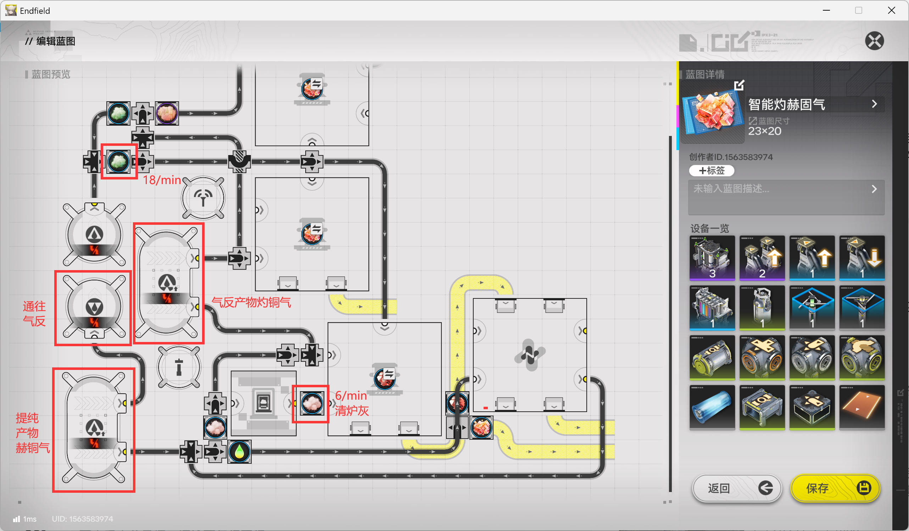

赫铜未满灼铜未满时一比二生产赫灼

赫铜已满灼铜未满时三核生产灼铜

赫铜未满灼铜已满时一核生产赫铜

全满了当然罢工了（用不掉的原料会积累），你还想怎的

如果灼铜满了赫铜满了之后使用了一些赫铜并不会自动复位，而是需要卖出灼铜后才会复位——事实上正是因为卖灼铜非常自然所以并没有进行灼铜的满仓检测而是依靠卖出复位。

## 息壤气-固气机-溢流式后馈

kokobird：老大，我投个稿

未来科技佬的需求：上游供应18息壤气，下游需要的息壤气在18-48浮动，需要按需启停固气机

原理：外部供气首先进入循环回路，一支和其他任意流体混管，混管长度\>1格。其他流体流通时，会堵塞混管，息壤气先在储气罐中积累，然后溢流到固气机中开始正常工作，此时产量达到48.由于下游需求流量不足48，会逐渐堵塞，并最终堵住其他流体，使得左侧息壤可以两路通过，停止溢流，最终固气机停止工作，使产量回到18。产量又不足以满足下游需求量，因此其他流体在之后又开始流通，如此形成自适应震荡循环。

问题仍然是溢流式通病：启动慢，响应慢，周期长。设上游流量I，下游需求流量O’，实际需求总流量为O（O'+(O'-I)\*1.25）。下游仓储C，启动大约需要500/(I/2)的时间，然后开始产息壤，在堵塞其他流体前总共经过C/(30+I-O)时间，如果太长，多口暗管会堵满C0息壤气，因此堵塞后恢复时间为C0\*10(\~5000s)，息壤气额外生产的息壤量高达C0\*10(\~5000s)\*（30+I-O')，需要加比较大的缓存

[https://beta.enka.network/endfield/aic/?id=W2c5B3w8Z4U3t5](https://beta.enka.network/endfield/aic/?id=W2c5B3w8Z4U3t5)

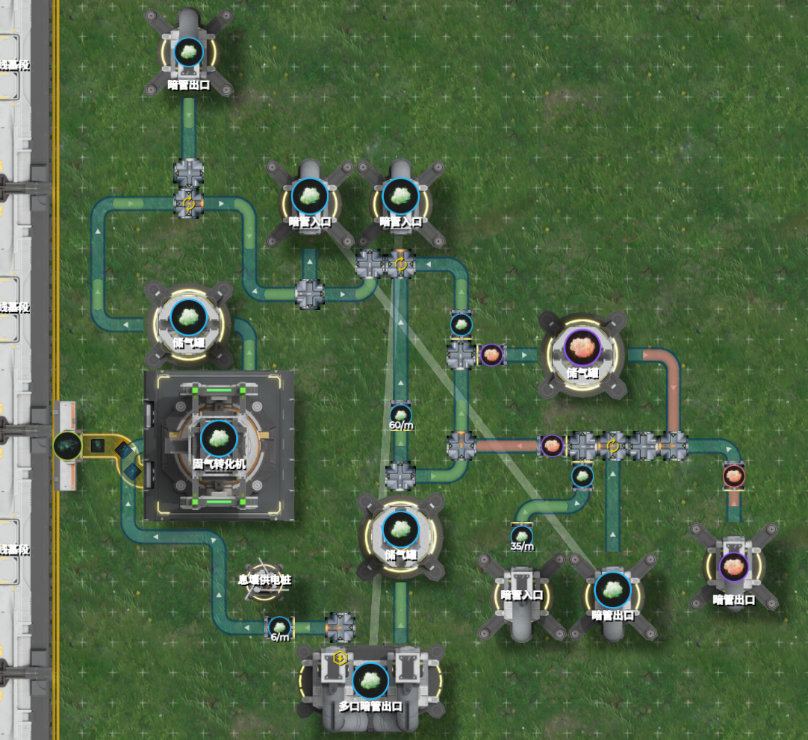
