# 迟滞输出现象(4n物品卡半格)整理与原理探究

> 原文：https://docs.qq.com/aio/DTmluZ1diWlpQZldw?p=tZlUFONP0H56rrjqpWpAn9　上级：[异常物流现象研究及底层逻辑推测](异常物流现象研究及底层逻辑推测.md)

<b>数据表视图：看板视图</b>

| 标题 | 详情 | 单选 | 日期 | 图片 |
| --- | --- | --- | --- | --- |
| 发现了现象 | @晨隐\_ 实验减法时正式提出该问题 | 相关实验 |  | ![C\$XI5D1D68)S@\_\~ZS1\]C\]BD.png](../图片/AgAABT6CrK1CsxwAWiVAIYhcNAHYpVAr.png) |
| 触发条件推测 |  | 相关推测 |  |  |
| 首个可复现实验 | @天云-翱翔天际 发现了一种可复现可空的该现象触发方法，该方式需要存储箱填满且分流器通向物流器后最后通向工厂的传送带比通向填满的箱子的传送带后放，此时比例与分流器到物流器的距离正相关，暂时无法断定多个分流器时按哪一个距离计算 | 相关实验 |  |  |
| 触发原理推测 |  | 相关推测 |  |  |
| 新的一批实验结果-1 | @jnk1698 完成了新的神秘实验，具体见下文折叠部分 | 相关实验 |  |  |
| 关于水管存在的相似问题 | @jnk1698 进行了关于水管摆出相似的结构下也存在的异常问题 | 相关实验 |  |  |

实验-1

> 需要连接右侧箱子的输入口的传送带最后放置
>
> 上面路线的物流器+传送带可以改成传送带+物流器或物流器+物流器，但是不能只用一段传送带或一个物流器，也不能换成传送带+物流器+传送带，也不能换成物流器+传送带+物流器，？
>
> 右边的箱子也是可有可无的

<table>

<tr>

<td valign="top" width="50%">

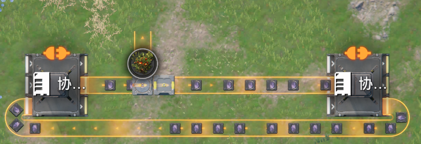

</td>

<td valign="top" width="50%">

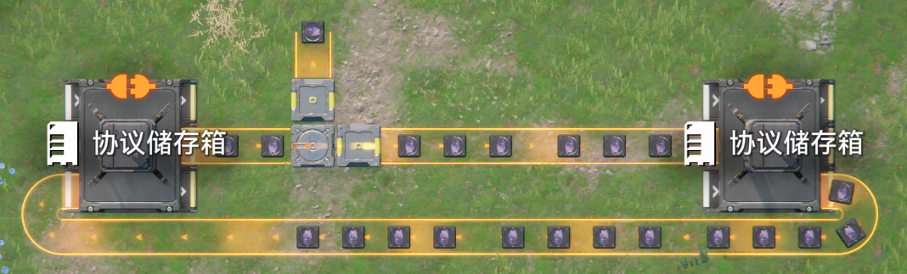

</td>

</tr>

<tr>

<td valign="top" width="50%">

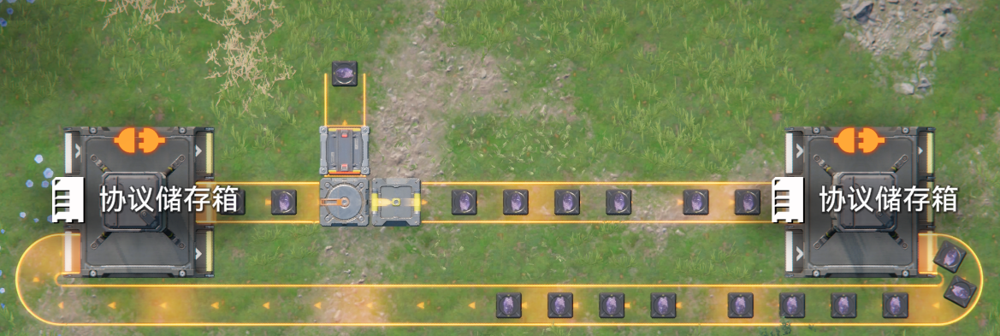

</td>

<td valign="top" width="50%">

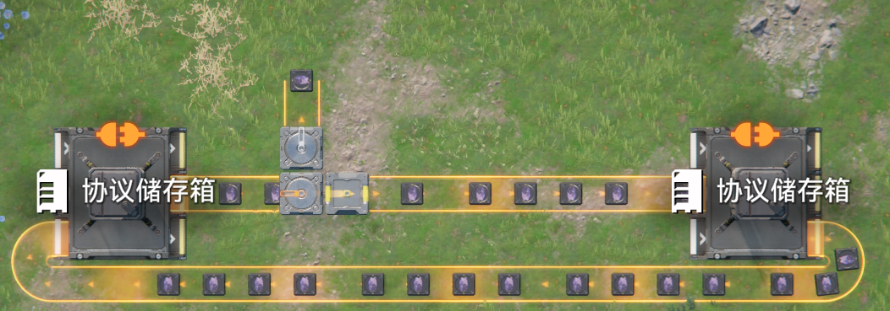

</td>

</tr>

<tr>

<td valign="top" width="50%">

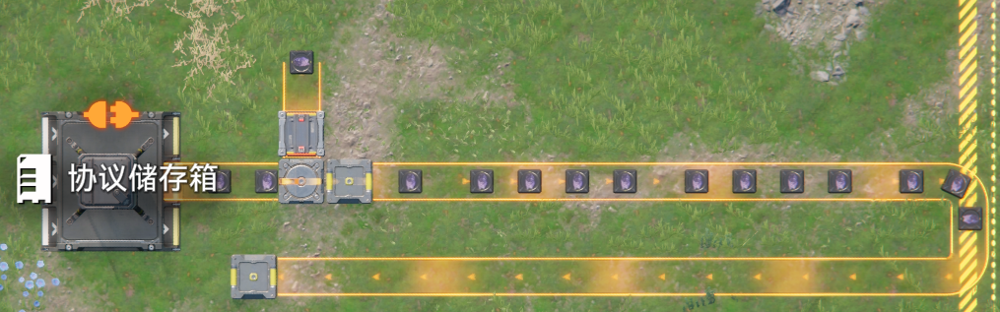

</td>

<td valign="top" width="50%">

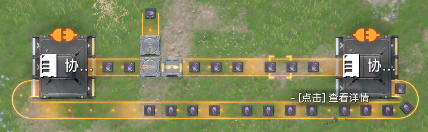

</td>

</tr>

<tr>

<td valign="top" width="50%">

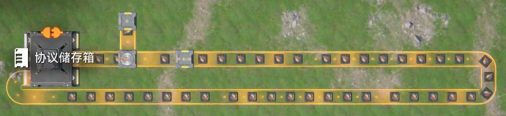

</td>

<td valign="top" width="50%">

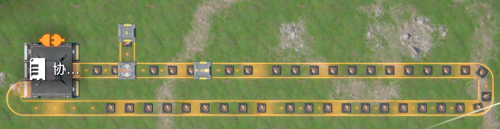

</td>

</tr>

</table>

水管版本实验

使用以下结构查看结果

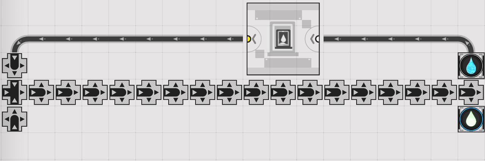

 先让水循环起来，然后接入优先级更高的锦草溶液，锦草溶液经过会导致迟滞输出的结构

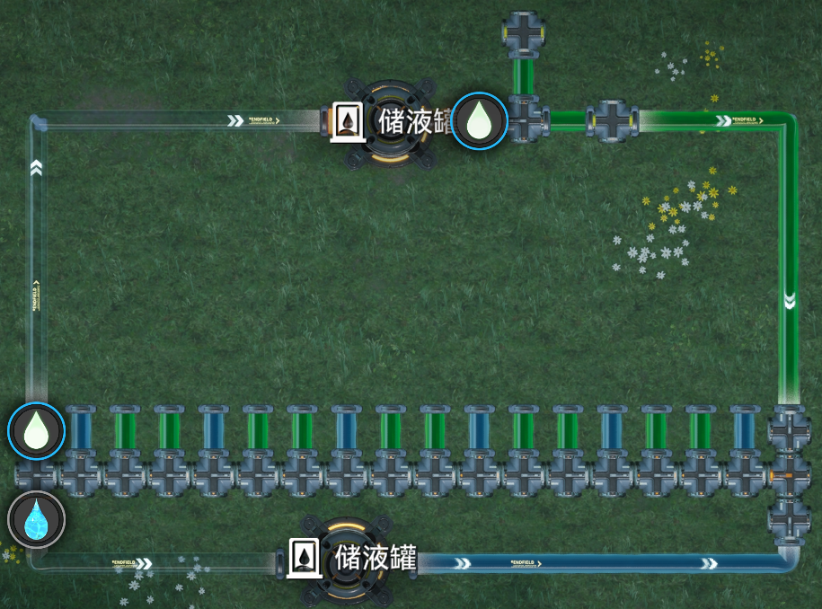

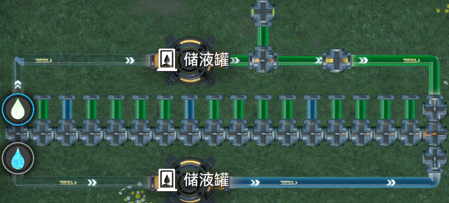

液体的现象与传送带略有不同，为2n卡1格，n为分流器到下一个物流器的距离，小于1时当1

对4n卡1s物品序列进行低优先插入的实验

使用实验-1产出的物品序列，对其进行优先汇入，汇入另一支低优先的物品，结果为物品序列中的n+1个物品后汇入一个另一支物品。这里的n不再将0视为1

实验-2

@恒星泰斗 与@c 在测试 顺环 结构（见阻尼理论的bugs栏目）时出现了疑似4n卡1s的结果，具体为出现顺环结构1、直带2、直带3之间轮询为1312循环，在@恒星泰斗 在后来的测试中确认了触发方式，如图，汇流器最后放置

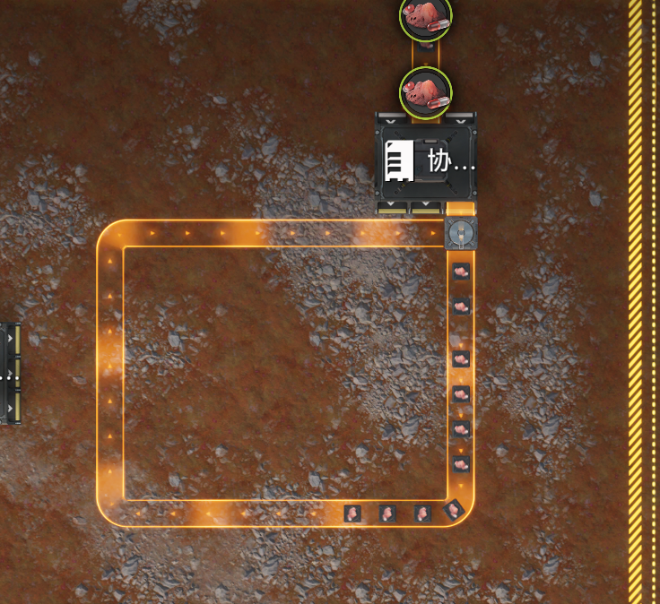

@jnk 认为准入口是无关的，即得出

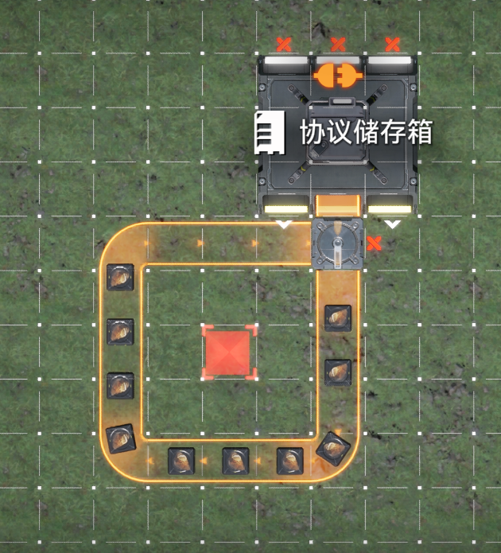

位置为浮点数相关推测与实验

@Fatal Error A1012 进行了一个实验，如图所示，此时箱子出口的汇流器可能导致了4n卡2s？ 

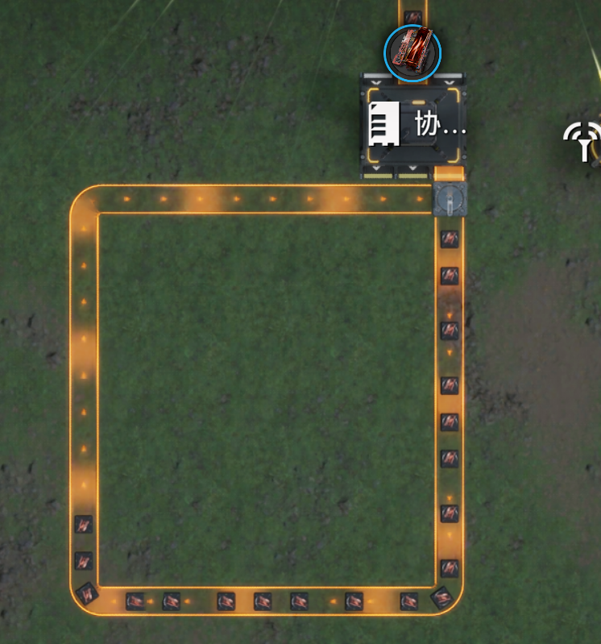

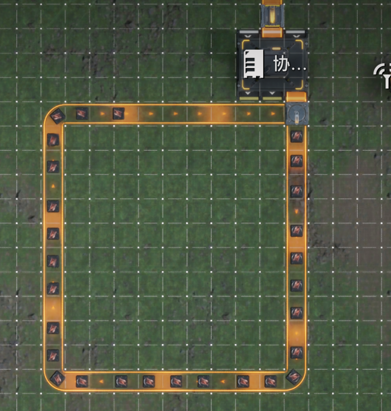

显然的，图二物品并非间隔1格，经排查与尝试复现，得出结论是收取传送带上的一个物品后，其他物品会渲染为真实位置，以下是相关测试图片

<table>

<tr>

<td valign="top" width="50%">

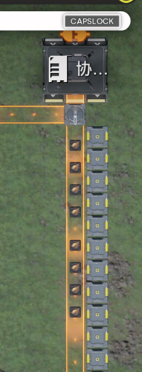

</td>

<td valign="top" width="50%">

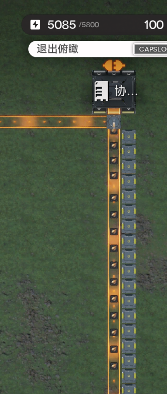

</td>

</tr>

</table>

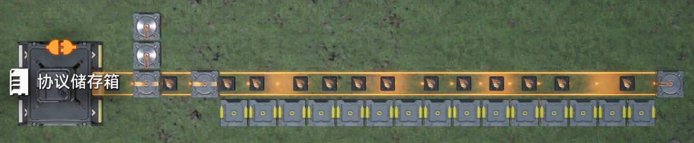

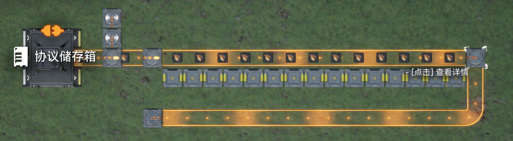

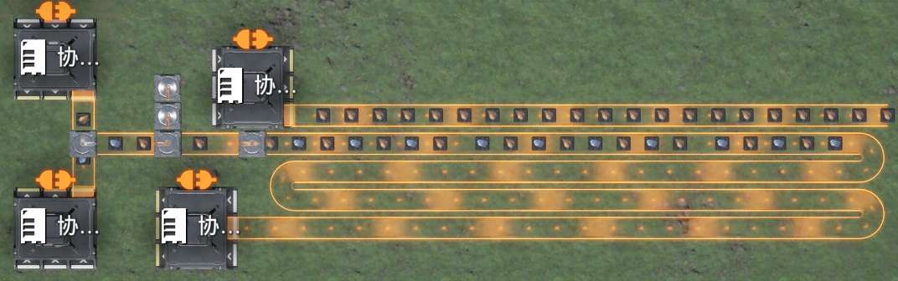

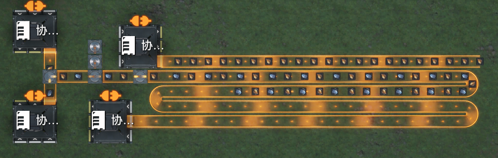

根据目前的实验结果，推测物品位置应当是小数，而不是被限制为两种情况，且从传送带上收取一个物品可以显示真实的物品分布，该物品分布经过一个物流器后再次被对齐为两种情况，依旧不知道触发条件，认为某些情况的轮询可能由此引发。

聊天记录-对当前研究的总结

jnk(2150891328) 2026/5/23 14:54:02

jnk

4n卡1s的现象目前是不是可以分为两类，目前还没有找到其他的触发方式或确定其他触发方式引发的是该问题

一类是汇流器紧贴箱子出口时的顺环导致的现象

另一类是分流器一侧无法输出导致的现象，第二类又可以分为断尾侧无法输出和非断尾侧无法输出两个子类

目前触发的情况来看，汇流器顺环类只会出现4物品卡1s；分流器类则与最终通路的分流器连接的物流元件长度有关，且该物流元件之后必须要有其他物流元件；分流器一侧断尾类的触发要求断尾方向的物流元件总数为2，且只要有一个符合条件的断尾侧即可；分流器一侧非断尾类的；对于分流器类，我们目前不知道阻塞是否是其中的必要要求

以上均为经验性总结，可能随着实验成果而改变

@c 对实验一进行了扩展，其下游通路有多出口时，必须全部断开重新放置

聊天记录-使动-转移-移动逻辑

jnk(2150891328) 2026/8/13 8:13:36

使动-转移-移动逻辑： 
物品只会移动/转移一次。 
物流元件运算时会先使下游元件内部物品移动，再检查自身内部抵达终点的物品是否可以转移到下一个元件，最后移动自身内部物品。 
分流器在使动阶段，如果使动的对象是汇流器，可能导致汇流器进行转移，与汇流器连接下游和连接上游分流器的顺序有关。

假定两个元件中上游先计算： 
x;x,x#x表示无物品，7～0表示刚进入的物品～即将输出的物品，左侧为上游 
7;x,x...#...表示跳过容易理解的时间 
1;x,x 
:0;x,x#移动，使用:表示同一tick内的行为 
:0;x,x#使动 
:0;x,x#转移，但是物品刚经过移动，无法进行转移 
0:x,x 
7;7,x... 
0;0,x 
:0;x,7#使动 
:x;7,7#转移 
:x;7,7 
:x;7,7#下游的使动-转移-移动没有任何变化，其内部两个物品都移动/转移过 
7;7,7...#自0;0,x后转移了一个物品 
0;0,0 
:0;0,0...#移动，这里跳过上游元件的使动-转移-移动和下游元件的使动，都没有变 
:0;0,x#下游元件转移 
:0;x,7#下游元件移动 
0;x,7#出现卡1tick 
:0;x,6 
:x;7,6 
:x;7,6 
7;7,6...#自0;0,x后转移两个物品 
1;1,0 
:1;0,0#使动 
:1;0,0#转移 
:0;0,0#移动 
:0;0,0#下游使动 
:0;0,x#下游转移 
:0;0,x#下游移动 
0;0,x#自上一次0;0,x后一共转移两个物品，发生一次卡顿，为4\*2卡1s（4tick=1s），容易理解下游元件的长度决定4n卡1s中的n

关于顺环的进一步研究，我们需要研究如图示没有下游输出的环

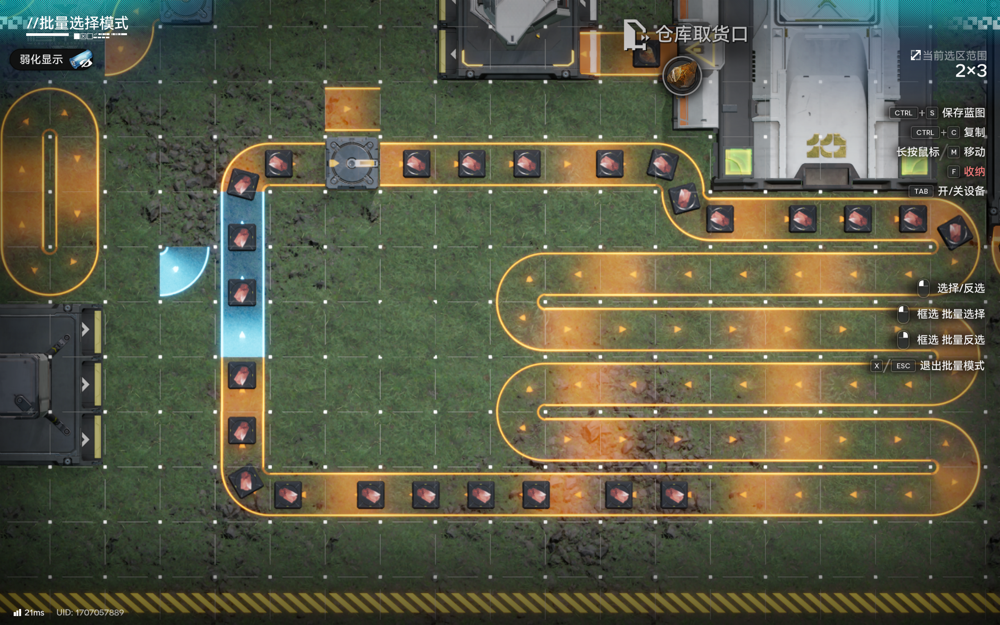
