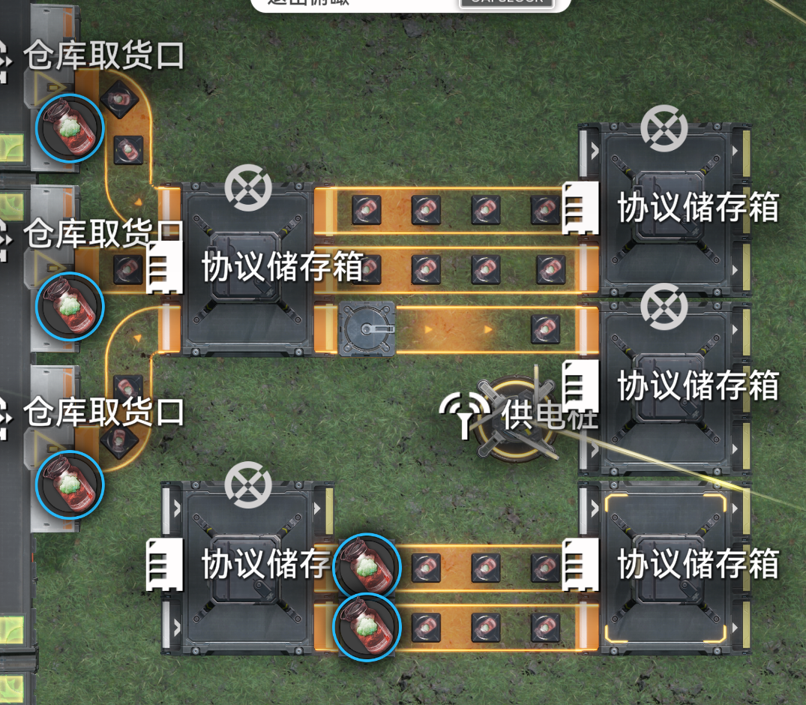
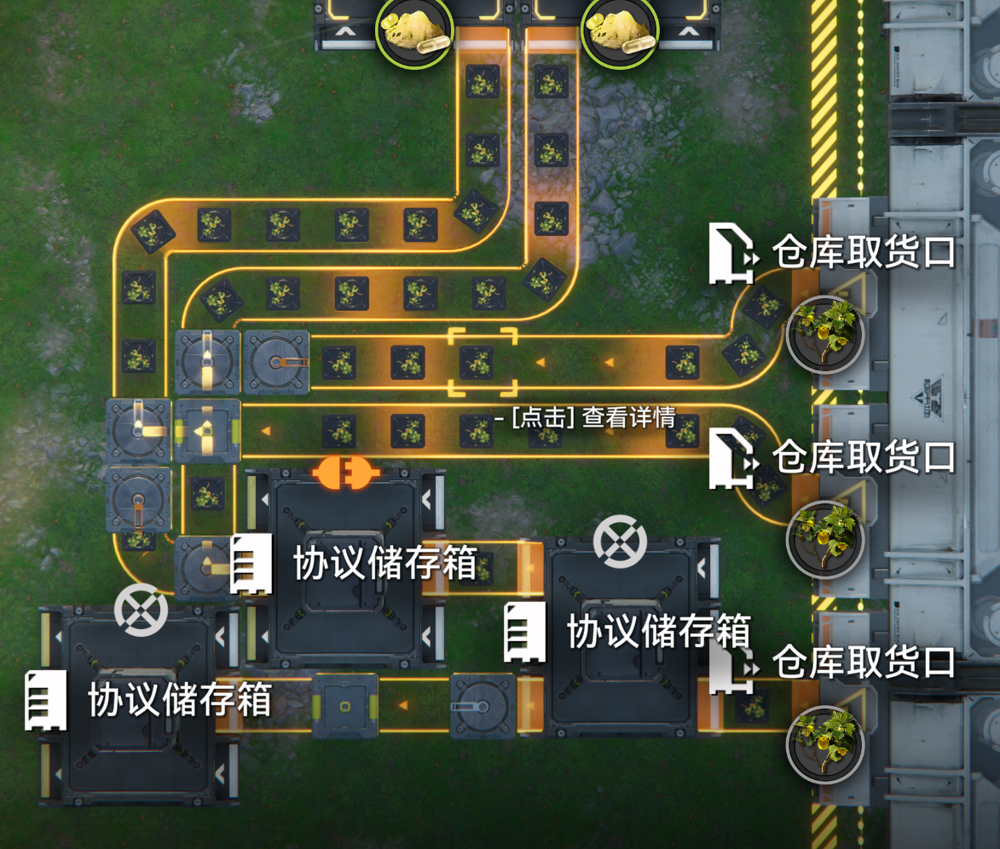
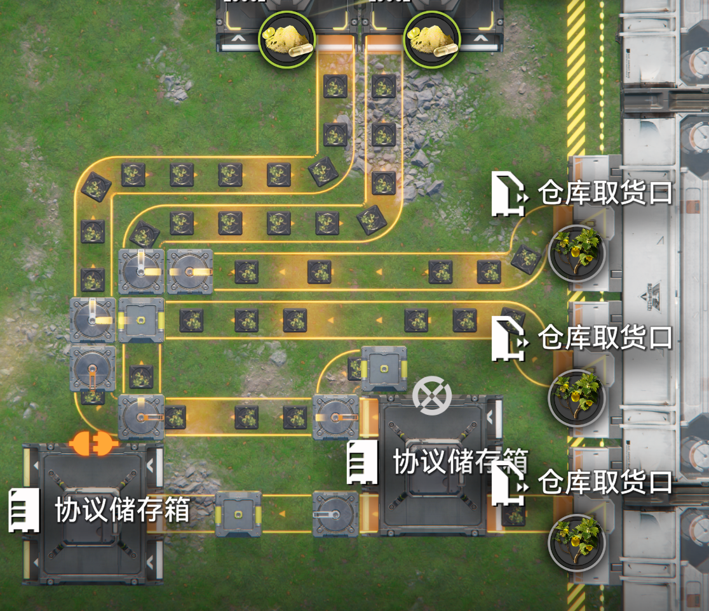
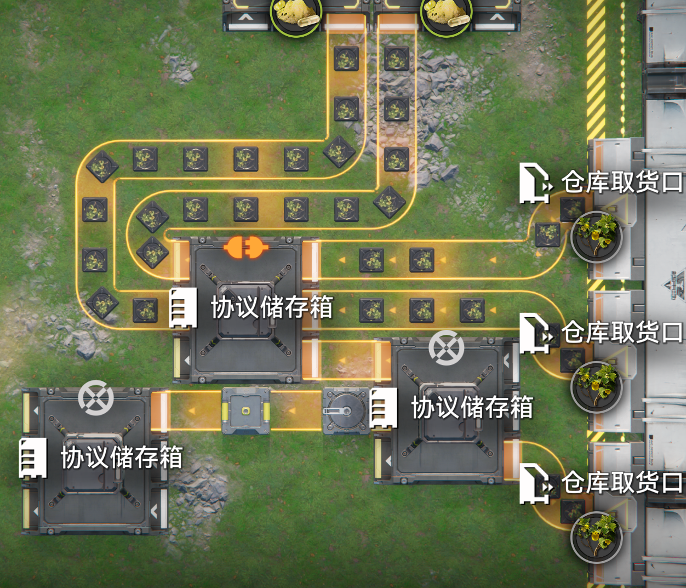

# 针对不稳定流量的稳定溢流器

> 原文：https://docs.qq.com/aio/DTmluZ1diWlpQZldw?p=ifqEe9XTNdBTG1goxN6xkD　上级：[任务板](任务板.md)

使用储存箱无线传输物料，在仓库缺货的情况下，仓库取货口并非满速输出，而是存在输出波动。如下图示，构建了一个平均2条带（60/s）的无线传输回仓库，然后分三路取货，并试图使用常规溢流器将物料并回两条带的装置。协议储存箱每10秒传输一次，在这里就是一次性传输10个。这10个物料会短暂地使三个取货口满速输出（6秒，输出9个物料），导致溢流器瞬时接收到三个物料，从而发生溢流，原本的意图没有达成。

如下是一个目前测得最稳定的稳流溢流器。输入依然是60/s，通过协议储存箱传送。通过分流器设置最上两个出货口对应的传送带为优先，然后将最下出货口的物料“补”到这两条主带上。由于右下协议储存箱最多只接受30/s，不会在非堵塞的情况下发生溢流，故而能达成原先的意图。

如果输入增加到90/s，那么未通电的协议储存箱会积累库存，最后发生堵塞，产生溢流，多余物料可以流向其他产线。

发散1：在这里，未通电协议储存箱充当缓冲瞬时输入的作用。比如依旧平均60/s，但每120秒传输120个，也是可以缓冲的。那么是否可以不用储存箱？例如上面案例，最下出货口在一次瞬时输入中最多会出四个物料，那么把储存箱换成4格的传送带，是否可行？

实测如下的装置，传送带只给到3格，在线和离线情况下也能稳定运行。唯一的问题是：

从谷地传送到武陵游玩一阵之后，再传送回来，左下储存箱库存变多了，发生了奇怪情况下的溢流。推测是游戏状态改变导致优先导致优先级变动（这个布置本来就有点问题）。

发散2：一种更加紧凑的布局，像下图那样，未通电储存箱把主带占用，似乎。。也可以实现？但实际上只在只有吞吐量在75/s以下时能够起效。当三条满带输出时，断电储存箱最终会积累库存，堵塞上面两条主道。最终整个流量是不足三条带的，其满载溢流效果不及预期。

发散3：能否紧凑地实现一条主道，两条溢流道的稳定溢流？
