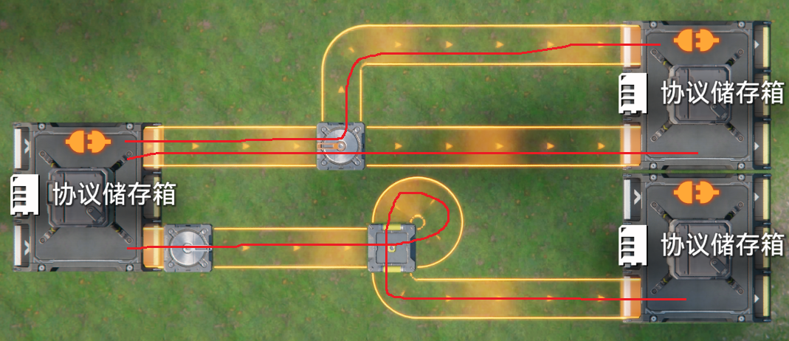
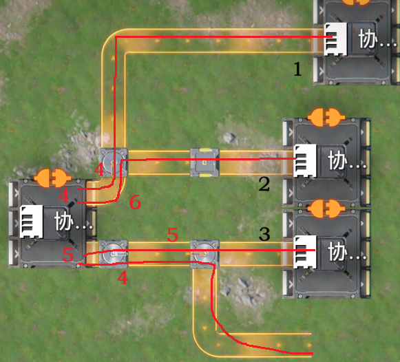

# 阻尼理论-改

> 原文：https://docs.qq.com/aio/DTmluZ1diWlpQZldw?p=WJNJBOl9tQtVZ0GEuD8UaP　上级：[阻尼理论与其修正和扩展（优先输出）](阻尼理论与其修正和扩展（优先输出）.md)

阻尼理论由@jnk 创作并整理维护，当前版本缺少足够量的验证

阻尼理论已经过时，最新理论请参见[终末地物流bug分析导论](终末地物流bug分析导论.md)

特殊的，反应池与扩容反应池的优先输入输出不能包含在该理论下，应当从[反应池特性研究整理](反应池特性研究整理.md)中查看其特殊性质。

这里使用物流线的说法，<i>物流线</i>：

简单来说，物流线是从工厂出口到物流结构末尾所有可能的物品路线，如红线所示。末尾没有连接到工厂的将末尾物流元件视为工厂。这里将所有的中间物流元件视为物流线的一部分

<i>物流线的阻尼</i>：

物流线上的物流元件个数为其的阻尼，整个传送带被视为一个物流元件，物流桥的不同方向被视为不同物流元件。紧贴工厂入口且有其他下游的分流器忽略连接到这个工厂的物流线，同时这里也不会影响接下来的连接顺序判定。

<i>末端序(连接顺序)</i>：

具体的，当物流元件直接连接工厂入口时

如果（该物流元件非分流器）且（该工厂其他入口有非分流器已经加入了末端序），则添加到已有的非分流器物流元件处，否则添加到末尾

当物流元件被删除或其连接的工厂被删除时，自然的，其将会从连接顺序中被删去并且重新计算相关的放置顺序改变（例如变成断尾后，末端物流元件会被视为早已经存在的工厂）

特别的，末端序同时也是优先输入的优先级，末端序越靠前的端口，优先级越高，同一位则轮询。

此处需补充计算图例

<i>出口阻尼</i>

每个出口可能对应多个物流线，但是其只会选取其中一个的阻尼作为出口阻尼，即一个出口只有一个阻尼，具体计算见阻尼理论。

<i>阻尼理论</i>

一种解释工厂出口有时存在优先级现象时的理论，我们说阻尼理论时通常是在解释优先输出现象。

按照末端序取出一位（可能有多个合并）末端物流元件：

执行从下游向上游进行的BFS，标记上游阻尼为下游阻尼加一，并添加访问标记防止重复访问。

特判工厂出口的没有连接下游的单个物流元件，假如该物流元件比上游工厂早被连接，则阻尼为不会发生同化的无穷大，否则为会被同化的无穷小。

对于同一个工厂的多个出口，使其中所有非汇流器开头的出口变成相同的最大的阻尼。这被称为同化。

最后，阻尼小的出口优先级高，先放下开头的物流元件的出口优先度高。先看优先级，再看优先度。对于非汇流器开头的那些出口，如果优先，会在其中轮询。

此处需补充计算图例
