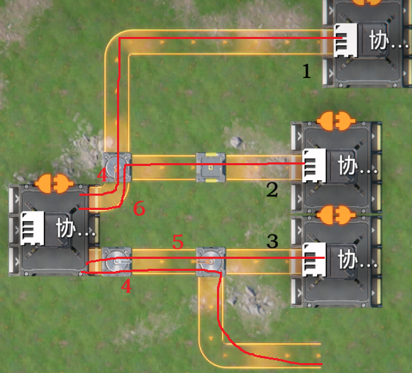
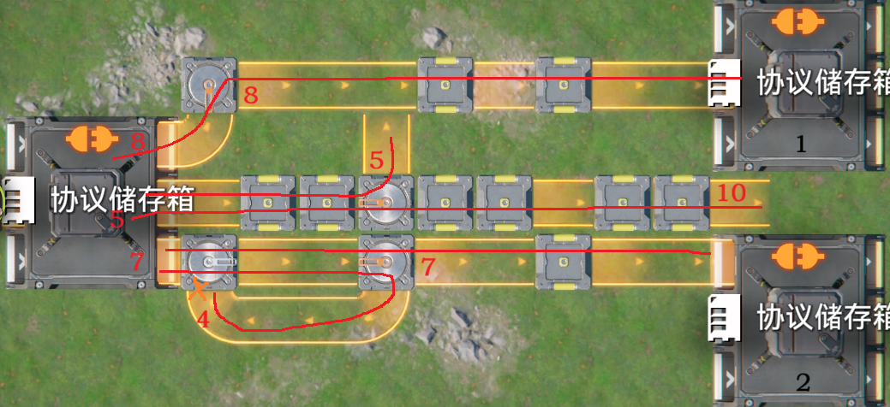
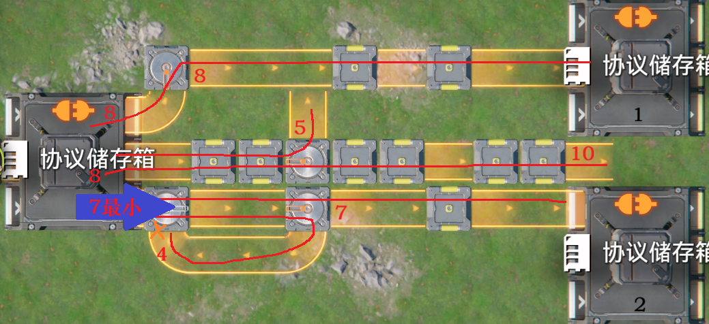
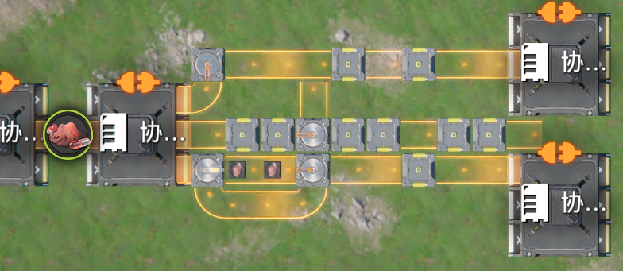
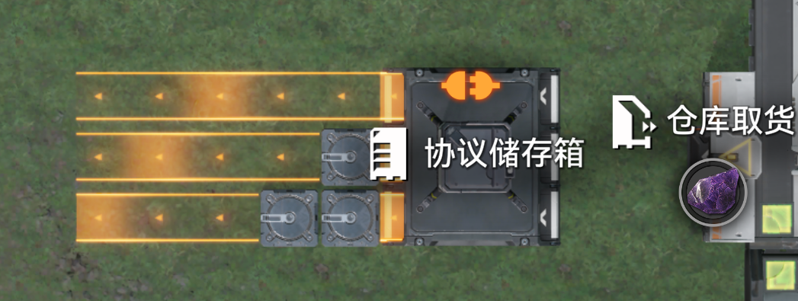
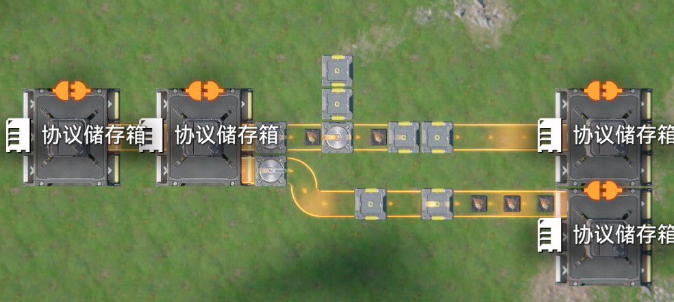

# 阻尼理论与其修正和扩展（优先输出）

> 原文：https://docs.qq.com/aio/DTmluZ1diWlpQZldw?p=JN3ceSWPVQFlqvlfOsiR7k　上级：[异常物流现象研究及底层逻辑推测](异常物流现象研究及底层逻辑推测.md)

阻尼理论由@jnk 创作并整理维护，@c、@苍孤狼、@苍蓝泥沼 等人提供丰富的验证

阻尼理论已经过时，最新理论请参见[终末地物流bug分析导论](终末地物流bug分析导论.md)

这里使用物流线的说法，<i>物流线</i>：

简单来说，物流线是从工厂出口到物流结构末尾所有可能的物品路线，如红线所示。末尾不是工厂入口的被称为断尾物流线。

<i>物流线的阻尼</i>：

物流线上的物流元件个数为其的阻尼，包括工厂入口，整个传送带被视为一个物流元件，物流桥的不同方向被视为不同物流元件。

出于过去的计算的兼容，我们一般从下游往上游数有多少个物流元件，从上游向下游数结果当然是一样的。

出于对过去的计算的兼容，在我们日常讨论时一般会减一，在本文中不会这么做。

<i>连接顺序</i>：

这是一种有序数据结构，存放了下游工厂关于放置顺序的一些数据。

具体的，当工厂入口被物流元件连接时，如果它不在连接顺序中，就加到末尾；

当工厂入口连接的物流元件被收纳时，如果工厂入口不再有任何连接，则从连接顺序中删除。

这张图与之后的图都用黑色表示连接顺序，红色表示阻尼与物流线。

当我们说按连接顺序时，就是按从前往后（往末尾）遍历这里的工厂

<i>出口阻尼</i>

每个出口可能对应多个物流线，但是其只会选取其中一个的阻尼作为出口阻尼，即一个出口只有一个阻尼，具体计算见阻尼理论，用途也是。

<i>阻尼理论</i>

一种解释工厂出口有时存在优先级现象时的理论，我们说阻尼理论时通常是在解释优先输出现象。

首先从上游向下游遍历断开物流元件连接中的环，即从上游向下游数，如果遇到数过的就把中间断开。然后计算所有还存在的物流线

这里橙色的叉是断开环时断开的连接

按照连接顺序取出一个工厂，计算所有连接到这个工厂的物流线的阻尼，这些物流线连接的工厂出口的阻尼取其对应的物流线的阻尼中最小的，在后续计算中就不会再被覆盖了。

连接顺序1

连接顺序2

如果工厂出口没有全部计算完毕，就继续使用断尾物流线的阻尼计算，同样取其中最小的，且不能覆盖之前的结果。

对于同一个工厂的多个出口，使其中所有非汇流器开头的出口变成相同的最大的阻尼。这被称为同化

同化效果

最后，阻尼小的出口优先级高，先放下开头的物流元件的出口优先度高。先看优先级，再看优先度。对于非汇流器开头的那些出口，如果优先，会在其中轮询。

接下来让我们欣赏成果

<b><i>需要注意的点</i></b>

优先级不是把非优先的都堵了，优先的路线速度不足以输出所有物品时，会从其他非优先的线路输出。

阻尼理论只规定了工厂出口的优先级，而不是物流线的优先级，即使阻尼大的物流线，也可以由分流器分流到物品。

不是所有工厂出口都遵循阻尼理论，例如(扩容)反应池。

水管的暗管出口在多次测试中同样符合这套理论，但是其他如反应池就不符合，没有优先输出现象。

阻尼理论是经验的，而不可能是底层原理。

特别的，反应池与扩容反应池的物品输出不遵循阻尼理论，除了多口暗管出口以外的液体输出都不遵循阻尼理论，它们不会产生优先级

对于存在环的情况，阻尼理论并不总是正确的，如果你观察到不符合理论的现象，请描述在下面。

<b>bugs：</b>

<s>当某些工厂出口的汇流器属于一个环并且符合某些特殊条件时，工厂出口会轮询而不是优先级，具体条件需要进一步测试。</s>已验证 顺环 结构导致4\*1卡1s现象，非优先级问题

箱子出口汇流器属于环中时，优先级会有异常，可以切换，以下是来自@恒星泰斗 的研究结果

📎 附件：[关于顺旋的研究.docx](../附件/关于顺旋的研究.docx)（634595 字节）

@恒星泰斗 发现以下内容，见聊天记录

断尾物流线的意外情况

恒星泰斗(3080778592)  1:11:21

之前我测过一个。箱子a三条路连向箱子b，其中两条路用分流器连向箱子c和d。阻尼会按照箱子的顺序计算，先放的箱子优先

然后把箱子cd用物流桥代替，有时也能看到类似的现象。

但是如果用传递带，或者用分流器分离出多条路并且这些路末端都不是箱子，就不行

另外，前面不接任何物流器，直连箱子的断头路会展现出和阻尼理论相反的情况。后放优先级更高

但是在这个断头路上加任何物流器，就会变成阻尼理论的情况

经验证，该现象属实，修正对断头传送带的描述，修正内容在本段内容末尾的阻尼理论-改中。

@c 发现断尾物流线的阻尼有异常现象，如图，优先级最高的是中间的

经验证，该现象属实，修正对断头传送带的描述，修正内容在本段内容末尾的阻尼理论-改中。

@jnk 注意到4n卡1s中出现的阻尼计算中断尾物流线存在一定异常，如下图所示

断头物流线末尾的物流器有时可以视作类似存储箱的事物。

经验证，修正对断头传送带的描述，修正内容在本段内容末尾的阻尼理论-改中。

📄 [阻尼理论-改](阻尼理论-改.md)

<b>阻尼理论的扩展</b>

阻尼在断开环后大部分时候可以完美符合层级BFS论，即计算移动时从下游BFS，但是每层内按照放置顺序进行输入的BFS访问

等待其他扩展...
