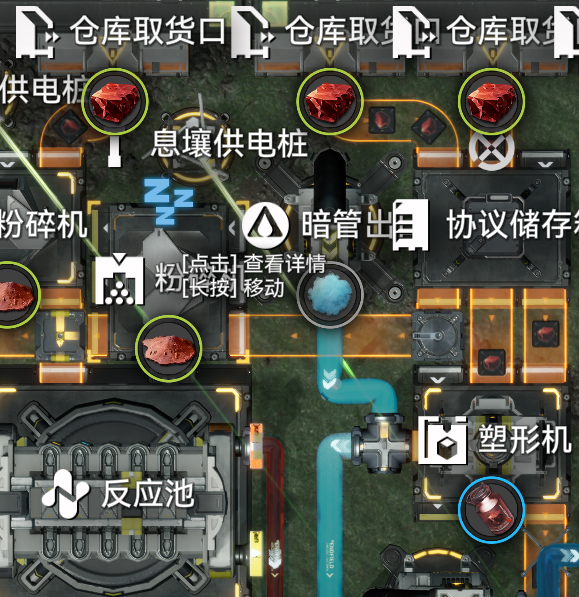

# 附录 常见的优先级结构设计

> 原文：https://docs.qq.com/aio/DTmluZ1diWlpQZldw?p=IlngKiLhDJAlZSX3Qv1eGF　上级：[反应控制与前沿研究](反应控制与前沿研究.md)

#### 常见的优先级结构

除了箱子出口放汇流器形成的优先级之外，还有其他的一些结构也会产生优先级：

1. 反应池中，<b>输入物料优先输出，反应中生成的物料优先反应</b>；可能存在特殊情况，例如[无标题-0DrfFS](无标题-0DrfFS.md)

2. 分流器指向汇流器时，<b>后连接汇流器的线路优先级低</b>；

3. 箱子、取货口、反应池甚至取货口等容器出口放置汇流器时，<b>容器输出优先级低于过路的传送带</b>。但是这个并不总是成立，暗管出口、储液罐就没有这一特性。此外，可以使用断电反应池作为分流器指汇流器的下位替代。

> [优先输入/输出/汇入理论](优先输入_输出_汇入理论.md)

#### 大流量的优先输出结构

由于传送带速度限制，当我们需要对流量大于30/m的固体或120/m的流体做优先输出时，最严格的方案需要将其分流到多条传送带/水管上，每条独立做一个如前所述的优先级，然后再各自汇流。但是，这样做并不是很方便，一般来说会考虑以下一些替代方案：

1. 使用分流结构替代优先输出（见2.4节等，不在本节讨论范围）

2. 使用流体替代固体，例如对120赤铜气做优先级，等价于对240固体赤铜块做优先级（前提是这240赤铜块都会变成气体）

3. 只对部分流量作优先级（本质仍与用分流类似，但具有优先级结构，因此放在这里说）

下面是一些例子。

使用存储箱控制30-60的固体流量优先级

图中，我们计算得到平衡生产时，分离芯-铜罐一路的铜块的消耗量约为46，且需要优先分配。我们采用两路铜进入储存箱，两路直连塑形机，低优先级支路连接粉碎机-反应池实现。在这一设计下，当塑形机没有阻塞时，两路铜块会优先供应塑形机，没有铜块去往粉碎机。由此，分离芯在阻塞后，会将信号一路往回传播到塑形机的铜块。当铜块堆满时，30的流量分往粉碎机，而另外30的流量则留在储存箱中。分离芯消耗掉之后，铜块又会优先供应塑形机生产。

可以思考如下问题：等我有空了再回来写答案。

1. 如果对一条路做优先级控制，另一条路直接连塑形机，会发生什么情况，为什么不对？

2. 储存箱子为什么需要关闭？

3. 即使塑形机没有堵塞，为什么也还是会有一些铜漏到粉碎机？它有影响吗？（提示：从相位角度思考）

更多例子可参考

[625挡可调自适应小龙泡泡+重息壤配平玩具](625挡可调自适应小龙泡泡+重息壤配平玩具.md)
