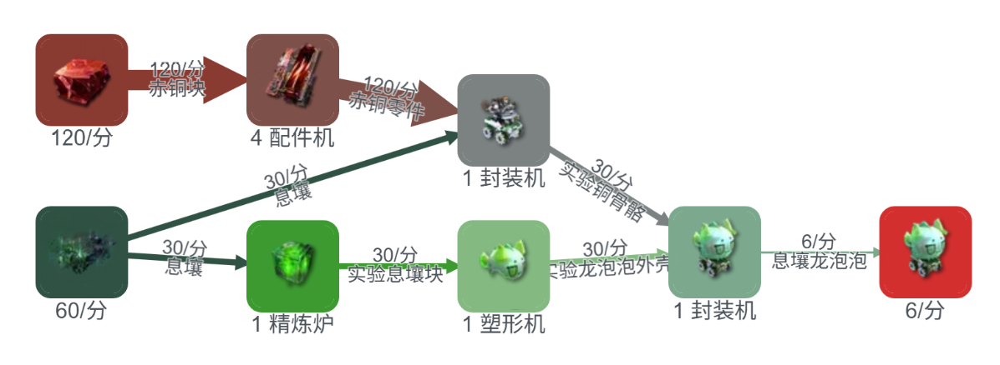
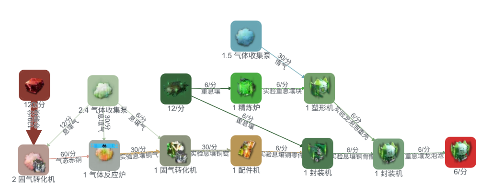
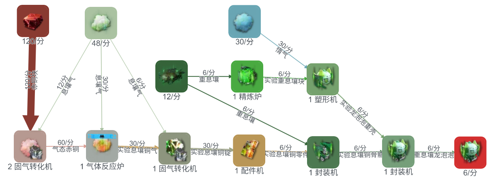
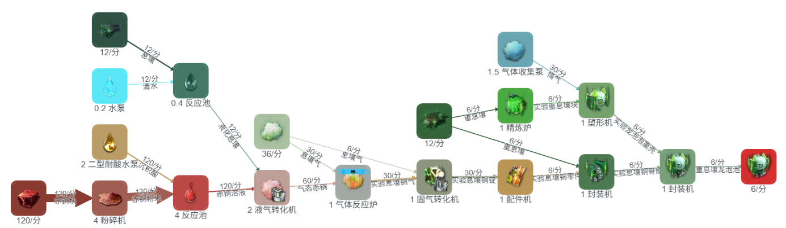

# 龙泡泡基建活动相关事项

> 原文：https://docs.qq.com/aio/DTmluZ1diWlpQZldw?p=1cmRL9Ya06LDbO5jjC7IO1　上级：[「雪凇幽梦」版本](「雪凇幽梦」版本.md)

## 数据汇总

[前瞻基建相关信息](前瞻基建相关信息.md)

## 配方

#### 原始配方

1息壤=1实验息壤块（精炼炉，2s）

1实验息壤块=1实验龙泡泡外壳（塑形机，2s）

4赤铜零件+1息壤=1实验铜骨骼（封装机，2s）

5实验龙泡泡外壳+5实验铜骨骼=1息壤龙泡泡（封装机，10s）

---

1重息壤=1实验重息壤块（精炼炉，10s）

1实验重息壤块+5惰气=1实验龙泡泡重壳（塑形机，10s）

2赤铜气+1息壤气=1实验息壤铜气（气体反应炉，2s）

1实验息壤铜气=1实验息壤铜锭（固气转化机，2s）

5实验息壤铜锭=1实验息壤铜零件（配件机，10s）

1实验息壤铜零件+1重息壤=1实验息壤铜骨骼（封装机，10s）

1实验龙泡泡重壳+1实验息壤铜骨骼=1重息壤龙泡泡（封装机，10s）

#### 整理后配方

1息壤龙泡泡=20铜+10息壤

1重息壤龙泡泡=10铜气+6息壤气+2重息壤+5惰气

\=20铜+9.2息壤+2重息壤+5惰气（液气路线，铜固气为9.6息壤，都固气为10息壤）

单核重息壤龙泡泡6/m=每分钟120铜+55.2息壤+12重息壤+30惰气

单个龙泡泡原料： 20铜 10息壤 价值100 25铜 24.9息壤 7.5惰气 价值200 

### 据点产值和售价

大龙泡泡：200调度券+20援助券

小龙泡泡：100调度券+10援助券

灼铜零件70=25铜块+11.8息壤（液气，双核灼铜，四核为11.75息壤）

赫铜零件48=25铜块+5.7息壤（液气）

重息壤27=2.5铜块+7.85息壤（液气）

铜药22=20铜块

每小时据点产值：4级天王坪42000+4级心脏站27360+4级应天台33600=102960合每分钟1716

基础积累速度分别为30000，22800，24000，合计76800/h=1280/m

产卷倍率加成在两阶段均为0.25（一阶段0.25，二阶段0.5，按叠加计算）

<b>增产25%后每分钟1716+1280\*0.25=2036</b>

<b>增产50%后每分钟1716+1280\*0.5=2356</b>

### 其他相关数据

#### 活动开启时间

2026/9/16 12:00:00一阶段

2026/9/23 4:00:00二阶段

2026/9/30 16:00:00活动配方关闭

2026/10/7 4:00:00商店关闭

一阶段共6天16小时=160小时=<b>9600分钟</b>，二阶段共7天12小时=180小时=<b>10800分钟</b>

#### 活动商店援助券价格

📄 [商店内容](商店内容.md)

蚀刻章

蚀刻章 
龙泡泡大爆发 
伟大的龙泡泡，其足迹遍布大地。出击，出击！ 
于「集成援助·泡泡出击」期间累计获得800000张援助成果券 
于「集成援助·泡泡出击」期间累计获得800000张援助成果券，且累计提交20000个重息壤龙泡泡

## 价值分析与生产方案

### 生产方案

方案1：

最简方案：一阶段小龙泡泡一条产线随便产一点用来解锁二阶段龙泡泡，二阶段大龙泡泡两条满速产线，即使活动二阶段开始一天才搭好也有二阶段20\*12\*60\*24\*6.5=2246400的活动券，完全足以换完商店

或者俩条小龙泡泡，2,180,800÷10÷12÷60÷24\<13天，即使一阶段快过一半也来得及

方案2：（搬空商店，且拿到蚀刻章镀层）

原产线基础上一阶段需生产411400/10=<b>41140</b>个息壤龙泡泡，合<b>4.285</b>个/min；二阶段仍需生产1769400/20=<b>88470</b>个重息壤龙泡泡，合<b>8.777</b>个/min。

推荐生产方案：（基础 14.75电 12灼 24重）

一阶段：<b>1</b>条满速息壤龙泡泡；

二阶段：1<b>.5</b>条满速重息壤龙泡泡

<i>ps：二阶段的1.5条重息壤龙泡泡的赤铜矿消耗为180/min，加上双灼双重的产线消耗360/min超出矿物产出。解决方法有四种：</i>

<i>1.不管，此时全部含原料赤铜块的产线减速至94.44%。但存在风险：由于产线模式的不同，可能会导致灼铜模块堵塞酸气停产；</i>

<i>2.关闭一条灼铜模块的赤铜块转赤铜气的出货口。但同样存在风险，同上；</i>

<i>3.关闭一条重息壤龙泡泡的铜矿输出，将产速从9/min将至7.5/min，活动期间活动代币产量为(100\*9600\*6+200\*10800\*7.5)/10＝2196000＞2180800，依然可以换完商店；</i>

<i>4.在3的基础上，如担心各种原因亏损少量产能，导致代币不足，可短期内自行增加产线模块，消耗库存。</i>

方案3：（只用活动产物换券）

原产线基础上一阶段需生产19545600/100=<b>195456</b>个息壤龙泡泡，合<b>19.390</b>个/min；二阶段仍需生产21988800/200=<b>109944</b>个重息壤龙泡泡，合<b>10.901</b>个/min。（0.25叠加至0.5：二阶段仍需生产25444800/200=127224个重息壤龙泡泡，合11.78个/min）

推荐生产方案：（基础 14.75电池 24重息壤）

一阶段：<b>3.232</b>条满速息壤龙泡泡

二阶段：1.817条满速重息壤龙泡泡（1.963）

方案4：（叛逆！优先换灼铜零件，重息壤，中容武陵电池）

1\.4-1.5摆烂基建（14.75电+18灼+24重，3电池用来发电）原产线基础上一阶段仍需生产<b>-48624</b>个息壤龙泡泡，合<b>-5.065</b>个/min；二阶段仍需生产<b>-27351</b>个重息壤龙泡泡，<b>合-2.5325</b>个/min。

推荐生产方案：<b>（你玩不玩？？？不推荐！！！）</b>

<i>ps：至于为什么会有息壤和铜块放生，是因为这里只给出比较容易实现的方案。那如果想完美利用所有资源怎么办呢？</i><i>当然是交给我们伟大的自适应产线啦！</i>

## 蓝图（持续更新）

官方版本小龙泡泡：EF01eaA7oaeAa4A6ioAi8

官方版本大龙泡泡：EF018OI3eO8IO1Aa4UI73

半速小龙泡泡：EF01u28IU2u820ei4AoOU

半速大龙泡泡：EF013Eou7E3oEa9IO0579

半速小龙泡泡（精炼）：EF015i2O1i52iu92OeIoe

半速大龙泡泡（精炼）：EF01A67iu6A76Ee169ieO

满速大龙泡泡：EF018OI3eO8IO1A63UI73

极限压缩9/min大龙泡泡：EF01u28IU2u820eEeAoOU

<i>除官方大龙泡泡需要外接息壤气，其余蓝图只需要接水，惰气，污水暗管（废水处理机）</i>

Ko鸟自用分离式蓝图

\[A\]两台固化机 EF015i2O1i52iu9OAeIoe

\[B\]12大龙泡泡封装 EF01u28IU2u820eUEAoOU

\[C\]4核气体反应 EF01ao605oa6oA41aoe5e

\[D\]两台气化机赤铜气 EF018OI3eO8IO1A66UI73

2A+1B+0.5C+1D=12/m重息壤龙泡泡，输入24+12+60=96息壤气，66惰气，240铜，24重息壤
